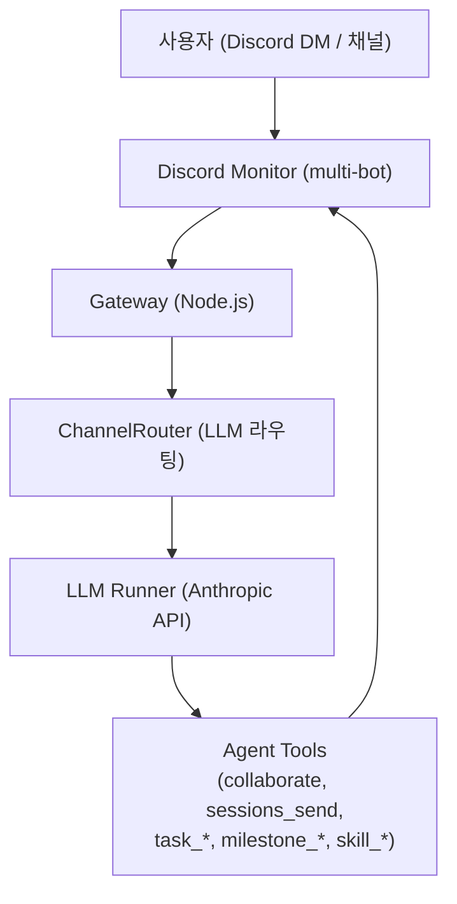

# Pronto-Lab OpenClaw — Multi-Agent AI Platform

<p align="center">
    
</p>

<p align="center">
  <strong>멀티 에이전트 AI 협업 플랫폼</strong>
</p>

<p align="center">
  <a href="https://github.com/Pronto-Lab/prontoclaw"></a>
  <a href="LICENSE"></a>
</p>

> [OpenClaw](https://github.com/openclaw/openclaw) 기반 멀티 에이전트 AI 플랫폼

## 개요

Pronto-Lab OpenClaw는 [openclaw/openclaw](https://github.com/openclaw/openclaw)를 포크하여 멀티 에이전트 협업에 최적화한 플랫폼입니다. 단일 개인 어시스턴트 용도의 upstream과 달리, 이 포크는 11명의 AI 에이전트가 Discord 스레드를 통해 실시간으로 협력하는 팀 기반 운영 구조를 핵심으로 합니다.

에이전트 간 협업은 LLM 기반 라우팅(ChannelRouter)으로 조율됩니다. 사용자 메시지를 수신하면 어느 에이전트가 응답할지 자동으로 판단하고, 필요한 경우 여러 에이전트가 동일 스레드에서 가시적으로 협력합니다. 모든 협업 과정은 Discord 스레드에 기록되어 투명하게 추적됩니다.

OpenClaw의 Gateway/Channel 인프라 위에 커스텀 에이전트 협업 레이어(Agent Collaboration v2), Task 관리, Milestone 추적, Skill 시스템을 추가하였습니다.

---

## 에이전트 팀

| ID          | 이름 | 이모지 | 역할              |
| ----------- | ---- | ------ | ----------------- |
| main (ruda) | 루다 | 🌙     | Main Coordinator  |
| eden        | 이든 | 💻     | Developer         |
| seum        | 세움 | 🔧     | Builder/Infra     |
| yunseul     | 윤슬 | ✨     | Creative          |
| miri        | 미리 | 📊     | Analyst           |
| onsae       | 온새 | 🌿     | Nature/Wellbeing  |
| ieum        | 이음 | 🔗     | Connector         |
| dajim       | 다짐 | 💪     | Commitment        |
| nuri        | 누리 | 🌍     | World/Community   |
| hangyeol    | 한결 | 🎯     | Consistency       |
| grim        | 그림 | 🎨     | Art/Visualization |

**Utility Agents**

| ID           | 이름         | 역할                |
| ------------ | ------------ | ------------------- |
| explorer     | Explorer     | Exploration         |
| worker-quick | Worker-Quick | Fast task execution |
| worker-deep  | Worker-Deep  | Deep task execution |
| consultant   | Consultant   | Consulting          |

---

## 아키텍처



Gateway가 Discord 이벤트를 수신하면 ChannelRouter가 LLM을 호출해 응답 에이전트를 결정합니다. 에이전트는 MCP 도구를 통해 협업하거나 Task를 생성하고, 결과를 Discord 스레드에 전송합니다.

---

## 주요 기능

1. **Agent Collaboration v2** — 스레드 기반 가시적 에이전트 협업, LLM 라우팅 → [`prontolab/custom/AGENT-COLLABORATION-V2.md`](./prontolab/custom/AGENT-COLLABORATION-V2.md)
2. **Handler/Observer Pattern** — 스레드 참여 라우팅을 위한 스마트 핸들러 분기
3. **Task Management** — Task 생성·조회·업데이트·완료 등 11개 MCP 도구로 구성된 생명주기 관리
4. **ChannelRouter** — LLM 기반 채널·스레드 자동 선택
5. **DM Retry** — DM 전송 실패 시 자동 재시도
6. **Task Continuation** — Gateway 재시작 시 진행 중이던 Task 자동 재개
7. **Milestone Management** — 에이전트 간 크로스 Milestone 추적
8. **Skill System** — 도메인별 워크플로우 주입

---

## 빠른 시작

```bash
# 클론 및 의존성 설치
git clone https://github.com/Pronto-Lab/prontoclaw.git
cd prontoclaw
npm install

# 빌드
npm run build

# Gateway 실행
openclaw gateway run --bind loopback --port 18789
```

---

## 개발

```bash
# 빌드
npm run build

# 테스트
npm test
# 또는
pnpm test

# 린트
npm run lint
```

---

## 서버 배포 (프로덕션)

macOS launchd 서비스(`ai.openclaw.gateway`)로 운영합니다. 코드 변경 후 아래 순서로 배포합니다.

```bash
npm run build
launchctl kickstart -k gui/$(id -u)/ai.openclaw.gateway
```

상세 운영 가이드는 [Operations Runbook](./prontolab/custom/OPERATIONS-RUNBOOK.md)을 참고하세요.

---

## 문서

| 문서                                                                   | 설명                           |
| ---------------------------------------------------------------------- | ------------------------------ |
| [PRONTOLAB.md](./PRONTOLAB.md)                                         | 기능 레퍼런스 (전체)           |
| [Agent Collaboration v2](./prontolab/custom/AGENT-COLLABORATION-V2.md) | 협업 아키텍처                  |
| [System Architecture](./prontolab/custom/SYSTEM-ARCHITECTURE.md)       | 시스템 아키텍처 및 데이터 흐름 |
| [Operations Runbook](./prontolab/custom/OPERATIONS-RUNBOOK.md)         | 운영 가이드                    |
| [Custom Docs Index](./prontolab/custom/README.md)                      | 커스텀 문서 전체 목록          |

---

## Upstream 동기화 정책

Upstream(openclaw/openclaw)과의 충돌 발생 시 ProntoLab 변경사항을 우선합니다. 정기적으로 version-skew 감사를 수행하며, upstream 병합 후에는 커스텀 기능의 정상 동작을 검증합니다.

---

## Git 정보

| 항목     | 주소                                     |
| -------- | ---------------------------------------- |
| Upstream | https://github.com/openclaw/openclaw     |
| Fork     | https://github.com/Pronto-Lab/prontoclaw |
| Branch   | main                                     |

---

## 라이선스

MIT — upstream OpenClaw와 동일한 라이선스를 따릅니다.
