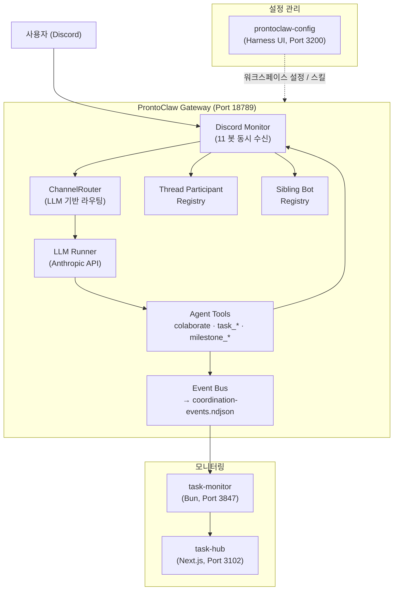
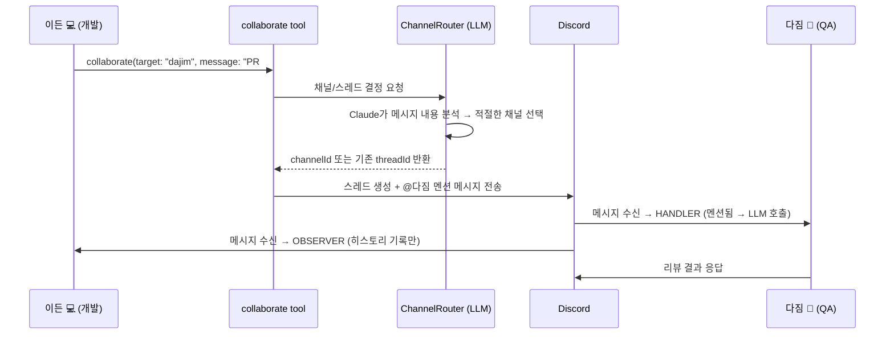

# ProntoClaw

<p align="center">
    <picture>
        <source media="(prefers-color-scheme: dark)" srcset="docs/assets/prontoclaw-logo-dark.png">
        
    </picture>
</p>

<p align="center">
  <strong>멀티 에이전트 AI 협업 플랫폼</strong>
</p>

<p align="center">
  <a href="https://github.com/Pronto-Lab/prontoclaw"></a>
  <a href="LICENSE"></a>
</p>

> [OpenClaw](https://github.com/openclaw/openclaw) 기반 멀티 에이전트 AI 협업 플랫폼

---

## OpenClaw vs ProntoClaw

[OpenClaw](https://github.com/openclaw/openclaw)는 **1인용 개인 AI 어시스턴트**입니다. 하나의 Gateway가 하나의 어시스턴트를 구동하고, WhatsApp·Telegram·Discord 등 다양한 채널에서 사용자 한 명과 대화합니다.

ProntoClaw는 이 구조를 **팀 기반 멀티 에이전트 시스템**으로 확장합니다.

|                  | OpenClaw              | ProntoClaw                                           |
| ---------------- | --------------------- | ---------------------------------------------------- |
| **컨셉**         | 1인용 개인 어시스턴트 | 11명의 AI 에이전트 팀                                |
| **에이전트**     | 단일 어시스턴트       | 역할별 전문 에이전트 (개발, 인프라, 마케팅, 법무 등) |
| **통신 채널**    | 사용자 ↔ 어시스턴트   | 사용자 ↔ 에이전트, 에이전트 ↔ 에이전트               |
| **Discord 활용** | 1개 봇                | 11개 봇 (에이전트별 독립 봇 계정)                    |
| **협업**         | 없음                  | LLM 라우팅 기반 스레드 협업 (Agent Collaboration v2) |
| **작업 관리**    | 없음                  | Task 생명주기 관리 (11개 MCP 도구)                   |
| **이벤트 추적**  | 없음                  | 모든 에이전트 활동을 ndjson 이벤트 로그에 기록       |
| **모니터링**     | 없음                  | task-hub 대시보드로 실시간 시각화                    |
| **도메인 스킬**  | 범용 스킬             | 43+ 전문 도메인 스킬 (법무, 재무, 마케팅 등)         |

---

## 아키텍처

### 전체 시스템 구조



### OpenClaw 위에 추가된 레이어

ProntoClaw는 OpenClaw의 Gateway/Channel 인프라를 그대로 활용하면서, 그 위에 다음 레이어를 추가합니다.

```
┌─────────────────────────────────────────────────┐
│          ProntoClaw 커스텀 레이어                 │
│                                                 │
│  Agent Collaboration v2 (스레드 기반 협업)        │
│  ChannelRouter (LLM 기반 채널/스레드 자동 선택)    │
│  Handler/Observer Pattern (멘션 기반 역할 분기)   │
│  Task Management (11개 MCP 도구)                 │
│  Event Bus + ndjson 이벤트 로그                   │
│  A2A Retry (에이전트 간 멘션 실패 자동 재시도)     │
│  Thread Participant Registry (참여자 추적)        │
│  Sibling Bot Registry (봇 ↔ 에이전트 ID 매핑)     │
│  Task Continuation (재시작 시 작업 자동 재개)      │
│  Milestone 크로스 에이전트 추적                    │
│  도메인 스킬 시스템 (43+ 전문 스킬)                │
├─────────────────────────────────────────────────┤
│          OpenClaw 기반 인프라                      │
│                                                 │
│  Gateway (WebSocket 컨트롤 플레인)                │
│  Pi Agent Runtime (LLM 세션 관리)                 │
│  Discord Channel (discord.js)                    │
│  Session Model (에이전트별 격리)                   │
│  Tool Policy Pipeline                            │
└─────────────────────────────────────────────────┘
```

---

## 동작 방식

### 1. 메시지 수신과 에이전트 라우팅

사용자가 Discord에 메시지를 보내면, 11개 봇이 동시에 이벤트를 수신합니다. 각 봇의 Discord Monitor가 **Handler/Observer 패턴**으로 역할을 판별합니다.

```
Discord 메시지 수신
       │
       ▼
봇이 @멘션 되었는가?
  ┌────┴────┐
  Yes       No
  │         │
  ▼         ▼
HANDLER   스레드 참여자인가?
(LLM 호출   ┌────┴────┐
 → 응답)    Yes       No
            │         │
            ▼         ▼
         OBSERVER   무시
      (히스토리에
       기록만)
```

- **HANDLER**: @멘션된 봇이 LLM을 호출해 응답 생성
- **OBSERVER**: 스레드 참여자이지만 멘션되지 않은 봇은 메시지를 세션 히스토리에 기록만 함 (LLM 호출 없음, 비용 없음)

### 2. 에이전트 간 협업 (Agent Collaboration v2)

에이전트가 다른 에이전트의 도움이 필요하면 `collaborate` 도구를 호출합니다. ChannelRouter(LLM)가 적절한 채널과 스레드를 자동으로 선택합니다.



**v1(DM) → v2(Thread)로 전환한 이유:**

|           | v1 (DM 기반)   | v2 (Thread 기반)                                 |
| --------- | -------------- | ------------------------------------------------ |
| 가시성    | 비공개 DM      | 공개 채널 스레드 → 팀 전체가 협업 과정 확인 가능 |
| 맥락 유지 | 단발성 메시지  | 스레드로 대화 맥락 유지                          |
| 라우팅    | 수동 채널 지정 | LLM이 내용 기반으로 채널/스레드 자동 선택        |
| 다자 참여 | 1:1만 가능     | 하나의 스레드에 여러 에이전트 참여 가능          |

### 3. 작업 관리 (Task Lifecycle)

에이전트는 11개의 MCP 도구로 작업을 명시적으로 관리합니다.

```
task_start → task_update → task_complete
                ↓               ↓
           task_block      TASK_HISTORY.md에
                ↓          월별 아카이브
           task_resume
```

| 도구                | 기능                                     |
| ------------------- | ---------------------------------------- |
| `task_start`        | 새 작업 생성 → `tasks/task_xxx.md` 파일  |
| `task_update`       | 진행 상황 기록                           |
| `task_complete`     | 작업 완료 → `TASK_HISTORY.md`에 아카이브 |
| `task_status`       | 상태 조회                                |
| `task_list`         | 작업 목록 (필터 가능)                    |
| `task_cancel`       | 작업 취소                                |
| `task_approve`      | 승인 대기 작업 승인                      |
| `task_block`        | 다른 에이전트 도움 필요 시 블록          |
| `task_resume`       | 블록 해제 후 재개                        |
| `task_backlog_add`  | 백로그에 추가                            |
| `task_backlog_pick` | 백로그에서 선택                          |

### 4. 이벤트 파이프라인

모든 에이전트 활동은 이벤트로 기록되어 실시간 모니터링됩니다.

```
에이전트 도구 호출
    ↓
Event Bus (인메모리 Pub/Sub)
    ↓
coordination-events.ndjson (append-only 로그)
    ↓
task-monitor (파일 감시 + 이벤트 enrichment)
    ↓
REST API + WebSocket
    ↓
task-hub 대시보드 (실시간 시각화)
```

**이벤트 종류:**

- **협업**: `a2a.send`, `a2a.response`, `a2a.complete`
- **작업**: `task.started`, `task.updated`, `task.completed`, `task.blocked`
- **마일스톤**: `milestone.sync_failed`
- **시스템**: `continuation.sent`, `plan.submitted`, `plan.approved`

### 5. 자동 복구

- **Task Continuation**: Gateway 재시작 시, 각 에이전트 워크스페이스의 `CURRENT_TASK.md`를 읽어 진행 중이던 작업을 자동 재개
- **A2A Retry**: 에이전트 간 멘션이 실패하면 60초 주기로 자동 재시도 (설정 가능한 backoff + 최대 시도 횟수)
- **DM Retry**: DM 전송 실패 시 5분 타임아웃 후 최대 3회 재시도

---

## 에이전트 팀

### 코어 에이전트 (11명)

각 에이전트는 독립된 Discord 봇 계정, 워크스페이스, 세션을 가집니다.

| ID          | 이름    | 역할                | 도메인 스킬                        |
| ----------- | ------- | ------------------- | ---------------------------------- |
| main (ruda) | 루다 🌙 | 총괄 코디네이터     | 제품 관리, 로드맵, 이해관계자 소통 |
| eden        | 이든 💻 | 백엔드 개발         | —                                  |
| seum        | 세움 🔧 | 인프라/배포         | 인프라 트러블슈팅                  |
| yunseul     | 윤슬 ✨ | 마케팅/크리에이티브 | 콘텐츠, 브랜드, 캠페인             |
| miri        | 미리 📊 | 데이터/재무 분석    | SQL, 데이터 시각화, 재무제표       |
| onsae       | 온새 🌿 | 개인 비서/세일즈    | 계정 리서치, 미팅 준비             |
| ieum        | 이음 🔗 | AI 커뮤니티 관리    | 검색 전략, 지식 합성               |
| dajim       | 다짐 💪 | QA/테스팅           | QA 가이드, API 테스팅              |
| nuri        | 누리 🌍 | 고객 지원           | 티켓 분류, 에스컬레이션            |
| hangyeol    | 한결 🎯 | 법무/컴플라이언스   | 계약 검토, NDA, 컴플라이언스       |
| grim        | 그림 🎨 | UI/UX 디자인        | —                                  |

### 유틸리티 에이전트 (4명)

| ID           | 역할           |
| ------------ | -------------- |
| explorer     | 코드 탐색      |
| worker-quick | 빠른 작업 실행 |
| worker-deep  | 깊은 작업 실행 |
| consultant   | 컨설팅         |

---

## 관련 프로젝트

ProntoClaw는 세 개의 프로젝트가 함께 동작합니다.

| 프로젝트                                                             | 역할                                 | 기술 스택                       | 포트  |
| -------------------------------------------------------------------- | ------------------------------------ | ------------------------------- | ----- |
| **prontoclaw** (이 레포)                                             | AI 에이전트 게이트웨이               | TypeScript, pnpm, Pi Agent Core | 18789 |
| [prontoclaw-config](https://github.com/Pronto-Lab/prontoclaw-config) | 에이전트 설정/스킬 관리 + Harness UI | Next.js, simple-git             | 3200  |
| [task-hub](https://github.com/Pronto-Lab/task-hub)                   | 작업 관리 + 실시간 모니터링 대시보드 | Next.js, MongoDB                | 3102  |

```
prontoclaw (Gateway)
    ├── coordination-events.ndjson ──→ task-monitor ──→ task-hub (대시보드)
    └── 에이전트 워크스페이스 설정 ←── prontoclaw-config (Harness)
```

---

## 빠른 시작

```bash
git clone https://github.com/Pronto-Lab/prontoclaw.git
cd prontoclaw
npm install
npm run build
openclaw gateway run --bind loopback --port 18789
```

## 개발

```bash
npm run build          # 빌드
npm test               # 테스트 (Vitest)
npm run lint           # 린트 (Oxlint + Oxfmt)
npm run gateway:dev    # 개발 서버 (hot-reload)
```

## 배포 (프로덕션)

macOS launchd 서비스로 운영합니다.

```bash
npm run build
launchctl kickstart -k gui/$(id -u)/ai.openclaw.gateway
```

상세 운영 가이드: [Operations Runbook](./prontolab/custom/OPERATIONS-RUNBOOK.md)

---

## 문서

| 문서                                                                   | 설명                           |
| ---------------------------------------------------------------------- | ------------------------------ |
| [PRONTOLAB.md](./PRONTOLAB.md)                                         | 기능 레퍼런스 (전체)           |
| [Agent Collaboration v2](./prontolab/custom/AGENT-COLLABORATION-V2.md) | 협업 아키텍처 상세             |
| [System Architecture](./prontolab/custom/SYSTEM-ARCHITECTURE.md)       | 시스템 아키텍처 및 데이터 흐름 |
| [Operations Runbook](./prontolab/custom/OPERATIONS-RUNBOOK.md)         | 운영 가이드                    |
| [Custom Docs Index](./prontolab/custom/README.md)                      | 커스텀 문서 전체 목록          |

---

## Upstream 동기화 정책

Upstream([openclaw/openclaw](https://github.com/openclaw/openclaw))과의 충돌 발생 시 ProntoClaw 변경사항을 우선합니다. 정기적으로 version-skew 감사를 수행하며, upstream 병합 후에는 커스텀 기능의 정상 동작을 검증합니다.

---

## Git 정보

| 항목     | 주소                                     |
| -------- | ---------------------------------------- |
| Upstream | https://github.com/openclaw/openclaw     |
| Fork     | https://github.com/Pronto-Lab/prontoclaw |
| Branch   | main                                     |

---

## 라이선스

MIT — upstream OpenClaw와 동일한 라이선스를 따릅니다.
