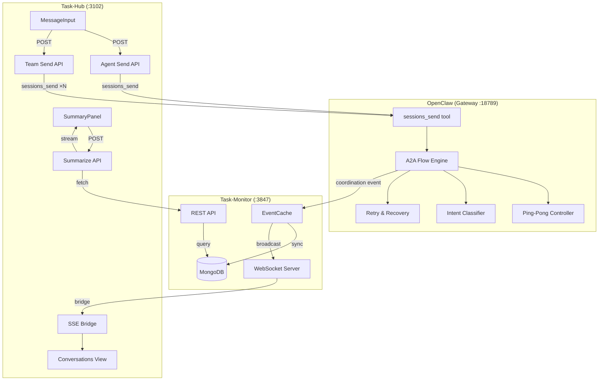

# A2A (Agent-to-Agent) 비동기 통신 시스템

> 구현 완료: 2026-02-18
> 대상: prontolab-openclaw, task-monitor, task-hub

## 개요

에이전트 간 비동기 통신(A2A) 시스템의 설계 및 구현 문서입니다.
4개의 핵심 설계와 E2E 테스트 결과, 그리고 Task-Hub 협업 허브 구현을 포함합니다.

## 문서 목록

### 설계 문서

| 문서                                                | 설명                                        | 상태    |
| --------------------------------------------------- | ------------------------------------------- | ------- |
| [병렬 실행](./parallel-execution.md)                | 2중 순차 큐잉 → 병렬 A2A 실행               | ✅ 완료 |
| [Task-Monitor 실시간성](./task-monitor-realtime.md) | EventCache, MongoDB 동기화, WS 강화         | ✅ 완료 |
| [재시도 및 에러 복구](./retry-error-recovery.md)    | 에러 분류 체계, 재시도 전략, CircuitBreaker | ✅ 완료 |
| [핑퐁 최적화](./pingpong-optimization.md)           | 턴 제어, 응답 품질, 의도 분류               | ✅ 완료 |

### 협업 허브 (Phase 9)

| 문서                                        | 설명                                         | 상태    |
| ------------------------------------------- | -------------------------------------------- | ------- |
| [Collaboration Hub](./collaboration-hub.md) | 에이전트 지시, 팀 메시징, 대화 개입, AI 요약 | ✅ 완료 |

### 테스트

| 문서                                     | 설명                          | 결과       |
| ---------------------------------------- | ----------------------------- | ---------- |
| [E2E 테스트 결과](./e2e-test-results.md) | 28개 테스트, 전체 시스템 검증 | 28/28 PASS |

## 아키텍처 개요

## 관련 문서

- [Multi-Agent Coordination](/MULTI-AGENT-COORDINATION.md) — 전체 멀티에이전트 시스템 개요
- [Collaboration Event Model](/concepts/collaboration-event-model.md) — 이벤트 모델 정의
- [Session Tool](/concepts/session-tool.md) — 세션 도구 상세
