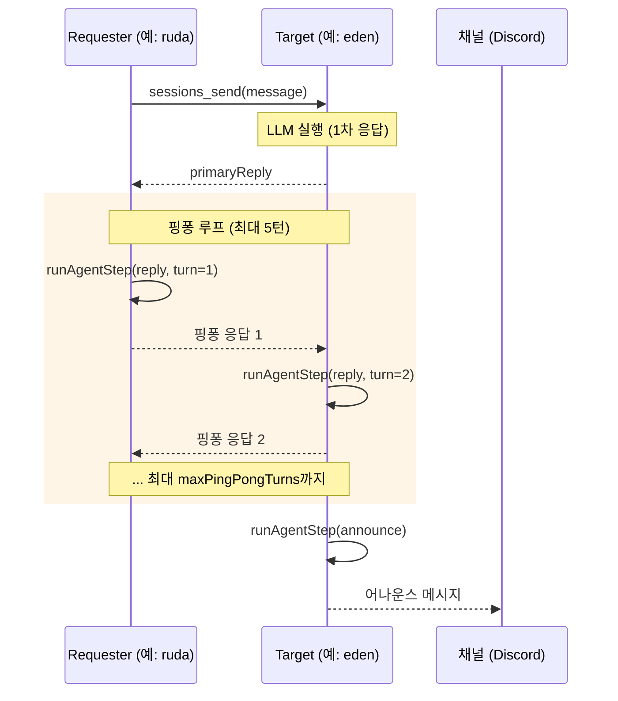
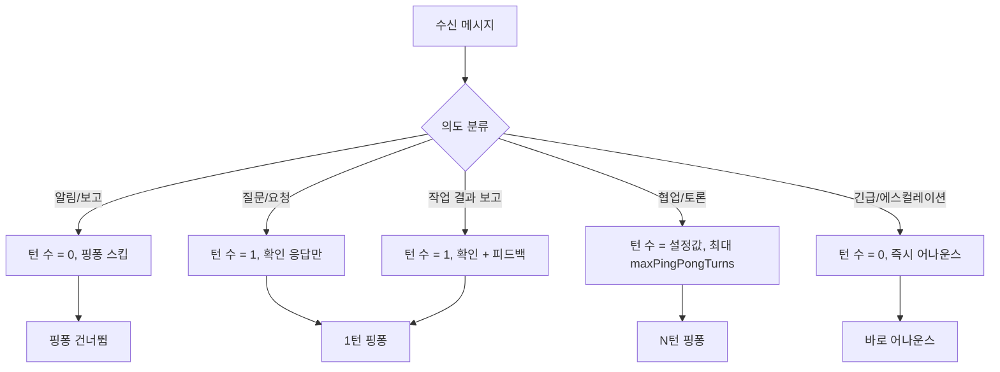
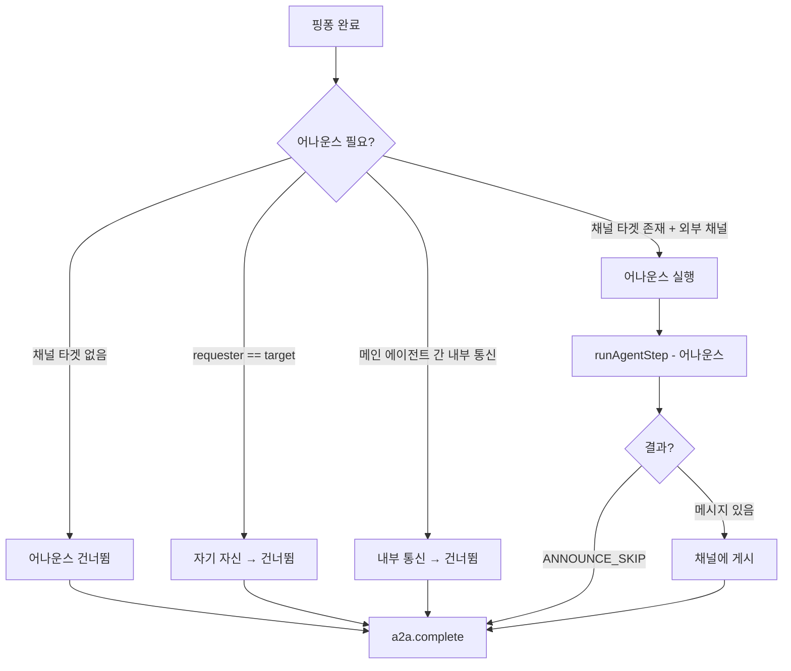
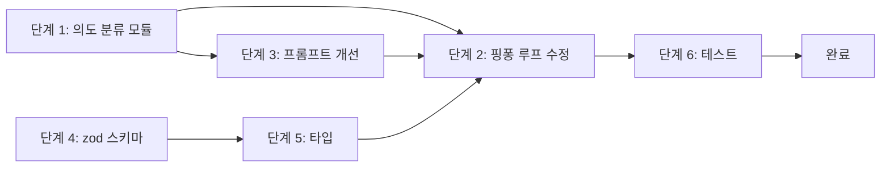
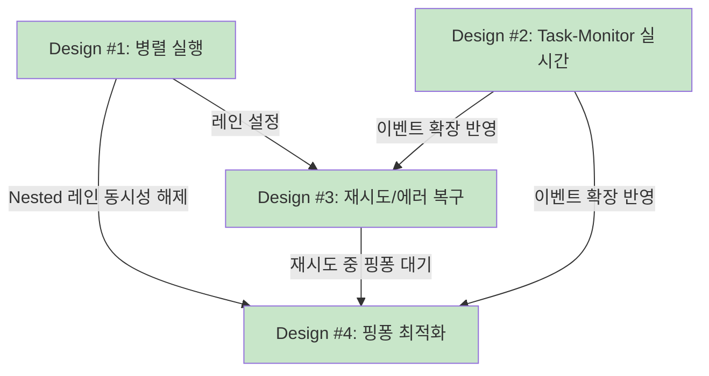

# A2A 핑퐁 턴 최적화 설계

> 작성일: 2026-02-17
> 상태: ✅ 구현 완료 (2026-02-18)
> 대상: `prontolab-openclaw`

## 목차

1. [현재 상태 분석](#1-현재-상태-분석)
2. [문제점](#2-문제점)
3. [설계 목표](#3-설계-목표)
4. [최적화 전략](#4-최적화-전략)
5. [구현 계획](#5-구현-계획)
6. [설정 스키마 확장](#6-설정-스키마-확장)
7. [모니터링](#7-모니터링)
8. [위험 분석 및 롤백](#8-위험-분석-및-롤백)

---

## 1. 현재 상태 분석

### 1.1 핑퐁 메커니즘 개요

A2A 메시지 전송 시 요청자(requester)와 대상(target)이 번갈아가며 응답하는 다중 턴 대화:



### 1.2 핵심 코드 구조

**핑퐁 루프** (`sessions-send-tool.a2a.ts` ~line 300-360):

```typescript
const shouldSkipPingPong =
  params.skipPingPong || /\[NO_REPLY_NEEDED\]|\[NOTIFICATION\]/i.test(params.message);

if (!shouldSkipPingPong && params.maxPingPongTurns > 0 && params.requesterSessionKey) {
  let currentSessionKey = params.requesterSessionKey;
  let nextSessionKey = params.targetSessionKey;
  let incomingMessage = latestReply;

  for (let turn = 1; turn <= params.maxPingPongTurns; turn += 1) {
    const replyText = await runAgentStep({
      sessionKey: currentSessionKey,
      message: incomingMessage,
      extraSystemPrompt: replyPrompt,
      timeoutMs: params.announceTimeoutMs, // 30초 (비동기) 또는 사용자 지정
      lane: AGENT_LANE_NESTED,
    });

    if (!replyText || isReplySkip(replyText)) break;

    // a2a.response 이벤트 발행
    // 세션 키 swap
    const swap = currentSessionKey;
    currentSessionKey = nextSessionKey;
    nextSessionKey = swap;
  }
}
```

**핑퐁 프롬프트** (`sessions-send-helpers.ts` ~line 206-230):

```typescript
function buildAgentToAgentReplyContext(params) {
  return [
    "Agent-to-agent reply step:",
    `Current agent: ${currentLabel}.`,
    `Turn ${params.turn} of ${params.maxTurns}.`,
    `Agent 1 (requester) session: ${params.requesterSessionKey}.`,
    `Agent 2 (target) session: ${params.targetSessionKey}.`,
    `If you want to stop the ping-pong, reply exactly "${REPLY_SKIP_TOKEN}".`,
  ].join("\n");
}
```

**어나운스 프롬프트** (`sessions-send-helpers.ts` ~line 232-260):

```typescript
function buildAgentToAgentAnnounceContext(params) {
  return [
    "Agent-to-agent announce step:",
    `Original request: ${params.originalMessage}`,
    `Round 1 reply: ${params.roundOneReply}`,
    `Latest reply: ${params.latestReply}`,
    `If you want to remain silent, reply exactly "${ANNOUNCE_SKIP_TOKEN}".`,
    "Any other reply will be posted to the target channel.",
  ].join("\n");
}
```

**설정** (`sessions-send-helpers.ts`):

```typescript
const DEFAULT_PING_PONG_TURNS = 5;
const MAX_PING_PONG_TURNS = 5; // 하드 리밋

function resolvePingPongTurns(cfg?: OpenClawConfig) {
  const raw = cfg?.session?.agentToAgent?.maxPingPongTurns;
  return Math.max(0, Math.min(MAX_PING_PONG_TURNS, rounded));
}
```

**`runAgentStep`** (`agent-step.ts`):

```typescript
async function runAgentStep(params) {
  // 1. callGateway("agent", ...) → LLM 실행
  // 2. callGateway("agent.wait", { timeoutMs: min(params.timeoutMs, 60_000) })
  // 3. readLatestAssistantReply()
  // 4. 실패 시 return undefined → 핑퐁 break
}
```

### 1.3 운영 데이터 분석

```
전체 A2A 완료: 27건
├── pingPongTurns=0: 27건 (100%)  ← 메인 에이전트 간 핑퐁 없음
└── pingPongTurns>0:  0건

핑퐁 응답 이벤트: 4건 (전부 worker→main)
├── worker-quick→ruda: turn=1/1, 3건
├── worker-deep→ruda:  turn=1/1, 1건
└── worker-quick→ieum: turn=1/1, 0건 (send만 확인)

메인 에이전트 간 통신: 23건
├── eden→seum:  11건 (skipPP=false, 그러나 pingPongTurns=0)
├── ruda→eden:   5건
├── ieum→eden:   5건
└── ieum→seum:   4건 (전부 announced=false)

발견: skipPingPong=false인데도 pingPongTurns=0
→ 메인 에이전트 간에 핑퐁이 작동하지 않는 것이 아니라,
→ requesterSessionKey가 없거나 같은 세션이어서 조건문에서 스킵됨
```

### 1.4 핑퐁 진입 조건 분석

```typescript
if (
  !shouldSkipPingPong &&          // (1) 스킵 플래그 없음
  params.maxPingPongTurns > 0 &&  // (2) 턴 수 > 0
  params.requesterSessionKey &&   // (3) 요청자 세션 존재 ← 이 조건이 관건
  params.requesterSessionKey !== params.targetSessionKey  // (4) 자기 자신 아님
) { ... }
```

**조건 (3)**: 비동기 모드에서 `requesterSessionKey = opts?.agentSessionKey`로 설정됨. 에이전트가 다른 에이전트에게 보낼 때 자신의 세션 키를 전달해야 핑퐁 활성화. 현재 에이전트 설정에서 이 값이 올바르게 전달되고 있는지 확인 필요.

---

## 2. 문제점

### 2.1 고정된 턴 수 — 맥락 무시

```
DEFAULT_PING_PONG_TURNS = 5
MAX_PING_PONG_TURNS = 5
```

모든 대화에 동일한 최대 5턴 적용:

- **간단한 질문** ("이 파일 어디 있어?"): 5턴은 낭비
- **복잡한 협업** ("이 아키텍처 설계 같이 검토하자"): 5턴이 부족할 수 있음
- **알림/보고** ("[NO_REPLY_NEEDED]"로 스킵): 이미 스킵되지만 문법에 의존

### 2.2 조기 종료 판단이 LLM에게만 의존

```
"If you want to stop the ping-pong, reply exactly "REPLY_SKIP"."
```

LLM이 `REPLY_SKIP`을 정확히 출력해야 핑퐁이 중단됨:

- LLM이 "더 이상 논의할 사항이 없습니다"라고 답해도 핑퐁 계속 진행
- `REPLY_SKIP` 토큰을 정확히 출력하지 않으면 무한히 (maxTurns까지) 반복
- **불필요한 LLM 호출** = 비용 + 시간 낭비 + Nested 레인 점유

### 2.3 핑퐁당 리소스 비용

각 핑퐁 턴 = 1회 `runAgentStep`:

- `callGateway("agent", ...)` → LLM 실행 (토큰 소비)
- `callGateway("agent.wait", { timeoutMs: 60s })` → 대기
- `readLatestAssistantReply()` → 히스토리 읽기

**5턴 핑퐁 비용**:

- LLM 호출: 5회 (핑퐁) + 1회 (어나운스) = 6회 추가 LLM 호출
- Nested 레인 점유: 턴당 최대 60초 × 5 = 최대 300초
- 토큰: 에이전트 전체 컨텍스트 × 6

**현재 실제 데이터**: worker→main만 1턴 핑퐁 발생. 메인 에이전트 간 0턴. 5턴 설정이 실제로는 무의미.

### 2.4 어나운스 단계 비효율

핑퐁 후 반드시 어나운스 단계 실행:

```typescript
const announceReply = await runAgentStep({
  message: "Agent-to-agent announce step.",
  extraSystemPrompt: announcePrompt, // originalMessage + roundOneReply + latestReply 포함
  timeoutMs: params.announceTimeoutMs,
});
```

- 핑퐁에서 이미 충분한 대화가 오갔는데, 어나운스에서 **다시 요약**
- 어나운스가 채널에 게시되지 않을 경우 (`ANNOUNCE_SKIP`) LLM 호출 낭비
- 현재 27건 중 announced=true: 3건 (11%), 24건은 어나운스 건너뜀/실패

### 2.5 프롬프트 정보 부족

현재 핑퐁 프롬프트:

```
Agent-to-agent reply step:
Current agent: Agent 1 (requester).
Turn 1 of 5.
...
```

**부족한 정보**:

- 원래 메시지의 맥락/목적
- 이전 턴에서 오간 내용의 요약
- 대화 종료 기준 (언제 `REPLY_SKIP`해야 하는지)
- 상대방 에이전트의 역할/전문성

---

## 3. 설계 목표

| 목표                  | 측정 기준                                      |
| --------------------- | ---------------------------------------------- |
| 불필요한 핑퐁 턴 제거 | 평균 LLM 호출 50% 이상 감소                    |
| 맥락 기반 턴 수 결정  | 메시지 유형별 차등 턴 수 적용                  |
| 자동 조기 종료        | LLM 출력 외 시스템 판단으로도 종료             |
| 어나운스 효율화       | 불필요한 어나운스 LLM 호출 제거                |
| 프롬프트 품질 향상    | 대화 목적, 종료 기준 명확 제시                 |
| 하위 호환             | 기존 설정(`maxPingPongTurns: 0-5`) 그대로 작동 |

---

## 4. 최적화 전략

### 4.1 전략 1: 메시지 의도 기반 턴 수 결정

현재 `[NO_REPLY_NEEDED]`와 `[NOTIFICATION]`만 스킵 판단에 사용. 이를 확장하여 메시지 의도를 분류하고 턴 수를 동적으로 결정:



#### 의도 분류 규칙

```typescript
// src/agents/tools/a2a-intent-classifier.ts (신규)

export enum A2AMessageIntent {
  NOTIFICATION = "notification", // 알림, 보고 — 응답 불필요
  QUESTION = "question", // 단순 질문 — 1턴 확인
  COLLABORATION = "collaboration", // 토론/협업 — 다중 턴
  ESCALATION = "escalation", // 긴급 — 즉시 어나운스
  RESULT_REPORT = "result_report", // 작업 결과 — 1턴 피드백
}

export function classifyMessageIntent(message: string): {
  intent: A2AMessageIntent;
  suggestedTurns: number;
  confidence: number;
} {
  // 1. 명시적 태그 확인 (기존 호환)
  if (/\[NO_REPLY_NEEDED\]|\[NOTIFICATION\]/i.test(message)) {
    return { intent: A2AMessageIntent.NOTIFICATION, suggestedTurns: 0, confidence: 1.0 };
  }
  if (/\[URGENT\]|\[ESCALATION\]/i.test(message)) {
    return { intent: A2AMessageIntent.ESCALATION, suggestedTurns: 0, confidence: 1.0 };
  }

  // 2. 패턴 기반 분류
  // 결과 보고 패턴
  if (/\[outcome\]|\[result\]|작업.*완료|결과.*보고|분석.*결과/i.test(message)) {
    return { intent: A2AMessageIntent.RESULT_REPORT, suggestedTurns: 1, confidence: 0.8 };
  }

  // 질문 패턴
  if (/\?$|어떻게|어디에|뭐가|확인.*해줘|알려줘/i.test(message)) {
    return { intent: A2AMessageIntent.QUESTION, suggestedTurns: 1, confidence: 0.7 };
  }

  // 협업 패턴
  if (/같이.*검토|함께.*논의|의견.*줘|피드백|리뷰/i.test(message)) {
    return { intent: A2AMessageIntent.COLLABORATION, suggestedTurns: -1, confidence: 0.7 };
    // suggestedTurns: -1 → 설정값(maxPingPongTurns) 사용
  }

  // 기본값: 질문으로 간주 (보수적 — 불필요한 핑퐁 방지)
  return { intent: A2AMessageIntent.QUESTION, suggestedTurns: 1, confidence: 0.5 };
}
```

#### 턴 수 해결 함수

```typescript
export function resolveEffectivePingPongTurns(params: {
  configMaxTurns: number; // 설정의 maxPingPongTurns (0-5)
  classifiedIntent: { intent: A2AMessageIntent; suggestedTurns: number };
  explicitSkipPingPong: boolean; // 호출자가 명시적으로 스킵 요청
}): number {
  // 명시적 스킵이 최우선
  if (params.explicitSkipPingPong) return 0;

  // 의도 분류의 suggestedTurns가 0이면 스킵
  if (params.classifiedIntent.suggestedTurns === 0) return 0;

  // suggestedTurns가 -1이면 설정값 사용 (협업 모드)
  if (params.classifiedIntent.suggestedTurns === -1) return params.configMaxTurns;

  // 나머지: min(suggested, config) — 더 작은 값 사용
  return Math.min(params.classifiedIntent.suggestedTurns, params.configMaxTurns);
}
```

### 4.2 전략 2: 시스템 레벨 조기 종료

LLM의 `REPLY_SKIP` 출력에만 의존하지 않고, 시스템이 판단하는 조기 종료 조건 추가:

```typescript
function shouldTerminatePingPong(params: {
  replyText: string;
  turn: number;
  maxTurns: number;
  previousReplies: string[];
}): { terminate: boolean; reason: string } {
  // 1. LLM 명시적 종료 (기존)
  if (isReplySkip(params.replyText)) {
    return { terminate: true, reason: "explicit_skip" };
  }

  // 2. 반복 감지 — 직전 턴과 유사도 높으면 대화 수렴으로 판단
  if (params.previousReplies.length > 0) {
    const lastReply = params.previousReplies[params.previousReplies.length - 1];
    if (calculateSimilarity(params.replyText, lastReply) > 0.85) {
      return { terminate: true, reason: "repetition_detected" };
    }
  }

  // 3. 짧은 응답 — 실질적 내용 없음으로 판단
  const trimmed = params.replyText.trim();
  if (trimmed.length < 20 && !/\?/.test(trimmed)) {
    // 20자 미만이고 질문이 아니면 → 종료
    return { terminate: true, reason: "minimal_content" };
  }

  // 4. 종료 신호 패턴 감지
  if (/^(알겠습니다|확인했습니다|감사합니다|네,?\s*이해했습니다|완료)/i.test(trimmed)) {
    return { terminate: true, reason: "conclusion_detected" };
  }

  return { terminate: false, reason: "" };
}
```

#### 유사도 계산 (가벼운 구현)

```typescript
function calculateSimilarity(a: string, b: string): number {
  // 간단한 Jaccard 유사도 — 단어 집합 비교
  const wordsA = new Set(a.toLowerCase().split(/\s+/));
  const wordsB = new Set(b.toLowerCase().split(/\s+/));
  const intersection = new Set([...wordsA].filter((w) => wordsB.has(w)));
  const union = new Set([...wordsA, ...wordsB]);
  return union.size === 0 ? 0 : intersection.size / union.size;
}
```

외부 라이브러리 없이 순수 JS로 구현. LLM 기반 유사도(embedding)는 오버헤드가 커서 부적합.

### 4.3 전략 3: 어나운스 조건부 실행

현재: 핑퐁 후 **항상** 어나운스 `runAgentStep` 실행 (LLM 1회 추가 호출)
실제: 27건 중 3건만 실제 어나운스 → 89%가 불필요한 LLM 호출



```typescript
function shouldRunAnnounce(params: {
  announceTarget: AnnounceTarget | null;
  requesterSessionKey?: string;
  targetSessionKey: string;
  latestReply?: string;
}): boolean {
  // 어나운스 타겟이 없으면 스킵
  if (!announceTarget) return false;

  // 응답 자체가 없으면 어나운스할 내용 없음
  if (!params.latestReply?.trim()) return false;

  // 내부 채널(internal)이면 스킵
  if (announceTarget.channel === "internal") return false;

  return true;
}
```

### 4.4 전략 4: 프롬프트 개선

#### 핑퐁 프롬프트 (개선)

```typescript
function buildAgentToAgentReplyContext(params: {
  // ... 기존 필드 +
  originalMessage: string; // 신규: 원래 요청 내용
  messageIntent: string; // 신규: 분류된 의도
  previousTurnSummary?: string; // 신규: 이전 턴 요약
}) {
  return [
    "## Agent-to-agent reply step",
    "",
    `**Your role**: ${currentLabel}`,
    `**Turn**: ${params.turn} of ${params.maxTurns}`,
    `**Conversation purpose**: ${params.messageIntent}`,
    "",
    `### Original request`,
    params.originalMessage,
    "",
    params.previousTurnSummary
      ? `### Previous discussion\n${params.previousTurnSummary}`
      : undefined,
    "",
    "### Guidelines",
    "- Be concise and focused on the topic",
    "- If you have nothing substantive to add, reply exactly: REPLY_SKIP",
    "- Do NOT repeat what has already been said",
    `- This conversation will end after at most ${params.maxTurns - params.turn + 1} more turns`,
    "",
    `To end the conversation, reply exactly "${REPLY_SKIP_TOKEN}".`,
  ]
    .filter(Boolean)
    .join("\n");
}
```

**변경 포인트**:

- 원래 메시지의 목적 전달 → 에이전트가 맥락 이해
- 이전 턴 요약 전달 → 반복 방지
- "nothing substantive to add" 가이드라인 → 조기 종료 유도
- 남은 턴 수 명시 → 긴급도 인식

---

## 5. 구현 계획

### 5.1 변경 파일 목록

| 단계 | 파일                                               | 변경 내용                                           |
| ---- | -------------------------------------------------- | --------------------------------------------------- |
| 1    | `src/agents/tools/a2a-intent-classifier.ts` (신규) | 메시지 의도 분류, 턴 수 해결                        |
| 2    | `src/agents/tools/sessions-send-tool.a2a.ts`       | 핑퐁 루프에 조기 종료 + 의도 기반 턴 수 적용        |
| 3    | `src/agents/tools/sessions-send-helpers.ts`        | 프롬프트 개선, 어나운스 조건부 실행                 |
| 4    | `src/config/zod-schema.session.ts`                 | `suggestedTurnsOverride`, `autoTerminate` 설정 추가 |
| 5    | `src/config/types.base.ts`                         | 타입 확장                                           |
| 6    | 테스트 파일                                        | 의도 분류 + 조기 종료 + 프롬프트 테스트             |

### 5.2 단계별 구현

#### 단계 1: 의도 분류 모듈 (신규)

```
src/agents/tools/a2a-intent-classifier.ts
├── A2AMessageIntent enum
├── classifyMessageIntent() function
├── resolveEffectivePingPongTurns() function
├── shouldTerminatePingPong() function
├── calculateSimilarity() helper
└── shouldRunAnnounce() function
```

순수 함수, 부수 효과 없음. 독립 테스트 가능.

#### 단계 2: 핑퐁 루프 수정

**변경 전**:

```typescript
const shouldSkipPingPong =
  params.skipPingPong || /\[NO_REPLY_NEEDED\]|\[NOTIFICATION\]/i.test(params.message);

for (let turn = 1; turn <= params.maxPingPongTurns; turn += 1) {
  const replyText = await runAgentStep({ ... });
  if (!replyText || isReplySkip(replyText)) break;
  // ... emit, swap
}
```

**변경 후**:

```typescript
// 의도 분류
const intentResult = classifyMessageIntent(params.message);
const effectiveTurns = resolveEffectivePingPongTurns({
  configMaxTurns: params.maxPingPongTurns,
  classifiedIntent: intentResult,
  explicitSkipPingPong: params.skipPingPong ?? false,
});

const previousReplies: string[] = [];

if (effectiveTurns > 0 && params.requesterSessionKey
    && params.requesterSessionKey !== params.targetSessionKey) {
  for (let turn = 1; turn <= effectiveTurns; turn += 1) {
    const replyText = await runAgentStep({ ... });
    if (!replyText) break;

    // 시스템 조기 종료 판단
    const termination = shouldTerminatePingPong({
      replyText,
      turn,
      maxTurns: effectiveTurns,
      previousReplies,
    });
    if (termination.terminate) {
      // 종료 사유를 이벤트에 포함
      emit({ type: EVENT_TYPES.A2A_RESPONSE, ..., data: {
        ..., terminationReason: termination.reason
      }});
      break;
    }

    previousReplies.push(replyText);
    // ... emit, swap
  }
}

// 어나운스 조건부 실행
if (shouldRunAnnounce({ announceTarget, requesterSessionKey, targetSessionKey, latestReply })) {
  const announceReply = await runAgentStep({ ... });
  // ...
}
```

#### 단계 3: 프롬프트 개선

`buildAgentToAgentReplyContext()` 확장:

- `originalMessage` 파라미터 추가
- `messageIntent` 파라미터 추가
- `previousTurnSummary` 파라미터 추가

`buildAgentToAgentAnnounceContext()` — 변경 없음 (기존 동작 유지).

#### 단계 4-5: 설정 스키마 확장

```typescript
// zod-schema.session.ts
agentToAgent: z.object({
  maxPingPongTurns: z.number().int().min(0).max(10).optional(),  // max 5→10 확장
  autoTerminate: z.boolean().optional(),  // 시스템 조기 종료 활성화 (default: true)
}).strict().optional(),
```

```typescript
// types.base.ts
agentToAgent?: {
  maxPingPongTurns?: number;
  /** Enable system-level early termination of ping-pong. Default: true. */
  autoTerminate?: boolean;
};
```

**MAX_PING_PONG_TURNS 상한 변경**: 5 → 10. 복잡한 협업 시나리오를 위해. 의도 분류 + 조기 종료가 있으므로 실제로 10턴까지 가는 경우는 드물 것.

### 5.3 구현 순서



- 단계 1, 4-5는 독립적 → 병렬 가능
- 단계 3은 1과 함께
- 단계 2는 1, 3, 4-5 완료 후
- 단계 6은 전부 완료 후

---

## 6. 설정 스키마 확장

### 6.1 전체 A2A 설정 (Design #3과 통합)

```typescript
session: {
  agentToAgent: {
    // 핑퐁 설정
    maxPingPongTurns: 5,       // 최대 턴 수 (0-10, default: 5)
    autoTerminate: true,        // 시스템 조기 종료 (default: true)

    // 재시도 설정 (Design #3)
    retry: {
      enabled: true,
      maxAttempts: 3,
      baseBackoffMs: 2_000,
      maxBackoffMs: 60_000,
    },

    // 타임아웃 설정 (Design #3)
    timeout: {
      maxWaitMs: 300_000,
      chunkMs: 30_000,
    },
  },
}
```

### 6.2 에이전트별 핑퐁 오버라이드 (향후)

```typescript
agents: {
  seum: {
    agentToAgent: {
      maxPingPongTurns: 3,  // seum은 코드 관련이라 짧은 핑퐁
    },
  },
  ruda: {
    agentToAgent: {
      maxPingPongTurns: 7,  // ruda는 매니저라 더 긴 토론 필요
    },
  },
}
```

---

## 7. 모니터링

### 7.1 이벤트 확장

기존 `a2a.response` 이벤트에 필드 추가:

```typescript
{
  type: "a2a.response",
  data: {
    // ... 기존 필드 +
    messageIntent?: string;        // "notification", "question", "collaboration" 등
    effectiveTurns?: number;       // 의도 기반 결정된 실제 턴 수
    terminationReason?: string;    // "explicit_skip", "repetition_detected", "minimal_content" 등
  }
}
```

기존 `a2a.complete` 이벤트에 필드 추가:

```typescript
{
  type: "a2a.complete",
  data: {
    // ... 기존 필드 +
    messageIntent?: string;
    configuredMaxTurns?: number;   // 설정된 최대 턴
    effectiveTurns?: number;       // 의도 기반 결정된 턴
    actualTurns?: number;          // 실제 실행된 턴
    earlyTermination?: boolean;    // 조기 종료 여부
    terminationReason?: string;    // 종료 사유
    announceSkipped?: boolean;     // 어나운스 건너뜀 여부
    announceSkipReason?: string;   // 건너뜀 사유
  }
}
```

### 7.2 대시보드 지표

Task-Monitor에서 표시할 핑퐁 관련 지표:

| 지표               | 계산                                    | 목적                 |
| ------------------ | --------------------------------------- | -------------------- |
| 평균 실제 턴 수    | `mean(actualTurns)`                     | 핑퐁 효율 모니터링   |
| 조기 종료 비율     | `count(earlyTermination=true) / total`  | 최적화 효과 측정     |
| 의도별 분포        | `groupBy(messageIntent).count`          | 메시지 패턴 파악     |
| 어나운스 스킵 비율 | `count(announceSkipped=true) / total`   | 어나운스 최적화 효과 |
| 턴당 평균 시간     | `(complete.ts - send.ts) / actualTurns` | 성능 모니터링        |

---

## 8. 위험 분석 및 롤백

### 8.1 위험 요소

| 위험                               | 영향                               | 확률 | 완화 방안                                       |
| ---------------------------------- | ---------------------------------- | ---- | ----------------------------------------------- |
| 의도 오분류 → 핑퐁 너무 적음       | 에이전트 협업 품질 저하            | 중   | 보수적 기본값 (QUESTION→1턴), confidence 임계값 |
| 의도 오분류 → 핑퐁 너무 많음       | 리소스 낭비                        | 낮   | 조기 종료가 안전망 역할                         |
| 조기 종료 오판 → 중요한 대화 끊김  | 협업 품질 저하                     | 낮   | 유사도 임계값 보수적 설정 (0.85)                |
| 반복 감지 false positive           | 유사하지만 다른 내용을 같다고 판단 | 낮   | Jaccard 유사도는 단어 순서 무시 → FP 낮음       |
| 어나운스 건너뜀 → 사용자 알림 누락 | UX 저하                            | 중   | 외부 채널 타겟 있으면 반드시 실행               |

### 8.2 롤백 계획

```yaml
# 부분 롤백: 설정으로 기존 동작 복원
session.agentToAgent.autoTerminate: false
# → 의도 분류는 작동하지만 시스템 조기 종료 비활성화

# 의도 분류 비활성화: 코드 한 줄 변경
# resolveEffectivePingPongTurns()에서 항상 configMaxTurns 반환

# 완전 롤백: git revert
# 단계 1 (의도 분류): 삭제해도 부수 효과 없음 (신규 파일)
# 단계 2 (핑퐁 루프): 핵심 변경 — revert 필요
# 단계 3 (프롬프트): 독립적, 개별 revert 가능
# 단계 4-5 (설정): 하위 호환 — 새 필드 무시됨
```

### 8.3 테스트 전략

| 테스트 범위      | 방법                                                            |
| ---------------- | --------------------------------------------------------------- |
| 의도 분류 정확성 | 단위 테스트: 20+ 메시지 샘플 → 기대 의도                        |
| 턴 수 해결       | 단위 테스트: 의도 × 설정값 조합                                 |
| 조기 종료 판단   | 단위 테스트: 유사 응답, 짧은 응답, 종료 패턴                    |
| 유사도 계산      | 단위 테스트: 동일/유사/다른 텍스트 쌍                           |
| 어나운스 조건    | 단위 테스트: 타겟 유무 × 채널 유형                              |
| 프롬프트 생성    | 스냅샷 테스트: 출력 형식 검증                                   |
| 통합             | 기존 `sessions-send-tool.a2a.test.ts` 확장                      |
| E2E              | 실제 에이전트 간 메시지 → 이벤트에 intent/termination 포함 확인 |

### 8.4 단계적 활성화

1. **Phase A**: 의도 분류만 활성화, 턴 수는 기존 설정 유지
   - 이벤트에 `messageIntent` 기록 → 분류 정확도 모니터링
   - 기존 동작 변경 없음

2. **Phase B**: 의도 기반 턴 수 활성화
   - `resolveEffectivePingPongTurns()` 실제 적용
   - 1주 모니터링 후 조기 종료 활성화

3. **Phase C**: 시스템 조기 종료 + 어나운스 최적화
   - `autoTerminate: true` 적용
   - `shouldRunAnnounce()` 적용

---

## 부록: 4개 설계 문서 상호 의존성



**구현 권장 순서**:

1. Design #1 (병렬 실행) — 다른 설계의 전제 조건
2. Design #3 (재시도/에러 복구) — 안정성 먼저
3. Design #2 (Task-Monitor) — 모니터링 인프라
4. Design #4 (핑퐁 최적화) — 모니터링 기반 튜닝 가능
