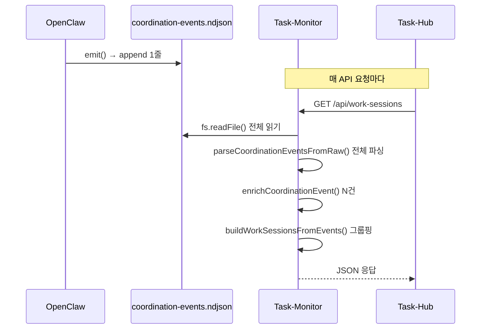
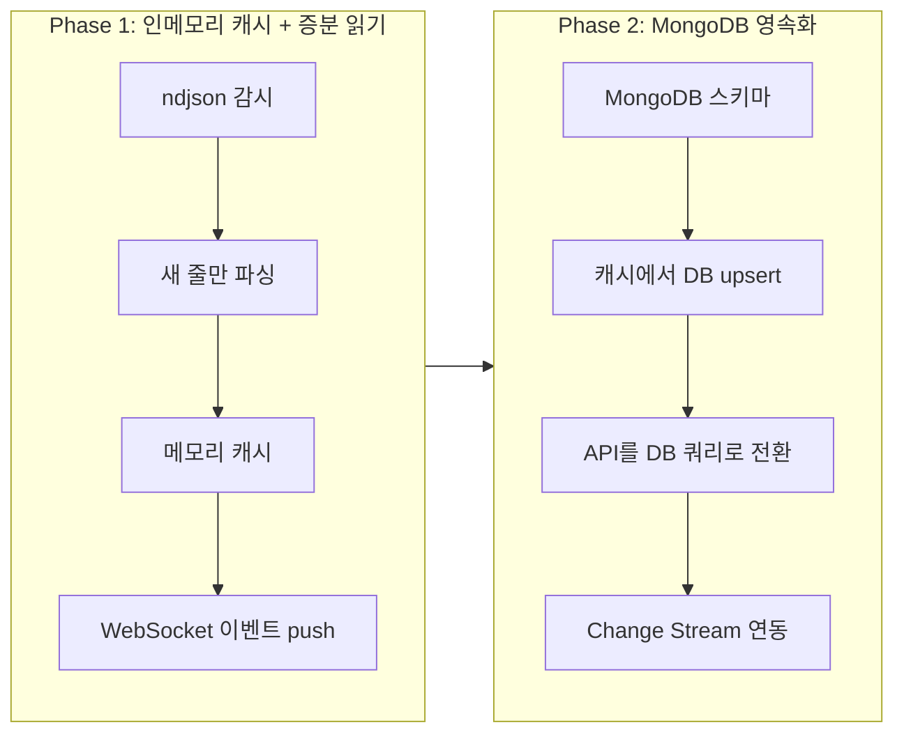
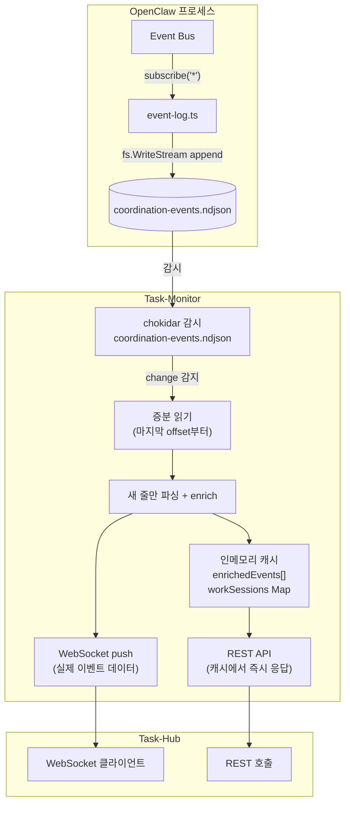
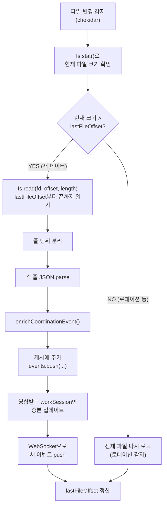
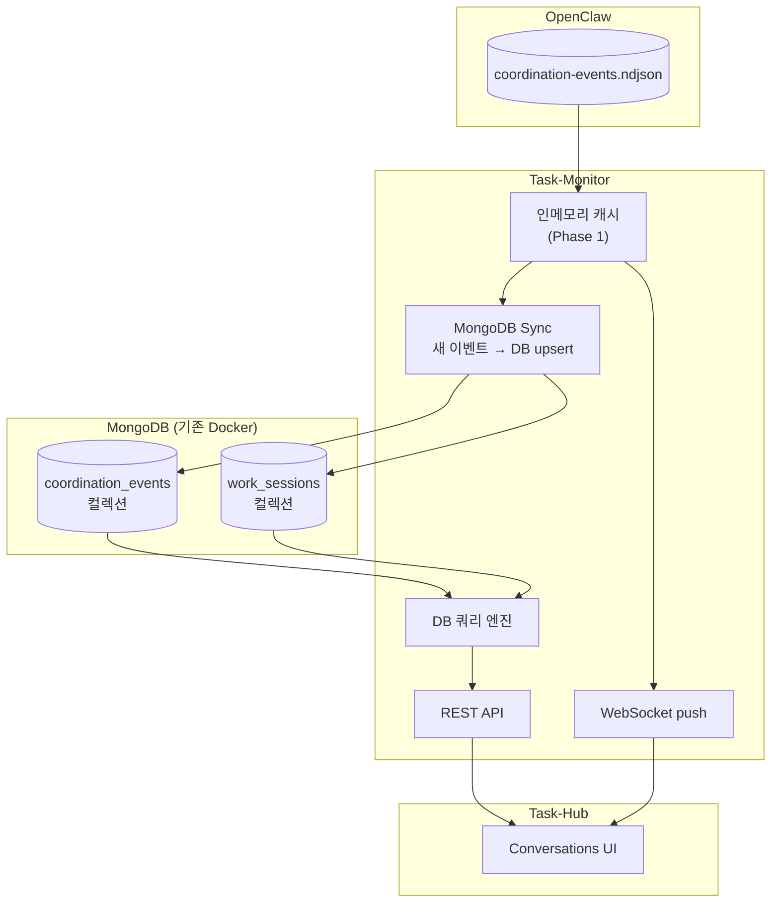
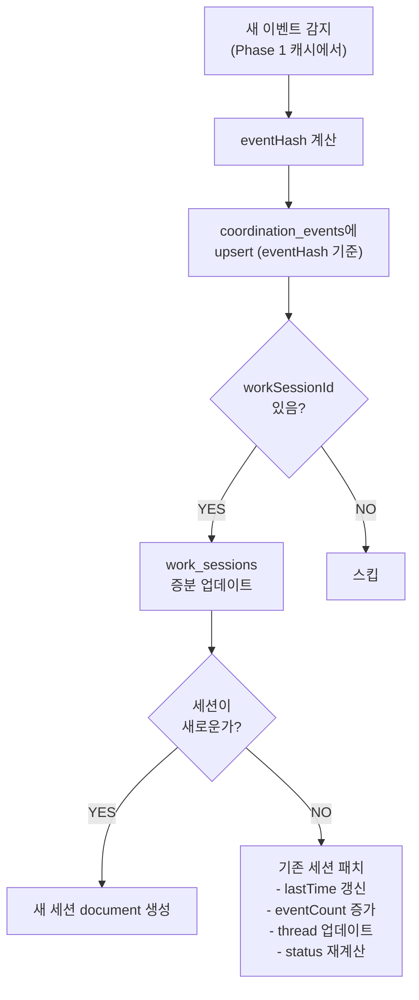
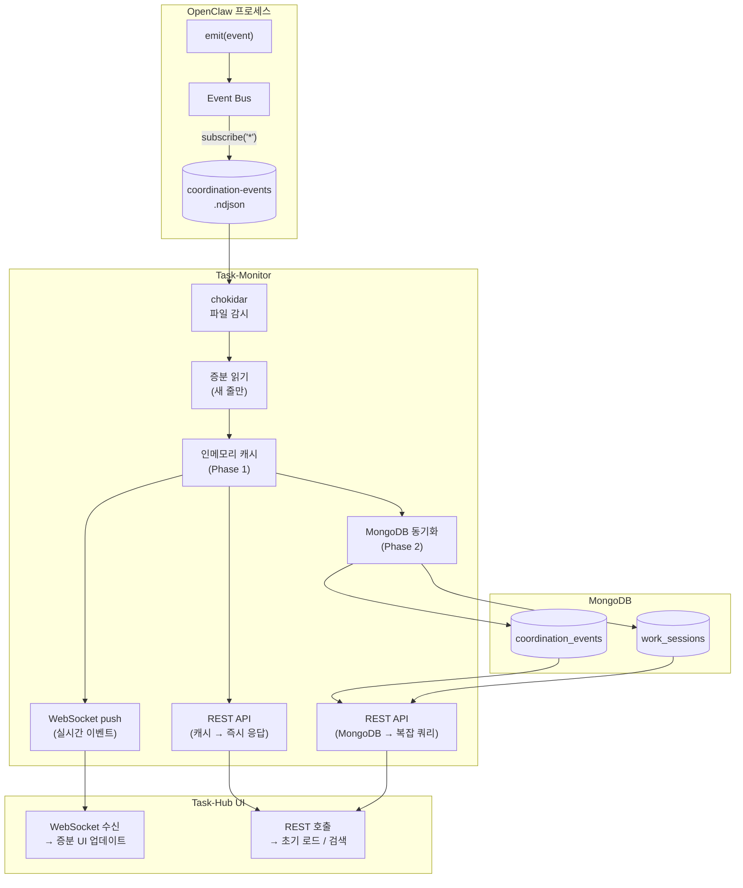
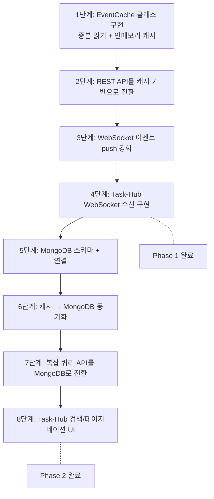

# Task-Monitor 실시간성 개선 설계

> 작성일: 2026-02-17
> 상태: ✅ 구현 완료 (2026-02-17)
> 대상: `task-monitor-server.ts` + `task-hub`

## 0. 문제 정의

### 0.1 현재 구조



### 0.2 병목

| 병목             | 현재        | 이벤트 1만건 시 예상 | 이벤트 10만건 시 예상 |
| ---------------- | ----------- | -------------------- | --------------------- |
| 파일 읽기        | 196KB, ~1ms | ~3MB, ~10ms          | ~30MB, ~100ms         |
| JSON 파싱 (줄별) | 682줄, ~5ms | ~50ms                | ~500ms                |
| enrichment       | ~10ms       | ~100ms               | ~1000ms               |
| 그룹핑           | ~5ms        | ~50ms                | ~500ms                |
| **총 응답 시간** | **~20ms**   | **~200ms**           | **~2000ms**           |

### 0.3 WebSocket 한계

현재 WebSocket은 chokidar 파일 변경 시 **알림만** 전송:

```typescript
// 현재 동작
broadcast({
  type: "event_log", // "파일이 바뀌었다"는 신호만
  data: { event, file: basename }, // 실제 이벤트 데이터 없음
});
```

Task-Hub가 이 신호를 받아도 결국 REST API를 다시 호출해서 전체 데이터를 받아야 함.

---

## 1. 단계적 개선 전략



---

## 2. Phase 1: 인메모리 캐시 + 증분 읽기

### 2.1 아키텍처



### 2.2 핵심 구현: EventCache 클래스

```typescript
// task-monitor-server.ts 내부에 추가할 EventCache

interface EventCache {
  // 상태
  events: EnrichedCoordinationEvent[]; // 전체 이벤트 (시간순)
  workSessions: Map<string, WorkSession>; // workSessionId → 세션
  lastFileOffset: number; // 마지막으로 읽은 파일 위치 (바이트)
  lastLineCount: number; // 마지막으로 읽은 줄 수

  // 메서드
  initialize(): Promise<void>; // 서버 시작 시 전체 파일 1회 로드
  onFileChange(): Promise<NewEvent[]>; // 파일 변경 시 새 줄만 읽기
  getWorkSessions(filters): WorkSession[]; // API용 필터링된 워크세션 반환
  getEvents(filters): EnrichedEvent[]; // API용 필터링된 이벤트 반환
}
```

### 2.3 증분 읽기 로직



### 2.4 WebSocket 이벤트 push 프로토콜

현재 vs 변경:

```typescript
// 현재: 파일 변경 알림만
broadcast({
  type: "event_log",
  data: { event: "change", file: "coordination-events.ndjson" }
});

// 변경: 실제 이벤트 데이터 포함
broadcast({
  type: "coordination_event_new",
  timestamp: new Date().toISOString(),
  data: {
    events: [
      {
        type: "a2a.send",
        agentId: "eden",
        ts: 1771330358110,
        data: { fromAgent: "eden", toAgent: "seum", ... },
        // enrichment 결과 포함
        eventRole: "conversation.main",
        collabCategory: "engineering_build",
      }
    ],
    affectedWorkSessions: ["ws_abc123"],  // UI가 어떤 세션을 갱신할지 힌트
  }
});
```

### 2.5 REST API 변경

```typescript
// 현재: 매번 파일 전체 읽기
app.get("/api/work-sessions", async (req, res) => {
  const raw = await fs.readFile(eventLogPath, "utf-8"); // 전체 읽기
  const { events } = parseCoordinationEventsFromRaw(raw); // 전체 파싱
  const sessions = buildWorkSessionsFromEvents(events, filters); // 전체 빌드
  jsonResponse(res, { sessions });
});

// 변경: 캐시에서 즉시 응답
app.get("/api/work-sessions", (req, res) => {
  const sessions = eventCache.getWorkSessions(filters); // 캐시 조회
  jsonResponse(res, { sessions });
});
```

### 2.6 Phase 1 성능 예상

| 작업      | 현재 (매 요청)             | Phase 1 (캐시)          |
| --------- | -------------------------- | ----------------------- |
| 파일 읽기 | 전체 파일                  | 새 줄만 (수 바이트~KB)  |
| 파싱      | 전체 N줄                   | 새 줄만 (1~10줄)        |
| 그룹핑    | 전체 재계산                | 증분 업데이트           |
| API 응답  | ~20ms (현재) ~ 2s (10만건) | **<5ms** (항상)         |
| WebSocket | 알림만                     | 실제 이벤트 데이터 push |

### 2.7 Phase 1 변경 파일

| 파일                                      | 변경 내용                                                                  |
| ----------------------------------------- | -------------------------------------------------------------------------- |
| `scripts/task-monitor-server.ts`          | EventCache 클래스 추가, API 핸들러 캐시 사용으로 전환, WebSocket push 강화 |
| `task-hub/src/app/conversations/page.tsx` | WebSocket으로 실시간 이벤트 수신 + 증분 UI 업데이트                        |

---

## 3. Phase 2: MongoDB 영속화

### 3.1 아키텍처



### 3.2 MongoDB 스키마

#### coordination_events 컬렉션

```typescript
interface CoordinationEventDoc {
  _id: ObjectId; // MongoDB 자동 생성
  type: string; // "a2a.send" 등
  agentId: string; // 발행자
  ts: number; // 원본 타임스탬프 (밀리초)
  createdAt: Date; // MongoDB 인덱스용

  // 원본 data
  fromAgent?: string;
  toAgent?: string;
  conversationId?: string;
  workSessionId?: string;
  taskId?: string;
  message?: string;
  replyPreview?: string;
  outcome?: string;
  waitStatus?: string;
  waitError?: string;
  turn?: number;
  maxTurns?: number;
  announced?: boolean;

  // enrichment 결과
  eventRole: string; // "conversation.main" 등
  collabCategory?: string; // "engineering_build" 등
  collabSubTags?: string[];
  categoryConfidence?: number;
  categorySource?: string;
  fromSessionType?: string;
  toSessionType?: string;

  // 중복 방지용 해시
  eventHash: string; // SHA256(type + agentId + ts + JSON(data))
}
```

**인덱스:**

```javascript
// 기본 조회용
db.coordination_events.createIndex({ ts: -1 });
db.coordination_events.createIndex({ type: 1, ts: -1 });
db.coordination_events.createIndex({ agentId: 1, ts: -1 });

// 대화 조회용
db.coordination_events.createIndex({ conversationId: 1, ts: 1 });
db.coordination_events.createIndex({ workSessionId: 1, ts: 1 });

// 필터용
db.coordination_events.createIndex({ eventRole: 1, ts: -1 });
db.coordination_events.createIndex({ collabCategory: 1, ts: -1 });

// 중복 방지
db.coordination_events.createIndex({ eventHash: 1 }, { unique: true });

// TTL (선택: 90일 후 자동 삭제)
db.coordination_events.createIndex({ createdAt: 1 }, { expireAfterSeconds: 7776000 });
```

#### work_sessions 컬렉션

```typescript
interface WorkSessionDoc {
  _id: string; // workSessionId
  status: "ACTIVE" | "QUIET" | "ARCHIVED";
  startTime: number;
  lastTime: number;
  durationMs: number;
  threadCount: number;
  eventCount: number;

  collabCategory?: string;
  collabSubTags?: string[];
  categoryOverride?: {
    collabCategory: string;
    updatedAt: string;
    updatedBy?: string;
  };

  threads: Array<{
    id: string; // "conv:{conversationId}" 등
    conversationId?: string;
    fromAgent: string;
    toAgent: string;
    startTime: number;
    lastTime: number;
    eventCount: number;
    lastEventType?: string;
    lastOutcome?: string;
  }>;

  // 업데이트 추적
  updatedAt: Date;
}
```

**인덱스:**

```javascript
db.work_sessions.createIndex({ status: 1, lastTime: -1 });
db.work_sessions.createIndex({ collabCategory: 1, lastTime: -1 });
db.work_sessions.createIndex({ "threads.conversationId": 1 });
db.work_sessions.createIndex({ updatedAt: -1 });
```

### 3.3 동기화 전략



**동기화 원칙:**

| 원칙                 | 설명                                                                  |
| -------------------- | --------------------------------------------------------------------- |
| ndjson이 진실의 원천 | MongoDB는 파생 데이터. ndjson이 항상 우선                             |
| 멱등성 보장          | eventHash로 중복 삽입 방지. 재시작 시 안전하게 재동기화 가능          |
| 증분 업데이트        | 새 이벤트만 DB에 추가. 전체 재빌드 불필요                             |
| 장애 복구            | task-monitor 재시작 시 → ndjson 전체 스캔 → DB와 비교 → 누락분만 삽입 |

### 3.4 REST API 변경 (Phase 2)

```typescript
// Phase 1: 인메모리 캐시
app.get("/api/work-sessions", (req, res) => {
  const sessions = eventCache.getWorkSessions(filters);
  jsonResponse(res, { sessions });
});

// Phase 2: MongoDB 쿼리
app.get("/api/work-sessions", async (req, res) => {
  const query: any = {};
  if (filters.status) query.status = { $in: filters.status };
  if (filters.category) query.collabCategory = filters.category;

  const sessions = await db
    .collection("work_sessions")
    .find(query)
    .sort({ lastTime: -1 })
    .limit(filters.limit || 50)
    .toArray();

  jsonResponse(res, { sessions });
});
```

### 3.5 Phase 2에서 새로 가능해지는 것

| 기능             | Phase 1 (캐시)       | Phase 2 (MongoDB)         |
| ---------------- | -------------------- | ------------------------- |
| 기본 필터링      | 메모리 내 filter()   | DB 인덱스 쿼리            |
| 페이지네이션     | offset/limit로 slice | cursor 기반, 효율적       |
| 전문 검색        | 불가                 | text 인덱스로 메시지 검색 |
| 시간 범위 쿼리   | 가능하나 전체 스캔   | ts 인덱스로 효율적        |
| 집계 (통계)      | 매번 재계산          | aggregation pipeline      |
| 히스토리 (90일+) | 메모리 한계          | TTL 인덱스로 자동 관리    |
| 재시작 복구      | 파일 전체 재파싱     | DB에서 즉시 로드          |
| 다중 인스턴스    | 불가 (프로세스 로컬) | 공유 DB로 가능            |

### 3.6 Phase 2 변경 파일

| 파일                                      | 변경 내용                                                         |
| ----------------------------------------- | ----------------------------------------------------------------- |
| `scripts/task-monitor-server.ts`          | MongoDB 연결 + 동기화 로직 + API를 DB 쿼리로 전환                 |
| `docker-compose.yml`                      | task-monitor에 MONGODB_URI 환경변수 추가 (기존 todo-mongo 재사용) |
| `task-hub/src/app/conversations/page.tsx` | 페이지네이션, 검색 UI 추가                                        |

### 3.7 Docker 설정 변경

```yaml
# docker-compose.yml — task-monitor에 MongoDB 연결 추가
task-monitor:
  environment:
    - TASK_HUB_URL=http://task-hub:3000
    - TASK_HUB_PROXY_COOKIE=task-hub-session=${TASK_HUB_SESSION_VALUE:-authenticated}
    - TASK_MONITOR_WRITE_TOKEN=${TASK_MONITOR_WRITE_TOKEN}
    - MONGODB_URI=mongodb://todo-mongo:27017/task-monitor # 추가
  depends_on: # 추가
    todo-mongo:
      condition: service_started
```

---

## 4. 전체 데이터 플로우 (Phase 1+2 완료 후)



**요청별 데이터 경로:**

| 요청 유형        | 데이터 경로                | 응답 시간               |
| ---------------- | -------------------------- | ----------------------- |
| 초기 페이지 로드 | REST → 인메모리 캐시       | <5ms                    |
| 실시간 새 이벤트 | WebSocket push             | <100ms (이벤트 발생 후) |
| 검색/필터        | REST → MongoDB             | <50ms                   |
| 페이지네이션     | REST → MongoDB cursor      | <20ms                   |
| 시간 범위 조회   | REST → MongoDB             | <50ms                   |
| 통계/집계        | REST → MongoDB aggregation | <100ms                  |

---

## 5. 구현 순서



| 단계 | 파일                                                    | 예상 난이도 |
| ---- | ------------------------------------------------------- | ----------- |
| 1    | `scripts/task-monitor-server.ts`                        | 중간        |
| 2    | `scripts/task-monitor-server.ts`                        | 낮음        |
| 3    | `scripts/task-monitor-server.ts`                        | 낮음        |
| 4    | `task-hub/src/app/conversations/page.tsx`               | 중간        |
| 5    | `scripts/task-monitor-server.ts` + `docker-compose.yml` | 낮음        |
| 6    | `scripts/task-monitor-server.ts`                        | 중간        |
| 7    | `scripts/task-monitor-server.ts`                        | 중간        |
| 8    | `task-hub/src/app/conversations/page.tsx`               | 높음        |

---

## 6. 리스크 및 완화

| #   | 리스크                                  | 심각도 | 완화                                                       |
| --- | --------------------------------------- | ------ | ---------------------------------------------------------- |
| 1   | 인메모리 캐시 메모리 폭발               | 중간   | 최대 이벤트 수 제한 (예: 최근 10만건), 오래된 것 자동 제거 |
| 2   | 증분 읽기에서 파일 로테이션 감지 실패   | 낮음   | 파일 크기가 줄면 전체 재로드                               |
| 3   | MongoDB 연결 실패                       | 낮음   | Phase 1 캐시가 fallback으로 동작                           |
| 4   | ndjson과 MongoDB 불일치                 | 중간   | eventHash로 멱등성 보장 + 주기적 정합성 체크               |
| 5   | WebSocket 연결 끊김 시 이벤트 손실      | 낮음   | 재연결 시 since 파라미터로 누락분 REST 조회                |
| 6   | task-monitor 재시작 시 캐시 콜드 스타트 | 낮음   | Phase 2에서는 MongoDB에서 즉시 로드 가능                   |

---

## 7. 미결 사항

- [ ] MongoDB 컬렉션을 task-hub와 같은 DB(`todo-web`)에 넣을지, 별도 DB(`task-monitor`)로 분리할지
- [ ] 인메모리 캐시 최대 크기 결정 (이벤트 수 기준 vs 메모리 크기 기준)
- [ ] WebSocket 재연결 시 "since" 파라미터로 이벤트 누락 복구 구체 설계
- [ ] Phase 2에서 ndjson 파일을 유지할지 (백업용), MongoDB만 쓸지
- [ ] MongoDB TTL 정책 결정 (90일? 365일? 무제한?)
- [ ] work_sessions 컬렉션의 threads를 임베디드로 할지, 별도 컬렉션으로 분리할지

---

## 8. 소스 코드 참조

| 파일                                            | 현재 역할                               | 변경 여부                                        |
| ----------------------------------------------- | --------------------------------------- | ------------------------------------------------ |
| `scripts/task-monitor-server.ts`                | 이벤트 파일 읽기 + REST API + WebSocket | **Phase 1+2 대규모 변경**                        |
| `src/infra/events/event-log.ts`                 | ndjson 파일 쓰기                        | 변경 없음 (쓰기 경로 유지)                       |
| `src/infra/events/bus.ts`                       | 이벤트 발행                             | 변경 없음                                        |
| `docker-compose.yml`                            | Docker 스택 정의                        | **Phase 2: MONGODB_URI 추가**                    |
| `task-hub/src/app/conversations/page.tsx`       | Conversations UI                        | **Phase 1: WS 수신, Phase 2: 검색/페이지네이션** |
| `task-hub/src/app/api/proxy/[...path]/route.ts` | 프록시                                  | 변경 없음                                        |
