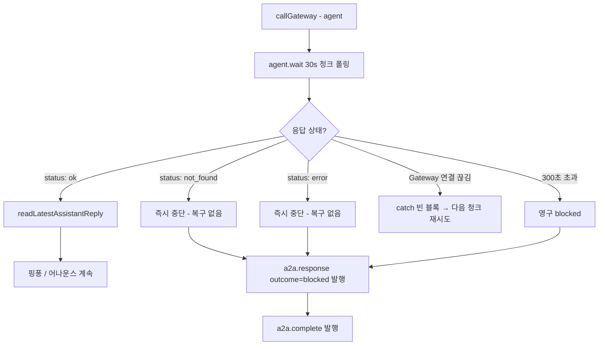
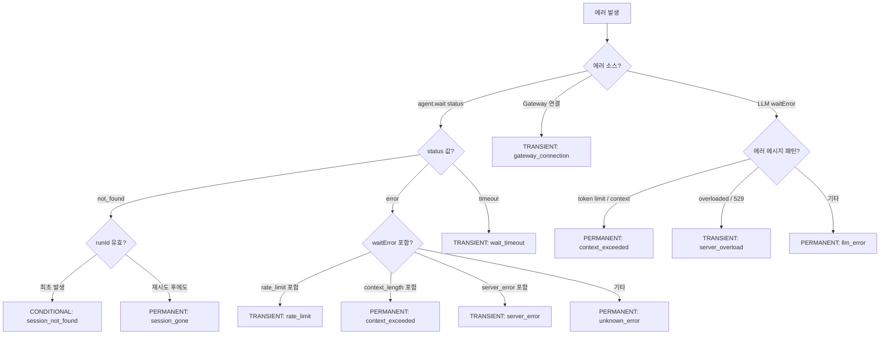
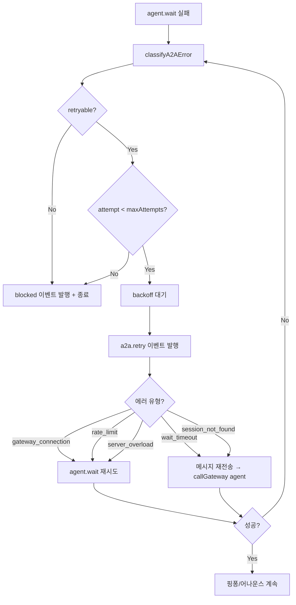
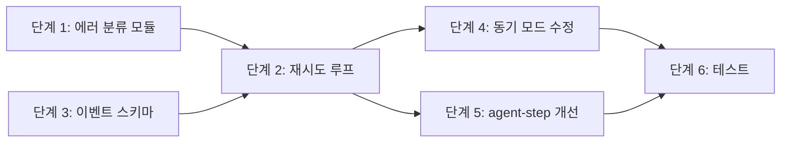
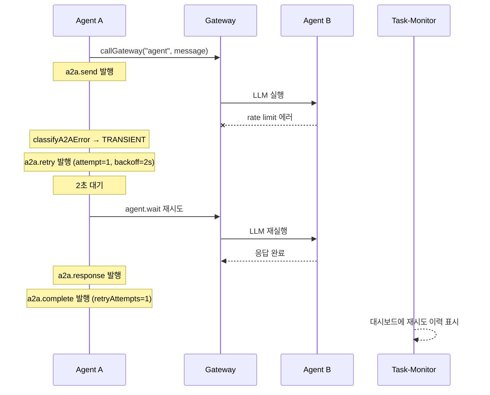

# A2A 재시도 및 에러 복구 설계

> 작성일: 2026-02-17
> 상태: 설계 (미구현)
> 대상: `prontolab-openclaw`

## 목차

1. [현재 상태 분석](#1-현재-상태-분석)
2. [문제점](#2-문제점)
3. [설계 목표](#3-설계-목표)
4. [에러 분류 체계](#4-에러-분류-체계)
5. [재시도 전략 설계](#5-재시도-전략-설계)
6. [구현 계획](#6-구현-계획)
7. [모니터링 및 이벤트 확장](#7-모니터링-및-이벤트-확장)
8. [설정 스키마](#8-설정-스키마)
9. [위험 분석 및 롤백](#9-위험-분석-및-롤백)

---

## 1. 현재 상태 분석

### 1.1 A2A 메시지 응답 대기 흐름



### 1.2 현재 에러 처리 코드 위치

| 파일                        | 라인 | 에러 유형                                 | 현재 동작                           |
| --------------------------- | ---- | ----------------------------------------- | ----------------------------------- |
| `sessions-send-tool.a2a.ts` | ~172 | Gateway 연결 끊김 (`catch {}`)            | 다음 30s 청크에서 자동 재시도       |
| `sessions-send-tool.a2a.ts` | ~184 | `agent.wait` → `not_found`                | `break` — 즉시 중단, 재시도 없음    |
| `sessions-send-tool.a2a.ts` | ~184 | `agent.wait` → `error`                    | `break` — 즉시 중단, 재시도 없음    |
| `sessions-send-tool.a2a.ts` | ~197 | 300초 타임아웃 (`elapsed >= MAX_WAIT_MS`) | 영구 `blocked` 처리                 |
| `sessions-send-tool.a2a.ts` | ~220 | LLM 컨텍스트 초과                         | `waitError`에 캡처 → 영구 `blocked` |
| `agent-step.ts`             | ~78  | `runAgentStep` 응답 없음                  | `return undefined` → 핑퐁 중단      |
| `sessions-send-tool.a2a.ts` | ~400 | 어나운스 전송 실패                        | `log.warn`만, 계속 진행             |

### 1.3 `buildNoReplyOutcomeMessage()` — 현재 에러 메시지

```typescript
// sessions-send-tool.a2a.ts line 67-92
function buildNoReplyOutcomeMessage(params) {
  if (reasonFromError) return `[outcome] blocked: 응답을 받지 못했습니다 (${reasonFromError})`;
  if (waitStatus === "not_found") return "... (실행 상태를 찾을 수 없음)";
  if (waitStatus === "error") return "... (실행 오류)";
  if (maxWaitExceeded) return `... (대기 시간 ${maxWaitMs / 1000}초 초과)`;
  return "[outcome] blocked: 응답을 받지 못했습니다";
}
```

### 1.4 실제 운영 데이터 (coordination-events.ndjson 분석)

```
총 A2A 이벤트: 90건
├── a2a.send:     29건
├── a2a.response: 26건 (initial: 22건, turn 1: 4건)
├── a2a.complete: 27건 (전부 outcome=null → 성공)
├── a2a.spawn:     4건
└── a2a.spawn_result: 4건

blocked 이벤트: 현재 로그에 0건
핑퐁 실행: 4건 (모두 worker→main, maxTurns=1)
```

**관찰**: 현재 로그에서 blocked 이벤트가 0건이지만, 이는 시스템이 안정적이라는 뜻이 아님. 에러 발생 시 **복구 메커니즘이 전혀 없어서** 단 한 번의 실패로도 대화 전체가 중단됨.

---

## 2. 문제점

### 2.1 재시도 없는 일회성 실패 → 영구 차단

```
에이전트 A → 에이전트 B 메시지 전송
  └── LLM 일시 에러 (rate limit, 네트워크 순단)
      └── agent.wait → status: "error"
          └── 즉시 break → blocked
              └── 대화 영구 중단 (복구 불가)
```

일시적 에러(rate limit, 네트워크 순단, LLM 서버 과부하)와 영구적 에러(컨텍스트 초과, 잘못된 세션)를 **동일하게 처리**하고 있음.

### 2.2 에러 정보 유실

- `catch {}` 빈 블록: Gateway 연결 에러의 상세 정보가 완전히 소실
- `waitError` 문자열만 보존: 에러 유형, 스택, 재시도 가능 여부 판단 불가
- 에러 이벤트 미발행: `a2a.error` 타입 자체가 없어 모니터링 불가

### 2.3 타임아웃 경직성

- `MAX_WAIT_MS = 300_000` (5분) 하드코딩
- `CHUNK_MS = 30_000` (30초) 하드코딩
- 에이전트별, 작업 유형별 차등 대기 불가
- 느린 작업(코드 분석 등)이 항상 5분 제한에 걸림

### 2.4 동기 모드 이벤트 누락 버그

```typescript
// sessions-send-tool.ts line ~642
if (timeoutSeconds > 0) {
  // 동기 모드
  // ... agent.wait 호출
  if (timeout) {
    return { status: "timeout" }; // ← startA2AFlow 미호출!
  }
  // ← 성공 시에도 startA2AFlow 미호출!
}
```

동기 모드(`timeoutSeconds > 0`)에서 타임아웃 발생 시 `startA2AFlow()`가 호출되지 않아 **모든 A2A 이벤트(`a2a.send`, `a2a.response`, `a2a.complete`)가 누락**됨. 모니터링 사각지대.

---

## 3. 설계 목표

| 목표                      | 측정 기준                                         |
| ------------------------- | ------------------------------------------------- |
| 일시적 에러에서 자동 복구 | Rate limit / 네트워크 순단 후 재시도 성공률 > 90% |
| 에러 유형별 차등 처리     | 재시도 가능 vs 불가 분류 정확도 100%              |
| 에러 정보 보존            | 모든 에러에 대해 유형, 원인, 시도 횟수 추적       |
| 타임아웃 유연성           | 에이전트별/작업별 설정 가능                       |
| 동기 모드 이벤트 정합성   | 동기 모드에서도 A2A 이벤트 완전 발행              |
| 기존 동작 호환            | 재시도 비활성화 시 현재와 동일 동작               |

---

## 4. 에러 분류 체계

### 4.1 에러 유형 정의

```typescript
// src/agents/tools/a2a-error-classification.ts (신규)

export enum A2AErrorCategory {
  /** 재시도로 복구 가능 — rate limit, 네트워크 순단, 서버 과부하 */
  TRANSIENT = "transient",
  /** 재시도 불가 — 컨텍스트 초과, 잘못된 세션, 인증 실패 */
  PERMANENT = "permanent",
  /** 재시도 가능하지만 조건부 — 세션 not_found (재생성 필요) */
  CONDITIONAL = "conditional",
}

export interface A2AErrorInfo {
  category: A2AErrorCategory;
  code: string; // 예: "rate_limit", "context_exceeded", "session_not_found"
  message: string; // 사람이 읽을 수 있는 설명
  retryable: boolean;
  retryAfterMs?: number; // rate limit 헤더에서 추출
  attempt: number; // 현재 시도 횟수
  maxAttempts: number; // 최대 시도 횟수
}
```

### 4.2 분류 규칙



### 4.3 분류 함수

```typescript
export function classifyA2AError(params: {
  waitStatus?: string;
  waitError?: string;
  gatewayError?: Error;
  attempt: number;
}): A2AErrorInfo {
  // 1. Gateway 연결 에러
  if (params.gatewayError) {
    return {
      category: A2AErrorCategory.TRANSIENT,
      code: "gateway_connection",
      message: `Gateway 연결 실패: ${params.gatewayError.message}`,
      retryable: true,
      attempt: params.attempt,
      maxAttempts: 3,
    };
  }

  // 2. agent.wait 상태 기반
  if (params.waitStatus === "not_found") {
    return {
      category: params.attempt <= 1 ? A2AErrorCategory.CONDITIONAL : A2AErrorCategory.PERMANENT,
      code: params.attempt <= 1 ? "session_not_found" : "session_gone",
      message: "실행 상태를 찾을 수 없음",
      retryable: params.attempt <= 1,
      attempt: params.attempt,
      maxAttempts: 2,
    };
  }

  // 3. waitError 패턴 매칭
  if (params.waitError) {
    if (/rate.?limit|429|too many/i.test(params.waitError)) {
      const retryAfter = extractRetryAfterMs(params.waitError);
      return {
        category: A2AErrorCategory.TRANSIENT,
        code: "rate_limit",
        message: "LLM API rate limit",
        retryable: true,
        retryAfterMs: retryAfter ?? 10_000,
        attempt: params.attempt,
        maxAttempts: 3,
      };
    }
    if (/context.?length|token.?limit|too.?long/i.test(params.waitError)) {
      return {
        category: A2AErrorCategory.PERMANENT,
        code: "context_exceeded",
        message: "LLM 컨텍스트 윈도우 초과",
        retryable: false,
        attempt: params.attempt,
        maxAttempts: 1,
      };
    }
    if (/overload|529|server.?error|500|502|503/i.test(params.waitError)) {
      return {
        category: A2AErrorCategory.TRANSIENT,
        code: "server_overload",
        message: "LLM 서버 과부하",
        retryable: true,
        attempt: params.attempt,
        maxAttempts: 3,
      };
    }
  }

  // 4. 기타 error 상태
  if (params.waitStatus === "error") {
    return {
      category: A2AErrorCategory.PERMANENT,
      code: "unknown_error",
      message: params.waitError ?? "알 수 없는 실행 오류",
      retryable: false,
      attempt: params.attempt,
      maxAttempts: 1,
    };
  }

  // 5. 대기 시간 초과 (300초)
  return {
    category: A2AErrorCategory.TRANSIENT,
    code: "wait_timeout",
    message: "응답 대기 시간 초과",
    retryable: true,
    attempt: params.attempt,
    maxAttempts: 2,
  };
}
```

---

## 5. 재시도 전략 설계

### 5.1 재시도 흐름



### 5.2 Exponential Backoff

```typescript
function calculateBackoffMs(attempt: number, errorInfo: A2AErrorInfo): number {
  // rate limit은 서버가 지정한 시간 사용
  if (errorInfo.retryAfterMs) {
    return errorInfo.retryAfterMs;
  }

  // exponential backoff: 2^attempt * base, 최대 60초
  const BASE_MS = 2_000;
  const MAX_BACKOFF_MS = 60_000;
  const backoff = Math.min(BASE_MS * Math.pow(2, attempt), MAX_BACKOFF_MS);

  // jitter: ±25% 무작위 분산 (thundering herd 방지)
  const jitter = backoff * (0.75 + Math.random() * 0.5);
  return Math.floor(jitter);
}

// 시도별 대기 시간 (jitter 제외 기준):
// attempt 0: 2s
// attempt 1: 4s
// attempt 2: 8s
// attempt 3: 16s (대부분 여기까지 도달하지 않음)
```

### 5.3 재시도 실행기

```typescript
// sessions-send-tool.a2a.ts 내 기존 while 루프 수정
async function waitForReplyWithRetry(params: {
  waitRunId: string;
  targetSessionKey: string;
  message: string;
  sendParams: object;
  maxWaitMs: number;
  chunkMs: number;
}): Promise<{
  reply?: string;
  waitStatus?: string;
  waitError?: string;
  maxWaitExceeded: boolean;
  retryAttempts: number;
}> {
  let attempt = 0;
  let lastError: A2AErrorInfo | undefined;

  while (attempt <= MAX_RETRY_ATTEMPTS) {
    let currentRunId = params.waitRunId;

    // 재전송이 필요한 에러인 경우 메시지 재전송
    if (
      lastError &&
      (lastError.code === "wait_timeout" || lastError.code === "session_not_found")
    ) {
      const resend = await callGateway<{ runId: string }>({
        method: "agent",
        params: params.sendParams,
        timeoutMs: 10_000,
      });
      currentRunId = resend?.runId ?? currentRunId;
    }

    // 기존 30s 청크 폴링 루프
    let elapsed = 0;
    let waitStatus: string | undefined;
    let waitError: string | undefined;
    let maxWaitExceeded = false;

    while (elapsed < params.maxWaitMs) {
      try {
        const wait = await callGateway<{ status?: string; error?: string }>({
          method: "agent.wait",
          params: { runId: currentRunId, timeoutMs: params.chunkMs },
          timeoutMs: params.chunkMs + 5_000,
        });
        waitStatus = wait?.status as string | undefined;
        waitError = wait?.error as string | undefined;

        if (wait?.status === "ok") {
          const reply = await readLatestAssistantReply({
            sessionKey: params.targetSessionKey,
          });
          return {
            reply,
            waitStatus,
            waitError,
            maxWaitExceeded: false,
            retryAttempts: attempt,
          };
        }

        if (wait?.status === "not_found" || wait?.status === "error") {
          break; // 내부 폴링 루프 탈출 → 에러 분류로
        }
      } catch (err) {
        // Gateway 연결 에러 — 기존 동작 유지 (다음 청크 재시도)
        log.debug("agent.wait gateway hiccup, retrying chunk", {
          runId: currentRunId,
          error: err instanceof Error ? err.message : String(err),
        });
      }
      elapsed += params.chunkMs;
    }

    if (elapsed >= params.maxWaitMs) {
      maxWaitExceeded = true;
      waitStatus = waitStatus || "timeout";
    }

    // 에러 분류
    const errorInfo = classifyA2AError({
      waitStatus,
      waitError,
      attempt,
    });

    // 재시도 불가 또는 최대 시도 횟수 도달
    if (!errorInfo.retryable || attempt >= errorInfo.maxAttempts - 1) {
      return {
        reply: undefined,
        waitStatus,
        waitError,
        maxWaitExceeded,
        retryAttempts: attempt,
      };
    }

    // 재시도 이벤트 발행
    emit({
      type: EVENT_TYPES.A2A_RETRY, // 신규 이벤트 타입
      agentId: extractAgentId(params.targetSessionKey),
      ts: Date.now(),
      data: {
        errorCode: errorInfo.code,
        errorCategory: errorInfo.category,
        errorMessage: errorInfo.message,
        attempt: attempt + 1,
        maxAttempts: errorInfo.maxAttempts,
        backoffMs: calculateBackoffMs(attempt, errorInfo),
      },
    });

    // backoff 대기
    const backoffMs = calculateBackoffMs(attempt, errorInfo);
    await new Promise((resolve) => setTimeout(resolve, backoffMs));

    lastError = errorInfo;
    attempt += 1;
  }

  // should not reach here
  return {
    reply: undefined,
    waitStatus: "max_retries",
    waitError: "최대 재시도 횟수 초과",
    maxWaitExceeded: true,
    retryAttempts: attempt,
  };
}
```

---

## 6. 구현 계획

### 6.1 변경 파일 목록

| 단계 | 파일                                                  | 변경 내용                                                    |
| ---- | ----------------------------------------------------- | ------------------------------------------------------------ |
| 1    | `src/agents/tools/a2a-error-classification.ts` (신규) | 에러 분류 체계, `classifyA2AError()`, `calculateBackoffMs()` |
| 2    | `src/agents/tools/sessions-send-tool.a2a.ts`          | 기존 while 루프를 `waitForReplyWithRetry()`로 교체           |
| 3    | `src/infra/events/schemas.ts`                         | `A2A_RETRY` 이벤트 타입 추가                                 |
| 4    | `src/agents/tools/sessions-send-tool.ts`              | 동기 모드 이벤트 누락 버그 수정                              |
| 5    | `src/agents/tools/agent-step.ts`                      | 에러 정보 반환 개선 (`undefined` → `A2AStepResult`)          |
| 6    | 테스트 파일 업데이트                                  | 기존 테스트 + 재시도 시나리오 추가                           |

### 6.2 단계별 구현

#### 단계 1: 에러 분류 모듈 (신규 파일)

```
src/agents/tools/a2a-error-classification.ts
├── A2AErrorCategory enum
├── A2AErrorInfo interface
├── classifyA2AError() function
├── calculateBackoffMs() function
└── extractRetryAfterMs() helper
```

- 순수 함수, 부수 효과 없음
- 단위 테스트 독립 실행 가능
- 기존 코드에 영향 없음

#### 단계 2: 재시도 루프 통합

**변경 전** (`sessions-send-tool.a2a.ts` ~line 162):

```typescript
const CHUNK_MS = 30_000;
const MAX_WAIT_MS = 300_000;
let elapsed = 0;
while (elapsed < MAX_WAIT_MS) {
  try {
    const wait = await callGateway<{ status?: string; error?: string }>({ ... });
    if (wait?.status === "ok") { ... break; }
    if (wait?.status === "not_found" || wait?.status === "error") { ... break; }
  } catch {
    // Gateway connection hiccup -> retry
  }
  elapsed += CHUNK_MS;
}
```

**변경 후**:

```typescript
const retryResult = await waitForReplyWithRetry({
  waitRunId: params.waitRunId,
  targetSessionKey: params.targetSessionKey,
  message: params.message,
  sendParams, // 재전송에 필요한 원본 파라미터
  maxWaitMs: resolvedMaxWaitMs, // 설정에서 읽어옴
  chunkMs: resolvedChunkMs,
});
primaryReply = retryResult.reply;
latestReply = retryResult.reply;
waitStatus = retryResult.waitStatus;
waitError = retryResult.waitError;
maxWaitExceeded = retryResult.maxWaitExceeded;
// retryResult.retryAttempts → complete 이벤트에 포함
```

#### 단계 3: 이벤트 스키마 확장

```typescript
// src/infra/events/schemas.ts 에 추가
A2A_RETRY: "a2a.retry",

// a2a.retry 이벤트 데이터
{
  errorCode: string;       // "rate_limit", "wait_timeout" 등
  errorCategory: string;   // "transient", "permanent", "conditional"
  errorMessage: string;
  attempt: number;
  maxAttempts: number;
  backoffMs: number;
  conversationId: string;
  fromAgent: string;
  toAgent: string;
}

// a2a.complete 이벤트에 추가 필드
{
  ...existingFields,
  retryAttempts: number;    // 재시도 횟수 (0이면 첫 시도에 성공)
  errorCode?: string;       // 최종 에러 코드 (실패 시)
  errorCategory?: string;   // 최종 에러 분류
}
```

#### 단계 4: 동기 모드 버그 수정

```typescript
// sessions-send-tool.ts — 동기 모드 타임아웃 분기
if (timeoutSeconds > 0) {
  // ... agent.wait 호출
  if (timeout) {
    // 수정: 타임아웃이어도 A2A 이벤트 발행
    startA2AFlow(undefined, response.runId); // ← 추가
    return { status: "timeout" };
  }
  // 수정: 성공 시에도 A2A 이벤트 발행
  startA2AFlow(reply, response.runId); // ← 추가
  return { status: "ok", reply };
}
```

#### 단계 5: `runAgentStep` 에러 정보 개선

```typescript
// agent-step.ts — 현재
export async function runAgentStep(params): Promise<string | undefined>;

// 개선 — 핑퐁 단계에서도 에러 유형 파악 가능
export interface AgentStepResult {
  reply?: string;
  error?: {
    source: "gateway" | "wait" | "read";
    status?: string;
    message?: string;
  };
}
export async function runAgentStep(params): Promise<AgentStepResult>;
```

핑퐁 루프에서 `runAgentStep` 실패 시에도 재시도 여부를 판단할 수 있게 됨.

### 6.3 구현 순서 및 의존성



- 단계 1, 3은 독립적 → 병렬 가능
- 단계 2는 1, 3 완료 후
- 단계 4, 5는 2 완료 후 병렬 가능
- 단계 6은 전부 완료 후

---

## 7. 모니터링 및 이벤트 확장

### 7.1 새 이벤트 타임라인



### 7.2 Task-Monitor 연동

기존 `coordination-events.ndjson`에 `a2a.retry` 이벤트가 자동으로 기록됨. Task-Monitor의 work-sessions API에서 추가 처리 없이 표시 가능:

- **Conversations 뷰**: 재시도 발생 시 "⟳ 재시도 중 (1/3)" 인디케이터 표시
- **타임라인 뷰**: 재시도 이벤트를 노란색 점으로 표시
- **에러 집계**: 에러 코드별 빈도 통계 (대시보드)

---

## 8. 설정 스키마

### 8.1 설정 위치

`openclaw.config.ts`의 기존 `session.agentToAgent` 섹션 확장:

```typescript
session: {
  agentToAgent: {
    // 기존
    maxPingPongTurns: 5,

    // 신규: 재시도 설정
    retry: {
      enabled: true,                  // 기본값: true
      maxAttempts: 3,                 // 에러 유형별 최대 시도 횟수
      baseBackoffMs: 2_000,           // exponential backoff 기본값
      maxBackoffMs: 60_000,           // backoff 상한
    },

    // 신규: 타임아웃 설정
    timeout: {
      maxWaitMs: 300_000,             // 기본값: 300초 (기존과 동일)
      chunkMs: 30_000,               // 기본값: 30초 (기존과 동일)
    },
  },
}
```

### 8.2 에이전트별 오버라이드 (향후 확장)

```typescript
// 에이전트 설정에서 개별 오버라이드
agents: {
  seum: {
    agentToAgent: {
      timeout: { maxWaitMs: 600_000 },  // seum은 코드 분석이 오래 걸림
    },
  },
}
```

현재 구현에서는 글로벌 설정만 지원. 에이전트별 오버라이드는 필요 시 추가.

---

## 9. 위험 분석 및 롤백

### 9.1 위험 요소

| 위험                      | 영향                                             | 확률    | 완화 방안                           |
| ------------------------- | ------------------------------------------------ | ------- | ----------------------------------- |
| 재시도로 인한 중복 메시지 | 에이전트가 같은 메시지를 여러 번 받음            | 중      | 기존 `idempotencyKey` 메커니즘 활용 |
| 재시도 중 리소스 누적     | LLM API 비용 증가                                | 낮      | maxAttempts 제한 + 이벤트 모니터링  |
| Backoff 대기 중 메모리    | setTimeout으로 인한 메모리 유지                  | 매우 낮 | 단일 Promise, 최대 60초             |
| 에러 분류 오판            | TRANSIENT를 PERMANENT로 잘못 분류 → 재시도 안 함 | 낮      | 보수적 분류 (확실한 것만 PERMANENT) |

### 9.2 롤백 계획

```yaml
# 즉시 롤백: 설정으로 비활성화
session.agentToAgent.retry.enabled: false
# → 재시도 없이 기존 동작과 동일하게 작동

# 완전 롤백: git revert
# 단계 1 (에러 분류 모듈): 삭제해도 부수 효과 없음
# 단계 2 (재시도 루프): git revert 한 커밋
# 단계 3 (이벤트 스키마): 하위 호환 — 기존 코드가 새 이벤트를 무시
# 단계 4 (동기 모드): 독립적, 별도 revert 가능
# 단계 5 (agent-step): 반환 타입 변경 → 호출부도 같이 revert 필요
```

### 9.3 테스트 전략

| 테스트 범위      | 방법                                                  |
| ---------------- | ----------------------------------------------------- |
| 에러 분류 정확성 | 단위 테스트: 모든 에러 유형별 입력 → 기대 분류        |
| 재시도 루프      | 통합 테스트: Gateway mock → 1회 실패 후 성공 시나리오 |
| Backoff 계산     | 단위 테스트: 시도 횟수별 대기 시간 범위 검증          |
| 동기 모드 수정   | 기존 테스트 + 타임아웃 이벤트 발행 검증               |
| 이벤트 발행      | 기존 `sessions-send-tool.a2a.test.ts` 확장            |
| E2E              | 실제 에이전트 간 메시지 전송 후 retry 이벤트 확인     |
