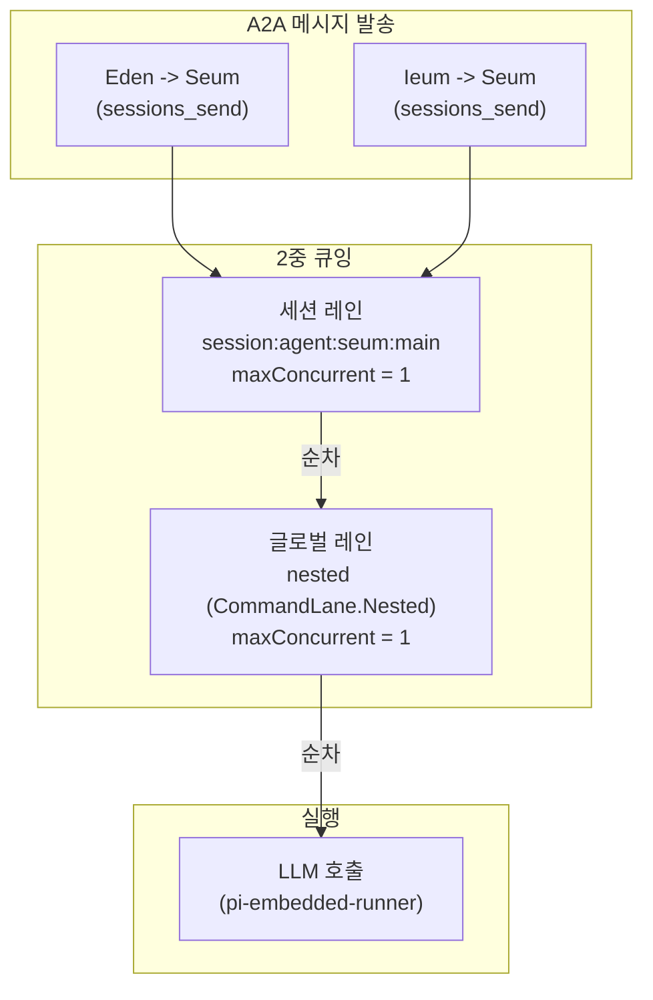
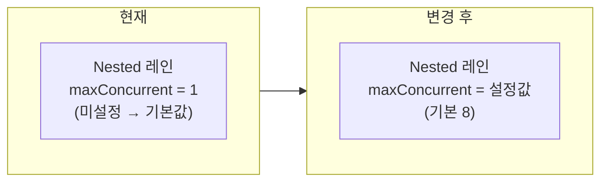
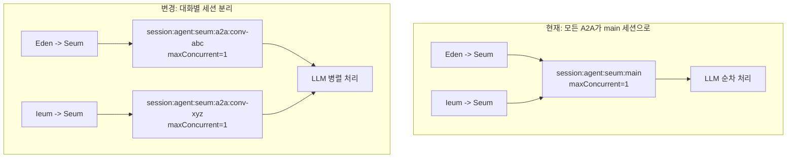
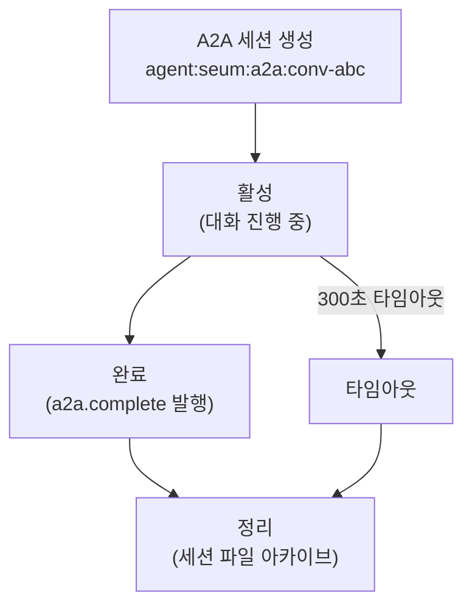
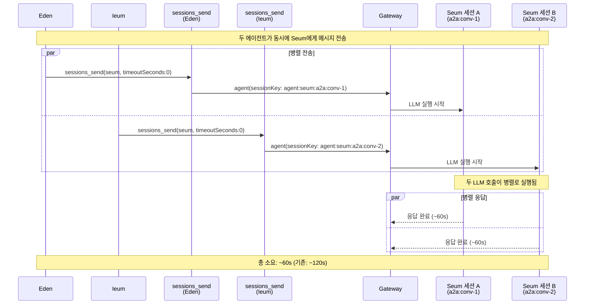
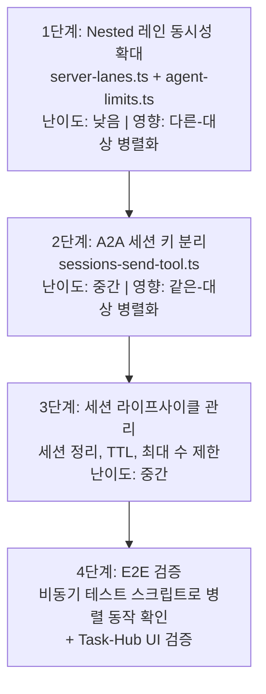

# A2A 비동기 병렬 실행 설계

> 작성일: 2026-02-17
> 상태: ✅ 구현 완료 (2026-02-17)
> 대상: `prontolab-openclaw`

## 0. 문제 정의

현재 A2A(에이전트 간) 메시지는 **2중 순차 큐잉**으로 인해 병렬 실행이 불가능하다.

### 0.1 현재 병목 구조



### 0.2 코드 위치

LLM 실행 시 2중 enqueue가 일어나는 곳:

```typescript
// src/agents/pi-embedded-runner/run.ts (라인 ~175)
export async function runEmbeddedPiAgent(params) {
  const sessionLane = resolveSessionLane(params.sessionKey); // "session:agent:seum:main"
  const globalLane = resolveGlobalLane(params.lane); // "nested" 또는 "main"

  return enqueueSession(() =>
    // 1차 큐: 세션 레인 (maxConcurrent=1)
    enqueueGlobal(async () => {
      // 2차 큐: 글로벌 레인
      // ... LLM 호출
    }),
  );
}
```

레인 키 생성:

```typescript
// src/agents/pi-embedded-runner/lanes.ts
export function resolveSessionLane(key: string) {
  const cleaned = key.trim() || CommandLane.Main;
  return cleaned.startsWith("session:") ? cleaned : `session:${cleaned}`;
}

export function resolveGlobalLane(lane?: string) {
  const cleaned = lane?.trim();
  return cleaned ? cleaned : CommandLane.Main;
}
```

글로벌 레인 동시성 설정:

```typescript
// src/gateway/server-lanes.ts
export function applyGatewayLaneConcurrency(cfg) {
  setCommandLaneConcurrency(CommandLane.Cron, cfg.cron?.maxConcurrentRuns ?? 1);
  setCommandLaneConcurrency(CommandLane.Main, resolveAgentMaxConcurrent(cfg)); // 기본 4
  setCommandLaneConcurrency(CommandLane.Subagent, resolveSubagentMaxConcurrent(cfg)); // 기본 8
  // !! CommandLane.Nested는 설정 안 됨 → 기본 maxConcurrent=1
}
```

### 0.3 영향

| 시나리오                          | 현재 동작                   | 소요 시간        |
| --------------------------------- | --------------------------- | ---------------- |
| Eden -> Seum 1건                  | 정상 처리                   | ~60s             |
| Eden -> Seum + Ieum -> Seum 동시  | 순차 큐잉                   | ~120s (60+60)    |
| 4개 에이전트가 Seum에게 동시 전송 | 순차 큐잉                   | ~240s (60x4)     |
| Eden -> Seum + Eden -> Miri 동시  | 글로벌 Nested 레인에서 순차 | ~120s (Nested=1) |

**핵심**: 다른 에이전트에게 보내는 메시지도 글로벌 Nested 레인에서 직렬화됨.

---

## 1. 변경 사항

두 가지 변경을 동시에 진행한다.

### 변경 1: 글로벌 Nested 레인 동시성 확대

**목표**: 서로 다른 에이전트 대상 A2A 메시지가 병렬 실행 가능하도록

**변경 파일**: `src/gateway/server-lanes.ts`



**구현 상세**:

```typescript
// src/gateway/server-lanes.ts — 변경
export function applyGatewayLaneConcurrency(cfg) {
  setCommandLaneConcurrency(CommandLane.Cron, cfg.cron?.maxConcurrentRuns ?? 1);
  setCommandLaneConcurrency(CommandLane.Main, resolveAgentMaxConcurrent(cfg));
  setCommandLaneConcurrency(CommandLane.Subagent, resolveSubagentMaxConcurrent(cfg));
  setCommandLaneConcurrency(CommandLane.Nested, resolveNestedMaxConcurrent(cfg)); // 추가
}
```

```typescript
// src/config/agent-limits.ts — 추가
export const DEFAULT_NESTED_MAX_CONCURRENT = 8;

export function resolveNestedMaxConcurrent(cfg?: OpenClawConfig): number {
  const raw = cfg?.agents?.defaults?.nestedMaxConcurrent;
  if (typeof raw === "number" && Number.isFinite(raw)) {
    return Math.max(1, Math.floor(raw));
  }
  return DEFAULT_NESTED_MAX_CONCURRENT;
}
```

**설정 예시** (`openclaw.json`):

```jsonc
{
  "agents": {
    "defaults": {
      "maxConcurrent": 4, // Main 레인 (기존)
      "nestedMaxConcurrent": 8, // Nested 레인 (신규)
      "subagents": {
        "maxConcurrent": 8, // Subagent 레인 (기존)
      },
    },
  },
}
```

**효과**: Eden -> Seum과 Eden -> Miri가 동시에 실행 가능 (다른 세션이므로 세션 레인도 별도)

**한계**: 같은 에이전트 대상 (Eden -> Seum + Ieum -> Seum)은 여전히 세션 레인에서 순차

---

### 변경 2: A2A 전용 대화별 세션 분리

**목표**: 같은 에이전트 대상 동시 A2A 메시지도 병렬 실행 가능하도록

**핵심 아이디어**: A2A 메시지의 타겟 세션 키를 `agent:seum:main` 대신 `agent:seum:a2a:{conversationId}`로 변경



**변경 파일**: `src/agents/tools/sessions-send-tool.ts`

**구현 상세**:

세션 키 결정 시점에서, A2A 메시지인 경우 대화별 세션 키를 생성:

```typescript
// sessions-send-tool.ts 내부 — 세션 키 결정 로직 변경
// 기존: resolvedKey = "agent:seum:main"
// 변경: A2A 전송 시 conversationId 기반 세션 키 사용

const isA2AMode = /* 발신자가 에이전트이고, 대상도 에이전트인 경우 */;

let targetSessionKey: string;
if (isA2AMode && conversationId) {
  // 대화별 전용 세션 → 병렬 처리 가능
  targetSessionKey = `agent:${targetAgentId}:a2a:${conversationId}`;
} else {
  // 기존 동작 유지
  targetSessionKey = resolvedKey;
}
```

**세션 라이프사이클 고려사항**:



| 고려 사항                  | 설계 방향                                                      |
| -------------------------- | -------------------------------------------------------------- |
| 세션 초기화                | 시스템 프롬프트, 에이전트 설정은 main 세션과 동일하게 적용     |
| 컨텍스트 격리              | 각 A2A 대화는 독립 컨텍스트 — 다른 A2A 대화의 히스토리 안 보임 |
| 에이전트 메인 세션         | Discord/사용자 대화용 main 세션은 변경 없음                    |
| 세션 정리                  | a2a.complete 후 일정 시간(예: 1시간) 후 자동 아카이브          |
| 세션 수 폭발 방지          | 에이전트당 최대 A2A 세션 수 제한 (예: 16)                      |
| 기존 conversationId 재사용 | 같은 conversationId는 같은 세션으로 → 연속 대화 유지           |

---

## 2. 변경 1+2 적용 후 동작



### 2.1 성능 비교

| 시나리오           | 현재 (순차) | 변경 1만 | 변경 1+2 |
| ------------------ | ----------- | -------- | -------- |
| A->B 1건           | ~60s        | ~60s     | ~60s     |
| A->B + C->B 동시   | ~120s       | ~120s    | **~60s** |
| A->B + A->C 동시   | ~120s       | **~60s** | **~60s** |
| 4건 모두 다른 대상 | ~240s       | **~60s** | **~60s** |
| 4건 모두 같은 대상 | ~240s       | ~240s    | **~60s** |

---

## 3. 리스크 및 완화

### 3.1 리스크

| #   | 리스크                             | 심각도 | 완화 방안                                                          |
| --- | ---------------------------------- | ------ | ------------------------------------------------------------------ |
| 1   | **LLM API 동시 요청 폭발**         | 높음   | Nested 레인 maxConcurrent로 전체 동시성 제한 (기본 8)              |
| 2   | **A2A 세션 수 폭발**               | 중간   | 에이전트당 최대 A2A 세션 수 제한                                   |
| 3   | **메모리 사용량 증가**             | 중간   | 세션 자동 정리 + TTL 설정                                          |
| 4   | **컨텍스트 분리로 인한 품질 저하** | 낮음   | A2A는 원래 단일 주제 대화이므로 격리가 자연스러움                  |
| 5   | **기존 동작 호환성**               | 낮음   | main 세션 경로는 변경 없음. A2A만 분리                             |
| 6   | **세션 스토어 호환성**             | 중간   | 새 세션 키 패턴이 기존 resolveSession 로직과 호환되는지 검증 필요  |
| 7   | **이벤트 그룹핑 영향**             | 낮음   | conversationId와 workSessionId는 동일 → Task-Monitor 그룹핑 무영향 |

### 3.2 롤백 계획

두 변경 모두 독립적으로 롤백 가능:

- **변경 1 롤백**: `server-lanes.ts`에서 Nested 레인 설정 줄 제거 → 기본 1로 복귀
- **변경 2 롤백**: `sessions-send-tool.ts`에서 A2A 세션 키 분기 제거 → main 세션으로 복귀

---

## 4. 구현 순서



| 단계 | 파일                                     | 변경 내용                                | 검증 방법                                  |
| ---- | ---------------------------------------- | ---------------------------------------- | ------------------------------------------ |
| 1    | `src/gateway/server-lanes.ts`            | Nested 레인 동시성 설정 추가             | 다른 대상 동시 전송 → 병렬 실행 확인       |
| 1    | `src/config/agent-limits.ts`             | `resolveNestedMaxConcurrent()` 함수 추가 | 단위 테스트                                |
| 2    | `src/agents/tools/sessions-send-tool.ts` | A2A 전용 세션 키 생성 로직               | 같은 대상 동시 전송 → 병렬 실행 확인       |
| 3    | `src/cron/session-reaper.ts` (또는 신규) | A2A 세션 TTL 정리                        | 완료된 A2A 세션이 자동 아카이브되는지 확인 |
| 4    | `/tmp/e2e-async-test.sh`                 | 병렬 전송 E2E 테스트                     | 4건 동시 전송 → 전부 ~60s 내 완료 확인     |

---

## 5. 설정 스키마 추가

```jsonc
// openclaw.json — 신규 설정 필드
{
  "agents": {
    "defaults": {
      "nestedMaxConcurrent": 8, // Nested 레인 동시성 (기본 8)
      "a2a": {
        "useConversationSessions": true, // A2A 대화별 세션 분리 (기본 true)
        "maxConversationSessions": 16, // 에이전트당 최대 A2A 세션 수
        "sessionTtlMinutes": 60, // A2A 세션 TTL (완료 후)
      },
    },
  },
}
```

---

## 6. 소스 코드 참조

| 파일                                     | 역할                     | 변경 여부        |
| ---------------------------------------- | ------------------------ | ---------------- |
| `src/process/command-queue.ts`           | 레인 기반 커맨드 큐      | 변경 없음        |
| `src/process/lanes.ts`                   | 레인 enum 정의           | 변경 없음        |
| `src/agents/pi-embedded-runner/lanes.ts` | 세션/글로벌 레인 키 생성 | 변경 없음        |
| `src/agents/pi-embedded-runner/run.ts`   | 2중 enqueue 실행         | 변경 없음        |
| `src/gateway/server-lanes.ts`            | 레인 동시성 설정         | **변경** (1단계) |
| `src/config/agent-limits.ts`             | 동시성 한도 함수         | **변경** (1단계) |
| `src/agents/tools/sessions-send-tool.ts` | A2A 전송 도구            | **변경** (2단계) |
| `src/cron/session-reaper.ts`             | 세션 정리                | **변경** (3단계) |

---

## 7. 미결 사항

- [ ] `CommandLane.Nested`의 현재 실제 사용처 전수 확인 (A2A 외에 nested를 쓰는 곳이 있는지)
- [ ] A2A 세션 키 패턴 (`agent:seum:a2a:conv-xxx`)이 `parseAgentSessionKey()`에서 정상 파싱되는지 확인
- [ ] `resolveSessionReference()`가 A2A 세션 키를 올바르게 resolve하는지 확인
- [ ] 핑퐁 단계에서 세션 키가 올바르게 전환되는지 확인 (A2A 플로우에서 요청자/대상 번갈아 실행)
- [ ] `agent-step.ts`의 `runAgentStep()`이 A2A 세션 키로 호출될 때 시스템 프롬프트가 정상 적용되는지
- [ ] Task-Monitor의 이벤트 그룹핑에서 새 세션 키가 영향을 주지 않는지 확인 (conversationId 기반이므로 무영향 예상)
