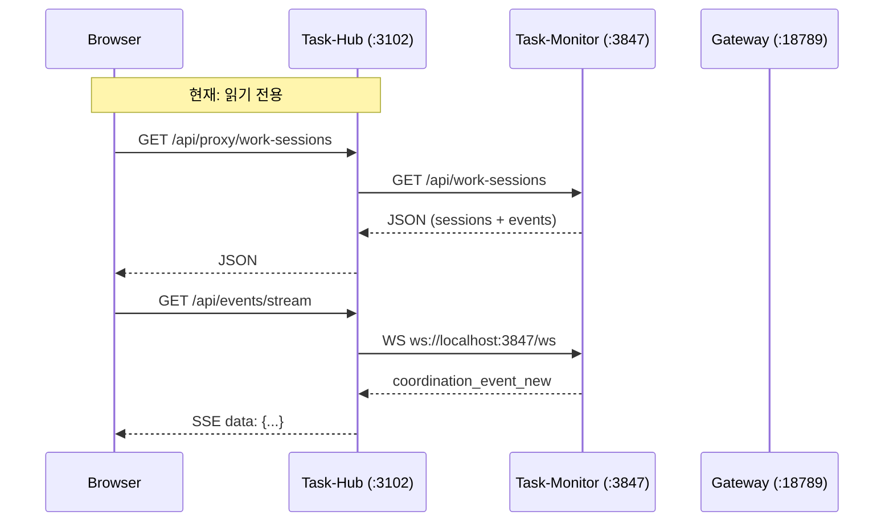
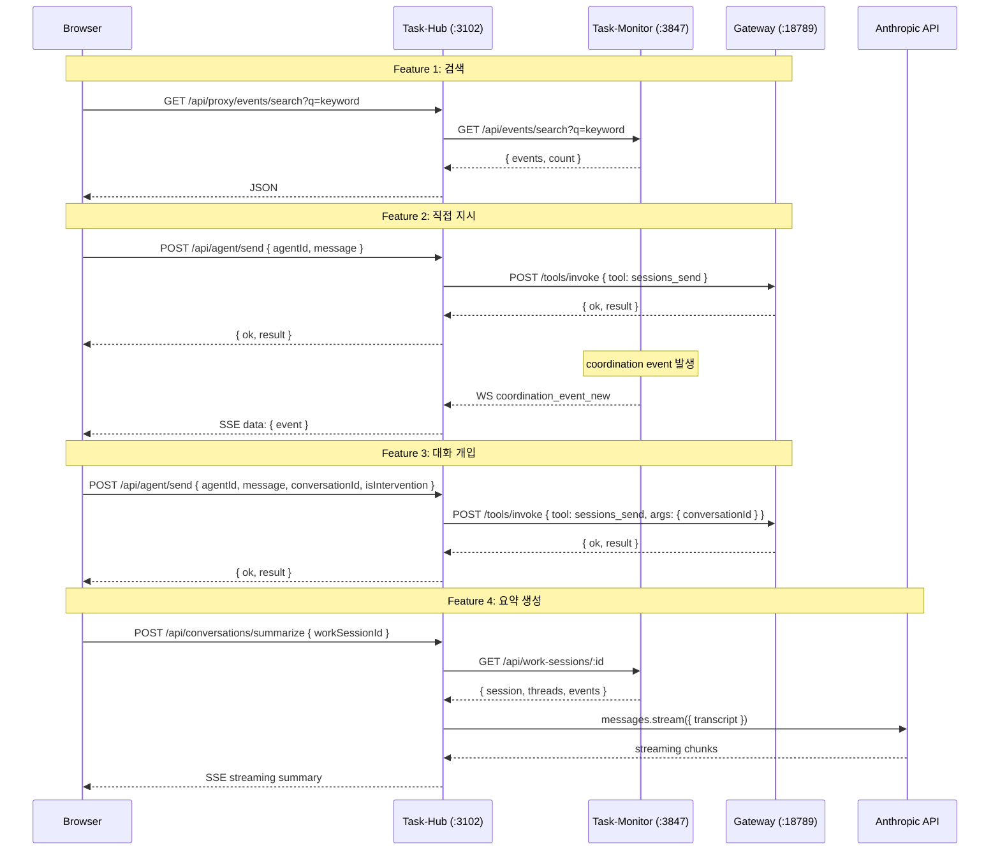
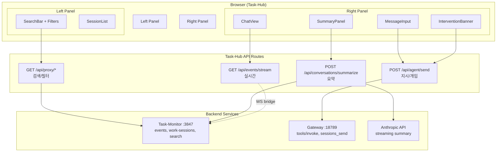
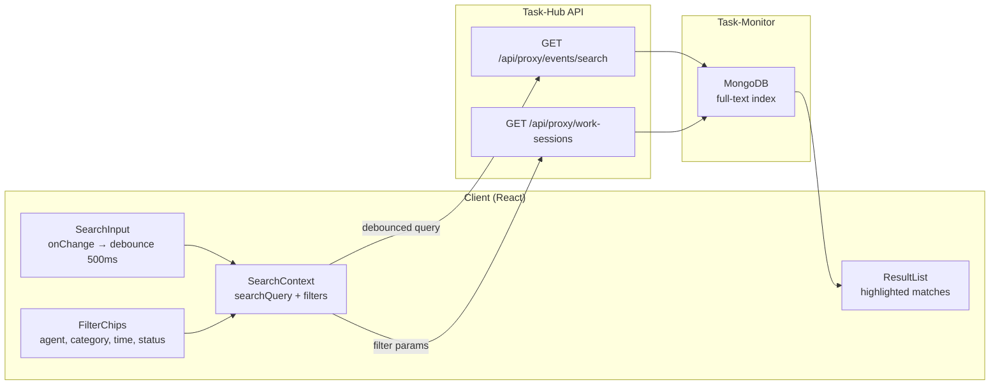
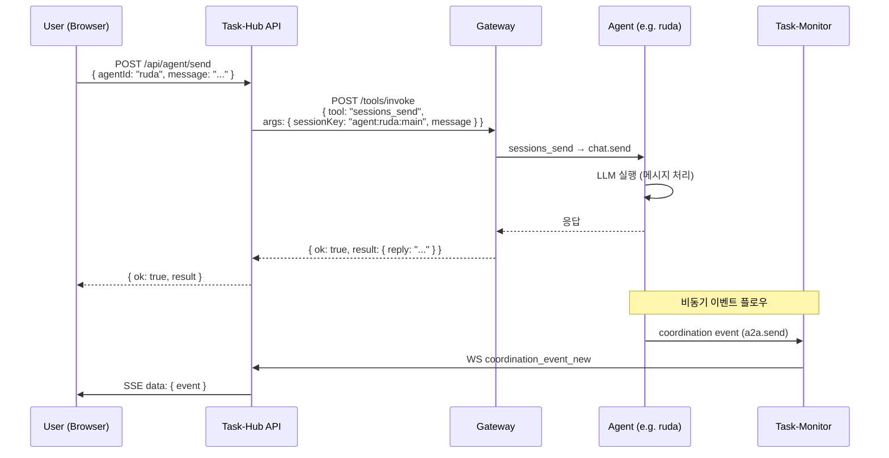
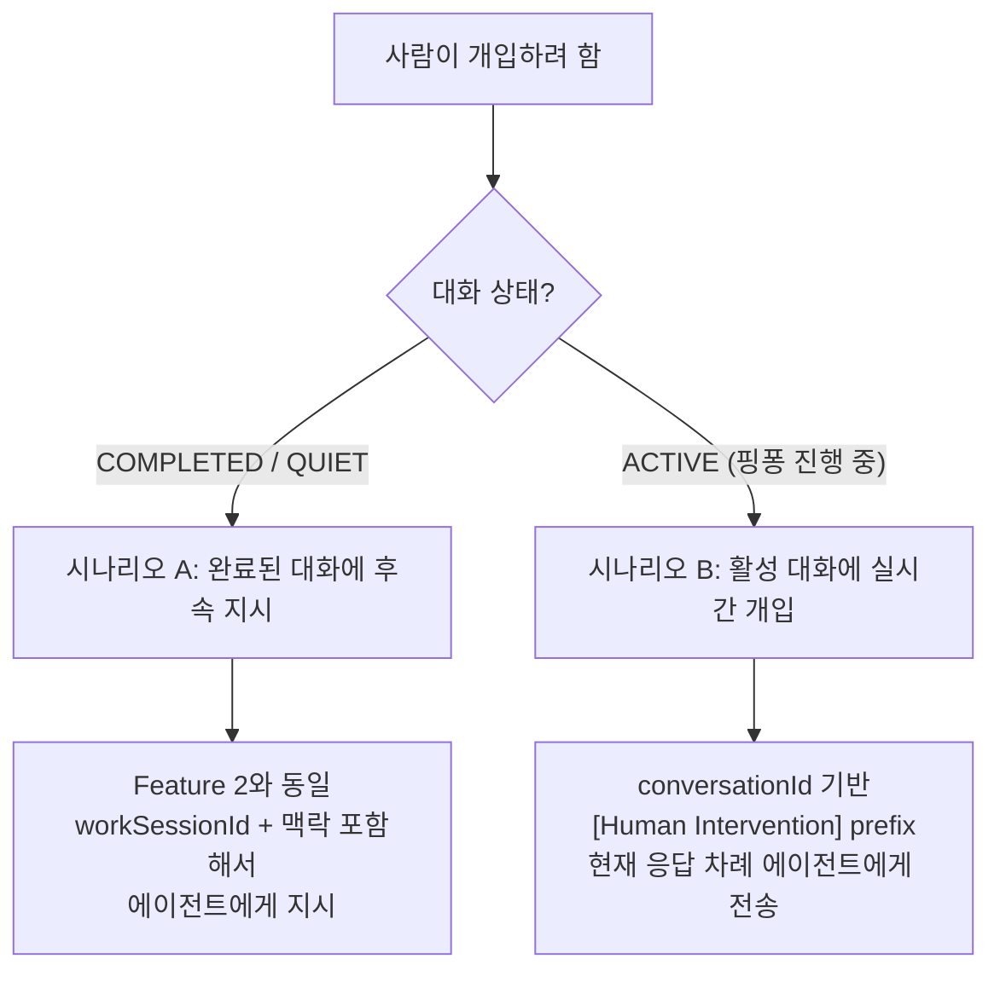
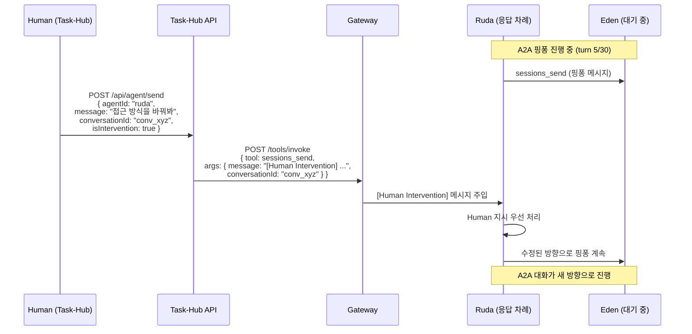
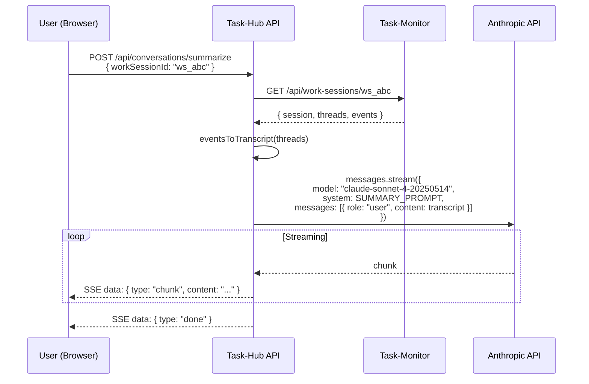

# Task-Hub → Agent Collaboration Hub 설계

> 작성일: 2026-02-18
> 상태: 🔄 설계 완료, 구현 대기
> 대상: task-hub (Next.js), task-monitor-server.ts, prontolab-openclaw (Gateway)

## 목차

1. [배경 및 목표](#1-배경-및-목표)
2. [현재 시스템 상태](#2-현재-시스템-상태)
3. [전체 아키텍처](#3-전체-아키텍처)
4. [Feature 1: 대화 이력 검색/필터링](#4-feature-1-대화-이력-검색필터링)
5. [Feature 2: 에이전트에게 직접 지시](#5-feature-2-에이전트에게-직접-지시)
6. [Feature 3: 대화에 사람이 개입](#6-feature-3-대화에-사람이-개입)
7. [Feature 4: 의사결정 요약 자동 생성](#7-feature-4-의사결정-요약-자동-생성)
8. [API 설계](#8-api-설계)
9. [UI 컴포넌트 설계](#9-ui-컴포넌트-설계)
10. [구현 순서](#10-구현-순서)
11. [구현 체크리스트 및 확장 가능성](#11-구현-체크리스트-및-확장-가능성)

---

## 1. 배경 및 목표

### 1.1 배경

A2A(Agent-to-Agent) 비동기 통신 시스템이 완성되면서, 에이전트 간 협업은 Discord를 거치지 않고 내부 프로토콜(`sessions_send`)로 동작한다. 그러나 현재 Task-Hub의 Conversations 페이지는 **읽기 전용**이며, 사람이 에이전트에게 지시하거나 대화에 개입할 수 없다.

### 1.2 전략적 방향

```
Discord → 알림/보고 전용 (push notification 불가능한 웹앱의 한계 보완)
Task-Hub → 에이전트 협업의 중심 허브 (검색, 지시, 개입, 요약)
```

### 1.3 목표 기능

| #   | 기능                    | 설명                                            |
| --- | ----------------------- | ----------------------------------------------- |
| F1  | 대화 이력 검색/필터링   | 서버사이드 MongoDB full-text search + 다중 필터 |
| F2  | 에이전트에게 직접 지시  | Task-Hub UI → Gateway sessions_send             |
| F3  | 대화에 사람이 개입      | 진행 중인 A2A 대화에 human message inject       |
| F4  | 의사결정 요약 자동 생성 | Anthropic API 기반 스트리밍 요약                |

---

## 2. 현재 시스템 상태

### 2.1 서비스 토폴로지

| 서비스           | 포트  | 기술             | 역할                                             |
| ---------------- | ----- | ---------------- | ------------------------------------------------ |
| OpenClaw Gateway | 18789 | Node.js          | 에이전트 실행, 도구 호출, A2A 프로토콜           |
| Task-Monitor     | 3847  | Bun              | 이벤트 캐시, MongoDB 동기화, WebSocket, REST API |
| Task-Hub         | 3102  | Next.js (Docker) | 웹 UI, API 프록시, SSE 브릿지                    |
| MongoDB          | 27018 | Docker           | 이벤트/세션 영속 저장                            |

### 2.2 현재 Task-Hub 데이터 플로우



### 2.3 Task-Hub 주요 파일

| 파일                                   | 설명                                     |
| -------------------------------------- | ---------------------------------------- |
| `src/app/conversations/page.tsx`       | Conversations 페이지 (~700줄, 읽기 전용) |
| `src/app/api/proxy/[...path]/route.ts` | Task-Monitor 프록시 (GET/PATCH only)     |
| `src/app/api/events/stream/route.ts`   | SSE 브릿지 (WS → SSE)                    |
| `src/lib/gateway.ts`                   | Gateway API 클라이언트                   |
| `src/lib/anthropic.ts`                 | Anthropic API 클라이언트                 |
| `src/lib/websocket-sync.ts`            | WebSocket 브릿지                         |
| `src/lib/conversations/types.ts`       | 대화 데이터 모델                         |
| `src/lib/conversations/constants.ts`   | 에이전트 표시 설정                       |
| `src/lib/conversations/utils.ts`       | 이벤트 파싱/그룹핑 유틸                  |

### 2.4 Task-Monitor API 현황

| 엔드포인트                        | 메서드 | 용도                                                 |
| --------------------------------- | ------ | ---------------------------------------------------- |
| `/api/events`                     | GET    | 이벤트 조회 (limit, since, role, type, viewCategory) |
| `/api/events/search`              | GET    | MongoDB full-text 검색                               |
| `/api/work-sessions`              | GET    | 작업 세션 목록 (status, role, type, viewCategory)    |
| `/api/work-sessions/:id`          | GET    | 세션 상세                                            |
| `/api/work-sessions/:id/category` | PATCH  | 세션 카테고리 오버라이드                             |
| `/api/workspace-file`             | POST   | 워크스페이스 파일 쓰기                               |
| `/api/agents`                     | GET    | 에이전트 목록                                        |

### 2.5 Gateway Tool Invocation

```
POST http://localhost:18789/tools/invoke
Authorization: Bearer <token>
Content-Type: application/json

{
  "tool": "sessions_send",
  "args": {
    "sessionKey": "agent:<agentId>:main",
    "message": "...",
    "workSessionId": "ws_123",
    "conversationId": "conv_456",
    "timeoutSeconds": 60
  },
  "sessionKey": "system:taskhub:main"
}
```

---

## 3. 전체 아키텍처

### 3.1 목표 데이터 플로우



### 3.2 시스템 블록 다이어그램



---

## 4. Feature 1: 대화 이력 검색/필터링

### 4.1 설계 원칙

- **서버사이드 검색**: MongoDB full-text search 활용 (Task-Monitor 기구축)
- **클라이언트 debounce**: 500ms 지연으로 과도한 요청 방지
- **필터 조합**: agent, category, time range, event type, status

### 4.2 검색 아키텍처



### 4.3 SearchProvider 설계 (Langfuse 패턴)

```typescript
// src/lib/conversations/search-context.tsx
interface SearchState {
  searchInputValue: string; // 즉시 반영 (input display)
  searchQuery: string; // debounced (실제 쿼리 트리거)
  filters: {
    agents: string[]; // ["ruda", "eden", ...]
    categories: string[]; // ["engineering_build", ...]
    timeRange: { from?: string; to?: string };
    status: "ACTIVE" | "QUIET" | "ARCHIVED" | "ALL";
    eventTypes: string[]; // ["a2a.send", "a2a.response", ...]
  };
}
```

### 4.4 API 호출

```
// 전체 텍스트 검색
GET /api/proxy/events/search?q=JWT+인증&limit=50

// 필터 기반 세션 조회
GET /api/proxy/work-sessions?status=ACTIVE&viewCategory=engineering_build&limit=50

// 시간 범위 + 역할 필터
GET /api/proxy/events?role=conversation.main&type=a2a.send,a2a.response&since=2026-02-18T00:00:00Z
```

### 4.5 UI 컴포넌트

```
SearchProvider (React Context)
├── SearchInput
│   ├── 텍스트 입력 (debounced 500ms)
│   └── Enter → 즉시 검색
├── FilterChips
│   ├── AgentSelector (multi-select, 15 agents)
│   ├── CategoryDropdown (10 categories)
│   ├── TimeRangePicker (1h, 24h, 7d, 30d, custom)
│   └── StatusFilter (ACTIVE, QUIET, ARCHIVED)
└── ResultList
    ├── 검색 결과 하이라이트
    ├── 세션 그룹핑
    └── 클릭 → ChatView로 이동
```

---

## 5. Feature 2: 에이전트에게 직접 지시

### 5.1 메시지 플로우



### 5.2 API 엔드포인트

```typescript
// POST /api/agent/send
// 새 파일: src/app/api/agent/send/route.ts

interface AgentSendRequest {
  agentId: string; // 대상 에이전트 ID
  message: string; // 지시 내용
  workSessionId?: string; // 기존 세션에 연결 (optional)
  conversationId?: string; // 기존 대화에 연결 (optional)
  isIntervention?: boolean; // Feature 3: 대화 개입 모드
  timeoutSeconds?: number; // 응답 대기 시간 (default: 60)
}

interface AgentSendResponse {
  ok: boolean;
  result?: {
    reply: string; // 에이전트 응답
    conversationId?: string; // 생성/사용된 대화 ID
    workSessionId?: string; // 연결된 작업 세션 ID
  };
  error?: string;
}
```

### 5.3 Gateway 호출 상세

```typescript
// src/app/api/agent/send/route.ts 내부 구현

const GATEWAY_URL = process.env.GATEWAY_URL || "http://localhost:18789";
const GATEWAY_TOKEN = process.env.GATEWAY_AUTH_TOKEN;

const gatewayResponse = await fetch(`${GATEWAY_URL}/tools/invoke`, {
  method: "POST",
  headers: {
    Authorization: `Bearer ${GATEWAY_TOKEN}`,
    "Content-Type": "application/json",
  },
  body: JSON.stringify({
    tool: "sessions_send",
    args: {
      sessionKey: `agent:${agentId}:main`,
      message: isIntervention ? `[Human Intervention] ${message}` : message,
      workSessionId,
      conversationId,
      timeoutSeconds: timeoutSeconds || 60,
    },
  }),
});
```

### 5.4 핵심 설계 결정

| 결정        | 선택                              | 이유                                                  |
| ----------- | --------------------------------- | ----------------------------------------------------- |
| 메시징 도구 | `sessions_send` (not `chat.send`) | coordination event 자동 기록 → Task-Monitor 추적 가능 |
| 타임아웃    | 60초 (default)                    | A2A 기본 30초보다 여유, 사람은 기다릴 수 있음         |
| 인증        | Gateway Bearer token (서버사이드) | 토큰이 브라우저에 노출되지 않음                       |

---

## 6. Feature 3: 대화에 사람이 개입

### 6.1 시나리오 분류



### 6.2 시나리오 A: 완료된 대화에 후속 지시

Feature 2와 동일. `workSessionId`를 지정하여 같은 작업 세션의 맥락을 유지.

```typescript
POST /api/agent/send
{
  agentId: "ruda",
  message: "아까 논의한 JWT 방식을 httpOnly cookie로 변경해줘",
  workSessionId: "ws_abc123"
}
```

### 6.3 시나리오 B: 활성 대화에 실시간 개입



### 6.4 에이전트 프롬프트 변경

11개 에이전트의 `AGENTS.md`에 추가:

```markdown
## Human Intervention Rule (CRITICAL)

A2A 대화 중 `[Human Intervention]`으로 시작하는 메시지를 받으면:

1. **즉시 현재 작업을 멈추고** human 지시를 최우선으로 처리
2. 상대 에이전트에게 "인간 관리자가 방향을 조정했다"는 사실을 전달
3. human 지시에 따라 대화 방향을 조정
4. 조정된 방향으로 A2A 대화를 계속 진행

예시:

- 받은 메시지: `[Human Intervention] JWT 대신 OAuth2 방식으로 변경해주세요`
- 행동: 현재 JWT 논의를 중단하고, OAuth2 방향으로 전환하여 상대 에이전트와 협의
```

### 6.5 UI 설계

```
활성 A2A 대화 뷰
├── MessageList
│   ├── 🔵 Agent A message (blue bubble)
│   ├── 🟢 Agent B message (green bubble)
│   ├── 🟡 [Human] message (gold bubble, distinct style)  ← 개입 메시지
│   └── 🔵 Agent A response to human (blue bubble)
├── InterventionBanner (활성 대화에만 표시)
│   └── "이 대화는 진행 중입니다 (turn 5/30). 개입하시겠습니까?" [개입하기]
└── MessageInput (intervention mode 활성화 시)
    ├── placeholder: "에이전트에게 지시할 내용을 입력하세요..."
    ├── 현재 대화 맥락 자동 첨부 (conversationId, workSessionId)
    └── [전송] 버튼
```

### 6.6 핵심 설계 결정

| 결정       | 선택                           | 이유                                              |
| ---------- | ------------------------------ | ------------------------------------------------- |
| Human 식별 | `[Human Intervention]` prefix  | 에이전트가 파싱 가능, 별도 프로토콜 변경 불필요   |
| 전송 대상  | 현재 응답 차례 에이전트        | UI에서 마지막 메시지의 대상 에이전트 자동 판별    |
| 턴 카운트  | Human turn은 maxTurns에 불포함 | 사람 개입으로 인해 대화가 조기 종료되지 않도록    |
| 동시성     | 핑퐁 진행 중 inject 가능       | sessions_send는 큐잉됨, 다음 턴에 자연스럽게 반영 |

---

## 7. Feature 4: 의사결정 요약 자동 생성

### 7.1 요약 생성 플로우



### 7.2 API 엔드포인트

```typescript
// POST /api/conversations/summarize
// 새 파일: src/app/api/conversations/summarize/route.ts

interface SummarizeRequest {
  workSessionId: string;
  format?: "brief" | "detailed"; // default: "detailed"
}

// Response: ReadableStream (Server-Sent Events)
// data: {"type":"chunk","content":"## 대화 요약\n\n"}
// data: {"type":"chunk","content":"### 1. 아키텍처 결정\n"}
// ...
// data: {"type":"done"}
```

### 7.3 요약 시스템 프롬프트

```typescript
const SUMMARY_SYSTEM_PROMPT = `당신은 에이전트 간 협업 대화를 분석하는 요약 전문가입니다.

다음 형식으로 요약을 작성하세요:

## 대화 요약
- **참여자**: (에이전트 목록)
- **기간**: (시작 ~ 종료, 총 소요 시간)
- **카테고리**: (협업 유형)

### 주요 의사결정
각 결정에 대해:
1. **[결정]** 무엇을 결정했는지 (제안자, 동의자)

### 실행 항목
- [ ] 에이전트명: 할 일
- [x] 에이전트명: 완료된 일

### 미결 사항
- 아직 결정되지 않은 것들

### 다음 단계
- 향후 진행 방향

규칙:
- 한국어로 작성
- 사실만 기록, 추측하지 않음
- 각 결정의 근거와 대안도 포함
- 에이전트 간 의견 불일치가 있었다면 명시`;
```

### 7.4 Transcript 변환

```typescript
function eventsToTranscript(threads: WorkSessionThread[]): string {
  return threads
    .map((thread) => {
      const header = `## Thread: ${thread.fromAgent} ↔ ${thread.toAgent}`;
      const messages = thread.events
        .filter((e) => ["a2a.send", "a2a.response"].includes(e.type))
        .map((e) => {
          const time = new Date(e.ts).toLocaleTimeString("ko-KR");
          const from = e.data.fromAgent || e.agentId;
          const msg = e.data.message || e.data.reply || "(no content)";
          return `[${time}] ${from}: ${msg}`;
        })
        .join("\n");
      return `${header}\n${messages}`;
    })
    .join("\n\n---\n\n");
}
```

### 7.5 UI 설계

```
Work Session Detail View
├── Header
│   ├── 세션 정보 (참여자, 기간, 카테고리)
│   ├── [요약 생성] 버튼
│   └── [요약 생성 중...] 로딩 상태 (스트리밍 시)
├── ChatView (기존 대화 내역)
└── SummaryPanel (슬라이딩 패널, 오른쪽에서)
    ├── 스트리밍 텍스트 렌더링 (Markdown)
    ├── [Markdown 복사] 버튼
    ├── [닫기] 버튼
    └── 캐시된 요약이 있으면 즉시 표시
```

### 7.6 요약 캐싱

```typescript
// MongoDB collection: conversation_summaries
{
  workSessionId: string;
  format: "brief" | "detailed";
  summary: string; // 전체 요약 텍스트
  generatedAt: Date;
  eventCount: number; // 요약 생성 시 이벤트 수
  // 이벤트 수가 변경되면 캐시 무효화
}
```

### 7.7 핵심 설계 결정

| 결정      | 선택                     | 이유                                                   |
| --------- | ------------------------ | ------------------------------------------------------ |
| AI 엔진   | Anthropic SDK 직접       | 기존 `src/lib/anthropic.ts` 활용, Vercel AI SDK 불필요 |
| 모델      | claude-sonnet-4-20250514 | 비용 효율적, 요약 품질 충분                            |
| 스트리밍  | SSE (ReadableStream)     | Next.js App Router 네이티브 지원                       |
| 캐싱      | MongoDB                  | 이벤트 수 변경 시 자동 무효화                          |
| 토큰 제한 | max_tokens: 4096         | 요약은 간결해야 함, 비용 제어                          |

---

## 8. API 설계

### 8.1 새로 추가할 API Routes

| 파일                                           | 메서드 | 엔드포인트                     | 용도                                 |
| ---------------------------------------------- | ------ | ------------------------------ | ------------------------------------ |
| `src/app/api/agent/send/route.ts`              | POST   | `/api/agent/send`              | 에이전트 지시 + 대화 개입            |
| `src/app/api/conversations/summarize/route.ts` | POST   | `/api/conversations/summarize` | 요약 생성 (SSE)                      |
| `src/app/api/proxy/[...path]/route.ts`         | POST   | `/api/proxy/*`                 | Task-Monitor POST 프록시 (기존 확장) |

### 8.2 기존 수정할 파일

| 파일                                   | 변경 내용                                       |
| -------------------------------------- | ----------------------------------------------- |
| `src/app/api/proxy/[...path]/route.ts` | POST 메서드 추가                                |
| `src/app/conversations/page.tsx`       | MessageInput, SearchProvider, SummaryPanel 추가 |
| `src/lib/conversations/types.ts`       | 새 타입 정의 추가                               |
| `src/lib/conversations/constants.ts`   | Human 아바타/색상 설정 추가                     |

### 8.3 환경 변수

```env
# Task-Hub .env (Docker)
GATEWAY_URL=http://host.docker.internal:18789
GATEWAY_AUTH_TOKEN=f90f179d9d9d66348cf108f353e0bc7525449f2aff2938a4
ANTHROPIC_API_KEY=sk-ant-...
TASK_MONITOR_URL=http://task-monitor:3847  # Docker 네트워크 내부
```

---

## 9. UI 컴포넌트 설계

### 9.1 컴포넌트 트리

```
ConversationsPage (수정)
├── SearchProvider (NEW)
│   ├── SearchBar (NEW)
│   │   ├── SearchInput
│   │   └── FilterChips
│   │       ├── AgentMultiSelect
│   │       ├── CategoryDropdown
│   │       ├── TimeRangePicker
│   │       └── StatusFilter
│   ├── SessionList (수정 — 검색 결과 통합)
│   └── ConversationDetail (수정)
│       ├── SessionHeader
│       │   ├── 세션 메타 정보
│       │   └── [요약 생성] 버튼 (NEW)
│       ├── ChatView (수정)
│       │   ├── MessageList (수정 — human message 스타일 추가)
│       │   └── InterventionBanner (NEW — 활성 대화에만)
│       ├── MessageInput (NEW)
│       │   ├── AgentSelector (새 대화 시)
│       │   ├── TextArea
│       │   └── SendButton
│       └── SummaryPanel (NEW — 슬라이딩 오버레이)
│           ├── StreamingMarkdown
│           ├── CopyButton
│           └── CloseButton
```

### 9.2 메시지 스타일링

```
┌────────────────────────────────────────────┐
│  🔵 ruda                         14:32:01  │
│  JWT 인증 방식에 대해 논의합시다.            │
│  httpOnly cookie vs localStorage 중 어떤    │
│  방식이 좋을까요?                            │
├────────────────────────────────────────────┤
│                         eden 🟢  14:32:15  │
│    httpOnly cookie가 XSS 방어에 유리합니다.  │
│    다만 CSRF 대응이 필요합니다.              │
├────────────────────────────────────────────┤
│  🟡 [Human Intervention]        14:33:00  │
│  OAuth2 방식으로 변경해주세요.               │
│  자체 JWT보다 표준 프로토콜이 낫습니다.      │
│  ─── intervention ───────────────────────  │
├────────────────────────────────────────────┤
│  🔵 ruda                         14:33:20  │
│  관리자 지시를 받았습니다. OAuth2 방식으로    │
│  전환하겠습니다. @eden OAuth2 flow 설계를    │
│  같이 논의합시다.                            │
└────────────────────────────────────────────┘
```

### 9.3 색상 체계

| 유형               | 배경색        | 텍스트           | 아바타            |
| ------------------ | ------------- | ---------------- | ----------------- |
| Agent (발신)       | `bg-blue-50`  | `text-blue-900`  | 에이전트별 아바타 |
| Agent (수신)       | `bg-green-50` | `text-green-900` | 에이전트별 아바타 |
| Human Intervention | `bg-amber-50` | `text-amber-900` | 👤 아이콘         |
| System             | `bg-gray-50`  | `text-gray-600`  | ⚙️ 아이콘         |

---

## 10. 구현 순서

```mermaid
gantt
    title Phase 9 구현 타임라인
    dateFormat  HH:mm
    axisFormat  %H:%M

    section 9.1 기반
    Proxy POST 지원             :p1, 00:00, 1h
    /api/agent/send 엔드포인트  :p2, after p1, 1h

    section 9.2 검색
    SearchProvider context      :s1, after p2, 1h
    Filter UI components        :s2, after s1, 1h
    서버사이드 검색 연동         :s3, after s2, 1h

    section 9.3 직접 지시
    MessageInput component      :m1, after s3, 1h
    Agent selector              :m2, after m1, 30m
    실시간 응답 표시 (SSE)      :m3, after m2, 1h30m

    section 9.4 대화 개입
    InterventionBanner UI       :i1, after m3, 1h
    conversationId inject       :i2, after i1, 1h
    Agent 프롬프트 업데이트     :i3, after i2, 1h
    Human message 스타일링      :i4, after i3, 1h

    section 9.5 요약
    /api/conversations/summarize :u1, after i4, 1h30m
    SummaryPanel component       :u2, after u1, 1h
    요약 캐싱 (MongoDB)          :u3, after u2, 30m

    section 9.6 검증
    E2E 테스트                   :t1, after u3, 1h
    에이전트 프롬프트 최종 조정  :t2, after t1, 1h
```



### 단계별 상세

| Phase    | 산출물                                                | 예상 시간 | 의존성           |
| -------- | ----------------------------------------------------- | --------- | ---------------- |
| **9.1**  | Proxy POST + /api/agent/send                          | 2h        | 없음             |
| **9.2**  | SearchProvider + Filter UI + 검색 연동                | 3h        | 9.1 (proxy)      |
| **9.3**  | MessageInput + Agent selector + SSE 응답              | 3h        | 9.1 (agent/send) |
| **9.4**  | InterventionBanner + conversationId inject + 프롬프트 | 4h        | 9.3              |
| **9.5**  | /api/conversations/summarize + SummaryPanel + 캐싱    | 3h        | 9.1 (proxy)      |
| **9.6**  | E2E 테스트 + 프롬프트 조정                            | 2h        | 전체             |
| **합계** |                                                       | **~17h**  |                  |

---

## 11. 구현 체크리스트 및 확장 가능성

### 11.1 구현 시 확인 사항

기존 리스크로 분류했으나, 분석 결과 모두 구현 과정에서 자연스럽게 해결 가능한 항목들이다.

| 항목                            | 해결 방법                                                                                                                                                                                                                          | 근거                                           |
| ------------------------------- | ---------------------------------------------------------------------------------------------------------------------------------------------------------------------------------------------------------------------------------- | ---------------------------------------------- |
| A2A 핑퐁 중 human inject 타이밍 | `sessions_send`는 세션 레인 큐에 들어감. 핑퐁 루프가 턴 사이에서 다음 메시지를 기다리는 구조이므로, human 메시지는 다음 턴 input으로 자연스럽게 처리됨                                                                             | 세션 레인 큐잉 구조 (`enqueueSession`)         |
| Task-Hub → Gateway 인증         | `POST /tools/invoke`는 Bearer token 인증. `sessionKey`는 "어떤 세션 컨텍스트에서 실행할지"이며, `sessions_send` 도구 자체가 target sessionKey를 args로 받으므로 outer sessionKey 없이 동작 가능. 불가 시 기존 에이전트 세션키 활용 | Gateway HTTP API 구조 (`tools-invoke-http.ts`) |
| 요약 토큰 비용                  | 대화 transcript truncation (최근 N턴 or 요약 → 상세 2단계) + `max_tokens: 4096` 제한 + MongoDB 캐싱으로 반복 생성 방지                                                                                                             | 일반적인 엔지니어링 패턴                       |
| Docker → Gateway 네트워크       | Task-Hub의 `delegateToAgent()`가 이미 Gateway 호출 중이므로 네트워크 설정 기완료. 미설정 시 `extra_hosts: ["host-gateway:host.docker.internal"]` 한 줄 추가                                                                        | 현재 `src/lib/gateway.ts` 동작 확인            |

### 11.2 설계 결정 (확정)

| 항목                             | 결정                                                           | 근거                                                            |
| -------------------------------- | -------------------------------------------------------------- | --------------------------------------------------------------- |
| Human intervention 대상 에이전트 | 마지막 메시지의 target agent 자동 선택 + UI에서 수동 변경 가능 | 대부분의 경우 대화의 마지막 수신자에게 지시하는 것이 자연스러움 |
| 요약 캐시 무효화                 | 이벤트 수 변경 기준 (eventCount 비교) + 생성 후 1시간 TTL      | 이벤트 수가 같으면 대화 내용 변화 없음, TTL은 안전장치          |
| Mobile responsive                | 데스크톱 우선 구현, Phase 10에서 반응형 적용                   | 현재 사용자는 데스크톱 환경                                     |

### 11.3 확장 가능성 (향후)

- **대화 내보내기**: Markdown/JSON 다운로드
- **대화 템플릿**: 자주 쓰는 지시를 템플릿으로 저장
- **알림 연동**: 특정 키워드/에이전트 대화 시 Discord 알림
- **대화 분석 대시보드**: 에이전트별 대화 빈도, 카테고리 분포, 평균 턴 수
- **음성 지시**: TTS/STT 연동 (Voice Overlay 활용)
