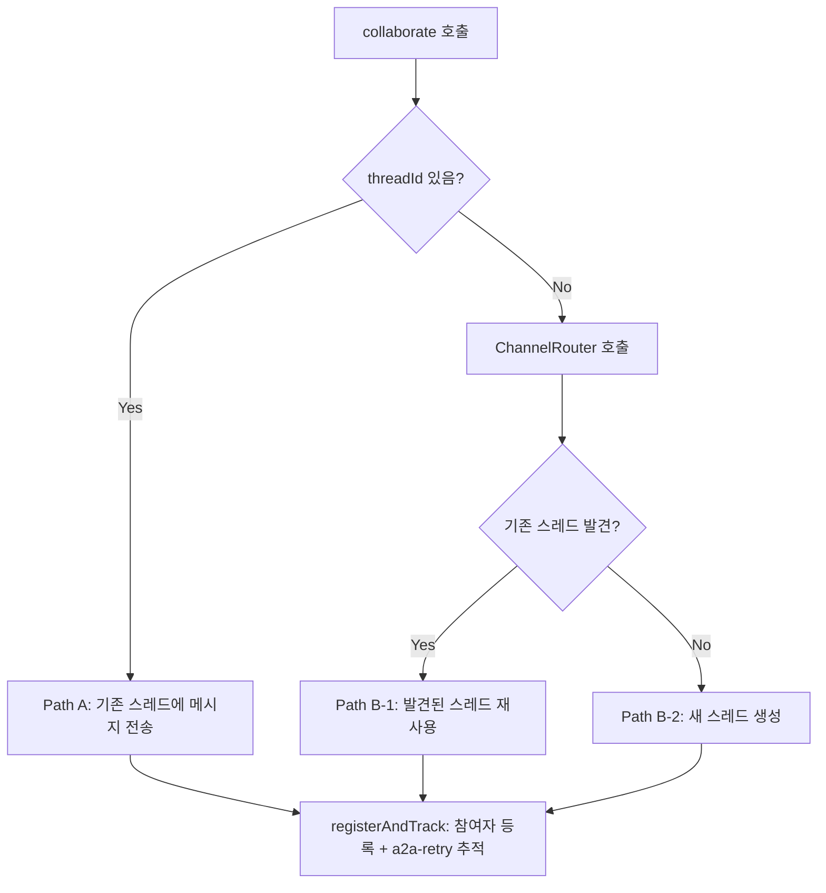
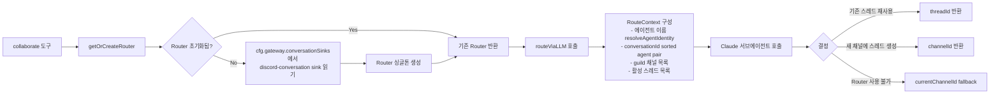
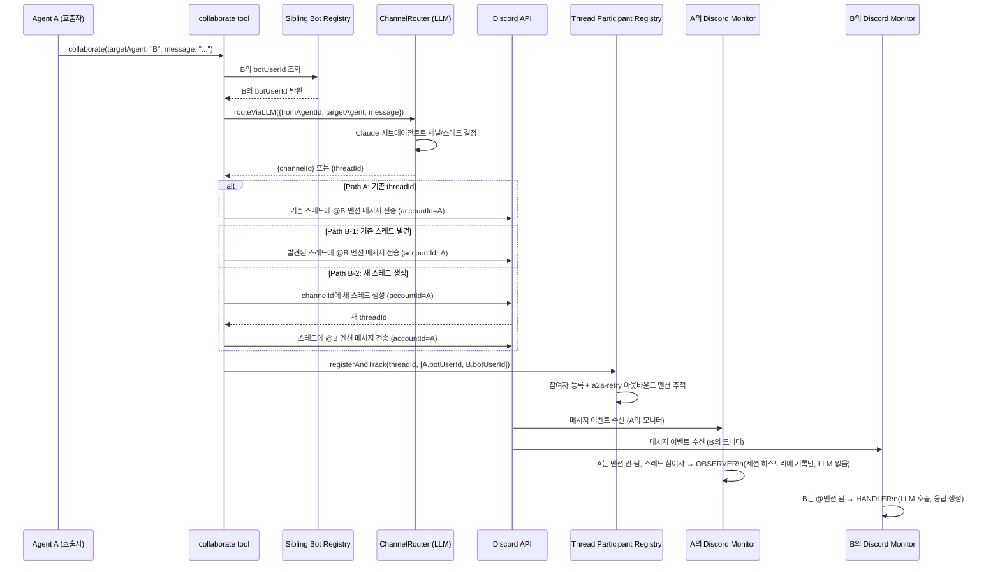
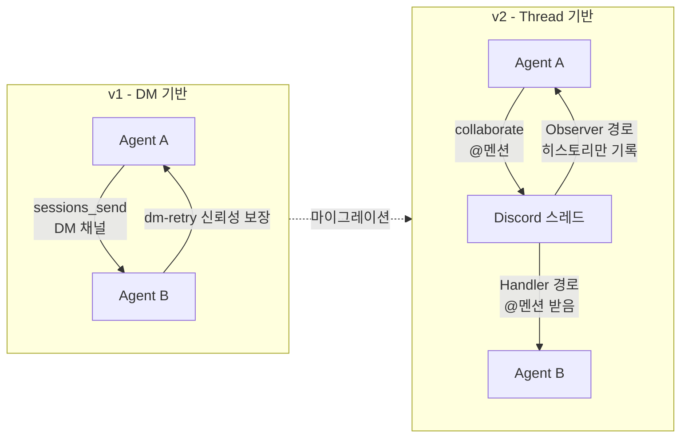
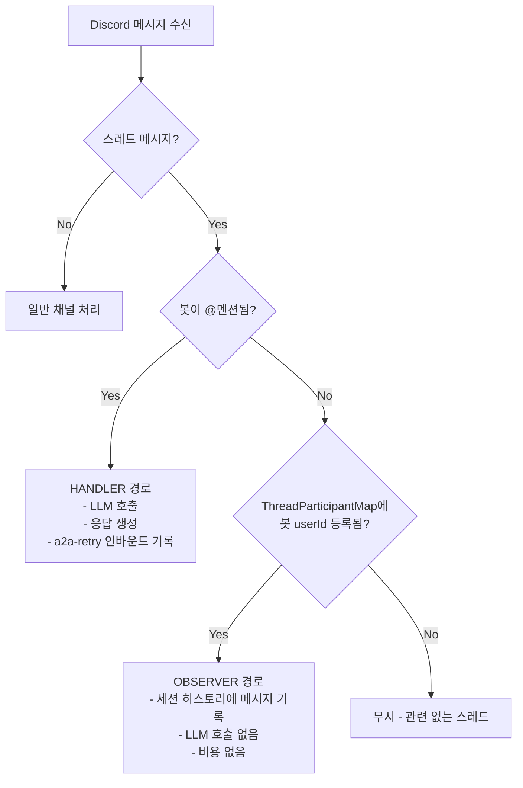

# Agent Collaboration v2 아키텍처

> **작성일**: 2026-02-26
> **대상 시스템**: prontolab-openclaw
> **상태**: 구현 완료

---

## 1. 개요

Agent Collaboration v2는 기존 DM(Direct Message) 기반 에이전트 간 통신을 **Discord 스레드 기반의 가시적 협업**으로 전환한 시스템이다.

### v1 vs v2 비교

| 항목      | v1 (DM 기반)                   | v2 (Thread 기반)                      |
| --------- | ------------------------------ | ------------------------------------- |
| 통신 방식 | `sessions_send`로 DM 채널 전송 | `collaborate` 도구로 스레드 생성/참여 |
| 가시성    | 비공개 (DM)                    | 공개 (채널 스레드)                    |
| 채널 선택 | 수동 지정                      | LLM 기반 ChannelRouter 자동 라우팅    |
| 신뢰성    | dm-retry 메커니즘              | a2a-retry + Handler/Observer 패턴     |
| 협업 맥락 | 단발성 메시지                  | 스레드로 대화 맥락 유지               |

### 핵심 변경 사항

1. 에이전트는 이제 적절한 채널에 **스레드를 생성**하여 협업한다.
2. **LLM 기반 ChannelRouter**가 어느 채널/스레드를 사용할지 결정한다.
3. **Handler/Observer 패턴**으로 스레드 참여 에이전트들의 역할이 구분된다.
4. `collaborate` 도구가 peer 간 대화를 시작하는 단일 진입점이 된다.

---

## 2. 핵심 개념

### 2.1 Handler/Observer 패턴

스레드에 여러 봇이 참여할 때, 각 봇의 역할이 명확히 구분된다.

```
스레드 메시지 수신
       │
       ▼
봇이 @멘션 되었는가?
  ┌────┴────┐
  Yes       No
  │         │
  ▼         ▼
HANDLER   스레드 참여자인가?
(LLM 호출)  ┌────┴────┐
            Yes       No
            │         │
            ▼         ▼
         OBSERVER   무시
      (세션 히스토리에
       메시지만 기록,
       LLM 호출 없음)
```

- **HANDLER**: @멘션 받은 봇 → LLM을 호출해 응답 생성
- **OBSERVER**: 스레드 참여자이지만 멘션되지 않은 봇 → 메시지를 세션 히스토리에 기록만 함 (LLM 호출 없음)

구현 위치: `src/discord/monitor/message-handler.preflight.ts`

### 2.2 Thread Participant Registry

어떤 봇이 어느 스레드에 참여 중인지 추적하는 전역 레지스트리.

**특징:**

- `ThreadParticipantMap` 클래스 (`src/discord/monitor/thread-participants.ts`)
- `globalThis` 싱글톤으로 프로세스 전역 공유
- 디스크 영속화: `~/.openclaw/data/thread-participants.json`
- 24시간 TTL (설정 가능)

**자동 등록 시점:**

1. `collaborate` 도구가 스레드를 생성하거나 메시지를 전송할 때
2. 봇이 스레드에 메시지를 전송할 때

### 2.3 Sibling Bot Registry

봇 유저 ID ↔ 에이전트 ID 간의 역방향 매핑 레지스트리.

- `src/discord/monitor/sibling-bots.ts` - `botUserId → agentId` 역방향 맵
- `src/discord/monitor/provider.ts` - `accountId`와 `agentId` 이중 등록
- `collaborate` 도구가 대상 에이전트의 Discord 봇 유저 ID를 조회할 때 사용

---

## 3. collaborate 도구

### 3.1 스키마

```typescript
{
  targetAgent: string,   // 대상 에이전트 ID (eden, ruda, seum 등)
  message: string,       // 전송할 메시지
  threadId?: string,     // 기존 스레드 ID (선택)
  channelId?: string,    // 새 스레드를 만들 채널 ID (선택)
  threadName?: string    // 스레드 이름 (선택)
}
```

### 3.2 세 가지 실행 경로



- **Path A**: `threadId` 명시 → 기존 스레드에 바로 전송
- **Path B-1**: `threadId` 없음, ChannelRouter가 기존 스레드 발견 → 재사용
- **Path B-2**: `threadId` 없음, ChannelRouter가 채널 선택 → 새 스레드 생성

### 3.3 구현 세부 사항

- Factory 함수: `createCollaborateTool(opts)`
  - `agentSessionKey`, `agentAccountId`, `currentChannelId` 수신
- 모든 Discord API 호출 시 `{ accountId: sendAccountId }` 전달 → 호출한 에이전트의 봇이 스레드 생성 (기본 봇 아님)
- `registerAndTrack()`: 발신자와 수신자 모두 스레드 참여자로 등록 + 아웃바운드 멘션 a2a-retry 추적
- 파일: `src/agents/tools/collaborate-tool.ts`

---

## 4. ChannelRouter (LLM 라우터)

### 4.1 동작 방식



### 4.2 주요 컴포넌트

- **Lazy 싱글톤**: 최초 호출 시 한 번만 초기화, 이후 재사용
- **ThreadRouteCache**: `conversationId → threadId` 매핑 캐시
- **RouteContext**: 에이전트 쌍, 메시지 내용, 채널/스레드 목록 포함
- 파일: `src/infra/events/sinks/channel-router.ts`

---

## 5. 전체 데이터 흐름



---

## 6. 시스템 프롬프트 통합

### 6.1 도구 등록

- `collaborate`가 `system-prompt.ts`의 `coreToolSummaries`에 추가됨
- `buildMessagingSection()`에 "Peer Collaboration" 섹션 추가

### 6.2 A2A 컨텍스트 가이드라인

`sessions-send-helpers.ts`의 A2A 컨텍스트가 업데이트됨:

| 상황                          | 권장 도구       |
| ----------------------------- | --------------- |
| 가시적인 크로스 에이전트 협업 | `collaborate`   |
| 비공개 조율/단순 작업 위임    | `sessions_send` |

---

## 7. 도구 정책 설정

`src/config/tool-policy.ts`에서의 등록:

```typescript
// collaborate가 추가된 그룹들
"group:sessions"   // 세션 관련 도구 그룹
"group:openclaw"   // openclaw 전용 도구 그룹

// messaging 프로필 허용 목록에도 추가
"messaging" profile allowlist
```

> **주의**: 이 항목들 없이는 tool-policy 파이프라인이 도구를 완전히 필터링한다.

---

## 8. 설정 요구사항

### 8.1 gateway.conversationSinks

```yaml
gateway:
  conversationSinks:
    - type: discord-conversation
      guildId: "YOUR_GUILD_ID"
      defaultChannelId: "YOUR_DEFAULT_CHANNEL_ID"
```

ChannelRouter의 Lazy 싱글톤이 이 설정에서 초기화된다.

### 8.2 에이전트별 Discord 계정 바인딩

```yaml
channels:
  discord:
    accounts:
      - agentId: eden
        botToken: "..."
        botUserId: "..."
```

### 8.3 collaborate 도구 허용 목록

에이전트 설정에서 다음 중 하나를 포함해야 한다:

- `group:sessions`
- `group:openclaw`
- `messaging` 프로필

---

## 9. 에이전트 목록 (현재)

| Agent ID    | 이름 | 역할            |
| ----------- | ---- | --------------- |
| main (ruda) | 루다 | 메인 코디네이터 |
| eden        | 이든 | 개발자          |
| seum        | 세움 | 빌더/인프라     |
| yunseul     | 윤슬 | 크리에이티브    |
| miri        | 미리 | 분석가          |
| onsae       | 온새 | 자연/웰빙       |
| ieum        | 이음 | 커넥터          |
| dajim       | 다짐 | 커밋먼트        |
| nuri        | 누리 | 월드/커뮤니티   |
| hangyeol    | 한결 | 일관성          |
| grim        | 그림 | 아트/시각화     |

**Utility Agents:**

| Agent ID     | 이름         | 역할             |
| ------------ | ------------ | ---------------- |
| explorer     | Explorer     | 탐색             |
| worker-quick | Worker-Quick | 빠른 태스크 실행 |
| worker-deep  | Worker-Deep  | 심층 태스크 실행 |
| consultant   | Consultant   | 컨설팅           |

---

## 10. 주요 파일 참조

| 파일 경로                                          | 역할                                              |
| -------------------------------------------------- | ------------------------------------------------- |
| `src/agents/tools/collaborate-tool.ts`             | `collaborate` 도구 구현, 세 가지 실행 경로        |
| `src/discord/monitor/message-handler.preflight.ts` | Handler vs Observer 판별 로직                     |
| `src/discord/monitor/thread-participants.ts`       | `ThreadParticipantMap` - 스레드 참여자 레지스트리 |
| `src/discord/monitor/sibling-bots.ts`              | `botUserId → agentId` 역방향 맵                   |
| `src/discord/monitor/provider.ts`                  | `accountId` + `agentId` 이중 등록                 |
| `src/infra/events/sinks/channel-router.ts`         | LLM 기반 ChannelRouter, `ThreadRouteCache`        |
| `src/config/tool-policy.ts`                        | `collaborate` 도구 정책 등록                      |
| `src/agents/system-prompt.ts`                      | `coreToolSummaries`, `buildMessagingSection()`    |
| `src/agents/sessions-send-helpers.ts`              | A2A 컨텍스트, collaborate 가이드라인              |
| `~/.openclaw/data/thread-participants.json`        | Thread Participant Registry 디스크 영속화         |

---

## 11. v1에서 v2로 마이그레이션

### 변경 사항 요약



### 하위 호환성

- DM retry (`dm-retry`)는 fallback으로 계속 동작
- 기존 `sessions_send`는 비공개 조율용으로 유지
- `collaborate`가 **가시적 크로스 에이전트 작업의 권장 방법**

### 마이그레이션 체크리스트

- [ ] `gateway.conversationSinks`에 `discord-conversation` sink 설정
- [ ] 각 에이전트의 Discord 계정 바인딩 확인
- [ ] 에이전트 도구 허용 목록에 `collaborate` 추가 (또는 group:sessions/group:openclaw 포함)
- [ ] 에이전트 시스템 프롬프트에서 collaborate 사용 가이드라인 숙지

---

## 12. Handler/Observer 판별 상세 흐름



---

_이 문서는 Agent Collaboration v2 구현 완료 시점의 아키텍처를 기술합니다._
_시스템 변경 시 함께 업데이트 바랍니다._
