# OpenClaw 시스템 아키텍처 & 데이터 플로우

> 작성일: 2026-02-17
> 상태: 분석 완료
> 대상: `prontolab-openclaw` + `task-monitor` + `task-hub`

## 0. 개요

OpenClaw는 **단일 Node.js 프로세스** 위에서 Gateway, 에이전트 도구, 채널 모니터(Discord 등)가 함께 동작하며,
별도 프로세스인 Task-Monitor와 Task-Hub가 모니터링/UI 역할을 담당한다.

---

## 1. 전체 시스템 구조

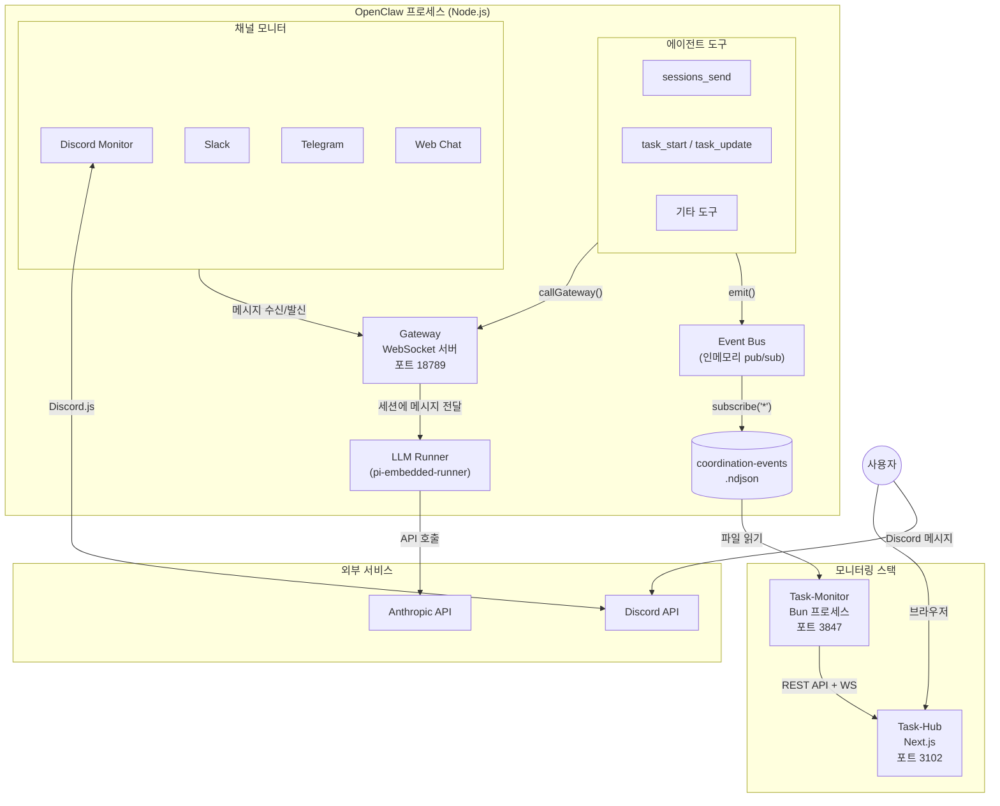

---

## 2. 컴포넌트별 역할

| 컴포넌트            | 프로세스              | 포트  | 역할                                                     | 통신 방식            |
| ------------------- | --------------------- | ----- | -------------------------------------------------------- | -------------------- |
| **Gateway**         | OpenClaw (메인)       | 18789 | 중앙 허브. 세션 관리, LLM 호출, 메시지 라우팅            | WebSocket 서버       |
| **에이전트 도구**   | OpenClaw (메인)       | —     | Gateway의 인프로세스 클라이언트. `callGateway()`로 통신  | 함수 호출 → WS       |
| **Discord Monitor** | OpenClaw (메인)       | —     | Discord 메시지 수신 → Gateway 전달, 결과 Discord 발신    | Discord.js + Gateway |
| **LLM Runner**      | OpenClaw (메인)       | —     | `pi-embedded-runner`: 세션에 대한 LLM 호출 실행          | Anthropic/OpenAI API |
| **Event Bus**       | OpenClaw (메인)       | —     | 인메모리 pub/sub. `emit()` → 리스너 실행                 | `subscribe("*")`     |
| **Task-Monitor**    | 별도 Bun 프로세스     | 3847  | ndjson 이벤트 파일 + workspace 파일 감시 → REST API 서빙 | HTTP + WebSocket     |
| **Task-Hub**        | 별도 Next.js (Docker) | 3102  | UI. Task-Monitor를 `/api/proxy/*`로 프록시               | HTTP 프록시          |

---

## 3. 데이터 저장소

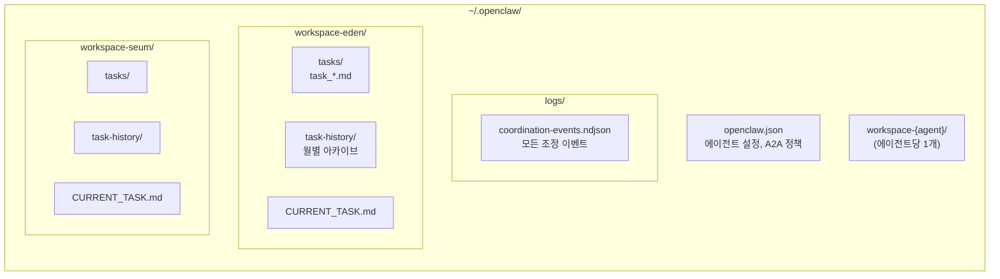

| 저장소                | 경로                                          | 내용                                     | 소비자                  |
| --------------------- | --------------------------------------------- | ---------------------------------------- | ----------------------- |
| 에이전트 설정         | `~/.openclaw/openclaw.json`                   | 15개 에이전트 목록, A2A 정책, 채널 설정  | Gateway, Task-Monitor   |
| 이벤트 로그           | `~/.openclaw/logs/coordination-events.ndjson` | `a2a.*`, `task.*`, `continuation.*` 등   | Task-Monitor            |
| 에이전트 워크스페이스 | `~/.openclaw/workspace-{agent}/`              | 태스크 파일, 대화 히스토리, CURRENT_TASK | Task-Monitor (chokidar) |
| 세션 스토어           | Gateway 내부 관리                             | 세션 메타데이터, 대화 히스토리           | Gateway                 |

---

## 4. A2A 메시지 라이프사이클

### 4.1 비동기 경로 (timeoutSeconds=0) — 권장

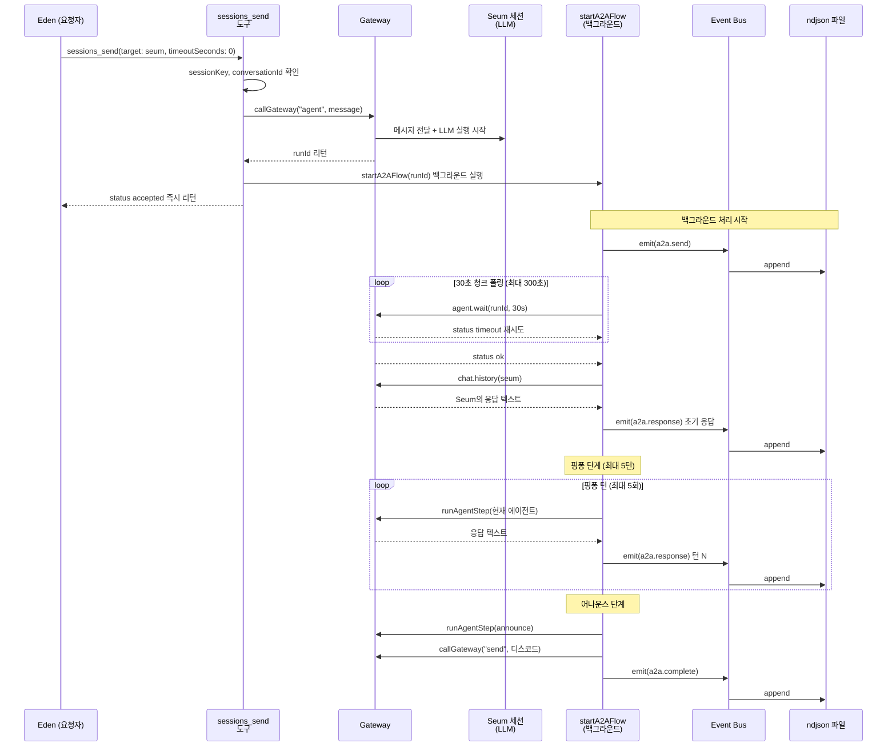

### 4.2 동기 경로 (timeoutSeconds>0) — 버그 있음

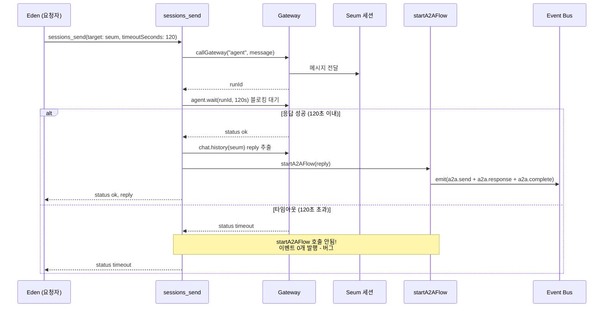

> **동기 모드 버그**: 타임아웃 시 `startA2AFlow()`가 호출되지 않아 이벤트가 전혀 발행되지 않는다.
> Task-Monitor/Task-Hub에서 해당 대화가 보이지 않게 된다.
>
> **참조**: `sessions-send-tool.ts` 라인 ~642 (timeout return) vs 라인 ~666 (success path)

### 4.3 비동기 vs 동기 비교

| 측면              | 비동기 (timeoutSeconds=0) | 동기 (timeoutSeconds>0)   |
| ----------------- | ------------------------- | ------------------------- |
| 도구 리턴         | 즉시 (`"accepted"`)       | 응답 완료까지 블로킹      |
| startA2AFlow 호출 | **항상**                  | 성공 시만 (타임아웃 시 X) |
| 이벤트 발행 보장  | 3개 이벤트 보장           | 타임아웃 시 0개           |
| 백그라운드 대기   | 최대 300초 폴링           | N/A (도구 자체가 블로킹)  |
| 병렬 전송         | 가능                      | 순차만 가능               |

---

## 5. 이벤트 파이프라인

### 5.1 이벤트 발행에서 소비까지

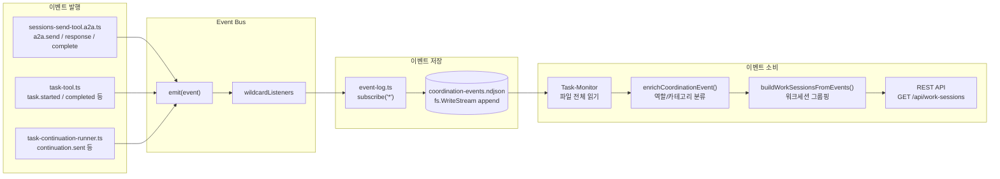

### 5.2 이벤트 타입 전체 목록

| 이벤트 타입             | 역할 분류            | 설명                                     |
| ----------------------- | -------------------- | ---------------------------------------- |
| `a2a.send`              | conversation.main    | 에이전트가 다른 에이전트에게 메시지 전송 |
| `a2a.response`          | conversation.main    | 대상 에이전트의 응답 (각 핑퐁 턴 포함)   |
| `a2a.complete`          | conversation.main    | A2A 교환 완료                            |
| `a2a.spawn`             | delegation.subagent  | 서브에이전트 생성                        |
| `a2a.spawn_result`      | delegation.subagent  | 서브에이전트 실행 결과                   |
| `a2a.auto_route`        | conversation.main    | 자동 라우팅                              |
| `task.started`          | orchestration.task   | 태스크 시작                              |
| `task.updated`          | orchestration.task   | 태스크 업데이트                          |
| `task.completed`        | orchestration.task   | 태스크 완료                              |
| `task.cancelled`        | orchestration.task   | 태스크 취소                              |
| `task.approved`         | orchestration.task   | 태스크 승인                              |
| `task.blocked`          | orchestration.task   | 태스크 블로킹                            |
| `task.resumed`          | orchestration.task   | 태스크 재개                              |
| `task.backlog_added`    | orchestration.task   | 백로그에 추가                            |
| `task.backlog_picked`   | orchestration.task   | 백로그에서 선택                          |
| `continuation.sent`     | orchestration.task   | 컨티뉴에이션 전송                        |
| `continuation.backoff`  | orchestration.task   | 컨티뉴에이션 백오프                      |
| `unblock.requested`     | orchestration.task   | 언블록 요청                              |
| `unblock.failed`        | orchestration.task   | 언블록 실패                              |
| `plan.submitted`        | orchestration.task   | 플랜 제출                                |
| `plan.approved`         | orchestration.task   | 플랜 승인                                |
| `plan.rejected`         | orchestration.task   | 플랜 거절                                |
| `milestone.sync_failed` | system.observability | 마일스톤 동기화 실패                     |

### 5.3 이벤트 페이로드 구조

```typescript
// Event Bus 이벤트 형식
interface CoordinationEvent {
  type: string; // 예: "a2a.send"
  agentId: string; // 발행자 에이전트 ID
  ts: number; // 타임스탬프 (밀리초)
  data: {
    // 공통
    fromAgent: string;
    toAgent: string;
    conversationId: string;
    workSessionId?: string;
    taskId?: string;
    eventRole: EventRole;
    fromSessionType: SessionType; // "main" | "subagent"
    toSessionType: SessionType;

    // a2a.send 전용
    message: string; // 최대 4000자
    targetSessionKey: string;
    runId: string;

    // a2a.response 전용
    replyPreview: string; // 최대 200자
    outcome?: "blocked"; // 응답 실패 시
    waitStatus?: string;
    waitError?: string;
    turn?: number; // 핑퐁 턴 번호
    maxTurns?: number;

    // a2a.complete 전용
    announced: boolean; // 외부 채널 발신 여부

    // 분류 (enrichment 후)
    collabCategory: CollaborationCategory;
    collabSubTags: string[];
    categoryConfidence: number;
    categorySource: "manual" | "rule" | "heuristic" | "fallback";
  };
}
```

---

## 6. Gateway 상세

### 6.1 Gateway 메서드 맵

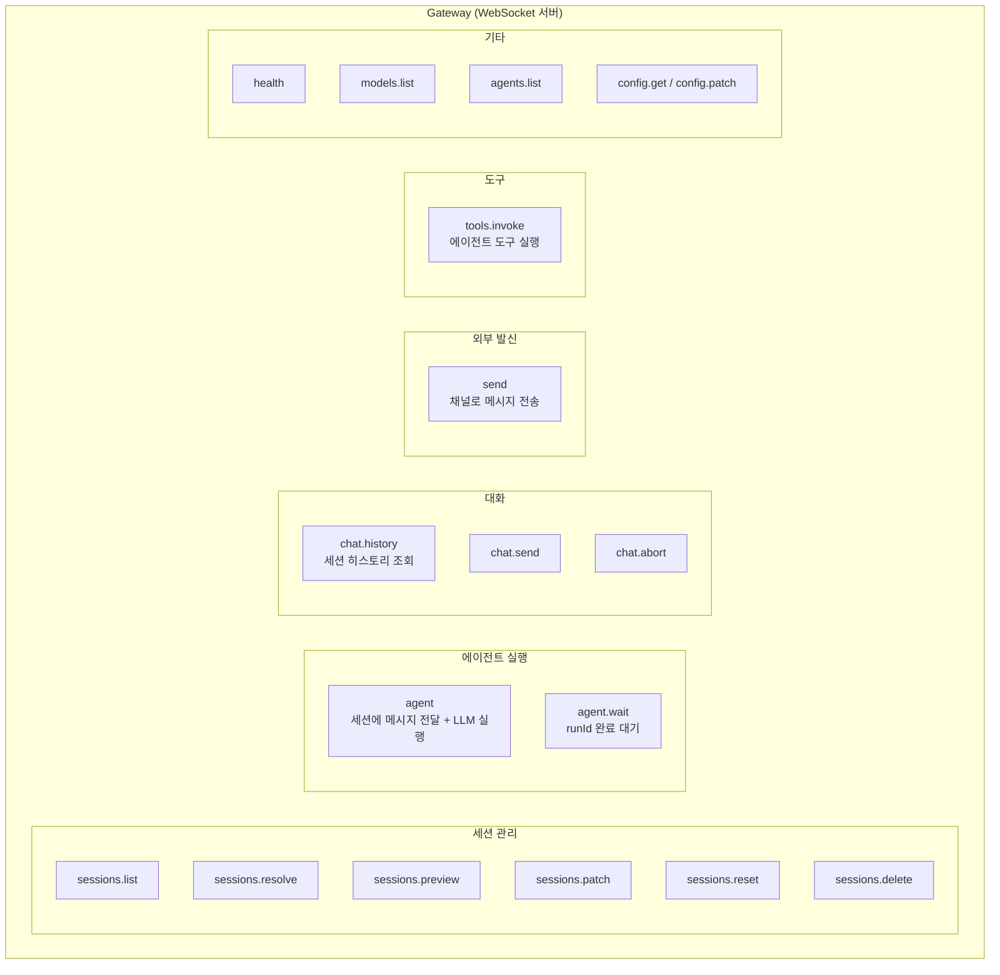

### 6.2 세션 모델

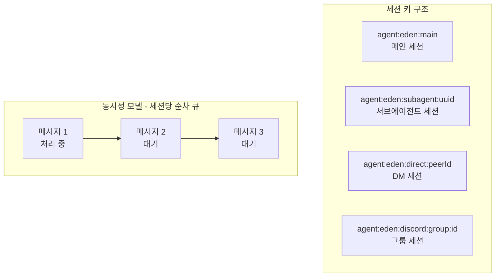

> **핵심**: Gateway는 **세션당 한 번에 하나의 메시지만 처리**한다.
> 같은 에이전트에 동시에 여러 비동기 메시지를 보내면 **순차 큐잉**된다.
>
> 예: Eden->Seum + Ieum->Seum 동시 전송 시, 응답시간이 적산됨 (60s + 60s = ~120s)

---

## 7. 대화 ID 체계

### 7.1 ID 관계도

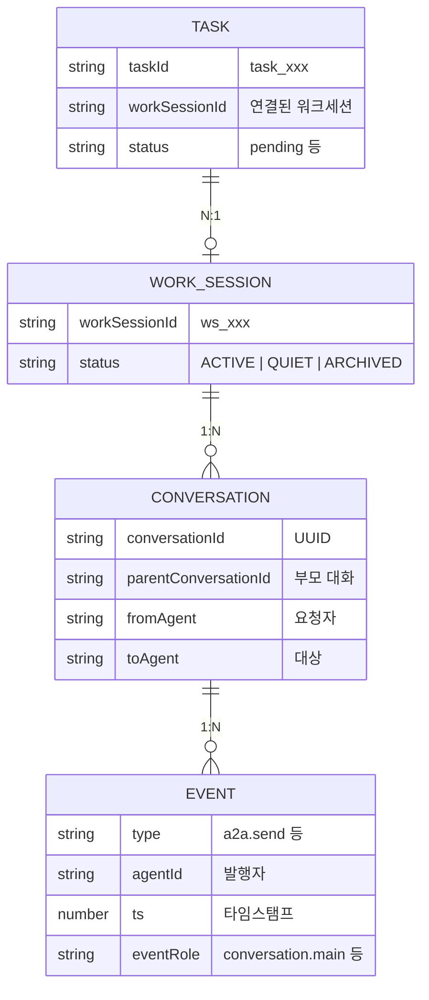

### 7.2 conversationId 결정 로직

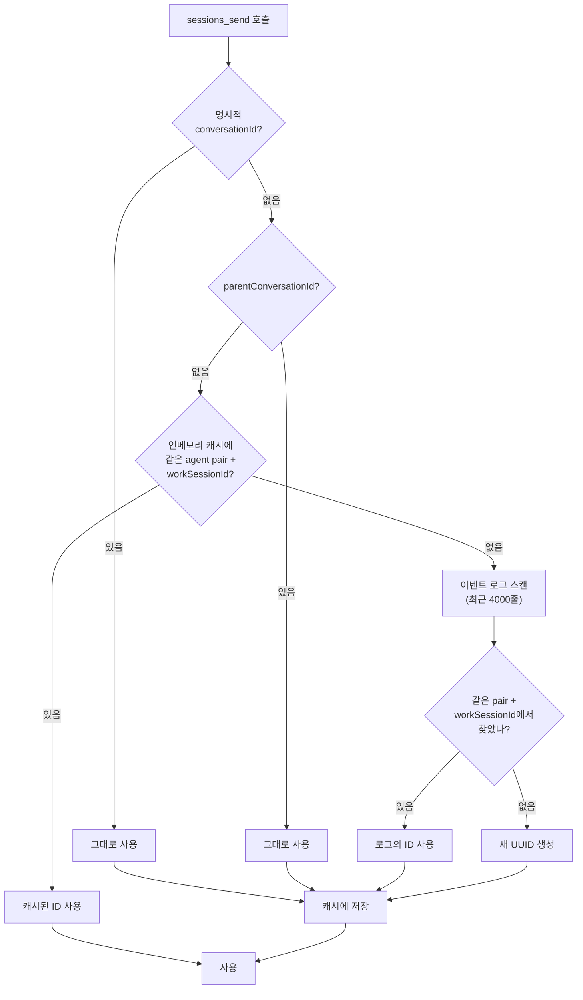

---

## 8. Task-Monitor 데이터 처리

### 8.1 이벤트에서 워크세션 그룹핑

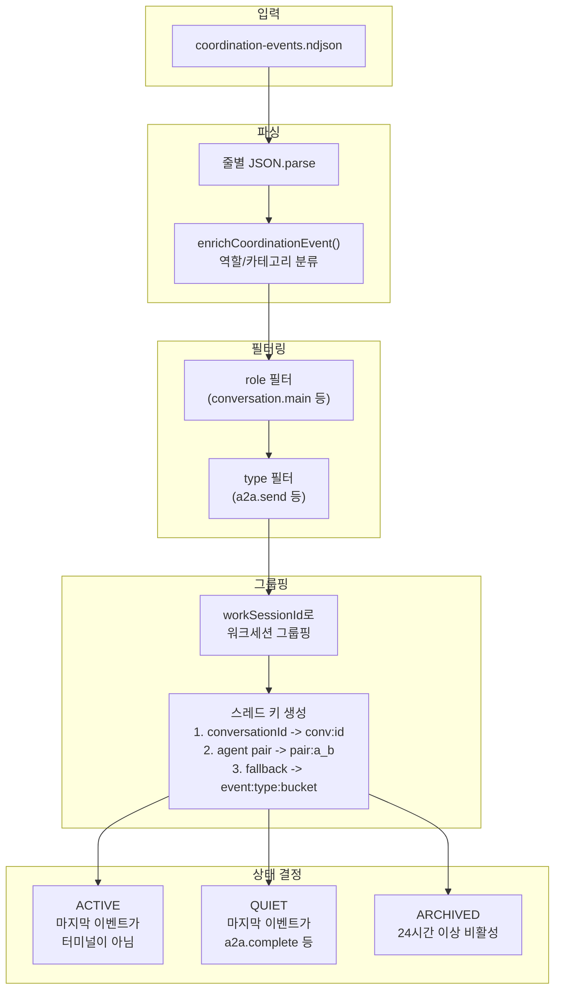

### 8.2 Task-Monitor API

| 엔드포인트                | 메서드    | 설명                            |
| ------------------------- | --------- | ------------------------------- |
| `/api/work-sessions`      | GET       | 워크세션 + 스레드 + 이벤트 조회 |
| `/api/agents`             | GET       | 전체 에이전트 목록              |
| `/api/agents/:id/tasks`   | GET       | 에이전트의 태스크 목록          |
| `/api/agents/:id/current` | GET       | 에이전트의 현재 태스크          |
| `/api/agents/:id/history` | GET       | 에이전트의 태스크 히스토리      |
| `/api/agents/:id/blocked` | GET       | 에이전트의 블로킹된 태스크      |
| `/api/health`             | GET       | 헬스체크                        |
| `/ws`                     | WebSocket | 실시간 태스크/이벤트 업데이트   |

**work-sessions 필터 파라미터:**

| 파라미터       | 설명             | 예시                                 |
| -------------- | ---------------- | ------------------------------------ |
| `role`         | 이벤트 역할 필터 | `conversation.main`                  |
| `type`         | 이벤트 타입 필터 | `a2a.send,a2a.response,a2a.complete` |
| `status`       | 워크세션 상태    | `ACTIVE,QUIET`                       |
| `viewCategory` | 협업 카테고리    | `engineering_build`                  |
| `subTag`       | 서브태그 필터    | `테스트`                             |
| `limit`        | 결과 수 제한     | `20`                                 |

---

## 9. Task-Hub에서 Task-Monitor 연결

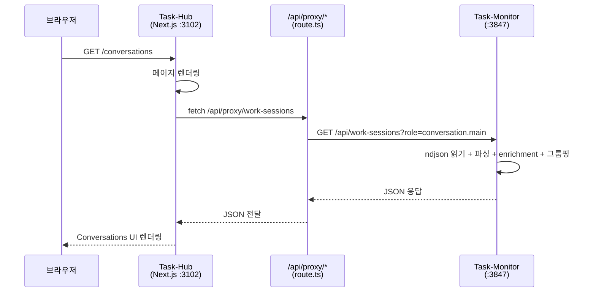

**Task-Hub 프록시 구현** (`src/app/api/proxy/[...path]/route.ts`):

- `GET /api/proxy/*` -> `GET http://task-monitor:3847/api/*` 투명 전달
- `PATCH /api/proxy/*` -> `PATCH` + `X-Task-Monitor-Token` 헤더 추가
- Docker 환경: `TASK_MONITOR_URL=http://host.docker.internal:3847`

---

## 10. 핑퐁 메커니즘 상세

A2A 대화는 단순 요청-응답이 아니라, 최대 5턴의 **핑퐁 교환**을 지원한다.

```mermaid
sequenceDiagram
    participant Eden as Eden
    participant Seum as Seum
    participant Bus as Event Bus

    Note over Eden,Seum: 초기 메시지
    Eden->>Seum: 원본 메시지
    Bus-->>Bus: emit(a2a.send)
    Seum-->>Eden: 초기 응답
    Bus-->>Bus: emit(a2a.response)

    Note over Eden,Seum: 핑퐁 시작 (최대 5턴)

    rect rgb(40, 40, 80)
        Eden->>Eden: runAgentStep(Seum의 응답 기반)
        Eden-->>Seum: 턴 1 응답
        Bus-->>Bus: emit(a2a.response, turn=1)
    end

    rect rgb(40, 40, 80)
        Seum->>Seum: runAgentStep(Eden의 응답 기반)
        Seum-->>Eden: 턴 2 응답
        Bus-->>Bus: emit(a2a.response, turn=2)
    end

    Note over Eden,Seum: REPLY_SKIP 시 즉시 종료

    rect rgb(60, 40, 40)
        Note over Seum: 어나운스 단계
        Seum->>Seum: 결과 요약 생성
        Seum-->>Seum: Discord 등에 발신 (또는 ANNOUNCE_SKIP)
    end

    Bus-->>Bus: emit(a2a.complete)
```

**설정**:

- `session.agentToAgent.maxPingPongTurns`: 최대 턴 수 (기본 5, 최대 5)
- `[NO_REPLY_NEEDED]` 또는 `[NOTIFICATION]` 태그: 핑퐁 건너뜀

---

## 11. 에러 처리 흐름

### 11.1 에러 분류

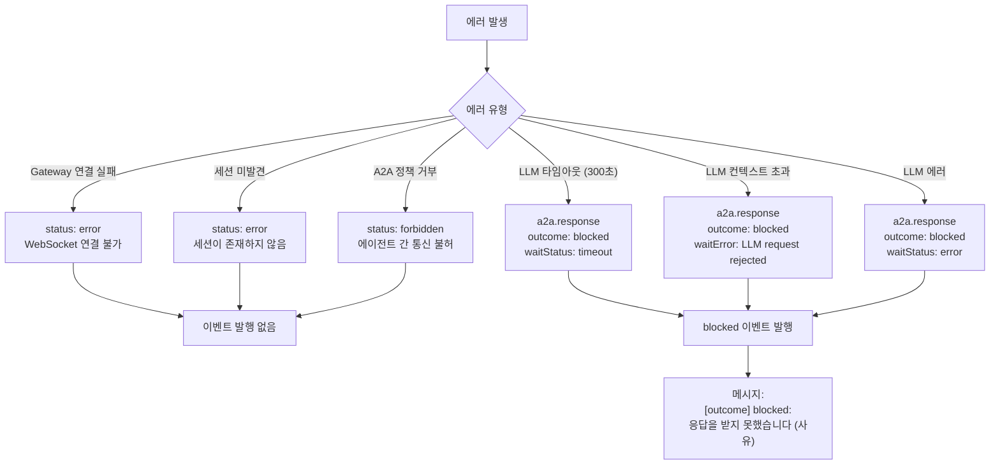

### 11.2 blocked 응답 메시지 생성 규칙

`buildNoReplyOutcomeMessage()`에서 생성:

| 조건                    | 메시지                                                                 |
| ----------------------- | ---------------------------------------------------------------------- |
| waitError 존재          | `[outcome] blocked: 응답을 받지 못했습니다 ({waitError})`              |
| waitStatus: not_found   | `[outcome] blocked: 응답을 받지 못했습니다 (실행 상태를 찾을 수 없음)` |
| waitStatus: error       | `[outcome] blocked: 응답을 받지 못했습니다 (실행 오류)`                |
| 300초 초과 또는 timeout | `[outcome] blocked: 응답을 받지 못했습니다 (대기 시간 300초 초과)`     |
| 기타                    | `[outcome] blocked: 응답을 받지 못했습니다`                            |

> **참고**: 재시도 로직은 현재 없음. 모든 실패는 영구적 blocked로 기록됨.

---

## 12. 소스 코드 참조

| 기능                   | 파일                                            | 핵심 함수                                                      |
| ---------------------- | ----------------------------------------------- | -------------------------------------------------------------- |
| A2A 전송 도구          | `src/agents/tools/sessions-send-tool.ts`        | `createSessionsSendTool()`                                     |
| A2A 백그라운드 플로우  | `src/agents/tools/sessions-send-tool.a2a.ts`    | `runSessionsSendA2AFlow()`                                     |
| 에이전트 단계 실행     | `src/agents/tools/agent-step.ts`                | `runAgentStep()`, `readLatestAssistantReply()`                 |
| 전송 헬퍼              | `src/agents/tools/sessions-send-helpers.ts`     | `buildAgentToAgentMessageContext()`, `resolvePingPongTurns()`  |
| 이벤트 버스            | `src/infra/events/bus.ts`                       | `emit()`, `subscribe()`                                        |
| 이벤트 로그            | `src/infra/events/event-log.ts`                 | `startEventLog()`                                              |
| 이벤트 스키마          | `src/infra/events/schemas.ts`                   | `EVENT_TYPES`                                                  |
| 세션 키 관리           | `src/routing/session-key.ts`                    | `resolveAgentIdFromSessionKey()`, `buildAgentMainSessionKey()` |
| Gateway 서버           | `src/gateway/server.impl.ts`                    | `startGatewayServer()`                                         |
| Gateway 메서드         | `src/gateway/server-methods.ts`                 | 메서드 등록                                                    |
| Gateway 세션           | `src/gateway/server-methods/sessions.ts`        | `sessionsHandlers`                                             |
| Gateway 호출           | `src/gateway/call.ts`                           | `callGateway()`                                                |
| Task-Monitor           | `scripts/task-monitor-server.ts`                | `buildWorkSessionsFromEvents()`, `enrichCoordinationEvent()`   |
| Task-Hub 프록시        | `task-hub/src/app/api/proxy/[...path]/route.ts` | `forwardRequest()`                                             |
| Task-Hub Conversations | `task-hub/src/app/conversations/page.tsx`       | 1,967줄 모놀리식 페이지                                        |

---

## 13. 알려진 이슈

### 13.1 시스템 수준

| #   | 이슈                                  | 영향                                             | 참조                        |
| --- | ------------------------------------- | ------------------------------------------------ | --------------------------- |
| 1   | 동기 모드 타임아웃 시 이벤트 미발행   | 대화가 UI에 표시되지 않음                        | sessions-send-tool.ts ~L642 |
| 2   | 세션당 순차 처리 (큐잉)               | 동일 에이전트 대상 동시 전송 시 응답시간 적산    | Gateway 아키텍처            |
| 3   | task-monitor는 요청 시 파일 전체 읽기 | 이벤트 많아지면 응답 느려짐                      | task-monitor-server.ts      |
| 4   | A2A 재시도 로직 없음                  | LLM 일시적 에러도 영구 blocked                   | sessions-send-tool.a2a.ts   |
| 5   | ndjson 월별 로테이션만                | 한 달 내 대량 이벤트 시 파일 커짐 (10MB 캡 있음) | event-log.ts                |

### 13.2 UI 수준 (Task-Hub Conversations)

| #   | 이슈                                          | 심각도   |
| --- | --------------------------------------------- | -------- |
| 1   | `[outcome] blocked:` 원본 에러 메시지 노출    | Critical |
| 2   | 세션 제목에 raw task ID 표시                  | Critical |
| 3   | Discord `<@mention_id>` 그대로 노출           | Critical |
| 4   | 마크다운 미렌더링 (`**bold**` 등)             | Major    |
| 5   | 대화 상태 배지 없음 (active/blocked/resolved) | Major    |
| 6   | 검색/필터 기능 없음                           | Major    |
| 7   | 우측 버블에 발신자/타임스탬프 누락            | Minor    |
