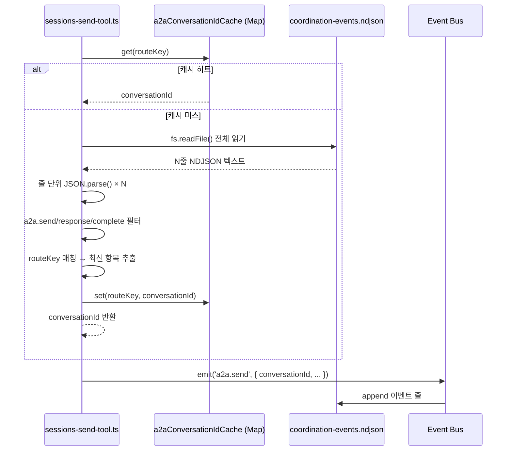
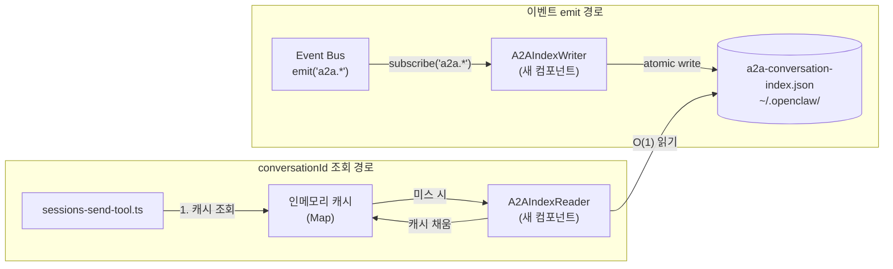
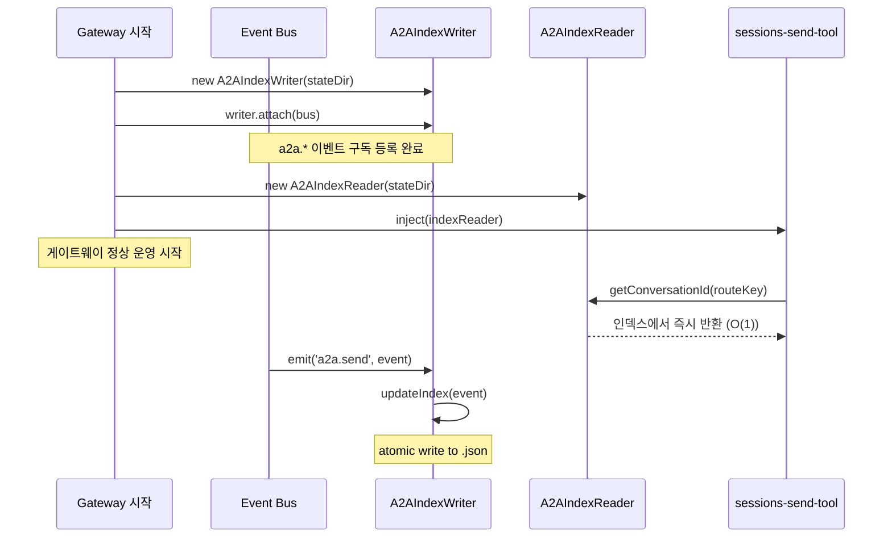

# A2A 대화 연속성 인덱스 교체

> 작성일: 2026-02-19
> 상태: 설계 문서
> 우선순위: 높음 (High)
> 노력 추정: L (1~2일)

---

## 1. 문제 정의

### 1.1 현재 상태

`src/agents/tools/sessions-send-tool.ts`는 A2A(Agent-to-Agent) 메시지를 보낼 때 대화 연속성을 유지하기 위해 이전 `conversationId`를 찾아야 한다. 현재 구현은 이를 위해 `coordination-events.ndjson` 파일 전체를 읽고 파싱한다.

이 파일은 `src/infra/events/event-log.ts`가 관리하는 append-only 로그다. 게이트웨이가 실행되는 동안 계속 커지며, 로테이션 정책이 있지만 단기간에도 수천 줄에 달할 수 있다.

### 1.2 구체적 문제점

**O(N) 선형 스캔 — A2A 전송마다 반복**

```
A2A send 요청
  → coordination-events.ndjson 전체 읽기 (fs.readFile)
  → 줄 단위 파싱 (JSON.parse × N)
  → a2a.send / a2a.response / a2a.complete 이벤트 필터링
  → routeKey 매칭 → 최신 conversationId 추출
```

파일이 10,000줄이면 매 A2A 전송마다 10,000번의 JSON.parse가 발생한다.

**`A2A_EVENT_LOG_SCAN_LIMIT` 임시방편**

현재 코드에는 스캔 상한선(`A2A_EVENT_LOG_SCAN_LIMIT`)이 있다. 이는 문제를 완화하지만 근본 해결이 아니다. 상한선을 넘어선 이벤트는 무시되므로, 오래된 대화의 `conversationId`를 찾지 못하는 경우가 생긴다.

**인메모리 캐시의 한계**

`a2aConversationIdCache`(Map)가 있지만 프로세스 재시작 시 초기화된다. 게이트웨이가 재시작되면 첫 번째 A2A 전송에서 반드시 전체 스캔이 발생한다.

**고처리량 시나리오에서의 CPU 압박**

여러 에이전트가 동시에 A2A 메시지를 보내면 동시 파일 읽기 + 파싱이 중첩된다. Node.js의 단일 스레드 이벤트 루프에서 이는 다른 요청의 지연으로 직결된다.

### 1.3 영향 범위

- A2A 전송 지연 증가 (파일 크기에 비례)
- 게이트웨이 재시작 후 첫 번째 A2A 배치에서 CPU 스파이크
- `A2A_EVENT_LOG_SCAN_LIMIT` 초과 시 대화 연속성 단절 (새 conversationId로 시작)

---

## 2. 설계 목표

| 목표 | 측정 기준 |
|------|-----------|
| conversationId 조회를 O(1)으로 단축 | 파일 크기와 무관하게 단일 JSON 파일 읽기 |
| 프로세스 재시작 후에도 캐시 유효 | 재시작 직후 스캔 없이 인덱스에서 즉시 조회 |
| 기존 이벤트 로그 구조 변경 없음 | `coordination-events.ndjson` 포맷 그대로 유지 |
| 인덱스 파일 크기 상한 | routeKey 수 × 약 200바이트 (수십 KB 이하) |
| 기존 `a2aConversationIdCache` 동작 호환 | 인메모리 캐시는 인덱스 위에 레이어로 유지 |
| 쓰기 경합 없음 | 인덱스 업데이트는 이벤트 emit 시점에 단일 경로로만 발생 |

---

## 3. 현재 구현 분석

### 3.1 핵심 파일

| 파일 | 역할 |
|------|------|
| `src/agents/tools/sessions-send-tool.ts` | A2A 전송 로직, conversationId 조회, 인메모리 캐시 |
| `src/infra/events/event-log.ts` | append-only NDJSON 로그, 로테이션 관리 |
| `src/infra/events/schemas.ts` | 이벤트 타입 정의 (A2A_SEND, A2A_RESPONSE, A2A_COMPLETE) |
| `src/infra/events/bus.ts` | 인메모리 pub/sub 이벤트 버스 |
| `src/agents/tools/sessions-send-tool.a2a.ts` | A2A 플로우 오케스트레이션 |

### 3.2 현재 conversationId 조회 플로우



### 3.3 이벤트 스키마 (현재)

`src/infra/events/schemas.ts`에서 A2A 관련 이벤트:

```typescript
// 현재 이벤트 구조 (변경 없음)
interface A2ASendEvent {
  type: 'a2a.send';
  conversationId: string;
  routeKey: string;        // "fromSession:toSession" 형태
  runId: string;
  timestamp: number;
  // ... 기타 필드
}

interface A2AResponseEvent {
  type: 'a2a.response';
  conversationId: string;
  routeKey: string;
  timestamp: number;
}

interface A2ACompleteEvent {
  type: 'a2a.complete';
  conversationId: string;
  routeKey: string;
  timestamp: number;
}
```

### 3.4 인메모리 캐시 현황

```typescript
// sessions-send-tool.ts 내부 (현재)
const a2aConversationIdCache = new Map<string, string>();
// key: routeKey (예: "main:worker-1")
// value: conversationId (UUID)
// 수명: 프로세스 생존 기간
```

---

## 4. 상세 설계

### 4.1 새로운 아키텍처 개요



### 4.2 인덱스 파일 구조

**파일 경로**: `~/.openclaw/a2a-conversation-index.json`

```typescript
// src/infra/events/a2a-index.ts

export interface A2AConversationEntry {
  /** 가장 최근 conversationId */
  conversationId: string;
  /** 마지막 이벤트 타임스탬프 (ms) */
  timestamp: number;
  /** 마지막 이벤트 타입 */
  lastEventType: 'a2a.send' | 'a2a.response' | 'a2a.complete';
  /** 해당 대화의 runId (디버깅용) */
  runId?: string;
}

export interface A2AConversationIndex {
  /** 스키마 버전 (마이그레이션 대비) */
  version: 1;
  /** routeKey → 최신 대화 정보 */
  entries: Record<string, A2AConversationEntry>;
  /** 인덱스 마지막 업데이트 시각 */
  updatedAt: number;
}
```

**실제 파일 예시**:

```json
{
  "version": 1,
  "updatedAt": 1740000000000,
  "entries": {
    "main:worker-1": {
      "conversationId": "conv-abc123",
      "timestamp": 1740000000000,
      "lastEventType": "a2a.complete",
      "runId": "run-xyz789"
    },
    "main:worker-2": {
      "conversationId": "conv-def456",
      "timestamp": 1739999990000,
      "lastEventType": "a2a.response",
      "runId": "run-uvw012"
    }
  }
}
```

### 4.3 A2AIndexWriter 설계

```typescript
// src/infra/events/a2a-index.ts

export class A2AIndexWriter {
  private indexPath: string;
  /** 동시 쓰기 방지용 뮤텍스 (Promise 체인) */
  private writeQueue: Promise<void> = Promise.resolve();

  constructor(stateDir: string) {
    this.indexPath = path.join(stateDir, 'a2a-conversation-index.json');
  }

  /**
   * 이벤트 버스에 구독 등록.
   * a2a.send / a2a.response / a2a.complete 이벤트 수신 시 인덱스 업데이트.
   */
  attach(bus: EventBus): void {
    bus.subscribe('a2a.send', (event) => this.onA2AEvent(event));
    bus.subscribe('a2a.response', (event) => this.onA2AEvent(event));
    bus.subscribe('a2a.complete', (event) => this.onA2AEvent(event));
  }

  private onA2AEvent(event: A2ASendEvent | A2AResponseEvent | A2ACompleteEvent): void {
    // fire-and-forget이지만 큐로 직렬화
    this.writeQueue = this.writeQueue.then(() => this.updateIndex(event));
  }

  private async updateIndex(event: { type: string; conversationId: string; routeKey: string; timestamp: number; runId?: string }): Promise<void> {
    const index = await this.readIndex();
    const existing = index.entries[event.routeKey];

    // 더 최신 이벤트만 반영 (타임스탬프 기준)
    if (existing && existing.timestamp > event.timestamp) {
      return;
    }

    index.entries[event.routeKey] = {
      conversationId: event.conversationId,
      timestamp: event.timestamp,
      lastEventType: event.type as A2AConversationEntry['lastEventType'],
      runId: event.runId,
    };
    index.updatedAt = Date.now();

    await this.writeIndex(index);
  }

  private async readIndex(): Promise<A2AConversationIndex> {
    try {
      const raw = await fs.readFile(this.indexPath, 'utf-8');
      return JSON.parse(raw) as A2AConversationIndex;
    } catch {
      // 파일 없음 또는 파싱 실패 → 빈 인덱스 반환
      return { version: 1, entries: {}, updatedAt: 0 };
    }
  }

  private async writeIndex(index: A2AConversationIndex): Promise<void> {
    const tmp = this.indexPath + '.tmp';
    await fs.writeFile(tmp, JSON.stringify(index, null, 2), 'utf-8');
    await fs.rename(tmp, this.indexPath); // atomic rename
  }
}
```

### 4.4 A2AIndexReader 설계

```typescript
// src/infra/events/a2a-index.ts (동일 파일)

export class A2AIndexReader {
  private indexPath: string;

  constructor(stateDir: string) {
    this.indexPath = path.join(stateDir, 'a2a-conversation-index.json');
  }

  /**
   * routeKey에 해당하는 최신 conversationId 반환.
   * 인덱스 파일이 없거나 항목이 없으면 undefined.
   */
  async getConversationId(routeKey: string): Promise<string | undefined> {
    try {
      const raw = await fs.readFile(this.indexPath, 'utf-8');
      const index = JSON.parse(raw) as A2AConversationIndex;
      return index.entries[routeKey]?.conversationId;
    } catch {
      return undefined;
    }
  }

  /**
   * 전체 인덱스 반환 (디버깅/진단용).
   */
  async getAll(): Promise<A2AConversationIndex | null> {
    try {
      const raw = await fs.readFile(this.indexPath, 'utf-8');
      return JSON.parse(raw) as A2AConversationIndex;
    } catch {
      return null;
    }
  }
}
```

### 4.5 sessions-send-tool.ts 변경 설계

기존 `a2aConversationIdCache` Map은 유지하되, 캐시 미스 시 전체 NDJSON 스캔 대신 `A2AIndexReader`를 호출한다.

```typescript
// sessions-send-tool.ts — 변경 후 conversationId 조회 로직

async function getA2AConversationId(
  routeKey: string,
  memCache: Map<string, string>,
  indexReader: A2AIndexReader,
): Promise<string | undefined> {
  // 1단계: 인메모리 캐시 확인 (O(1))
  const cached = memCache.get(routeKey);
  if (cached) return cached;

  // 2단계: 인덱스 파일 조회 (O(1) — 단일 JSON 파일 읽기)
  const fromIndex = await indexReader.getConversationId(routeKey);
  if (fromIndex) {
    memCache.set(routeKey, fromIndex); // 캐시 채움
    return fromIndex;
  }

  // 3단계: 인덱스에도 없으면 undefined (새 대화 시작)
  return undefined;
}
```

기존 NDJSON 스캔 코드(`A2A_EVENT_LOG_SCAN_LIMIT` 관련 로직)는 **제거**한다.

### 4.6 초기화 순서 (게이트웨이 시작 시)



---

## 5. 구현 계획

### Phase 1: 인덱스 모듈 신규 작성 (0.5일)

**변경 파일**: `src/infra/events/a2a-index.ts` (신규)

1. `A2AConversationEntry`, `A2AConversationIndex` 인터페이스 정의
2. `A2AIndexWriter` 클래스 구현
   - `attach(bus)` 메서드
   - `onA2AEvent()` 핸들러
   - `updateIndex()` — Promise 큐로 직렬화
   - `readIndex()` / `writeIndex()` — atomic rename 패턴
3. `A2AIndexReader` 클래스 구현
   - `getConversationId(routeKey)` 메서드
   - `getAll()` 진단용 메서드
4. 단위 테스트 작성 (`src/infra/events/a2a-index.test.ts`)

### Phase 2: 게이트웨이 초기화에 연결 (0.25일)

**변경 파일**: 게이트웨이 초기화 코드 (정확한 파일은 `src/infra/` 또는 `src/gateway/` 내 진입점)

1. `A2AIndexWriter` 인스턴스 생성 및 `bus.attach()` 호출
2. `A2AIndexReader` 인스턴스 생성
3. `sessions-send-tool` 팩토리에 `indexReader` 주입

### Phase 3: sessions-send-tool.ts 수정 (0.5일)

**변경 파일**: `src/agents/tools/sessions-send-tool.ts`

1. `A2AIndexReader` 의존성 추가 (생성자 또는 팩토리 파라미터)
2. `getA2AConversationId()` 함수 교체
   - 기존: NDJSON 전체 스캔
   - 신규: 인메모리 캐시 → 인덱스 파일 순서로 조회
3. `A2A_EVENT_LOG_SCAN_LIMIT` 관련 코드 제거
4. 기존 `a2aConversationIdCache` Map 유지 (인덱스 위의 L1 캐시)

### Phase 4: 검증 및 마이그레이션 (0.25일)

1. 기존 `coordination-events.ndjson`에서 인덱스 초기 빌드 스크립트 작성 (선택)
   - 게이트웨이 최초 시작 시 인덱스가 없으면 빈 인덱스로 시작해도 무방
   - 기존 대화는 새 conversationId로 시작됨 (허용 가능한 트레이드오프)
2. 통합 테스트: A2A 전송 → 인덱스 업데이트 → 재조회 검증
3. 성능 측정: 10,000줄 NDJSON 스캔 vs 인덱스 조회 시간 비교

---

## 6. 영향 받는 파일

| 파일 경로 | 변경 유형 | 설명 |
|-----------|-----------|------|
| `src/infra/events/a2a-index.ts` | 신규 생성 | `A2AIndexWriter`, `A2AIndexReader` 클래스 및 인터페이스 |
| `src/infra/events/a2a-index.test.ts` | 신규 생성 | 단위 테스트 |
| `src/agents/tools/sessions-send-tool.ts` | 수정 | conversationId 조회 로직 교체, NDJSON 스캔 코드 제거 |
| `src/infra/events/bus.ts` | 수정 (최소) | `A2AIndexWriter.attach()` 호환성 확인 (subscribe API 변경 없음) |
| 게이트웨이 초기화 파일 | 수정 | `A2AIndexWriter` / `A2AIndexReader` 인스턴스 생성 및 주입 |
| `src/agents/tools/sessions-send-tool.a2a.ts` | 수정 (최소) | `A2AIndexWriter`가 이벤트를 받을 수 있도록 emit 경로 확인 |

---

## 7. 테스트 전략

### 7.1 단위 테스트 (`a2a-index.test.ts`)

```typescript
describe('A2AIndexWriter', () => {
  it('a2a.send 이벤트 수신 시 인덱스 파일에 항목 추가', async () => { ... });
  it('동일 routeKey에 더 최신 이벤트가 오면 덮어씀', async () => { ... });
  it('더 오래된 이벤트는 무시함 (타임스탬프 기준)', async () => { ... });
  it('동시 이벤트 10개 처리 시 파일 손상 없음 (직렬화 검증)', async () => { ... });
  it('인덱스 파일 없을 때 빈 인덱스로 초기화', async () => { ... });
  it('atomic rename으로 쓰기 중 크래시 시 파일 손상 없음', async () => { ... });
});

describe('A2AIndexReader', () => {
  it('존재하는 routeKey의 conversationId 반환', async () => { ... });
  it('없는 routeKey는 undefined 반환', async () => { ... });
  it('인덱스 파일 없으면 undefined 반환 (에러 없음)', async () => { ... });
});
```

### 7.2 통합 테스트

- 실제 `EventBus` 인스턴스에 `A2AIndexWriter` 연결
- `a2a.send` emit → 인덱스 파일 생성 확인
- `A2AIndexReader.getConversationId()` 호출 → 올바른 값 반환 확인
- `sessions-send-tool`의 `getA2AConversationId()` 함수가 인덱스를 사용하는지 확인

### 7.3 성능 벤치마크

```typescript
// 벤치마크 스크립트 (scripts/bench-a2a-index.ts)
// 10,000줄 NDJSON 스캔 시간 vs 인덱스 조회 시간 측정
// 목표: 인덱스 조회가 10배 이상 빠를 것
```

### 7.4 회귀 테스트

- 기존 `sessions-send-tool.test.ts` 전체 통과 확인
- A2A 플로우 E2E 테스트 (있다면) 통과 확인

---

## 8. 위험 평가

| 위험 | 가능성 | 영향 | 완화 전략 |
|------|--------|------|-----------|
| 인덱스 파일 손상 (쓰기 중 크래시) | 낮음 | 중간 | atomic rename 패턴 사용. 손상 시 빈 인덱스로 재시작 |
| 동시 쓰기로 인한 경합 | 낮음 | 높음 | Promise 큐로 직렬화. 단일 프로세스이므로 실질적 위험 낮음 |
| 인덱스와 실제 이벤트 로그 불일치 | 낮음 | 낮음 | 인덱스는 "최신 conversationId" 힌트일 뿐. 불일치 시 새 대화 시작 |
| 기존 대화 연속성 단절 (마이그레이션) | 중간 | 낮음 | 게이트웨이 재시작 시 기존 대화는 어차피 새로 시작됨. 허용 가능 |
| `stateDir` 경로 변경 시 인덱스 미발견 | 낮음 | 낮음 | 인덱스 미발견 시 undefined 반환 → 새 대화 시작 (graceful degradation) |

---

## 9. 의존성

### 선행 조건

- 없음. 독립적으로 구현 가능.

### 후속 작업과의 관계

- **02-a2a-durable-jobs.md** (A2A 플로우 내구성 확보): 해당 설계에서 A2A 잡 상태를 `~/.openclaw/a2a-jobs/`에 저장할 때, 이 인덱스 파일과 같은 `stateDir` 패턴을 공유한다. 두 개선안을 함께 구현하면 `stateDir` 관리 코드를 통합할 수 있다.

### 영향 없는 항목

- `coordination-events.ndjson` 포맷 변경 없음
- 기존 Task-Monitor의 NDJSON 읽기 로직 영향 없음
- Discord/Slack 채널 모니터 영향 없음

---

## 10. 노력 추정

| 작업 | 추정 시간 |
|------|-----------|
| `a2a-index.ts` 신규 작성 (Writer + Reader) | 3시간 |
| 단위 테스트 작성 | 2시간 |
| 게이트웨이 초기화 연결 | 1시간 |
| `sessions-send-tool.ts` 수정 | 2시간 |
| 통합 테스트 + 성능 벤치마크 | 2시간 |
| 코드 리뷰 및 수정 | 2시간 |
| **합계** | **~12시간 (1.5일)** |

---

## 부록: 현재 코드 스냅샷 (참조용)

### NDJSON 스캔 패턴 (제거 대상)

```typescript
// sessions-send-tool.ts — 현재 구현 (개념적 표현)
const lines = rawContent.split('\n').slice(-A2A_EVENT_LOG_SCAN_LIMIT);
for (const line of lines.reverse()) {
  try {
    const event = JSON.parse(line);
    if (
      (event.type === 'a2a.send' || event.type === 'a2a.response' || event.type === 'a2a.complete') &&
      event.routeKey === targetRouteKey
    ) {
      return event.conversationId;
    }
  } catch {
    // 파싱 실패 줄 무시
  }
}
return undefined;
```

이 패턴 전체가 `A2AIndexReader.getConversationId()` 단일 호출로 대체된다.
