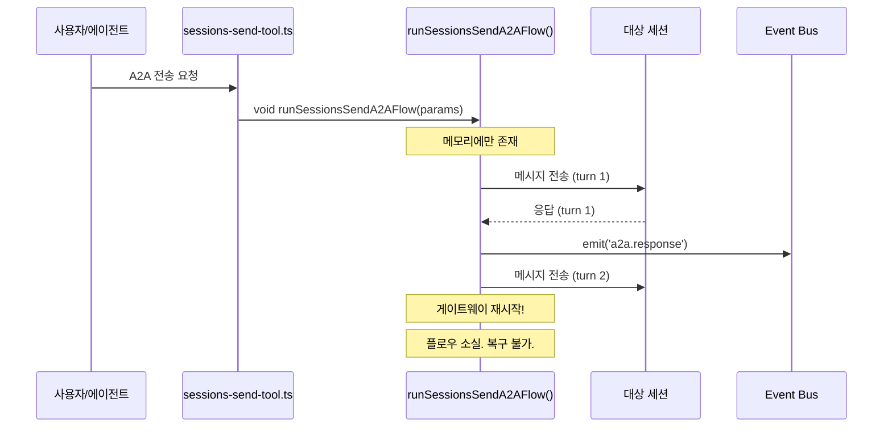
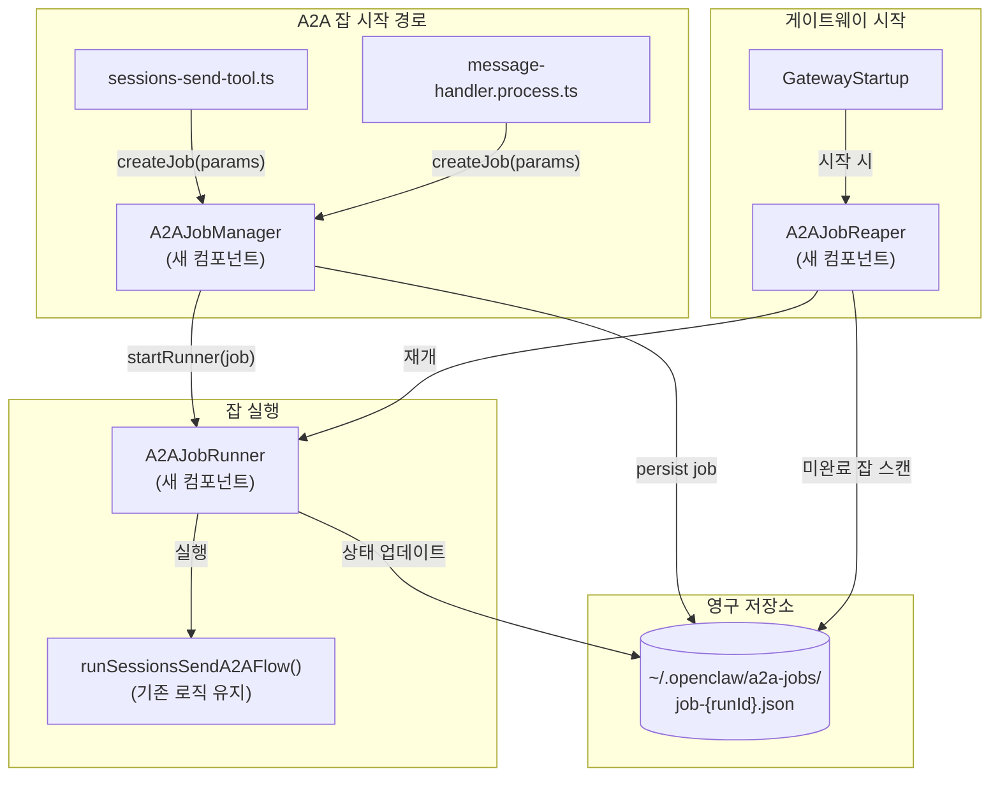
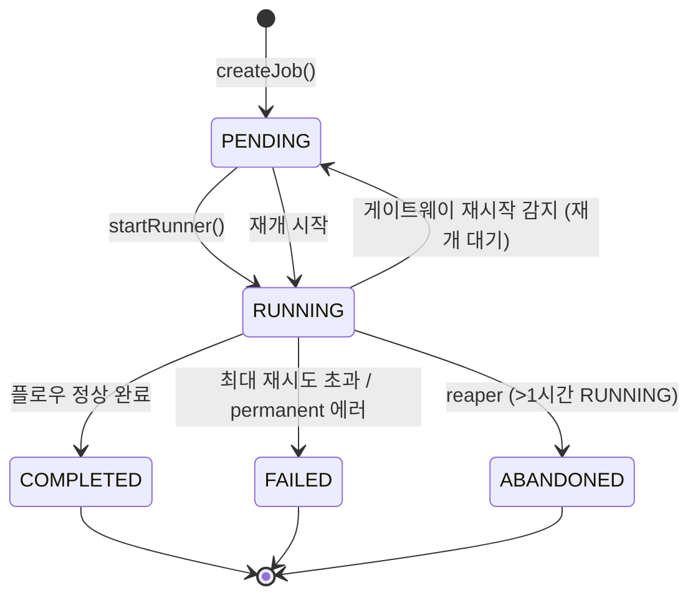
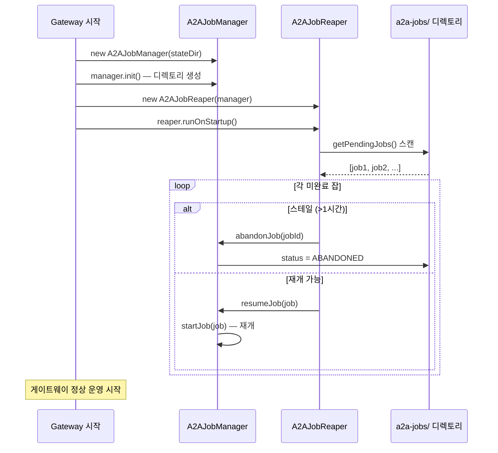
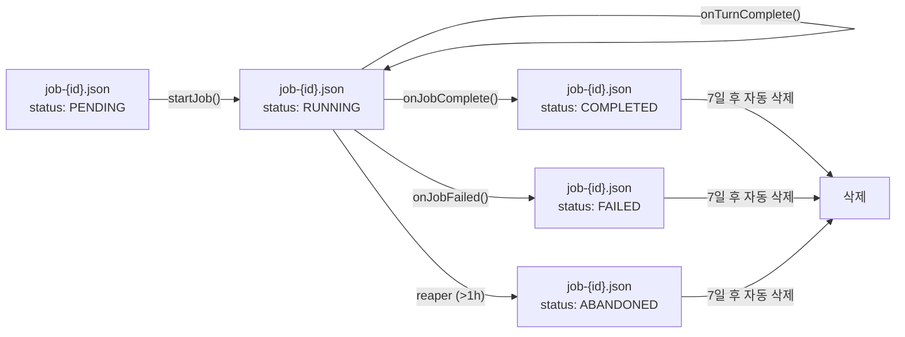

# A2A 플로우 내구성 확보

> 작성일: 2026-02-19
> 상태: 설계 문서
> 우선순위: 높음 (High)
> 노력 추정: XL (3일 이상)

---

## 1. 문제 정의

### 1.1 현재 상태

A2A(Agent-to-Agent) 플로우는 `sessions-send-tool.ts`와 `message-handler.process.ts`에서 `void runSessionsSendA2AFlow(...)` 형태로 시작된다. 이는 전형적인 fire-and-forget 패턴이다. 함수가 반환하는 Promise를 아무도 기다리지 않고, 어디에도 저장하지 않는다.

Node.js 이벤트 루프 안에서 실행 중인 이 비동기 함수들은 프로세스가 살아있는 동안만 존재한다. 게이트웨이가 종료되는 순간 모든 진행 중인 A2A 대화는 흔적 없이 사라진다.

### 1.2 구체적 문제점

**프로세스 재시작 시 A2A 대화 전체 소실**

게이트웨이가 재시작되는 경우는 다양하다.

- 수동 업데이트 (`openclaw update`)
- OOM(Out of Memory) 킬
- 예외 처리되지 않은 에러로 인한 크래시
- macOS 앱에서 "Restart Gateway" 클릭
- 서버 재부팅

이 중 어느 경우든 현재 진행 중인 A2A 플로우는 복구 불가능하게 손실된다. 에이전트 A가 에이전트 B에게 작업을 위임했는데, 게이트웨이가 재시작되면 에이전트 B의 응답을 기다리던 플로우가 사라진다. 에이전트 A는 응답을 영원히 받지 못한다.

**실패 감지 불가**

현재 A2A 플로우가 실패해도 외부에서 알 방법이 없다. `a2a.complete` 이벤트가 오지 않으면 그냥 조용히 실패한 것이다. 재시도 로직(`calculateBackoffMs`, 최대 3회)이 있지만, 이 역시 프로세스 메모리 안에서만 동작한다.

**상태 가시성 없음**

현재 몇 개의 A2A 플로우가 진행 중인지, 어느 단계에 있는지, 얼마나 오래 실행 중인지 알 수 없다. Task-Monitor나 Task-Hub에서도 A2A 플로우 상태를 볼 수 없다.

**Discord A2A 자동 라우팅도 동일 문제**

`src/discord/monitor/message-handler.process.ts` 약 434번째 줄에서도 Discord 메시지가 A2A 자동 라우팅을 트리거할 때 동일한 `void` 패턴을 사용한다. Discord 채널에서 시작된 A2A 플로우도 같은 취약점을 가진다.

### 1.3 영향 범위

- 장시간 실행되는 A2A 작업 (예: 코드 생성, 데이터 분석) 중 게이트웨이 재시작 시 작업 전체 손실
- 사용자 입장에서 "에이전트가 응답을 안 한다"는 증상으로 나타남
- 재시도 없이 조용히 실패하므로 디버깅 어려움

---

## 2. 설계 목표

| 목표 | 측정 기준 |
|------|-----------|
| 게이트웨이 재시작 후 A2A 플로우 재개 | 재시작 후 60초 이내에 미완료 잡 재개 시작 |
| 잡 상태 영구 저장 | `~/.openclaw/a2a-jobs/` 디렉토리에 JSON 파일로 저장 |
| 상태 머신 명확화 | PENDING → RUNNING → COMPLETED / FAILED / ABANDONED |
| 스테일 잡 자동 정리 | 1시간 이상 RUNNING 상태인 잡은 ABANDONED 처리 |
| 기존 A2A 플로우 로직 변경 최소화 | `runSessionsSendA2AFlow()` 내부 로직은 그대로 유지 |
| 잡 상태 조회 API | 진단/디버깅용 CLI 또는 내부 API |

---

## 3. 현재 구현 분석

### 3.1 핵심 파일

| 파일 | 역할 |
|------|------|
| `src/agents/tools/sessions-send-tool.ts` | A2A 플로우 시작 (`void runSessionsSendA2AFlow(...)`) |
| `src/agents/tools/sessions-send-tool.a2a.ts` | A2A 플로우 전체 오케스트레이션 (ping-pong, 재시도, 이벤트 emit) |
| `src/agents/tools/a2a-error-classification.ts` | `classifyA2AError()`, `calculateBackoffMs()` |
| `src/discord/monitor/message-handler.process.ts` | Discord A2A 자동 라우팅 (동일한 void 패턴) |
| `src/infra/events/event-log.ts` | 이벤트 로그 (A2A 이벤트 기록) |

### 3.2 현재 A2A 플로우 상태

`sessions-send-tool.a2a.ts`에서 관리하는 플로우 상태 (현재 메모리에만 존재):

```typescript
// 현재 플로우 내부 상태 (메모리에만 존재, 저장 안 됨)
interface A2AFlowState {
  runId: string;
  sessionKey: string;       // 발신 세션
  targetSessionKey: string; // 수신 세션
  conversationId: string;
  currentTurn: number;
  maxTurns: number;
  retryCount: number;
  lastError?: string;
  startedAt: number;
}
```

### 3.3 현재 재시도 로직

`sessions-send-tool.a2a.ts`의 재시도 파라미터:

- 청크 단위: 30초
- 최대 대기: 5분 (ceiling)
- 최대 재시도: 3회
- 에러 분류: `classifyA2AError()` → transient / permanent

### 3.4 현재 플로우 시작 패턴

```typescript
// sessions-send-tool.ts — 현재 (fire-and-forget)
void runSessionsSendA2AFlow({
  runId,
  sessionKey,
  targetSessionKey,
  conversationId,
  message,
  maxTurns,
  // ...
});
// 이 줄 이후 플로우 상태를 추적하는 코드 없음
```

```typescript
// message-handler.process.ts — Discord A2A 라우팅 (동일 패턴)
void runSessionsSendA2AFlow({ ... });
```

### 3.5 현재 데이터 플로우



---

## 4. 상세 설계

### 4.1 전체 아키텍처



### 4.2 잡 상태 머신



**상태 설명**:

| 상태 | 의미 | 다음 전환 |
|------|------|-----------|
| `PENDING` | 잡 생성됨, 아직 실행 안 됨 (또는 재시작 후 재개 대기) | → RUNNING |
| `RUNNING` | 현재 실행 중 | → COMPLETED / FAILED / ABANDONED |
| `COMPLETED` | 정상 완료 | 종료 |
| `FAILED` | 영구 실패 (재시도 소진 또는 permanent 에러) | 종료 |
| `ABANDONED` | 1시간 이상 RUNNING 상태 유지 (좀비 잡) | 종료 |

### 4.3 잡 파일 구조

**파일 경로**: `~/.openclaw/a2a-jobs/job-{runId}.json`

```typescript
// src/agents/tools/a2a-job-manager.ts

export type A2AJobStatus = 'PENDING' | 'RUNNING' | 'COMPLETED' | 'FAILED' | 'ABANDONED';

export interface A2AJobRecord {
  /** 잡 고유 ID (runId와 동일) */
  jobId: string;
  /** A2A 플로우 runId */
  runId: string;
  /** 현재 상태 */
  status: A2AJobStatus;
  /** 발신 세션 키 */
  sessionKey: string;
  /** 수신 세션 키 */
  targetSessionKey: string;
  /** 대화 ID */
  conversationId: string;
  /** 전송할 메시지 */
  message: string;
  /** 최대 턴 수 */
  maxTurns: number;
  /** 현재 턴 (재개 시 사용) */
  currentTurn: number;
  /** 재시도 횟수 */
  retryCount: number;
  /** 최대 재시도 횟수 */
  maxRetries: number;
  /** 마지막 에러 메시지 */
  lastError?: string;
  /** 잡 생성 시각 (ms) */
  createdAt: number;
  /** 마지막 상태 변경 시각 (ms) */
  updatedAt: number;
  /** 완료/실패 시각 (ms) */
  finishedAt?: number;
  /** 재개 횟수 (디버깅용) */
  resumeCount: number;
  /** 추가 메타데이터 (채널 정보 등) */
  meta?: Record<string, unknown>;
}
```

**실제 파일 예시**:

```json
{
  "jobId": "run-abc123",
  "runId": "run-abc123",
  "status": "RUNNING",
  "sessionKey": "main",
  "targetSessionKey": "worker-1",
  "conversationId": "conv-xyz789",
  "message": "다음 작업을 처리해줘: ...",
  "maxTurns": 5,
  "currentTurn": 2,
  "retryCount": 0,
  "maxRetries": 3,
  "createdAt": 1740000000000,
  "updatedAt": 1740000060000,
  "resumeCount": 0
}
```

### 4.4 A2AJobManager 설계

```typescript
// src/agents/tools/a2a-job-manager.ts

export class A2AJobManager {
  private jobsDir: string;
  /** 현재 실행 중인 잡 (runId → AbortController) */
  private activeJobs = new Map<string, AbortController>();

  constructor(stateDir: string) {
    this.jobsDir = path.join(stateDir, 'a2a-jobs');
  }

  async init(): Promise<void> {
    await fs.mkdir(this.jobsDir, { recursive: true });
  }

  /**
   * 새 A2A 잡 생성 및 즉시 실행.
   * 기존 void runSessionsSendA2AFlow() 호출을 이것으로 교체.
   */
  async createAndStart(params: A2AJobParams): Promise<string> {
    const job: A2AJobRecord = {
      jobId: params.runId,
      runId: params.runId,
      status: 'PENDING',
      sessionKey: params.sessionKey,
      targetSessionKey: params.targetSessionKey,
      conversationId: params.conversationId,
      message: params.message,
      maxTurns: params.maxTurns,
      currentTurn: 0,
      retryCount: 0,
      maxRetries: params.maxRetries ?? 3,
      createdAt: Date.now(),
      updatedAt: Date.now(),
      resumeCount: 0,
      meta: params.meta,
    };

    await this.persistJob(job);
    await this.startJob(job);
    return job.jobId;
  }

  /**
   * 잡 실행 시작 (신규 또는 재개).
   */
  private async startJob(job: A2AJobRecord): Promise<void> {
    const abort = new AbortController();
    this.activeJobs.set(job.jobId, abort);

    await this.updateJobStatus(job.jobId, 'RUNNING');

    // 기존 플로우 로직 실행 (변경 없음)
    runSessionsSendA2AFlow({
      runId: job.runId,
      sessionKey: job.sessionKey,
      targetSessionKey: job.targetSessionKey,
      conversationId: job.conversationId,
      message: job.message,
      maxTurns: job.maxTurns,
      startTurn: job.currentTurn, // 재개 시 이어서 시작
      retryCount: job.retryCount,
      signal: abort.signal,
      onTurnComplete: (turn) => this.onTurnComplete(job.jobId, turn),
    })
      .then(() => this.onJobComplete(job.jobId))
      .catch((err) => this.onJobFailed(job.jobId, err))
      .finally(() => this.activeJobs.delete(job.jobId));
  }

  private async onTurnComplete(jobId: string, turn: number): Promise<void> {
    const job = await this.readJob(jobId);
    if (!job) return;
    job.currentTurn = turn;
    job.updatedAt = Date.now();
    await this.persistJob(job);
  }

  private async onJobComplete(jobId: string): Promise<void> {
    await this.updateJobStatus(jobId, 'COMPLETED', { finishedAt: Date.now() });
  }

  private async onJobFailed(jobId: string, err: Error): Promise<void> {
    await this.updateJobStatus(jobId, 'FAILED', {
      lastError: err.message,
      finishedAt: Date.now(),
    });
  }

  /**
   * 미완료 잡 목록 반환 (재개 대상).
   */
  async getPendingJobs(): Promise<A2AJobRecord[]> {
    const files = await fs.readdir(this.jobsDir).catch(() => [] as string[]);
    const jobs: A2AJobRecord[] = [];
    for (const file of files) {
      if (!file.startsWith('job-') || !file.endsWith('.json')) continue;
      const job = await this.readJobFromFile(path.join(this.jobsDir, file));
      if (job && (job.status === 'PENDING' || job.status === 'RUNNING')) {
        jobs.push(job);
      }
    }
    return jobs;
  }

  private async persistJob(job: A2AJobRecord): Promise<void> {
    const filePath = path.join(this.jobsDir, `job-${job.jobId}.json`);
    const tmp = filePath + '.tmp';
    await fs.writeFile(tmp, JSON.stringify(job, null, 2), 'utf-8');
    await fs.rename(tmp, filePath);
  }

  private async updateJobStatus(
    jobId: string,
    status: A2AJobStatus,
    extra?: Partial<A2AJobRecord>,
  ): Promise<void> {
    const job = await this.readJob(jobId);
    if (!job) return;
    Object.assign(job, { status, updatedAt: Date.now(), ...extra });
    await this.persistJob(job);
  }

  private async readJob(jobId: string): Promise<A2AJobRecord | null> {
    return this.readJobFromFile(path.join(this.jobsDir, `job-${jobId}.json`));
  }

  private async readJobFromFile(filePath: string): Promise<A2AJobRecord | null> {
    try {
      const raw = await fs.readFile(filePath, 'utf-8');
      return JSON.parse(raw) as A2AJobRecord;
    } catch {
      return null;
    }
  }
}
```

### 4.5 A2AJobReaper 설계

게이트웨이 시작 시 미완료 잡을 재개하고, 스테일 잡을 정리한다.

```typescript
// src/agents/tools/a2a-job-reaper.ts

export class A2AJobReaper {
  /** RUNNING 상태로 이 시간 이상 경과하면 ABANDONED 처리 (ms) */
  private static readonly STALE_THRESHOLD_MS = 60 * 60 * 1000; // 1시간

  constructor(private manager: A2AJobManager) {}

  /**
   * 게이트웨이 시작 시 호출.
   * 미완료 잡 스캔 → 스테일 잡 ABANDONED → 나머지 재개.
   */
  async runOnStartup(): Promise<void> {
    const pendingJobs = await this.manager.getPendingJobs();

    if (pendingJobs.length === 0) return;

    console.log(`[A2AJobReaper] ${pendingJobs.length}개의 미완료 A2A 잡 발견`);

    for (const job of pendingJobs) {
      if (this.isStale(job)) {
        console.log(`[A2AJobReaper] 스테일 잡 ABANDONED 처리: ${job.jobId}`);
        await this.manager.abandonJob(job.jobId);
      } else {
        console.log(`[A2AJobReaper] 잡 재개: ${job.jobId} (turn ${job.currentTurn}/${job.maxTurns})`);
        await this.manager.resumeJob(job);
      }
    }
  }

  private isStale(job: A2AJobRecord): boolean {
    const age = Date.now() - job.updatedAt;
    return age > A2AJobReaper.STALE_THRESHOLD_MS;
  }
}
```

### 4.6 runSessionsSendA2AFlow() 인터페이스 확장

기존 함수 시그니처에 재개 지원을 위한 파라미터를 추가한다. 기존 호출 코드는 새 파라미터 없이도 동작한다 (선택적 파라미터).

```typescript
// sessions-send-tool.a2a.ts — 인터페이스 확장

export interface A2AFlowParams {
  runId: string;
  sessionKey: string;
  targetSessionKey: string;
  conversationId: string;
  message: string;
  maxTurns: number;

  // 재개 지원을 위한 새 파라미터 (선택적)
  startTurn?: number;          // 재개 시 시작 턴 (기본값: 0)
  retryCount?: number;         // 재개 시 기존 재시도 횟수 (기본값: 0)
  signal?: AbortSignal;        // 취소 지원
  onTurnComplete?: (turn: number) => Promise<void>; // 턴 완료 콜백
}
```

### 4.7 게이트웨이 초기화 순서



### 4.8 잡 파일 생명주기



완료된 잡 파일은 7일 후 자동 삭제한다 (별도 cleanup 스케줄러 또는 reaper 실행 시 처리).

---

## 5. 구현 계획

### Phase 1: 핵심 데이터 모델 및 저장소 (0.5일)

**신규 파일**: `src/agents/tools/a2a-job-manager.ts`

1. `A2AJobStatus` 타입 정의
2. `A2AJobRecord` 인터페이스 정의
3. `A2AJobManager` 클래스 기본 구조
   - `init()` — 디렉토리 생성
   - `persistJob()` — atomic write
   - `readJob()` / `readJobFromFile()`
   - `getPendingJobs()` — 미완료 잡 스캔
   - `updateJobStatus()` — 상태 업데이트
4. 단위 테스트 (`a2a-job-manager.test.ts`)

### Phase 2: A2AJobReaper 구현 (0.5일)

**신규 파일**: `src/agents/tools/a2a-job-reaper.ts`

1. `A2AJobReaper` 클래스 구현
   - `runOnStartup()` — 미완료 잡 스캔 및 처리
   - `isStale()` — 스테일 판단 로직
   - `abandonJob()` — ABANDONED 처리
2. 완료 잡 파일 정리 로직 (7일 초과 파일 삭제)
3. 단위 테스트

### Phase 3: runSessionsSendA2AFlow() 인터페이스 확장 (0.5일)

**변경 파일**: `src/agents/tools/sessions-send-tool.a2a.ts`

1. `A2AFlowParams`에 선택적 파라미터 추가
   - `startTurn`, `retryCount`, `signal`, `onTurnComplete`
2. 함수 내부에서 `startTurn`부터 시작하도록 수정
3. 각 턴 완료 시 `onTurnComplete` 콜백 호출
4. `AbortSignal` 지원 추가 (취소 가능)
5. 기존 테스트 통과 확인

### Phase 4: A2AJobManager 실행 로직 완성 (0.5일)

**변경 파일**: `src/agents/tools/a2a-job-manager.ts`

1. `createAndStart()` 구현
2. `startJob()` — 기존 플로우 함수 호출 + 콜백 연결
3. `resumeJob()` — 재개 로직
4. `abandonJob()` — ABANDONED 처리
5. `activeJobs` Map 관리 (AbortController)

### Phase 5: 기존 호출 코드 교체 (0.5일)

**변경 파일**:
- `src/agents/tools/sessions-send-tool.ts`
- `src/discord/monitor/message-handler.process.ts`

1. `void runSessionsSendA2AFlow(...)` → `await manager.createAndStart(params)`
2. `A2AJobManager` 인스턴스 주입 (의존성 주입 패턴)
3. 기존 fire-and-forget 코드 제거

### Phase 6: 게이트웨이 초기화 연결 (0.25일)

**변경 파일**: 게이트웨이 초기화 코드

1. `A2AJobManager` 인스턴스 생성 및 `init()` 호출
2. `A2AJobReaper` 인스턴스 생성 및 `runOnStartup()` 호출
3. `sessions-send-tool` 팩토리에 `manager` 주입

### Phase 7: 통합 테스트 및 검증 (0.5일)

1. 게이트웨이 시작 → A2A 잡 생성 → 파일 확인
2. 게이트웨이 재시작 시뮬레이션 → 잡 재개 확인
3. 스테일 잡 ABANDONED 처리 확인
4. 완료 잡 파일 정리 확인

---

## 6. 영향 받는 파일

| 파일 경로 | 변경 유형 | 설명 |
|-----------|-----------|------|
| `src/agents/tools/a2a-job-manager.ts` | 신규 생성 | `A2AJobManager` 클래스, `A2AJobRecord` 인터페이스 |
| `src/agents/tools/a2a-job-manager.test.ts` | 신규 생성 | 단위 테스트 |
| `src/agents/tools/a2a-job-reaper.ts` | 신규 생성 | `A2AJobReaper` 클래스 |
| `src/agents/tools/a2a-job-reaper.test.ts` | 신규 생성 | 단위 테스트 |
| `src/agents/tools/sessions-send-tool.a2a.ts` | 수정 | `A2AFlowParams` 확장, `startTurn` / `onTurnComplete` / `signal` 지원 |
| `src/agents/tools/sessions-send-tool.ts` | 수정 | `void runSessionsSendA2AFlow()` → `manager.createAndStart()` 교체 |
| `src/discord/monitor/message-handler.process.ts` | 수정 | Discord A2A 라우팅의 fire-and-forget 패턴 교체 |
| `src/agents/tools/a2a-error-classification.ts` | 수정 (최소) | `classifyA2AError()` 반환값을 `A2AJobManager`가 활용할 수 있도록 export 확인 |
| 게이트웨이 초기화 파일 | 수정 | `A2AJobManager`, `A2AJobReaper` 인스턴스 생성 및 주입 |

---

## 7. 테스트 전략

### 7.1 단위 테스트 (`a2a-job-manager.test.ts`)

```typescript
describe('A2AJobManager', () => {
  it('createAndStart() 호출 시 job-{id}.json 파일 생성', async () => { ... });
  it('잡 생성 직후 status가 RUNNING으로 전환', async () => { ... });
  it('onTurnComplete 콜백 호출 시 currentTurn 업데이트', async () => { ... });
  it('플로우 정상 완료 시 status가 COMPLETED로 전환', async () => { ... });
  it('플로우 실패 시 status가 FAILED로 전환, lastError 기록', async () => { ... });
  it('getPendingJobs()가 PENDING/RUNNING 잡만 반환', async () => { ... });
  it('atomic write — 쓰기 중 에러 시 기존 파일 손상 없음', async () => { ... });
});
```

### 7.2 단위 테스트 (`a2a-job-reaper.test.ts`)

```typescript
describe('A2AJobReaper', () => {
  it('runOnStartup() — 미완료 잡 없으면 아무것도 안 함', async () => { ... });
  it('1시간 미만 RUNNING 잡은 재개', async () => { ... });
  it('1시간 이상 RUNNING 잡은 ABANDONED 처리', async () => { ... });
  it('COMPLETED/FAILED 잡은 무시', async () => { ... });
  it('재개된 잡의 resumeCount가 증가', async () => { ... });
});
```

### 7.3 통합 테스트

- 실제 `A2AJobManager` + 파일 시스템으로 전체 생명주기 테스트
- 게이트웨이 재시작 시뮬레이션: 잡 생성 → 프로세스 종료 시뮬레이션 → 새 `A2AJobManager` 인스턴스 생성 → `reaper.runOnStartup()` → 잡 재개 확인

### 7.4 회귀 테스트

- 기존 `sessions-send-tool.test.ts` 전체 통과
- 기존 A2A 플로우 테스트 (있다면) 통과
- Discord 메시지 핸들러 테스트 통과

---

## 8. 위험 평가

| 위험 | 가능성 | 영향 | 완화 전략 |
|------|--------|------|-----------|
| 재개 시 중복 메시지 전송 | 중간 | 높음 | `startTurn`으로 이미 완료된 턴 건너뜀. 대상 세션의 멱등성 확인 필요 |
| 잡 파일 디렉토리 권한 문제 | 낮음 | 중간 | `init()`에서 `mkdir -p` 실행. 실패 시 명확한 에러 메시지 |
| 재개 시 conversationId 불일치 | 낮음 | 중간 | 잡 파일에 conversationId 저장. 재개 시 동일 ID 사용 |
| 잡 파일 누적으로 디스크 사용 증가 | 낮음 | 낮음 | 7일 후 자동 삭제. 잡당 ~1KB이므로 실질적 영향 미미 |
| `runSessionsSendA2AFlow()` 인터페이스 변경으로 인한 기존 코드 호환성 | 중간 | 중간 | 모든 새 파라미터를 선택적으로 정의. 기존 호출 코드 변경 없이 동작 |
| 재개 중 대상 세션이 없는 경우 | 중간 | 낮음 | 세션 없음 에러 → FAILED 처리. 사용자에게 알림 (이벤트 emit) |
| 스테일 임계값(1시간)이 너무 짧은 경우 | 낮음 | 낮음 | 환경 변수 또는 설정으로 조정 가능하게 구현 |

### 8.1 중복 메시지 위험 상세

재개 시 가장 큰 위험은 이미 전송된 턴을 다시 전송하는 것이다. 이를 방지하기 위해:

1. `currentTurn`을 각 턴 완료 직후 파일에 저장 (`onTurnComplete` 콜백)
2. 재개 시 `startTurn = job.currentTurn`으로 설정
3. 대상 세션이 이미 처리한 메시지를 다시 받는 경우, 대상 에이전트의 컨텍스트에 중복이 생길 수 있음 — 이는 허용 가능한 트레이드오프로 판단

---

## 9. 의존성

### 선행 조건

- 없음. 독립적으로 구현 가능.

### 01-a2a-conversation-index.md와의 관계

두 개선안을 함께 구현할 때:

- `stateDir` 경로 관리 코드를 공유할 수 있음
- `A2AJobManager`가 잡 완료 시 `A2AIndexWriter`를 통해 인덱스도 업데이트하면 이벤트 버스 구독 없이도 인덱스 동기화 가능
- 단, 두 개선안은 독립적으로 구현 가능하므로 순서 제약 없음

### 영향 없는 항목

- `coordination-events.ndjson` 포맷 변경 없음
- Task-Monitor / Task-Hub 변경 없음 (단, 향후 잡 상태를 Task-Hub에서 보여주는 확장 가능)
- Discord/Slack 채널 모니터 로직 변경 없음 (호출 패턴만 변경)

---

## 10. 노력 추정

| 작업 | 추정 시간 |
|------|-----------|
| Phase 1: 데이터 모델 + 저장소 | 4시간 |
| Phase 2: A2AJobReaper 구현 | 3시간 |
| Phase 3: runSessionsSendA2AFlow() 인터페이스 확장 | 3시간 |
| Phase 4: A2AJobManager 실행 로직 완성 | 4시간 |
| Phase 5: 기존 호출 코드 교체 | 2시간 |
| Phase 6: 게이트웨이 초기화 연결 | 2시간 |
| Phase 7: 통합 테스트 및 검증 | 4시간 |
| 코드 리뷰 및 수정 | 2시간 |
| **합계** | **~24시간 (3일)** |

---

## 부록 A: 현재 fire-and-forget 패턴 (교체 대상)

```typescript
// sessions-send-tool.ts — 현재 (교체 대상)
void runSessionsSendA2AFlow({
  runId,
  sessionKey,
  targetSessionKey,
  conversationId,
  message,
  maxTurns,
});

// 교체 후
await manager.createAndStart({
  runId,
  sessionKey,
  targetSessionKey,
  conversationId,
  message,
  maxTurns,
});
```

```typescript
// message-handler.process.ts — 현재 (교체 대상)
void runSessionsSendA2AFlow({ ... });

// 교체 후
void manager.createAndStart({ ... }); // 여기서는 여전히 void — 하지만 잡은 저장됨
```

`message-handler.process.ts`에서는 Discord 메시지 처리 흐름을 막지 않기 위해 `void`를 유지하되, 잡 자체는 파일에 저장되므로 내구성이 확보된다.

---

## 부록 B: 향후 확장 가능성

이 설계는 최소한의 내구성 확보에 집중한다. 향후 다음 확장이 가능하다.

1. **Task-Hub 연동**: `a2a-jobs/` 디렉토리를 Task-Monitor가 감시하여 Task-Hub UI에서 A2A 잡 상태 표시
2. **잡 취소 API**: `manager.cancelJob(jobId)` — AbortController를 통해 실행 중인 잡 취소
3. **잡 히스토리 조회**: `openclaw a2a jobs --status completed` 형태의 CLI 명령
4. **알림**: 잡 실패 시 Discord/Telegram으로 알림 전송
