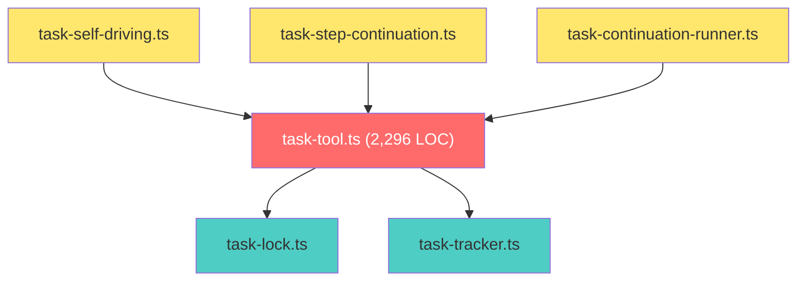
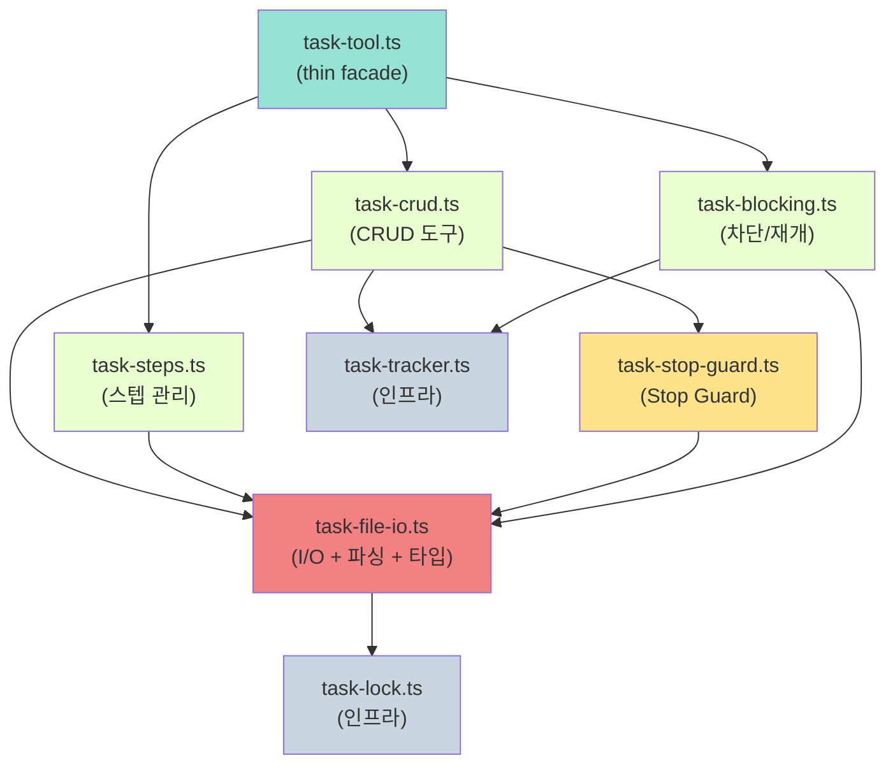

# task-tool.ts 모듈 분할 설계

> `src/agents/tools/task-tool.ts` (2,296 LOC) 를 책임 단위로 분리하여
> 독립적 테스트, 안전한 확장, 명확한 의존 관계를 확보한다.
>
> **작성일**: 2026-02-19
> **상태**: 설계 문서 (구현 전)
> **우선순위**: Medium
> **노력 추정**: L (1~2일)

---

## 1. 문제 정의

### 1.1 현재 상태

`src/agents/tools/task-tool.ts`는 코드베이스에서 가장 큰 단일 파일이다 (2,296 LOC). 이 파일 하나에 다음 책임이 모두 뒤섞여 있다.

| 책임 영역 | 대략적 위치 | 설명 |
|-----------|-------------|------|
| 데이터 모델 | 상단 | `TaskFile`, `TaskStep`, `TaskStatus` 정의 |
| 파일 I/O | 전반 | 마크다운 파싱, 직렬화, 파일 읽기/쓰기 |
| Task CRUD | 중반 | `task_start`, `task_update`, `task_complete`, `task_status` |
| Step 관리 | 중반 | 스텝 생성, 상태 업데이트, 순서 변경 |
| Stop Guard | ~1303번째 줄 | `task_complete` 호출 시 미완료 스텝 검증 |
| Task 차단 | 후반 | `task_block`, `task_resume` |
| 히스토리 | 후반 | 이벤트 추적 연동 |

### 1.2 구체적 문제점

**테스트 불가능성**: Stop Guard 로직을 단독으로 테스트하려면 파일 I/O, CRUD, 스텝 관리 코드를 모두 로드해야 한다. 단위 테스트가 사실상 통합 테스트가 된다.

**변경 위험**: 스텝 순서 변경 로직을 수정할 때 파일 파싱 코드와 같은 파일에 있어서 의도치 않은 충돌이 발생할 수 있다. 2,296줄 파일에서 diff를 리뷰하는 것 자체가 고통스럽다.

**확장 비용**: 새 task 기능(예: 태그, 마감일, 우선순위 변경)을 추가할 때마다 이미 복잡한 파일을 더 복잡하게 만든다. 어디에 코드를 넣어야 할지 명확하지 않다.

**인지 부하**: 새 팀원이 Stop Guard가 어떻게 동작하는지 이해하려면 2,296줄 전체를 훑어야 한다. 관련 코드가 파일 전반에 흩어져 있기 때문이다.

**의존성 불투명**: `task-lock.ts`, `task-tracker.ts`와의 의존 관계가 파일 전체에 걸쳐 암묵적으로 존재한다. 어떤 함수가 어떤 인프라에 의존하는지 한눈에 파악할 수 없다.

---

## 2. 설계 목표

분할 후 달성할 구체적 목표:

1. **각 모듈 300줄 이하** — 한 화면에 전체 맥락을 파악할 수 있는 크기
2. **Stop Guard 독립 테스트** — 파일 I/O 없이 순수 함수로 검증 가능
3. **외부 API 변경 없음** — `task-tool.ts`가 thin facade로 남아 기존 import 경로 유지
4. **명시적 의존 관계** — 각 모듈의 import가 그 모듈의 책임을 드러냄
5. **새 기능 추가 위치 명확** — 태그 기능이면 `task-crud.ts`, 스텝 검증이면 `task-steps.ts`

---

## 3. 현재 구현 분석

### 3.1 파일 구조 (현재)

```
src/agents/tools/
├── task-tool.ts          (2,296 LOC) ← 모든 것이 여기에
└── task-tool.test.ts     (기존 테스트)

src/infra/
├── task-lock.ts          (파일 잠금)
├── task-tracker.ts       (이벤트 추적)
├── task-self-driving.ts  (352 LOC, 자기주도 루프)
└── task-step-continuation.ts (205 LOC, 스텝 continuation)
```

### 3.2 핵심 데이터 모델

현재 `task-tool.ts` 상단에 정의된 타입들:

```typescript
// 현재 task-tool.ts 내부 (분산되어 있음)

export type TaskStatus =
  | "pending"
  | "in_progress"
  | "blocked"
  | "completed"
  | "cancelled";

export interface TaskStep {
  id: string;           // "s1", "s2", ...
  content: string;
  status: "pending" | "in_progress" | "done" | "skipped";
  order: number;
}

export interface TaskFile {
  id: string;
  status: TaskStatus;
  priority: "low" | "medium" | "high" | "critical";
  description: string;
  steps?: TaskStep[];
  outcome?: string;
  createdAt: string;
  updatedAt: string;
  blockedReason?: string;
  simple?: boolean;     // true면 Stop Guard 비활성화
}
```

### 3.3 Stop Guard 동작 (현재, ~1303번째 줄)

```typescript
// 현재 task-tool.ts 내부 (단순화)
// task_complete 핸들러 내부에서 호출됨

function checkStopGuard(task: TaskFile): { blocked: boolean; reason?: string } {
  // simple=true면 Guard 비활성화
  if (task.simple) return { blocked: false };

  const steps = task.steps ?? [];

  // 스텝이 없으면 최소 2개 요구
  if (steps.length < 2) {
    return {
      blocked: true,
      reason: `task_complete 거부: steps가 ${steps.length}개입니다. simple=false 태스크는 최소 2개의 steps가 필요합니다.`
    };
  }

  // 미완료 스텝 확인
  const incomplete = steps.filter(
    s => s.status !== "done" && s.status !== "skipped"
  );

  if (incomplete.length > 0) {
    return {
      blocked: true,
      reason: `task_complete 거부: ${incomplete.length}개의 미완료 steps가 있습니다: ${incomplete.map(s => s.id).join(", ")}`
    };
  }

  return { blocked: false };
}
```

### 3.4 파일 I/O 패턴 (현재)

마크다운 파일을 파싱하고 직렬화하는 코드가 파일 전반에 흩어져 있다. 대략적인 패턴:

```typescript
// 현재 task-tool.ts 내부 (단순화)

async function readTaskFile(taskId: string): Promise<TaskFile> {
  const filePath = getTaskFilePath(taskId);
  const lock = await acquireLock(filePath);  // task-lock.ts
  try {
    const content = await fs.readFile(filePath, "utf-8");
    return parseTaskMarkdown(content);
  } finally {
    await lock.release();
  }
}

async function writeTaskFile(task: TaskFile): Promise<void> {
  const filePath = getTaskFilePath(task.id);
  const lock = await acquireLock(filePath);
  try {
    const content = serializeTaskMarkdown(task);
    await fs.writeFile(filePath, content, "utf-8");
  } finally {
    await lock.release();
  }
}
```

### 3.5 의존 관계 그래프 (현재)



---

## 4. 상세 설계

### 4.1 목표 모듈 구조

```
src/agents/tools/
├── task-tool.ts              (thin facade, ~50 LOC)
├── task-tool.test.ts         (기존 테스트 유지)
├── task-file-io.ts           (파일 I/O + 파싱, ~250 LOC)
├── task-file-io.test.ts      (신규)
├── task-crud.ts              (CRUD 도구 구현, ~300 LOC)
├── task-crud.test.ts         (신규)
├── task-steps.ts             (스텝 관리, ~200 LOC)
├── task-steps.test.ts        (신규)
├── task-stop-guard.ts        (Stop Guard 로직, ~80 LOC)
├── task-stop-guard.test.ts   (신규)
├── task-blocking.ts          (차단/재개, ~150 LOC)
└── task-blocking.test.ts     (신규)
```

### 4.2 TypeScript 인터페이스 정의

#### 공유 타입 (`task-file-io.ts`에 정의, 전체 모듈이 import)

```typescript
// src/agents/tools/task-file-io.ts

export type TaskStatus =
  | "pending"
  | "in_progress"
  | "blocked"
  | "completed"
  | "cancelled";

export type StepStatus = "pending" | "in_progress" | "done" | "skipped";

export type TaskPriority = "low" | "medium" | "high" | "critical";

export interface TaskStep {
  id: string;
  content: string;
  status: StepStatus;
  order: number;
  createdAt?: string;
  completedAt?: string;
}

export interface TaskFile {
  id: string;
  status: TaskStatus;
  priority: TaskPriority;
  description: string;
  steps?: TaskStep[];
  outcome?: string;
  createdAt: string;
  updatedAt: string;
  blockedReason?: string;
  blockedBy?: string;       // 차단한 에이전트 ID
  simple?: boolean;
  tags?: string[];          // 미래 확장용
}

// 파일 I/O 결과 타입
export interface TaskReadResult {
  task: TaskFile;
  filePath: string;
}

export interface TaskWriteOptions {
  skipLock?: boolean;       // 이미 락을 보유한 경우
}
```

#### Stop Guard 인터페이스 (`task-stop-guard.ts`)

```typescript
// src/agents/tools/task-stop-guard.ts

import type { TaskFile } from "./task-file-io.js";

export interface StopGuardResult {
  blocked: boolean;
  reason?: string;
  incompleteSteps?: string[];   // 미완료 스텝 ID 목록
  missingStepCount?: number;    // 스텝 부족 시 필요한 최소 개수
}

export interface StopGuardOptions {
  minSteps?: number;            // 기본값: 2
  allowSkipped?: boolean;       // skipped를 완료로 간주할지 (기본: true)
}

// 핵심 함수 — 순수 함수, 부작용 없음
export function checkStopGuard(
  task: TaskFile,
  options?: StopGuardOptions
): StopGuardResult;

// 에러 메시지 포맷터
export function formatStopGuardError(result: StopGuardResult): string;
```

#### CRUD 도구 인터페이스 (`task-crud.ts`)

```typescript
// src/agents/tools/task-crud.ts

import type { TaskFile, TaskPriority } from "./task-file-io.js";

export interface TaskStartInput {
  description: string;
  priority?: TaskPriority;
  simple?: boolean;
  initialSteps?: string[];    // 시작 시 스텝 목록 (선택)
}

export interface TaskUpdateInput {
  taskId: string;
  description?: string;
  priority?: TaskPriority;
  outcome?: string;
  appendProgress?: string;    // 진행 상황 추가
}

export interface TaskCompleteInput {
  taskId: string;
  outcome: string;
  force?: boolean;            // Stop Guard 우회 (관리자용)
}

export interface TaskStatusInput {
  taskId?: string;            // 없으면 전체 목록
  includeCompleted?: boolean;
}

// 각 도구 핸들러 시그니처
export type TaskStartHandler = (input: TaskStartInput) => Promise<string>;
export type TaskUpdateHandler = (input: TaskUpdateInput) => Promise<string>;
export type TaskCompleteHandler = (input: TaskCompleteInput) => Promise<string>;
export type TaskStatusHandler = (input: TaskStatusInput) => Promise<string>;
```

#### 스텝 관리 인터페이스 (`task-steps.ts`)

```typescript
// src/agents/tools/task-steps.ts

import type { TaskFile, TaskStep, StepStatus } from "./task-file-io.js";

export interface AddStepsInput {
  taskId: string;
  steps: string[];            // 스텝 내용 목록
  insertAfter?: string;       // 특정 스텝 뒤에 삽입 (없으면 끝에 추가)
}

export interface UpdateStepInput {
  taskId: string;
  stepId: string;
  status: StepStatus;
  note?: string;              // 완료/스킵 시 메모
}

export interface ReorderStepsInput {
  taskId: string;
  stepIds: string[];          // 새 순서로 정렬된 스텝 ID 배열
}

// 스텝 생성 헬퍼
export function createStep(content: string, order: number): TaskStep;

// 스텝 유효성 검사
export function validateStepTransition(
  current: StepStatus,
  next: StepStatus
): { valid: boolean; reason?: string };

// 다음 실행할 스텝 찾기
export function findNextPendingStep(steps: TaskStep[]): TaskStep | undefined;
```

#### 차단 관리 인터페이스 (`task-blocking.ts`)

```typescript
// src/agents/tools/task-blocking.ts

export interface TaskBlockInput {
  taskId: string;
  reason: string;
  blockedBy?: string;         // 차단한 에이전트 ID
  expectedResolutionHint?: string;
}

export interface TaskResumeInput {
  taskId: string;
  resumeNote?: string;        // 재개 이유/맥락
}

export interface BlockingState {
  isBlocked: boolean;
  reason?: string;
  blockedAt?: string;
  blockedBy?: string;
}
```

### 4.3 모듈 의존 관계 (목표)



### 4.4 Facade 패턴 (task-tool.ts)

분할 후 `task-tool.ts`는 단순히 re-export만 담당한다:

```typescript
// src/agents/tools/task-tool.ts (분할 후, ~50 LOC)

// 타입 re-export (기존 import 경로 유지)
export type {
  TaskFile,
  TaskStep,
  TaskStatus,
  StepStatus,
  TaskPriority,
} from "./task-file-io.js";

// 도구 핸들러 re-export
export { createTaskStartTool } from "./task-crud.js";
export { createTaskUpdateTool } from "./task-crud.js";
export { createTaskCompleteTool } from "./task-crud.js";
export { createTaskStatusTool } from "./task-crud.js";
export { createAddStepsTool } from "./task-steps.js";
export { createUpdateStepTool } from "./task-steps.js";
export { createReorderStepsTool } from "./task-steps.js";
export { createTaskBlockTool } from "./task-blocking.js";
export { createTaskResumeTool } from "./task-blocking.js";

// 도구 등록 함수 (기존 API 유지)
export function registerTaskTools(registry: ToolRegistry): void {
  // 각 모듈에서 가져온 도구들을 등록
}
```

---

## 5. 구현 계획

### Phase 1: 타입 + 파일 I/O 분리 (2~3시간)

**목표**: 데이터 모델과 파일 읽기/쓰기를 독립 모듈로 추출

1. `task-file-io.ts` 파일 생성
   - `TaskFile`, `TaskStep`, `TaskStatus` 등 모든 타입 이동
   - `readTaskFile()`, `writeTaskFile()` 함수 이동
   - 마크다운 파싱/직렬화 함수 이동 (`parseTaskMarkdown`, `serializeTaskMarkdown`)
   - `task-lock.ts` 의존성은 이 파일에만 집중

2. `task-file-io.test.ts` 작성
   - 마크다운 파싱 라운드트립 테스트
   - 스텝 포함/미포함 파일 파싱 테스트
   - 잘못된 형식 처리 테스트

3. `task-tool.ts`에서 타입/함수를 `task-file-io.ts`로 교체
   - 기존 테스트가 여전히 통과하는지 확인

### Phase 2: Stop Guard 분리 (1~2시간)

**목표**: Stop Guard를 순수 함수로 추출하여 독립 테스트 가능하게

1. `task-stop-guard.ts` 파일 생성
   - `checkStopGuard()` 순수 함수로 추출
   - `formatStopGuardError()` 헬퍼 추가
   - 외부 의존성 없음 (파일 I/O 타입만 import)

2. `task-stop-guard.test.ts` 작성
   - `simple=true` 케이스 (Guard 비활성화)
   - 스텝 0개, 1개, 2개 케이스
   - 미완료 스텝 있는 케이스
   - 모두 `done`/`skipped`인 케이스
   - 경계값 테스트 (minSteps 옵션)

3. `task-tool.ts`에서 Stop Guard 로직을 `task-stop-guard.ts`로 교체

### Phase 3: 스텝 관리 분리 (2~3시간)

**목표**: 스텝 CRUD 로직을 독립 모듈로 추출

1. `task-steps.ts` 파일 생성
   - `createStep()`, `validateStepTransition()`, `findNextPendingStep()` 이동
   - `add_steps`, `update_step`, `reorder_steps` 도구 핸들러 이동
   - `task-file-io.ts`만 의존

2. `task-steps.test.ts` 작성
   - 스텝 생성 및 ID 자동 할당 테스트
   - 상태 전환 유효성 테스트 (`pending → in_progress → done`)
   - 잘못된 전환 거부 테스트 (`done → pending`)
   - 순서 변경 테스트

3. `task-tool.ts`에서 스텝 관련 코드를 `task-steps.ts`로 교체

### Phase 4: CRUD + 차단 분리 (3~4시간)

**목표**: 나머지 도구 핸들러를 각 모듈로 분리

1. `task-blocking.ts` 파일 생성
   - `task_block`, `task_resume` 핸들러 이동
   - `task-tracker.ts` 연동 코드 포함

2. `task-crud.ts` 파일 생성
   - `task_start`, `task_update`, `task_complete`, `task_status` 핸들러 이동
   - `task-stop-guard.ts` 호출 포함
   - `task-tracker.ts` 연동 코드 포함

3. 각 모듈 테스트 작성

### Phase 5: Facade 정리 + 검증 (1시간)

1. `task-tool.ts`를 thin facade로 정리
2. 전체 테스트 실행 (`pnpm test`)
3. 기존 `task-tool.test.ts` 모두 통과 확인
4. 빌드 확인 (`pnpm build`)

---

## 6. 영향 받는 파일

| 파일 | 변경 유형 | 설명 |
|------|-----------|------|
| `src/agents/tools/task-tool.ts` | 대폭 축소 | 2,296 LOC → ~50 LOC (thin facade) |
| `src/agents/tools/task-file-io.ts` | 신규 생성 | 타입 + 파일 I/O (~250 LOC) |
| `src/agents/tools/task-file-io.test.ts` | 신규 생성 | 파일 I/O 단위 테스트 |
| `src/agents/tools/task-crud.ts` | 신규 생성 | CRUD 도구 핸들러 (~300 LOC) |
| `src/agents/tools/task-crud.test.ts` | 신규 생성 | CRUD 단위 테스트 |
| `src/agents/tools/task-steps.ts` | 신규 생성 | 스텝 관리 (~200 LOC) |
| `src/agents/tools/task-steps.test.ts` | 신규 생성 | 스텝 관리 단위 테스트 |
| `src/agents/tools/task-stop-guard.ts` | 신규 생성 | Stop Guard 순수 함수 (~80 LOC) |
| `src/agents/tools/task-stop-guard.test.ts` | 신규 생성 | Stop Guard 단위 테스트 |
| `src/agents/tools/task-blocking.ts` | 신규 생성 | 차단/재개 (~150 LOC) |
| `src/agents/tools/task-blocking.test.ts` | 신규 생성 | 차단/재개 단위 테스트 |
| `src/agents/tools/task-tool.test.ts` | 유지 | 기존 테스트 — 변경 없이 통과해야 함 |
| `src/infra/task-self-driving.ts` | import 경로 수정 | `task-tool.ts` import 유지 (facade 통해) |
| `src/infra/task-step-continuation.ts` | import 경로 수정 | `task-tool.ts` import 유지 (facade 통해) |
| `src/infra/task-continuation-runner.ts` | import 경로 수정 | `task-tool.ts` import 유지 (facade 통해) |

---

## 7. 테스트 전략

### 7.1 Stop Guard 단위 테스트 (최우선)

Stop Guard는 현재 테스트하기 가장 어려운 부분이다. 분리 후 다음을 검증한다:

```typescript
// src/agents/tools/task-stop-guard.test.ts

describe("checkStopGuard", () => {
  it("simple=true면 항상 통과", () => {
    const task = makeTask({ simple: true, steps: [] });
    expect(checkStopGuard(task).blocked).toBe(false);
  });

  it("스텝 0개면 차단 (최소 2개 필요)", () => {
    const task = makeTask({ simple: false, steps: [] });
    const result = checkStopGuard(task);
    expect(result.blocked).toBe(true);
    expect(result.missingStepCount).toBe(2);
  });

  it("스텝 1개면 차단", () => {
    const task = makeTask({ simple: false, steps: [makeStep("done")] });
    expect(checkStopGuard(task).blocked).toBe(true);
  });

  it("스텝 2개 모두 done이면 통과", () => {
    const task = makeTask({
      simple: false,
      steps: [makeStep("done"), makeStep("done")]
    });
    expect(checkStopGuard(task).blocked).toBe(false);
  });

  it("미완료 스텝 있으면 차단 + ID 목록 반환", () => {
    const task = makeTask({
      simple: false,
      steps: [
        makeStep("done", "s1"),
        makeStep("in_progress", "s2"),
        makeStep("pending", "s3"),
      ]
    });
    const result = checkStopGuard(task);
    expect(result.blocked).toBe(true);
    expect(result.incompleteSteps).toEqual(["s2", "s3"]);
  });

  it("skipped는 완료로 간주", () => {
    const task = makeTask({
      simple: false,
      steps: [makeStep("done"), makeStep("skipped")]
    });
    expect(checkStopGuard(task).blocked).toBe(false);
  });
});
```

### 7.2 파일 I/O 라운드트립 테스트

```typescript
// src/agents/tools/task-file-io.test.ts

describe("parseTaskMarkdown / serializeTaskMarkdown", () => {
  it("스텝 없는 태스크 라운드트립", () => {
    const original = makeTaskFile({ steps: undefined });
    const serialized = serializeTaskMarkdown(original);
    const parsed = parseTaskMarkdown(serialized);
    expect(parsed).toEqual(original);
  });

  it("스텝 있는 태스크 라운드트립", () => {
    const original = makeTaskFile({
      steps: [
        { id: "s1", content: "첫 번째 단계", status: "done", order: 1 },
        { id: "s2", content: "두 번째 단계", status: "pending", order: 2 },
      ]
    });
    const serialized = serializeTaskMarkdown(original);
    const parsed = parseTaskMarkdown(serialized);
    expect(parsed.steps).toHaveLength(2);
    expect(parsed.steps![0].status).toBe("done");
  });

  it("잘못된 마크다운 형식 처리", () => {
    expect(() => parseTaskMarkdown("# 잘못된 형식")).toThrow();
  });
});
```

### 7.3 기존 테스트 회귀 방지

분할 전후로 `task-tool.test.ts`의 모든 테스트가 통과해야 한다. 이것이 외부 API 변경 없음을 보장하는 핵심 검증이다.

```bash
# 분할 전 기준선 확인
pnpm test src/agents/tools/task-tool.test.ts

# 각 Phase 완료 후 재확인
pnpm test src/agents/tools/
```

### 7.4 커버리지 목표

| 모듈 | 목표 커버리지 |
|------|--------------|
| `task-stop-guard.ts` | 100% (순수 함수, 분기 적음) |
| `task-file-io.ts` | 90%+ (파싱 엣지 케이스 포함) |
| `task-steps.ts` | 85%+ |
| `task-crud.ts` | 80%+ |
| `task-blocking.ts` | 80%+ |

---

## 8. 위험 평가

### 8.1 마크다운 파싱 회귀

**위험**: 파싱 코드를 이동하면서 미묘한 동작 차이가 생길 수 있다.

**완화**: Phase 1에서 라운드트립 테스트를 먼저 작성하고, 이동 전후로 동일한 결과를 확인한다. 실제 task 파일 샘플을 테스트 픽스처로 사용한다.

**심각도**: Medium

### 8.2 파일 잠금 경쟁 조건

**위험**: 파일 I/O를 분리하면서 잠금 획득/해제 순서가 바뀔 수 있다.

**완화**: `task-lock.ts` 의존성을 `task-file-io.ts`에만 집중시킨다. 다른 모듈은 파일 I/O 함수를 통해서만 파일에 접근한다. 잠금 로직은 이동하지 않고 래핑만 한다.

**심각도**: Medium

### 8.3 Circular Import

**위험**: 모듈 간 순환 의존이 생길 수 있다 (예: `task-crud.ts` ↔ `task-steps.ts`).

**완화**: 의존 관계 그래프를 명시적으로 설계하고 (섹션 4.3 참조), 공유 타입은 모두 `task-file-io.ts`에 집중시킨다. `task-crud.ts`와 `task-steps.ts`는 서로 직접 import하지 않는다.

**심각도**: Low (설계 단계에서 방지 가능)

### 8.4 외부 import 경로 깨짐

**위험**: `task-self-driving.ts`, `task-continuation-runner.ts` 등이 `task-tool.ts`에서 직접 내부 함수를 import하고 있을 수 있다.

**완화**: 분할 전에 `grep -r "from.*task-tool"` 로 모든 import를 확인한다. Facade가 모든 공개 API를 re-export하므로 경로 변경 없이 동작한다.

**심각도**: Low

---

## 9. 의존성

### 9.1 선행 조건

이 개선안은 독립적으로 실행 가능하다. 다른 개선안에 의존하지 않는다.

### 9.2 후행 영향

- **개선안 #4 (계속실행 상태머신)**: `task-continuation-runner.ts`가 `task-tool.ts`를 import한다. 이 분할이 완료되면 #4 구현 시 더 명확한 의존 관계를 갖게 된다.
- **미래 task 기능 추가**: 분할 후에는 새 기능을 적절한 모듈에 추가하기 쉬워진다.

### 9.3 관련 파일

```
src/infra/task-lock.ts          — 변경 없음 (task-file-io.ts가 사용)
src/infra/task-tracker.ts       — 변경 없음 (task-crud.ts, task-blocking.ts가 사용)
src/infra/task-self-driving.ts  — import 경로 유지 (facade 통해)
src/infra/task-step-continuation.ts — import 경로 유지 (facade 통해)
```

---

## 10. 노력 추정

| 작업 | 추정 시간 | 비고 |
|------|-----------|------|
| Phase 1: 타입 + 파일 I/O 분리 | 2~3시간 | 가장 기초적인 작업 |
| Phase 2: Stop Guard 분리 | 1~2시간 | 순수 함수라 비교적 쉬움 |
| Phase 3: 스텝 관리 분리 | 2~3시간 | 스텝 관련 코드 파악 필요 |
| Phase 4: CRUD + 차단 분리 | 3~4시간 | 가장 많은 코드 이동 |
| Phase 5: Facade 정리 + 검증 | 1시간 | 테스트 실행 + 빌드 확인 |
| **합계** | **9~13시간** | 1~2일 작업 |

### 10.1 위험 버퍼

마크다운 파싱 회귀나 예상치 못한 의존성 발견 시 +2~4시간 추가 가능. 전체 추정: **최대 2일**.

---

## 부록: 분할 전 검증 체크리스트

분할 작업 시작 전 확인해야 할 사항:

```bash
# 1. 현재 테스트 기준선 확인
pnpm test src/agents/tools/task-tool.test.ts

# 2. 모든 import 경로 확인
grep -r "from.*task-tool" src/ --include="*.ts"

# 3. 파일 크기 확인
wc -l src/agents/tools/task-tool.ts

# 4. 빌드 기준선 확인
pnpm build
```
