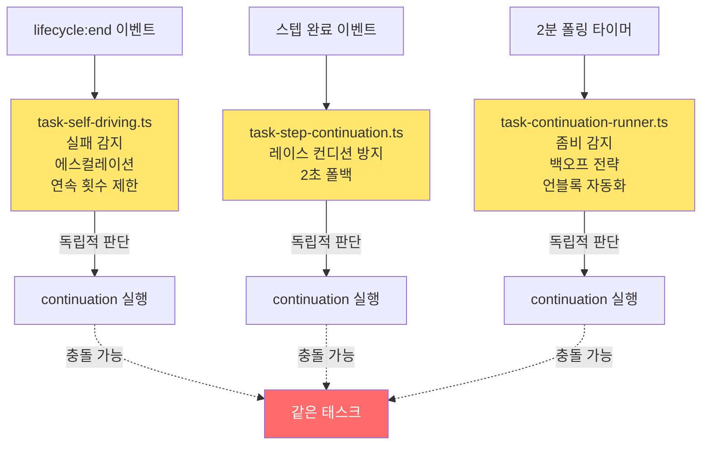
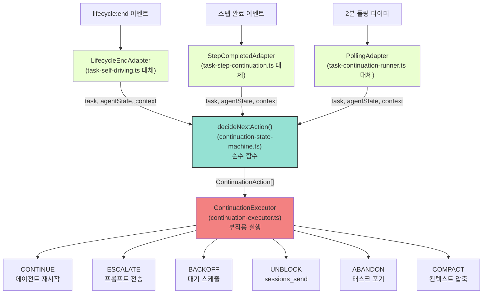

# 계속실행 상태머신 리팩토링 설계

> `task-continuation-runner.ts` (1,407 LOC), `task-self-driving.ts` (352 LOC),
> `task-step-continuation.ts` (205 LOC) 에 분산된 결정 로직을 단일 결정 함수로 통합한다.
>
> **작성일**: 2026-02-19
> **상태**: 설계 문서 (구현 전)
> **우선순위**: High
> **노력 추정**: XL (3일 이상)

---

## 1. 문제 정의

### 1.1 현재 상태

계속실행(continuation) 결정 로직이 세 개의 파일에 분산되어 있다:

| 파일 | LOC | 역할 | 트리거 방식 |
|------|-----|------|-------------|
| `src/infra/task-continuation-runner.ts` | 1,407 | 폴링 기반 메인 루프, 좀비 감지, 백오프 | 2분 주기 폴링 |
| `src/infra/task-self-driving.ts` | 352 | 자기주도 루프, 실패 감지, 에스컬레이션 | `lifecycle:end` 이벤트 후 0.5초 |
| `src/infra/task-step-continuation.ts` | 205 | 이벤트 기반 continuation, 레이스 컨디션 방지 | 스텝 완료 이벤트 + 2초 폴백 |

### 1.2 핵심 문제: "관례에 의한 정확성"

세 파일 각각이 "다음에 무엇을 해야 하는가"를 독립적으로 판단한다. 같은 태스크에 대해 세 곳이 동시에 다른 결론을 내릴 수 있다. 이 계약은 코드에 명시되지 않고 개발자의 관례와 암묵적 이해에 의존한다.

**구체적 증상**:

1. **백오프 로직 중복**: `rate_limit` 백오프가 `task-continuation-runner.ts`에 있지만, `task-self-driving.ts`도 실패 감지 후 자체 대기 로직을 갖는다. 두 로직이 충돌하면 어느 쪽이 이기는지 불명확하다.

2. **좀비 감지 단일 지점**: 24시간 TTL 좀비 감지가 `task-continuation-runner.ts`에만 있다. `task-self-driving.ts`가 좀비 태스크를 계속 재시도할 수 있다.

3. **언블록 자동화 분산**: 차단된 태스크에 `sessions_send`를 보내는 로직이 `task-continuation-runner.ts`에 있지만, 언제 보낼지 판단하는 조건이 세 파일에 걸쳐 있다.

4. **레이스 컨디션**: `task-step-continuation.ts`의 2초 폴백과 `task-continuation-runner.ts`의 2분 폴링이 같은 태스크를 동시에 처리할 수 있다.

5. **테스트 불가능**: "rate_limit 백오프 중인 태스크에 새 스텝이 완료되면 어떻게 되는가?" 같은 시나리오를 테스트하려면 세 파일을 모두 이해해야 한다.

---

## 2. 설계 목표

1. **단일 결정 함수**: `decideNextAction(task, agentState, context) → ContinuationAction[]` 하나가 모든 결정을 내린다
2. **순수 함수**: 결정 함수는 부작용이 없다. 입력만 보고 출력을 반환한다. 완전한 단위 테스트 가능
3. **명시적 액션 타입**: `CONTINUE`, `ESCALATE`, `BACKOFF`, `UNBLOCK`, `ABANDON`, `SKIP` — 가능한 결과가 타입으로 명시됨
4. **실행 레이어 분리**: 결정(순수)과 실행(부작용)이 명확히 분리됨
5. **세 트리거 통합**: 폴링, 이벤트, 자기주도 루프가 모두 같은 결정 함수를 호출함

---

## 3. 현재 구현 분석

### 3.1 task-continuation-runner.ts 핵심 로직

```typescript
// src/infra/task-continuation-runner.ts (단순화)

// 메인 루프 — 2분마다 실행
async function runContinuationLoop(): Promise<void> {
  while (true) {
    await sleep(POLL_INTERVAL_MS); // ~2분
    const tasks = await loadAllActiveTasks();

    for (const task of tasks) {
      await processSingleTask(task);
    }
  }
}

async function processSingleTask(task: TaskFile): Promise<void> {
  // 좀비 감지: 24시간 이상 업데이트 없음
  if (isZombie(task)) {
    await abandonTask(task, "24h TTL 초과");
    return;
  }

  // 백오프 전략별 처리
  const backoffState = getBackoffState(task.id);
  if (backoffState) {
    if (backoffState.type === "rate_limit") {
      // 지수 백오프: 1분 → 2분 → 4분 → ...
      if (!isBackoffExpired(backoffState)) return;
    } else if (backoffState.type === "billing") {
      // 청구 오류: 더 긴 대기 + 알림
      await notifyBillingError(task);
      return;
    } else if (backoffState.type === "context_overflow") {
      // 컨텍스트 초과: 컴팩션 시도
      await attemptCompaction(task);
      return;
    }
  }

  // 차단된 태스크: 언블록 요청 자동화
  if (task.status === "blocked") {
    await sendUnblockRequest(task);
    return;
  }

  // 정상 continuation
  await triggerContinuation(task);
}
```

### 3.2 task-self-driving.ts 핵심 로직

```typescript
// src/infra/task-self-driving.ts (단순화)

// lifecycle:end 이벤트 후 0.5초 대기
async function onLifecycleEnd(sessionId: string): Promise<void> {
  await sleep(500);

  const task = await getCurrentTask(sessionId);
  if (!task) return;

  // 실패 감지: 스텝 진행 없음
  if (isStalled(task)) {
    await sendEscalationPrompt(task);
    return;
  }

  // 최대 연속 실행 횟수 초과 (20회)
  if (consecutiveCount >= MAX_CONSECUTIVE) {
    await pauseSelfDriving(sessionId);
    return;
  }

  // 자기주도 continuation
  await triggerSelfDriving(sessionId);
}
```

### 3.3 task-step-continuation.ts 핵심 로직

```typescript
// src/infra/task-step-continuation.ts (단순화)

// 스텝 완료 이벤트 수신
async function onStepCompleted(stepId: string, taskId: string): Promise<void> {
  // 자기주도 grace period 확인
  if (isSelfDrivingActive(taskId)) {
    // 자기주도가 처리 중이면 스킵
    return;
  }

  // 2초 폴백 대기 (이벤트 누락 방지)
  await sleep(2000);

  // 다음 스텝이 있으면 continuation
  const nextStep = findNextPendingStep(taskId);
  if (nextStep) {
    await triggerStepContinuation(taskId, nextStep.id);
  }
}
```

### 3.4 현재 결정 흐름 (문제 있는 상태)



---

## 4. 상세 설계

### 4.1 핵심 타입 정의

```typescript
// src/infra/continuation-state-machine.ts

// 가능한 모든 액션 타입
export type ContinuationActionType =
  | "CONTINUE"          // 정상 continuation 실행
  | "ESCALATE"          // 에스컬레이션 프롬프트 전송
  | "BACKOFF"           // 대기 후 재시도
  | "UNBLOCK"           // 차단 해제 요청 전송
  | "ABANDON"           // 태스크 포기 (좀비 등)
  | "SKIP"              // 이번 사이클 스킵 (다음 트리거 대기)
  | "COMPACT";          // 컨텍스트 컴팩션 시도

// 각 액션의 상세 정보
export interface ContinuationAction {
  type: ContinuationActionType;
  reason: string;           // 사람이 읽을 수 있는 이유
  delayMs?: number;         // BACKOFF 시 대기 시간
  escalationPrompt?: string; // ESCALATE 시 전송할 프롬프트
  unblockTargetId?: string;  // UNBLOCK 시 대상 에이전트 ID
  metadata?: Record<string, unknown>;
}

// 결정 함수의 입력 컨텍스트
export interface ContinuationContext {
  trigger: "polling" | "lifecycle_end" | "step_completed";
  consecutiveSelfDriveCount: number;  // 연속 자기주도 횟수
  lastTriggerAt: Date;
  backoffHistory: BackoffEntry[];
  teamState?: TeamState;
}

// 에이전트 상태 스냅샷
export interface AgentState {
  sessionId: string;
  isRunning: boolean;
  lastActivityAt: Date;
  currentModel: string;
  contextTokens?: number;
  contextLimit?: number;
}

// 백오프 이력 항목
export interface BackoffEntry {
  type: "rate_limit" | "billing" | "timeout" | "context_overflow";
  startedAt: Date;
  expiresAt: Date;
  attemptCount: number;
}

// 팀 상태 (다중 에이전트 환경)
export interface TeamState {
  activeAgents: string[];
  blockedByMap: Record<string, string>;  // taskId → blockedBy agentId
}
```

### 4.2 핵심 결정 함수

```typescript
// src/infra/continuation-state-machine.ts

import type { TaskFile } from "../agents/tools/task-file-io.js";

// 핵심 결정 함수 — 순수 함수, 부작용 없음
export function decideNextAction(
  task: TaskFile,
  agentState: AgentState,
  context: ContinuationContext
): ContinuationAction[] {
  const actions: ContinuationAction[] = [];

  // 1. 좀비 감지 (최우선)
  const zombieCheck = checkZombie(task);
  if (zombieCheck.isZombie) {
    return [{ type: "ABANDON", reason: zombieCheck.reason! }];
  }

  // 2. 완료/취소된 태스크
  if (task.status === "completed" || task.status === "cancelled") {
    return [{ type: "SKIP", reason: `태스크 상태: ${task.status}` }];
  }

  // 3. 활성 백오프 확인
  const activeBackoff = findActiveBackoff(context.backoffHistory);
  if (activeBackoff) {
    const remaining = activeBackoff.expiresAt.getTime() - Date.now();
    if (remaining > 0) {
      return [{
        type: "SKIP",
        reason: `백오프 중: ${activeBackoff.type}, ${Math.ceil(remaining / 1000)}초 남음`
      }];
    }
  }

  // 4. 차단된 태스크
  if (task.status === "blocked") {
    const unblockAction = buildUnblockAction(task, context);
    return [unblockAction];
  }

  // 5. 에이전트 실행 중
  if (agentState.isRunning) {
    return [{ type: "SKIP", reason: "에이전트 실행 중, 중복 트리거 방지" }];
  }

  // 6. 컨텍스트 초과 위험
  if (isContextNearLimit(agentState)) {
    return [{ type: "COMPACT", reason: "컨텍스트 한계 근접" }];
  }

  // 7. 연속 실행 횟수 초과
  if (context.consecutiveSelfDriveCount >= MAX_CONSECUTIVE_DRIVES) {
    return [{
      type: "ESCALATE",
      reason: `연속 ${context.consecutiveSelfDriveCount}회 실행, 에스컬레이션 필요`,
      escalationPrompt: buildEscalationPrompt(task, context)
    }];
  }

  // 8. 스텝 진행 없음 (stalled)
  const stalledCheck = checkStalled(task, context);
  if (stalledCheck.isStalled) {
    return [{
      type: "ESCALATE",
      reason: stalledCheck.reason!,
      escalationPrompt: buildStalledPrompt(task)
    }];
  }

  // 9. 정상 continuation
  return [{ type: "CONTINUE", reason: "정상 continuation" }];
}

// 좀비 감지 — 24시간 TTL
function checkZombie(task: TaskFile): { isZombie: boolean; reason?: string } {
  const updatedAt = new Date(task.updatedAt);
  const ageMs = Date.now() - updatedAt.getTime();
  const ZOMBIE_TTL_MS = 24 * 60 * 60 * 1000;

  if (ageMs > ZOMBIE_TTL_MS) {
    const hours = Math.floor(ageMs / (60 * 60 * 1000));
    return {
      isZombie: true,
      reason: `마지막 업데이트로부터 ${hours}시간 경과 (TTL: 24시간)`
    };
  }

  return { isZombie: false };
}

// 컨텍스트 한계 근접 확인 (80% 이상)
function isContextNearLimit(agentState: AgentState): boolean {
  if (!agentState.contextTokens || !agentState.contextLimit) return false;
  return agentState.contextTokens / agentState.contextLimit > 0.8;
}

// 스텝 진행 없음 감지
function checkStalled(
  task: TaskFile,
  context: ContinuationContext
): { isStalled: boolean; reason?: string } {
  if (!task.steps || task.steps.length === 0) return { isStalled: false };

  const inProgressSteps = task.steps.filter(s => s.status === "in_progress");
  if (inProgressSteps.length === 0) return { isStalled: false };

  // 같은 스텝이 너무 오래 in_progress 상태
  const STALL_THRESHOLD_MS = 10 * 60 * 1000; // 10분
  const now = Date.now();

  for (const step of inProgressSteps) {
    if (!step.createdAt) continue;
    const stepAge = now - new Date(step.createdAt).getTime();
    if (stepAge > STALL_THRESHOLD_MS) {
      return {
        isStalled: true,
        reason: `스텝 ${step.id}가 ${Math.floor(stepAge / 60000)}분째 진행 중`
      };
    }
  }

  return { isStalled: false };
}
```

### 4.3 실행 레이어

```typescript
// src/infra/continuation-executor.ts

import { decideNextAction } from "./continuation-state-machine.js";
import type { ContinuationAction } from "./continuation-state-machine.js";

// 실행 레이어 — 부작용 담당
export class ContinuationExecutor {
  async execute(
    task: TaskFile,
    agentState: AgentState,
    context: ContinuationContext
  ): Promise<void> {
    const actions = decideNextAction(task, agentState, context);

    for (const action of actions) {
      await this.applyAction(task, agentState, action);
    }
  }

  private async applyAction(
    task: TaskFile,
    agentState: AgentState,
    action: ContinuationAction
  ): Promise<void> {
    switch (action.type) {
      case "CONTINUE":
        await this.triggerContinuation(task, agentState);
        break;

      case "ESCALATE":
        await this.sendEscalation(task, agentState, action.escalationPrompt!);
        break;

      case "BACKOFF":
        await this.scheduleBackoff(task, action.delayMs!);
        break;

      case "UNBLOCK":
        await this.sendUnblockRequest(task, action.unblockTargetId);
        break;

      case "ABANDON":
        await this.abandonTask(task, action.reason);
        break;

      case "COMPACT":
        await this.triggerCompaction(agentState.sessionId);
        break;

      case "SKIP":
        // 아무것도 하지 않음 — 로그만 기록
        this.logSkip(task, action.reason);
        break;
    }
  }
}
```

### 4.4 통합 아키텍처 (목표)



### 4.5 백오프 전략 통합

현재 세 파일에 분산된 백오프 로직을 단일 전략 맵으로 통합한다:

```typescript
// src/infra/continuation-state-machine.ts

export interface BackoffStrategy {
  initialDelayMs: number;
  maxDelayMs: number;
  multiplier: number;
  maxAttempts: number;
  onExhausted: "ABANDON" | "ESCALATE";
}

export const BACKOFF_STRATEGIES: Record<BackoffEntry["type"], BackoffStrategy> = {
  rate_limit: {
    initialDelayMs: 60_000,      // 1분
    maxDelayMs: 3_600_000,       // 1시간
    multiplier: 2,
    maxAttempts: 8,
    onExhausted: "ESCALATE",
  },
  billing: {
    initialDelayMs: 300_000,     // 5분
    maxDelayMs: 86_400_000,      // 24시간
    multiplier: 3,
    maxAttempts: 5,
    onExhausted: "ABANDON",
  },
  timeout: {
    initialDelayMs: 30_000,      // 30초
    maxDelayMs: 600_000,         // 10분
    multiplier: 1.5,
    maxAttempts: 10,
    onExhausted: "ESCALATE",
  },
  context_overflow: {
    initialDelayMs: 0,           // 즉시 컴팩션 시도
    maxDelayMs: 0,
    multiplier: 1,
    maxAttempts: 3,
    onExhausted: "ESCALATE",
  },
};

// 백오프 계산 — 순수 함수
export function calculateBackoffDelay(
  type: BackoffEntry["type"],
  attemptCount: number
): number {
  const strategy = BACKOFF_STRATEGIES[type];
  const delay = strategy.initialDelayMs * Math.pow(strategy.multiplier, attemptCount);
  return Math.min(delay, strategy.maxDelayMs);
}
```

### 4.6 어댑터 패턴

각 트리거 소스는 어댑터를 통해 컨텍스트를 구성하고 결정 함수를 호출한다:

```typescript
// src/infra/lifecycle-end-adapter.ts

export class LifecycleEndAdapter {
  constructor(
    private executor: ContinuationExecutor,
    private stateStore: ContinuationStateStore
  ) {}

  async onLifecycleEnd(sessionId: string): Promise<void> {
    // 0.5초 대기 (기존 동작 유지)
    await sleep(500);

    const task = await this.stateStore.getCurrentTask(sessionId);
    if (!task) return;

    const agentState = await this.stateStore.getAgentState(sessionId);
    const context = await this.stateStore.buildContext(task.id, "lifecycle_end");

    await this.executor.execute(task, agentState, context);
  }
}

// src/infra/step-completed-adapter.ts

export class StepCompletedAdapter {
  async onStepCompleted(stepId: string, taskId: string): Promise<void> {
    // 2초 폴백 대기 (기존 동작 유지)
    await sleep(2000);

    const task = await this.stateStore.getTask(taskId);
    if (!task) return;

    const agentState = await this.stateStore.getAgentStateForTask(taskId);
    const context = await this.stateStore.buildContext(taskId, "step_completed");

    await this.executor.execute(task, agentState, context);
  }
}
```

---

## 5. 구현 계획

### Phase 1: 상태머신 코어 구현 (4~6시간)

**목표**: 순수 결정 함수와 타입 정의 완성

1. `src/infra/continuation-state-machine.ts` 파일 생성
   - 모든 타입 정의 (`ContinuationAction`, `ContinuationContext`, `AgentState` 등)
   - `decideNextAction()` 순수 함수 구현
   - 보조 함수들 (`checkZombie`, `checkStalled`, `isContextNearLimit` 등)
   - 백오프 전략 맵 (`BACKOFF_STRATEGIES`)

2. `src/infra/continuation-state-machine.test.ts` 작성
   - 모든 액션 타입에 대한 단위 테스트
   - 경계값 테스트 (TTL 경계, 연속 횟수 경계)
   - 복합 시나리오 테스트

3. 기존 코드 변경 없이 새 파일만 추가 (안전한 시작)

### Phase 2: 실행 레이어 구현 (3~4시간)

**목표**: 부작용을 담당하는 실행 레이어 구현

1. `src/infra/continuation-executor.ts` 파일 생성
   - `ContinuationExecutor` 클래스 구현
   - 각 액션 타입별 실행 메서드
   - 기존 `triggerContinuation`, `sendEscalation` 등 함수 래핑

2. `src/infra/continuation-state-store.ts` 파일 생성
   - 상태 조회 인터페이스 (`getTask`, `getAgentState`, `buildContext`)
   - 기존 상태 저장소 어댑터

3. 실행 레이어 통합 테스트 작성

### Phase 3: 어댑터 구현 (3~4시간)

**목표**: 세 트리거 소스를 새 코어에 연결

1. `src/infra/lifecycle-end-adapter.ts` 구현
   - `task-self-driving.ts`의 트리거 로직을 어댑터로 래핑
   - 기존 0.5초 대기 유지

2. `src/infra/step-completed-adapter.ts` 구현
   - `task-step-continuation.ts`의 트리거 로직을 어댑터로 래핑
   - 기존 2초 폴백 유지

3. `src/infra/polling-adapter.ts` 구현
   - `task-continuation-runner.ts`의 폴링 루프를 어댑터로 래핑
   - 기존 2분 주기 유지

### Phase 4: 기존 파일 교체 (4~6시간)

**목표**: 기존 세 파일의 결정 로직을 새 코어로 교체

1. `task-self-driving.ts` 리팩토링
   - 결정 로직 제거, `LifecycleEndAdapter` 호출로 교체
   - 파일 크기: 352 LOC → ~80 LOC

2. `task-step-continuation.ts` 리팩토링
   - 결정 로직 제거, `StepCompletedAdapter` 호출로 교체
   - 파일 크기: 205 LOC → ~60 LOC

3. `task-continuation-runner.ts` 리팩토링
   - 결정 로직 제거, `PollingAdapter` 호출로 교체
   - 파일 크기: 1,407 LOC → ~200 LOC

### Phase 5: 검증 + 정리 (2~3시간)

1. 전체 테스트 실행 (`pnpm test`)
2. 기존 동작과 동일한지 통합 테스트로 검증
3. 빌드 확인 (`pnpm build`)
4. 레이스 컨디션 시나리오 수동 검증

---

## 6. 영향 받는 파일

| 파일 | 변경 유형 | 변경 전 LOC | 변경 후 LOC |
|------|-----------|-------------|-------------|
| `src/infra/task-continuation-runner.ts` | 대폭 축소 | 1,407 | ~200 |
| `src/infra/task-self-driving.ts` | 대폭 축소 | 352 | ~80 |
| `src/infra/task-step-continuation.ts` | 대폭 축소 | 205 | ~60 |
| `src/infra/continuation-state-machine.ts` | 신규 생성 | 0 | ~350 |
| `src/infra/continuation-state-machine.test.ts` | 신규 생성 | 0 | ~400 |
| `src/infra/continuation-executor.ts` | 신규 생성 | 0 | ~200 |
| `src/infra/continuation-state-store.ts` | 신규 생성 | 0 | ~150 |
| `src/infra/lifecycle-end-adapter.ts` | 신규 생성 | 0 | ~80 |
| `src/infra/step-completed-adapter.ts` | 신규 생성 | 0 | ~60 |
| `src/infra/polling-adapter.ts` | 신규 생성 | 0 | ~80 |

---

## 7. 테스트 전략

### 7.1 결정 함수 단위 테스트 (핵심)

순수 함수이므로 모든 시나리오를 빠르게 테스트할 수 있다:

```typescript
// src/infra/continuation-state-machine.test.ts

describe("decideNextAction", () => {
  describe("좀비 감지", () => {
    it("24시간 이상 업데이트 없으면 ABANDON", () => {
      const task = makeTask({
        updatedAt: new Date(Date.now() - 25 * 60 * 60 * 1000).toISOString()
      });
      const actions = decideNextAction(task, makeAgentState(), makeContext());
      expect(actions[0].type).toBe("ABANDON");
    });

    it("23시간 59분이면 ABANDON 아님", () => {
      const task = makeTask({
        updatedAt: new Date(Date.now() - 23.99 * 60 * 60 * 1000).toISOString()
      });
      const actions = decideNextAction(task, makeAgentState(), makeContext());
      expect(actions[0].type).not.toBe("ABANDON");
    });
  });

  describe("백오프 중 스킵", () => {
    it("활성 rate_limit 백오프면 SKIP", () => {
      const context = makeContext({
        backoffHistory: [{
          type: "rate_limit",
          startedAt: new Date(),
          expiresAt: new Date(Date.now() + 60_000),
          attemptCount: 1,
        }]
      });
      const actions = decideNextAction(makeTask(), makeAgentState(), context);
      expect(actions[0].type).toBe("SKIP");
    });

    it("만료된 백오프는 스킵 안 함", () => {
      const context = makeContext({
        backoffHistory: [{
          type: "rate_limit",
          startedAt: new Date(Date.now() - 120_000),
          expiresAt: new Date(Date.now() - 60_000), // 이미 만료
          attemptCount: 1,
        }]
      });
      const actions = decideNextAction(makeTask(), makeAgentState(), context);
      expect(actions[0].type).not.toBe("SKIP");
    });
  });

  describe("차단된 태스크", () => {
    it("blocked 상태면 UNBLOCK", () => {
      const task = makeTask({ status: "blocked", blockedBy: "agent-eden" });
      const actions = decideNextAction(task, makeAgentState(), makeContext());
      expect(actions[0].type).toBe("UNBLOCK");
      expect(actions[0].unblockTargetId).toBe("agent-eden");
    });
  });

  describe("에이전트 실행 중", () => {
    it("에이전트 실행 중이면 SKIP (중복 방지)", () => {
      const agentState = makeAgentState({ isRunning: true });
      const actions = decideNextAction(makeTask(), agentState, makeContext());
      expect(actions[0].type).toBe("SKIP");
    });
  });

  describe("컨텍스트 초과", () => {
    it("컨텍스트 80% 이상이면 COMPACT", () => {
      const agentState = makeAgentState({
        contextTokens: 160_000,
        contextLimit: 200_000,
      });
      const actions = decideNextAction(makeTask(), agentState, makeContext());
      expect(actions[0].type).toBe("COMPACT");
    });
  });

  describe("연속 실행 초과", () => {
    it("20회 연속이면 ESCALATE", () => {
      const context = makeContext({ consecutiveSelfDriveCount: 20 });
      const actions = decideNextAction(makeTask(), makeAgentState(), context);
      expect(actions[0].type).toBe("ESCALATE");
    });
  });

  describe("정상 continuation", () => {
    it("모든 조건 정상이면 CONTINUE", () => {
      const actions = decideNextAction(
        makeTask({ status: "in_progress" }),
        makeAgentState({ isRunning: false }),
        makeContext({ consecutiveSelfDriveCount: 0 })
      );
      expect(actions[0].type).toBe("CONTINUE");
    });
  });
});
```

### 7.2 백오프 계산 테스트

```typescript
describe("calculateBackoffDelay", () => {
  it("rate_limit 첫 번째 시도: 1분", () => {
    expect(calculateBackoffDelay("rate_limit", 0)).toBe(60_000);
  });

  it("rate_limit 두 번째 시도: 2분", () => {
    expect(calculateBackoffDelay("rate_limit", 1)).toBe(120_000);
  });

  it("최대값 초과 시 최대값 반환", () => {
    expect(calculateBackoffDelay("rate_limit", 100)).toBe(3_600_000);
  });
});
```

### 7.3 통합 테스트 시나리오

기존 동작과 동일한지 검증하는 시나리오:

| 시나리오 | 기존 동작 | 새 동작 | 검증 방법 |
|----------|-----------|---------|-----------|
| 정상 태스크 + lifecycle:end | 0.5초 후 continuation | 동일 | 통합 테스트 |
| rate_limit 오류 후 재시도 | 지수 백오프 | 동일 | 단위 테스트 |
| 24시간 미업데이트 태스크 | ABANDON | 동일 | 단위 테스트 |
| 차단된 태스크 | sessions_send | 동일 | 통합 테스트 |
| 에이전트 실행 중 폴링 | 스킵 | 동일 | 단위 테스트 |
| 컨텍스트 80% 초과 | 컴팩션 | 동일 | 단위 테스트 |

---

## 8. 위험 평가

### 8.1 기존 동작 회귀 (최고 위험)

**위험**: 세 파일의 암묵적 상호작용이 새 코어에서 재현되지 않을 수 있다. 특히 레이스 컨디션 방지 로직이 미묘하게 다를 수 있다.

**완화**:
- Phase 1~2에서 기존 파일을 변경하지 않고 새 코어만 추가
- Phase 3에서 어댑터를 통해 점진적으로 연결
- 각 Phase마다 기존 테스트 전체 실행
- 프로덕션 배포 전 스테이징 환경에서 24시간 관찰

**심각도**: High

### 8.2 레이스 컨디션 악화

**위험**: 어댑터 레이어를 추가하면서 기존에 없던 레이스 컨디션이 생길 수 있다.

**완화**: `ContinuationExecutor`에 태스크별 뮤텍스를 추가한다. 같은 태스크에 대한 동시 실행을 방지한다.

```typescript
// continuation-executor.ts 내부
private taskLocks = new Map<string, Promise<void>>();

async execute(task: TaskFile, ...): Promise<void> {
  // 같은 태스크에 대한 동시 실행 방지
  const existing = this.taskLocks.get(task.id);
  if (existing) {
    await existing;
    return;
  }

  const execution = this._doExecute(task, ...);
  this.taskLocks.set(task.id, execution.finally(() => {
    this.taskLocks.delete(task.id);
  }));

  await execution;
}
```

**심각도**: Medium

### 8.3 상태 저장소 불일치

**위험**: `ContinuationStateStore`가 기존 상태를 올바르게 읽지 못할 수 있다. 특히 `consecutiveSelfDriveCount` 같은 인메모리 상태.

**완화**: Phase 2에서 상태 저장소를 기존 코드의 상태를 그대로 읽는 어댑터로 구현한다. 새 상태 저장 방식은 Phase 4 이후에 도입한다.

**심각도**: Medium

### 8.4 성능 저하

**위험**: 어댑터 레이어 추가로 각 트리거마다 추가 함수 호출이 발생한다.

**완화**: 결정 함수는 순수 함수이므로 오버헤드가 매우 작다 (마이크로초 단위). 실제 병목은 파일 I/O와 네트워크 호출이므로 무시 가능한 수준이다.

**심각도**: Low

---

## 9. 의존성

### 9.1 선행 조건

**개선안 #3 (task-tool.ts 모듈 분할)** 이 완료되면 이 작업이 더 쉬워진다. `task-file-io.ts`에서 타입을 import하면 의존 관계가 더 명확해진다. 하지만 #3 없이도 독립적으로 진행 가능하다.

### 9.2 후행 영향

이 리팩토링이 완료되면:
- 새 백오프 전략 추가가 `BACKOFF_STRATEGIES` 맵에 항목 하나 추가로 끝남
- 새 트리거 소스 추가가 어댑터 하나 추가로 끝남
- 결정 로직 버그 수정이 단위 테스트로 즉시 검증 가능

### 9.3 관련 파일

```
src/infra/task-lock.ts          — 변경 없음
src/infra/task-tracker.ts       — 변경 없음
src/agents/tools/task-tool.ts   — 변경 없음 (타입만 import)
```

---

## 10. 노력 추정

| 작업 | 추정 시간 | 비고 |
|------|-----------|------|
| Phase 1: 상태머신 코어 + 테스트 | 4~6시간 | 가장 중요한 작업 |
| Phase 2: 실행 레이어 + 상태 저장소 | 3~4시간 | 부작용 격리 |
| Phase 3: 어댑터 3개 구현 | 3~4시간 | 기존 로직 래핑 |
| Phase 4: 기존 파일 교체 | 4~6시간 | 가장 위험한 단계 |
| Phase 5: 검증 + 정리 | 2~3시간 | 통합 테스트 포함 |
| **합계** | **16~23시간** | 3~4일 작업 |

### 10.1 위험 버퍼

기존 동작 회귀 발견 시 +4~8시간 추가 가능. 전체 추정: **최대 4일**.

### 10.2 단계별 중단 가능성

각 Phase는 독립적으로 완료 가능하다. Phase 1~2만 완료해도 결정 로직이 명시적으로 문서화되고 테스트된다는 가치가 있다. Phase 3~4는 별도 PR로 진행 가능하다.

---

## 부록 A: 현재 코드 분석 체크리스트

리팩토링 시작 전 확인해야 할 사항:

```bash
# 1. 세 파일의 현재 상태 확인
wc -l src/infra/task-continuation-runner.ts
wc -l src/infra/task-self-driving.ts
wc -l src/infra/task-step-continuation.ts

# 2. 기존 테스트 기준선
pnpm test src/infra/

# 3. 세 파일 간 import 관계 확인
grep -n "import" src/infra/task-continuation-runner.ts
grep -n "import" src/infra/task-self-driving.ts
grep -n "import" src/infra/task-step-continuation.ts

# 4. 외부에서 세 파일을 import하는 곳 확인
grep -r "task-continuation-runner\|task-self-driving\|task-step-continuation" src/ --include="*.ts"
```

## 부록 B: 결정 함수 시나리오 매트릭스

| 태스크 상태 | 에이전트 상태 | 백오프 | 연속 횟수 | 결정 |
|-------------|---------------|--------|-----------|------|
| in_progress | 실행 중 | 없음 | 0 | SKIP |
| in_progress | 대기 중 | 없음 | 0 | CONTINUE |
| in_progress | 대기 중 | rate_limit 활성 | 0 | SKIP |
| in_progress | 대기 중 | rate_limit 만료 | 0 | CONTINUE |
| in_progress | 대기 중 | 없음 | 20 | ESCALATE |
| blocked | 대기 중 | 없음 | 0 | UNBLOCK |
| completed | 대기 중 | 없음 | 0 | SKIP |
| in_progress (24h+) | 대기 중 | 없음 | 0 | ABANDON |
| in_progress | 대기 중 (80%+ ctx) | 없음 | 0 | COMPACT |
