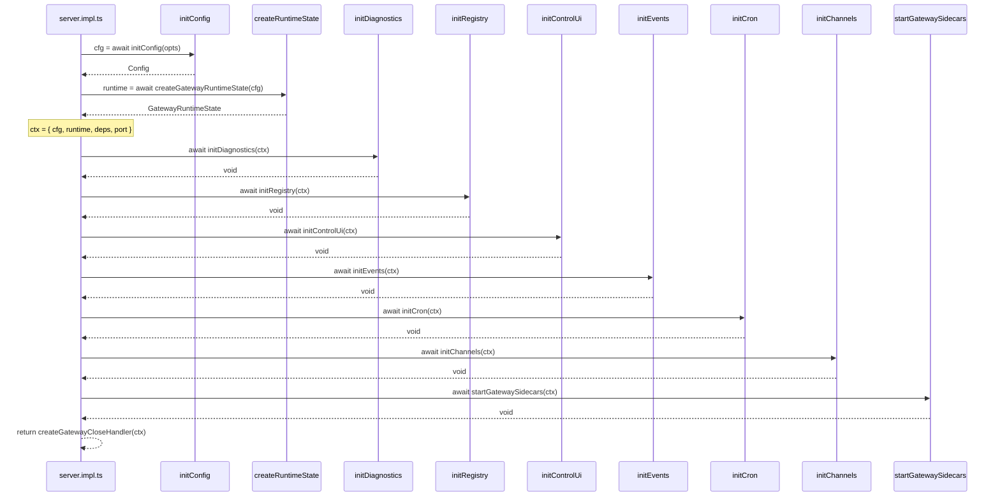

# Gateway 순수 조합 전환 (Pure Composition Root)

> **작성일**: 2026-02-19
> **상태**: 설계 문서
> **우선순위**: 중간 (Medium)
> **노력 추정**: L (1~2일)
> **관련 파일**: `src/gateway/server.impl.ts`, `src/gateway/server-startup.ts`, `src/gateway/server-methods/`

---

## 1. 문제 정의

### 1.1 현재 상태의 핵심 문제

`src/gateway/server.impl.ts`는 현재 두 가지 역할을 동시에 수행하고 있다.

1. **조합 루트(Composition Root)**: 모든 모듈을 import하고 순서대로 연결하는 배선 레이어
2. **초기화 로직 컨테이너**: 설정 마이그레이션, 채널 초기화, 이벤트 버스 설정, 헬스 체크 등 실제 도메인 로직

이 두 역할이 하나의 파일에 섞여 있어 다음 문제가 발생한다.

### 1.2 구체적 문제점

**임포트 폭발 (Import Explosion)**
- 현재 `server.impl.ts`는 80개 이상의 import 구문을 가진다
- 코드베이스 전체에서 import를 끌어오는 "임포트 자석(import magnet)" 역할
- 새 기능 추가 시 항상 이 파일을 수정해야 하므로 머지 충돌 빈도가 높다

**단일 책임 원칙 위반**
- 설정 파일 마이그레이션 로직이 서버 시작 함수 안에 인라인으로 존재
- 채널 초기화, 플러그인 로딩, 크론 서비스 시작이 모두 `startGatewayServer()` 함수 하나에 집중
- 737줄짜리 파일로, 어느 부분이 "배선"이고 어느 부분이 "로직"인지 구분하기 어렵다

**테스트 격리 불가**
- 특정 초기화 단계만 단독으로 테스트하려면 전체 `startGatewayServer()`를 실행해야 한다
- 단위 테스트에서 특정 init 모듈만 모킹하기 어렵다

**변경 파급 범위 과대**
- 채널 초기화 로직을 수정하면 gateway/runtime/plugins/infra 전체에 영향을 줄 수 있다
- 리그레션 위험이 높아 변경을 꺼리게 된다

---

## 2. 설계 목표

개선 후 달성할 구체적 목표는 다음과 같다.

| 목표 | 측정 기준 |
|------|-----------|
| `server.impl.ts` import 수 50% 감소 | 80개 → 40개 이하 |
| `startGatewayServer()` 함수 길이 단축 | 현재 ~600줄 → 100줄 이하 |
| 각 init 모듈 독립 테스트 가능 | 단위 테스트 커버리지 추가 가능 |
| 새 기능 추가 시 `server.impl.ts` 수정 불필요 | 새 `server-init-*.ts` 파일만 추가 |
| 초기화 순서 명시적 문서화 | 코드 자체가 순서를 표현 |

---

## 3. 현재 구현 분석

### 3.1 파일 구조 현황

```
src/gateway/
├── server.impl.ts          # 737줄, 80+ imports — 문제의 핵심
├── server-startup.ts       # 사이드카 시작 (부분 분리됨)
├── server-close.ts         # 종료 핸들러 (부분 분리됨)
├── server-chat.ts          # 채팅 이벤트 핸들러 (부분 분리됨)
├── server-methods/         # 메서드별 파일 (부분 분리됨)
│   ├── agent.ts
│   ├── chat.ts
│   ├── config.ts
│   └── ... (40+ 파일)
├── server-channels.ts      # 채널 매니저
├── server-plugins.ts       # 플러그인 로딩
├── server-cron.ts          # 크론 서비스
└── server-runtime-state.ts # 런타임 상태
```

### 3.2 `startGatewayServer()` 내부 초기화 단계 분석

현재 `startGatewayServer()` 함수는 다음 단계를 순서대로 실행한다.

```
1. 환경 변수 설정 (OPENCLAW_GATEWAY_PORT)
2. 설정 파일 읽기 + 레거시 마이그레이션
3. 플러그인 자동 활성화 처리
4. 진단 하트비트 시작
5. 재시작 정책 설정
6. 서브에이전트 레지스트리 초기화
7. 플러그인 로딩
8. 채널 플러그인 메서드 수집
9. 런타임 설정 해석
10. Auth Rate Limiter 생성
11. Control UI 에셋 해석
12. 위저드 세션 트래커 생성
13. 기본 deps 생성
14. TLS 런타임 로딩
15. Gateway 런타임 상태 생성 (HTTP/WS 서버)
16. 채널 매니저 생성
17. 노드 레지스트리 생성
18. 노드 구독 매니저 생성
19. Exec Approval 매니저 생성
20. 이벤트 핸들러 등록 (agent events, heartbeat)
21. WS 핸들러 연결
22. 메서드 핸들러 등록
23. 크론 서비스 시작
24. 채널 시작
25. 사이드카 시작 (Tailscale, Discovery, 헬스 모니터 등)
26. 온보딩 위저드 실행 (필요시)
27. 시작 로그 출력
28. close 핸들러 반환
```

이 28단계가 모두 하나의 함수 안에 인라인으로 존재한다.

### 3.3 이미 분리된 부분 vs 아직 남은 부분

**분리 완료**:
- `server-startup.ts` — `startGatewaySidecars()`: Tailscale, Discovery, 헬스 모니터
- `server-close.ts` — `createGatewayCloseHandler()`: 종료 로직
- `server-chat.ts` — `createAgentEventHandler()`: 채팅 이벤트
- `server-methods/` — 각 WS 메서드 핸들러

**아직 `server.impl.ts`에 남은 초기화 로직**:
- 설정 마이그레이션 (단계 2)
- 플러그인 자동 활성화 (단계 3)
- 진단 하트비트 (단계 4)
- 재시작 정책 (단계 5)
- 서브에이전트 레지스트리 (단계 6)
- Control UI 에셋 해석 (단계 11)
- 이벤트 핸들러 등록 (단계 20)
- 크론 서비스 시작 (단계 23)

---

## 4. 상세 설계

### 4.1 핵심 인터페이스

각 init 모듈이 따를 표준 인터페이스를 정의한다.

```typescript
// src/gateway/server-init-types.ts

import type { GatewayServer } from "./server.impl.js";
import type { GatewayRuntimeState } from "./server-runtime-state.js";
import type { CliDeps } from "../cli/deps.js";
import type { Config } from "../config/config.js";

/**
 * 모든 init 모듈이 받는 공통 컨텍스트.
 * 각 init 함수는 이 타입을 받아 서버에 기능을 등록한다.
 */
export type GatewayInitContext = {
  /** 현재 로드된 설정 */
  cfg: Config;
  /** 런타임 상태 (HTTP/WS 서버, 클라이언트 맵 등) */
  runtime: GatewayRuntimeState;
  /** CLI 기본 의존성 */
  deps: CliDeps;
  /** 서버 포트 */
  port: number;
};

/**
 * 각 init 모듈이 구현하는 함수 시그니처.
 * 동기 또는 비동기 모두 허용.
 */
export type GatewayInitFn = (ctx: GatewayInitContext) => void | Promise<void>;

/**
 * init 모듈이 반환할 수 있는 cleanup 핸들러.
 * 서버 종료 시 역순으로 호출된다.
 */
export type GatewayInitResult = {
  cleanup?: () => Promise<void>;
};

/**
 * cleanup을 반환하는 init 함수 시그니처.
 */
export type GatewayInitFnWithCleanup = (
  ctx: GatewayInitContext,
) => GatewayInitResult | Promise<GatewayInitResult>;
```

### 4.2 새 파일 구조

```
src/gateway/
├── server.impl.ts              # 얇은 조합 루트 (100줄 이하)
├── server-init-types.ts        # GatewayInitContext, GatewayInitFn 타입 정의
├── server-init-config.ts       # 설정 마이그레이션 + 플러그인 자동 활성화
├── server-init-diagnostics.ts  # 진단 하트비트 + 재시작 정책
├── server-init-registry.ts     # 서브에이전트 레지스트리 + 노드 레지스트리
├── server-init-control-ui.ts   # Control UI 에셋 해석
├── server-init-events.ts       # 이벤트 핸들러 등록 (agent events, heartbeat)
├── server-init-cron.ts         # 크론 서비스 시작
├── server-init-channels.ts     # 채널 매니저 + 채널 시작
├── server-startup.ts           # (기존) 사이드카 시작
├── server-close.ts             # (기존) 종료 핸들러
└── server-methods/             # (기존) 메서드 핸들러
```

### 4.3 목표 `server.impl.ts` 구조

```typescript
// src/gateway/server.impl.ts (개선 후)
// 이 파일은 오직 "배선"만 담당한다. 도메인 로직 없음.

import { createGatewayRuntimeState } from "./server-runtime-state.js";
import { initConfig } from "./server-init-config.js";
import { initDiagnostics } from "./server-init-diagnostics.js";
import { initRegistry } from "./server-init-registry.js";
import { initControlUi } from "./server-init-control-ui.js";
import { initEvents } from "./server-init-events.js";
import { initCron } from "./server-init-cron.js";
import { initChannels } from "./server-init-channels.js";
import { startGatewaySidecars } from "./server-startup.js";
import { createGatewayCloseHandler } from "./server-close.js";
import { createDefaultDeps } from "../cli/deps.js";
import type { GatewayInitContext } from "./server-init-types.js";

export async function startGatewayServer(
  port = 18789,
  opts: GatewayServerOptions = {},
): Promise<GatewayServer> {
  // 1. 설정 초기화 (마이그레이션 포함)
  const cfg = await initConfig(opts);

  // 2. 런타임 상태 생성 (HTTP/WS 서버)
  const runtime = await createGatewayRuntimeState({ cfg, port, ...opts });

  const deps = createDefaultDeps();
  const ctx: GatewayInitContext = { cfg, runtime, deps, port };

  // 3. 각 init 모듈을 순서대로 실행
  await initDiagnostics(ctx);
  await initRegistry(ctx);
  await initControlUi(ctx);
  await initEvents(ctx);
  await initCron(ctx);
  await initChannels(ctx);
  await startGatewaySidecars(ctx);

  // 4. close 핸들러 반환
  return createGatewayCloseHandler(ctx);
}
```

### 4.4 각 init 모듈 예시

**`server-init-config.ts`**:
```typescript
// src/gateway/server-init-config.ts

import {
  isNixMode,
  loadConfig,
  migrateLegacyConfig,
  readConfigFileSnapshot,
  writeConfigFile,
} from "../config/config.js";
import { applyPluginAutoEnable } from "../config/plugin-auto-enable.js";
import { formatCliCommand } from "../cli/command-format.js";
import { createSubsystemLogger } from "../logging/subsystem.js";
import type { Config } from "../config/config.js";
import type { GatewayServerOptions } from "./server.impl.js";

const log = createSubsystemLogger("gateway");

/**
 * 설정 파일을 읽고, 레거시 항목을 마이그레이션하고,
 * 플러그인 자동 활성화를 적용한 뒤 최종 Config를 반환한다.
 */
export async function initConfig(opts: GatewayServerOptions): Promise<Config> {
  let configSnapshot = await readConfigFileSnapshot();

  // 레거시 마이그레이션
  if (configSnapshot.legacyIssues.length > 0) {
    if (isNixMode) {
      throw new Error(
        "Legacy config entries detected while running in Nix mode.",
      );
    }
    const { config: migrated, changes } = migrateLegacyConfig(configSnapshot.parsed);
    if (!migrated) {
      throw new Error(
        `Legacy config entries detected but auto-migration failed. Run "${formatCliCommand("openclaw doctor")}" to migrate.`,
      );
    }
    await writeConfigFile(migrated);
    if (changes.length > 0) {
      log.info(`gateway: migrated legacy config entries:\n${changes.map((e) => `- ${e}`).join("\n")}`);
    }
    configSnapshot = await readConfigFileSnapshot();
  }

  // 유효성 검사
  if (configSnapshot.exists && !configSnapshot.valid) {
    const issues = configSnapshot.issues
      .map((i) => `${i.path || "<root>"}: ${i.message}`)
      .join("\n") || "Unknown validation issue.";
    throw new Error(`Invalid config at ${configSnapshot.path}.\n${issues}`);
  }

  // 플러그인 자동 활성화
  const autoEnable = applyPluginAutoEnable({ config: configSnapshot.config, env: process.env });
  if (autoEnable.changes.length > 0) {
    try {
      await writeConfigFile(autoEnable.config);
      log.info(`gateway: auto-enabled plugins:\n${autoEnable.changes.map((e) => `- ${e}`).join("\n")}`);
    } catch (err) {
      log.warn(`gateway: failed to persist plugin auto-enable changes: ${String(err)}`);
    }
  }

  return loadConfig();
}
```

**`server-init-diagnostics.ts`**:
```typescript
// src/gateway/server-init-diagnostics.ts

import { isDiagnosticsEnabled } from "../infra/diagnostic-events.js";
import { startDiagnosticHeartbeat } from "../logging/diagnostic.js";
import { setGatewaySigusr1RestartPolicy, setPreRestartDeferralCheck } from "../infra/restart.js";
import { getTotalQueueSize } from "../process/command-queue.js";
import { getTotalPendingReplies } from "../auto-reply/reply/dispatcher-registry.js";
import { getActiveEmbeddedRunCount } from "../agents/pi-embedded-runner/runs.js";
import type { GatewayInitContext } from "./server-init-types.js";

/**
 * 진단 하트비트와 재시작 정책을 설정한다.
 * 서버 시작 초기에 실행되어야 한다.
 */
export function initDiagnostics({ cfg }: GatewayInitContext): void {
  if (isDiagnosticsEnabled(cfg)) {
    startDiagnosticHeartbeat();
  }

  setGatewaySigusr1RestartPolicy({
    allowExternal: cfg.commands?.restart === true,
  });

  // 재시작 전 대기 중인 작업 수를 확인하는 체크 함수 등록
  setPreRestartDeferralCheck(
    () => getTotalQueueSize() + getTotalPendingReplies() + getActiveEmbeddedRunCount(),
  );
}
```

### 4.5 아키텍처 다이어그램

```mermaid
graph TD
    A[startGatewayServer] --> B[initConfig]
    A --> C[createGatewayRuntimeState]
    A --> D[GatewayInitContext 생성]
    D --> E[initDiagnostics]
    D --> F[initRegistry]
    D --> G[initControlUi]
    D --> H[initEvents]
    D --> I[initCron]
    D --> J[initChannels]
    D --> K[startGatewaySidecars]
    D --> L[createGatewayCloseHandler]

    subgraph "server-init-config.ts"
        B --> B1[readConfigFileSnapshot]
        B --> B2[migrateLegacyConfig]
        B --> B3[applyPluginAutoEnable]
    end

    subgraph "server-init-diagnostics.ts"
        E --> E1[startDiagnosticHeartbeat]
        E --> E2[setGatewaySigusr1RestartPolicy]
        E --> E3[setPreRestartDeferralCheck]
    end

    subgraph "server-init-registry.ts"
        F --> F1[initSubagentRegistry]
        F --> F2[NodeRegistry 생성]
        F --> F3[createNodeSubscriptionManager]
    end

    subgraph "server-init-events.ts"
        H --> H1[onAgentEvent 등록]
        H --> H2[onHeartbeatEvent 등록]
        H --> H3[createAgentEventHandler]
    end

    subgraph "server-init-channels.ts"
        J --> J1[createChannelManager]
        J --> J2[채널 시작]
        J --> J3[startChannelHealthMonitor]
    end

    style A fill:#ff9999,stroke:#cc0000
    style B fill:#99ccff,stroke:#0066cc
    style C fill:#99ccff,stroke:#0066cc
    style D fill:#ffcc99,stroke:#cc6600
```



### 4.6 초기화 순서 의존성 다이어그램



---

## 5. 구현 계획

### Phase 1: 타입 정의 및 기반 작업 (0.5일)

**목표**: 새 인터페이스 정의, 기존 코드 변경 없이 타입만 추가

1. `src/gateway/server-init-types.ts` 파일 생성
   - `GatewayInitContext` 인터페이스 정의
   - `GatewayInitFn`, `GatewayInitFnWithCleanup` 타입 정의
2. `pnpm tsgo`로 타입 체크 통과 확인

### Phase 2: 설정 초기화 분리 (0.5일)

**목표**: 가장 독립적인 설정 로직부터 분리

1. `src/gateway/server-init-config.ts` 생성
   - `server.impl.ts`의 설정 마이그레이션 로직 이동
   - `server.impl.ts`에서 `initConfig()` 호출로 교체
2. `src/gateway/server-init-diagnostics.ts` 생성
   - 진단 하트비트 + 재시작 정책 로직 이동
3. `pnpm test`로 기존 테스트 통과 확인

### Phase 3: 레지스트리 및 이벤트 분리 (0.5일)

**목표**: 상태 초기화 로직 분리

1. `src/gateway/server-init-registry.ts` 생성
   - `initSubagentRegistry()`, `NodeRegistry`, `createNodeSubscriptionManager()` 이동
2. `src/gateway/server-init-events.ts` 생성
   - `onAgentEvent`, `onHeartbeatEvent`, `createAgentEventHandler()` 등록 로직 이동
3. `src/gateway/server-init-cron.ts` 생성
   - `buildGatewayCronService()` 시작 로직 이동

### Phase 4: 채널 및 Control UI 분리 (0.5일)

**목표**: 나머지 초기화 로직 분리

1. `src/gateway/server-init-channels.ts` 생성
   - `createChannelManager()`, 채널 시작, `startChannelHealthMonitor()` 이동
2. `src/gateway/server-init-control-ui.ts` 생성
   - Control UI 에셋 해석 로직 이동
3. `server.impl.ts`를 얇은 조합 루트로 정리

### Phase 5: 검증 및 정리 (0.5일)

1. `pnpm build` 빌드 통과 확인
2. `pnpm test` 전체 테스트 통과 확인
3. `server.impl.ts` import 수 40개 이하 확인
4. `startGatewayServer()` 함수 길이 100줄 이하 확인
5. 각 init 모듈에 단위 테스트 추가 (선택)

---

## 6. 영향 받는 파일

| 파일 | 변경 유형 | 설명 |
|------|-----------|------|
| `src/gateway/server.impl.ts` | 수정 | 조합 루트로 축소, 도메인 로직 제거 |
| `src/gateway/server-init-types.ts` | 신규 생성 | `GatewayInitContext` 등 공통 타입 |
| `src/gateway/server-init-config.ts` | 신규 생성 | 설정 마이그레이션 + 플러그인 자동 활성화 |
| `src/gateway/server-init-diagnostics.ts` | 신규 생성 | 진단 하트비트 + 재시작 정책 |
| `src/gateway/server-init-registry.ts` | 신규 생성 | 서브에이전트/노드 레지스트리 초기화 |
| `src/gateway/server-init-control-ui.ts` | 신규 생성 | Control UI 에셋 해석 |
| `src/gateway/server-init-events.ts` | 신규 생성 | 이벤트 핸들러 등록 |
| `src/gateway/server-init-cron.ts` | 신규 생성 | 크론 서비스 시작 |
| `src/gateway/server-init-channels.ts` | 신규 생성 | 채널 매니저 + 채널 시작 |
| `src/gateway/server-startup.ts` | 수정 | `GatewayInitContext`를 받도록 시그니처 변경 |
| `src/gateway/server-close.ts` | 수정 | `GatewayInitContext`를 받도록 시그니처 변경 |

---

## 7. 테스트 전략

### 7.1 기존 테스트 보호

이 리팩토링은 동작 변경 없이 구조만 바꾸는 작업이다. 기존 e2e 테스트가 회귀 방지 역할을 한다.

- `server.e2e.test.ts` 계열 파일들이 전체 게이트웨이 시작/종료를 검증
- `pnpm test` 전체 통과가 리팩토링 완료의 기준

### 7.2 새 단위 테스트 추가 (선택)

각 init 모듈은 독립적으로 테스트 가능해진다.

```typescript
// src/gateway/server-init-config.test.ts 예시

import { describe, it, expect, vi } from "vitest";
import { initConfig } from "./server-init-config.js";

describe("initConfig", () => {
  it("레거시 설정이 없으면 마이그레이션 없이 Config를 반환한다", async () => {
    // readConfigFileSnapshot을 모킹하여 legacyIssues: [] 반환
    // initConfig()가 정상 Config를 반환하는지 확인
  });

  it("레거시 설정이 있으면 마이그레이션 후 Config를 반환한다", async () => {
    // legacyIssues가 있는 스냅샷을 모킹
    // writeConfigFile이 호출되는지 확인
  });

  it("Nix 모드에서 레거시 설정이 있으면 에러를 던진다", async () => {
    // isNixMode = true 환경에서 에러 발생 확인
  });
});
```

### 7.3 통합 테스트

`test-with-server.ts`의 `withTestServer()` 헬퍼가 전체 초기화 파이프라인을 실행하므로, 기존 통합 테스트가 자동으로 검증한다.

---

## 8. 위험 평가

| 위험 | 가능성 | 영향 | 완화 방법 |
|------|--------|------|-----------|
| 초기화 순서 변경으로 인한 런타임 오류 | 중간 | 높음 | Phase별 점진적 분리, 각 Phase 후 테스트 실행 |
| 순환 import 발생 | 낮음 | 중간 | `server-init-types.ts`를 별도 파일로 분리하여 순환 방지 |
| `GatewayInitContext`에 필요한 상태 누락 | 중간 | 중간 | 초기 구현 시 기존 코드와 나란히 두고 점진적 이동 |
| 기존 테스트에서 `server.impl.ts` 직접 import | 낮음 | 낮음 | export 인터페이스 유지, 내부 구현만 변경 |

---

## 9. 의존성

### 선행 조건

- 없음. 이 작업은 독립적으로 시작 가능하다.

### 후속 작업

- **문서 #6 (DI 서비스 경계 확장)**: `GatewayInitContext`에 `GatewayServices`를 추가하면 두 개선이 자연스럽게 연결된다
- 각 init 모듈이 독립적이 되면 단위 테스트 추가가 쉬워진다

---

## 10. 노력 추정

| 단계 | 예상 시간 |
|------|-----------|
| Phase 1: 타입 정의 | 2시간 |
| Phase 2: 설정/진단 분리 | 3시간 |
| Phase 3: 레지스트리/이벤트 분리 | 3시간 |
| Phase 4: 채널/Control UI 분리 | 3시간 |
| Phase 5: 검증 및 정리 | 1시간 |
| **합계** | **12시간 (1.5일)** |

> 이 작업은 동작 변경 없는 순수 리팩토링이다. 기존 e2e 테스트가 안전망 역할을 하므로 위험도가 낮다. 각 Phase를 독립적인 PR로 나눠서 리뷰 부담을 줄이는 것을 권장한다.
