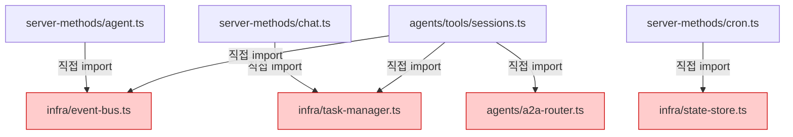
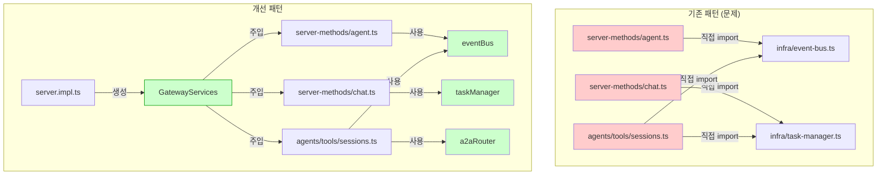
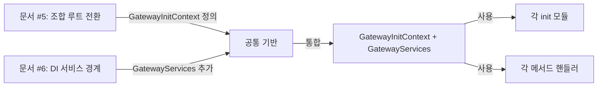

# DI 서비스 경계 확장 (Dependency Injection Service Boundary)

> **작성일**: 2026-02-19
> **상태**: 설계 문서
> **우선순위**: 중간 (Medium)
> **노력 추정**: L (1~2일)
> **관련 파일**: `src/cli/deps.ts`, `src/gateway/server.impl.ts`, `src/gateway/server-methods/`

---

## 1. 문제 정의

### 1.1 현재 상태의 핵심 문제

의존성 주입(DI)이 `src/cli/deps.ts`의 `createDefaultDeps()`에만 국한되어 있다. 이 함수는 CLI 커맨드에서 채널 전송 함수를 주입하는 용도로만 쓰인다. Gateway와 에이전트 툴은 의존성을 직접 import로 해결한다.

### 1.2 구체적 문제점

**직접 import로 인한 강한 결합**

Gateway 메서드 핸들러들이 인프라 레이어를 직접 import한다.

```typescript
// src/gateway/server-methods/agent.ts (현재)
import { getEventBus } from "../../infra/event-bus.js";
import { getTaskManager } from "../../infra/task-manager.js";
import { getA2ARouter } from "../../agents/a2a-router.js";
```

이 패턴은 테스트에서 모듈 레벨 모킹(`vi.mock(...)`)을 강제한다. 모듈 레벨 모킹은 테스트 격리가 어렵고, 병렬 테스트에서 상태 오염이 발생할 수 있다.

**테스트 작성의 어려움**

```typescript
// 현재 테스트 방식 (문제 있음)
vi.mock("../../infra/event-bus.js", () => ({
  getEventBus: () => mockEventBus,
}));

// 원하는 테스트 방식 (주입 패턴)
const handler = createAgentHandler({ eventBus: mockEventBus });
```

**서비스 경계 부재**

- `EventBus`, `TaskManager`, `A2ARouter`, `StateStore` 같은 핵심 서비스에 대한 통합된 추상화가 없다
- 각 모듈이 각자의 방식으로 이 서비스들에 접근한다
- 새 서비스를 추가하면 사용하는 모든 파일을 수정해야 한다

**Gateway 메서드의 ad-hoc 의존성**

`server-methods/` 디렉토리의 각 파일이 필요한 의존성을 각자 다른 방식으로 가져온다. 일관된 패턴이 없어 코드를 읽기 어렵다.

---

## 2. 설계 목표

| 목표 | 측정 기준 |
|------|-----------|
| 핵심 서비스에 대한 단일 진입점 | `GatewayServices` 인터페이스 하나로 통합 |
| 테스트에서 모듈 레벨 모킹 제거 | `vi.mock()` 사용 없이 서비스 교체 가능 |
| Gateway 메서드 핸들러 테스트 용이성 | 핸들러 생성 시 서비스 주입 가능 |
| 풀 DI 컨테이너 도입 없음 | 타입이 있는 객체 전달 패턴만 사용 |
| `createDefaultDeps()` 하위 호환성 유지 | 기존 CLI 코드 변경 없음 |

> **중요**: 이 설계는 풀 DI 컨테이너(InversifyJS, tsyringe 등)를 도입하지 않는다. 단순히 타입이 있는 서비스 객체를 함수 파라미터로 전달하는 패턴이다.

---

## 3. 현재 구현 분석

### 3.1 `createDefaultDeps()` 현황

```typescript
// src/cli/deps.ts (현재)
export type CliDeps = {
  sendMessageWhatsApp: typeof sendMessageWhatsApp;
  sendMessageTelegram: typeof sendMessageTelegram;
  sendMessageDiscord: typeof sendMessageDiscord;
  sendMessageSlack: typeof sendMessageSlack;
  sendMessageSignal: typeof sendMessageSignal;
  sendMessageIMessage: typeof sendMessageIMessage;
};

export function createDefaultDeps(): CliDeps {
  // 각 채널 전송 함수를 동적 import로 래핑
  return { ... };
}
```

`CliDeps`는 오직 채널 전송 함수만 포함한다. Gateway나 에이전트 툴이 필요한 서비스(EventBus, TaskManager 등)는 포함되지 않는다.

### 3.2 Gateway 메서드의 현재 의존성 패턴

`server-methods/` 디렉토리를 분석하면 다음 패턴이 반복된다.

```typescript
// src/gateway/server-methods/agent.ts (현재 패턴)
import { clearAgentRunContext, onAgentEvent } from "../../infra/agent-events.js";
import { getEventBus } from "../../infra/event-bus.js";

export function registerAgentMethods(server: FastifyInstance) {
  server.post("/agent/run", async (req, reply) => {
    const eventBus = getEventBus(); // 전역 싱글톤 직접 접근
    // ...
  });
}
```

```typescript
// src/gateway/server-methods/chat.ts (현재 패턴)
import { getTaskManager } from "../../infra/task-manager.js";

export function registerChatMethods(server: FastifyInstance) {
  server.post("/chat", async (req, reply) => {
    const taskManager = getTaskManager(); // 전역 싱글톤 직접 접근
    // ...
  });
}
```

### 3.3 에이전트 툴의 현재 의존성 패턴

```typescript
// src/agents/tools/sessions.ts (현재 패턴)
import { getEventBus } from "../../infra/event-bus.js";
import { getTaskManager } from "../../infra/task-manager.js";
import { getA2ARouter } from "../../agents/a2a-router.js";

export function createSessionsTool() {
  return {
    async execute(params) {
      const eventBus = getEventBus();    // 직접 접근
      const taskManager = getTaskManager(); // 직접 접근
      // ...
    }
  };
}
```

### 3.4 문제 패턴 요약



모든 소비자가 인프라 레이어를 직접 참조한다. 테스트에서 이 의존성을 교체하려면 모듈 레벨 모킹이 필요하다.

---

## 4. 상세 설계

### 4.1 `GatewayServices` 인터페이스

```typescript
// src/gateway/gateway-services.ts

/**
 * Gateway와 에이전트 툴이 공유하는 핵심 서비스 인터페이스.
 *
 * 풀 DI 컨테이너가 아니다. 타입이 있는 서비스 객체를 함수 파라미터로
 * 전달하는 단순한 패턴이다.
 *
 * 새 서비스를 추가할 때는 이 인터페이스를 확장하고,
 * createGatewayServices()에서 구현을 추가한다.
 */
export type GatewayServices = {
  /** 게이트웨이 전체 이벤트 버스 */
  eventBus: EventBus;
  /** 에이전트 작업 관리자 */
  taskManager: TaskManager;
  /** Agent-to-Agent 라우터 */
  a2aRouter: A2ARouter;
  /** 게이트웨이 상태 저장소 */
  stateStore: StateStore;
};

/**
 * 프로덕션 환경에서 실제 서비스 인스턴스를 생성한다.
 * 테스트에서는 이 함수 대신 mock 객체를 직접 전달한다.
 */
export function createGatewayServices(): GatewayServices {
  return {
    eventBus: getEventBus(),
    taskManager: getTaskManager(),
    a2aRouter: getA2ARouter(),
    stateStore: getStateStore(),
  };
}

/**
 * 테스트용 mock 서비스를 쉽게 만들 수 있는 헬퍼.
 * 필요한 서비스만 오버라이드하고 나머지는 no-op으로 채운다.
 */
export function createMockGatewayServices(
  overrides: Partial<GatewayServices> = {},
): GatewayServices {
  return {
    eventBus: createNoopEventBus(),
    taskManager: createNoopTaskManager(),
    a2aRouter: createNoopA2ARouter(),
    stateStore: createNoopStateStore(),
    ...overrides,
  };
}
```

### 4.2 `CliDeps` 확장

```typescript
// src/cli/deps.ts (확장 후)

import type { GatewayServices } from "../gateway/gateway-services.js";

export type CliDeps = {
  // 기존 채널 전송 함수 (변경 없음)
  sendMessageWhatsApp: typeof sendMessageWhatsApp;
  sendMessageTelegram: typeof sendMessageTelegram;
  sendMessageDiscord: typeof sendMessageDiscord;
  sendMessageSlack: typeof sendMessageSlack;
  sendMessageSignal: typeof sendMessageSignal;
  sendMessageIMessage: typeof sendMessageIMessage;
};

/**
 * Gateway 컨텍스트에서 사용하는 확장 deps.
 * CliDeps를 포함하고 GatewayServices를 추가한다.
 */
export type GatewayDeps = CliDeps & {
  services: GatewayServices;
};

export function createDefaultDeps(): CliDeps {
  // 기존 구현 그대로 유지 (하위 호환성)
  return { ... };
}

/**
 * Gateway 시작 시 호출. CliDeps + GatewayServices를 함께 생성한다.
 */
export function createGatewayDeps(): GatewayDeps {
  return {
    ...createDefaultDeps(),
    services: createGatewayServices(),
  };
}
```

### 4.3 `GatewayInitContext` 통합 (문서 #5와 연계)

문서 #5의 `GatewayInitContext`에 `GatewayServices`를 추가한다.

```typescript
// src/gateway/server-init-types.ts (문서 #5에서 정의, 여기서 확장)

import type { GatewayServices } from "./gateway-services.js";

export type GatewayInitContext = {
  cfg: Config;
  runtime: GatewayRuntimeState;
  deps: GatewayDeps;  // CliDeps → GatewayDeps로 변경
  port: number;
  /** 핵심 서비스 — init 모듈과 메서드 핸들러가 이를 통해 서비스에 접근 */
  services: GatewayServices;
};
```

### 4.4 Gateway 메서드 핸들러 패턴 변경

```typescript
// src/gateway/server-methods/agent.ts (개선 후)

import type { GatewayServices } from "../gateway-services.js";

/**
 * 에이전트 메서드 핸들러를 생성한다.
 * 서비스를 파라미터로 받아 직접 import 의존성을 제거한다.
 */
export function createAgentMethodHandlers(services: GatewayServices) {
  const { eventBus, taskManager } = services;

  return {
    async handleAgentRun(params: AgentRunParams) {
      // eventBus, taskManager를 클로저로 사용
      // 전역 싱글톤 직접 접근 없음
      await eventBus.emit("agent:run:start", params);
      const task = await taskManager.create(params);
      return task;
    },

    async handleAgentStop(params: AgentStopParams) {
      await taskManager.cancel(params.taskId);
    },
  };
}

// 테스트에서:
// const handlers = createAgentMethodHandlers(createMockGatewayServices({
//   eventBus: mockEventBus,
//   taskManager: mockTaskManager,
// }));
// await handlers.handleAgentRun(testParams);
```

### 4.5 에이전트 툴 패턴 변경

```typescript
// src/agents/tools/sessions.ts (개선 후)

import type { GatewayServices } from "../../gateway/gateway-services.js";

/**
 * sessions 툴을 생성한다.
 * 필요한 서비스를 생성 시점에 주입받는다.
 */
export function createSessionsTool(services: Pick<GatewayServices, "eventBus" | "a2aRouter">) {
  const { eventBus, a2aRouter } = services;

  return {
    name: "sessions_send",
    async execute(params: SessionsSendParams) {
      // 직접 import 없이 주입된 서비스 사용
      await a2aRouter.route(params);
      await eventBus.emit("sessions:send", params);
    },
  };
}
```

### 4.6 전체 아키텍처 다이어그램



### 4.7 서비스 인터페이스 상세 정의

```typescript
// src/gateway/gateway-services.ts (상세)

/** 이벤트 버스 인터페이스 */
export type EventBus = {
  emit(event: string, payload?: unknown): Promise<void>;
  on(event: string, handler: (payload: unknown) => void): () => void;
  off(event: string, handler: (payload: unknown) => void): void;
};

/** 에이전트 작업 관리자 인터페이스 */
export type TaskManager = {
  create(params: TaskCreateParams): Promise<Task>;
  cancel(taskId: string): Promise<void>;
  get(taskId: string): Task | undefined;
  list(): Task[];
};

/** Agent-to-Agent 라우터 인터페이스 */
export type A2ARouter = {
  route(params: A2ARouteParams): Promise<void>;
  register(agentId: string, handler: A2AHandler): void;
  unregister(agentId: string): void;
};

/** 게이트웨이 상태 저장소 인터페이스 */
export type StateStore = {
  get<T>(key: string): T | undefined;
  set<T>(key: string, value: T): void;
  delete(key: string): void;
};
```

### 4.8 테스트 패턴 비교

**기존 패턴 (모듈 레벨 모킹)**:
```typescript
// 기존 테스트 — 모듈 레벨 모킹 필요
import { describe, it, vi, beforeEach } from "vitest";

vi.mock("../../infra/event-bus.js", () => ({
  getEventBus: () => ({
    emit: vi.fn(),
    on: vi.fn(),
  }),
}));

vi.mock("../../infra/task-manager.js", () => ({
  getTaskManager: () => ({
    create: vi.fn().mockResolvedValue({ id: "task-1" }),
  }),
}));

describe("handleAgentRun", () => {
  it("작업을 생성한다", async () => {
    // 모듈 모킹이 전역 상태를 오염시킬 수 있음
    // 병렬 테스트에서 충돌 가능
  });
});
```

**개선 패턴 (주입 기반 테스트)**:
```typescript
// 개선 후 테스트 — 깔끔한 주입 패턴
import { describe, it, vi } from "vitest";
import { createAgentMethodHandlers } from "./agent.js";
import { createMockGatewayServices } from "../gateway-services.js";

describe("createAgentMethodHandlers", () => {
  it("작업을 생성하고 이벤트를 발행한다", async () => {
    const mockEventBus = { emit: vi.fn(), on: vi.fn(), off: vi.fn() };
    const mockTaskManager = {
      create: vi.fn().mockResolvedValue({ id: "task-1" }),
      cancel: vi.fn(),
      get: vi.fn(),
      list: vi.fn().mockReturnValue([]),
    };

    // 필요한 서비스만 오버라이드
    const services = createMockGatewayServices({
      eventBus: mockEventBus,
      taskManager: mockTaskManager,
    });

    const handlers = createAgentMethodHandlers(services);
    const result = await handlers.handleAgentRun({ agentId: "test" });

    expect(mockTaskManager.create).toHaveBeenCalledWith({ agentId: "test" });
    expect(mockEventBus.emit).toHaveBeenCalledWith("agent:run:start", { agentId: "test" });
    expect(result.id).toBe("task-1");
  });

  it("다른 테스트와 완전히 격리된다", async () => {
    // 각 테스트가 독립적인 mock 인스턴스를 사용
    // 전역 상태 오염 없음
  });
});
```

---

## 5. 구현 계획

### Phase 1: 인터페이스 정의 (0.5일)

**목표**: 코드 변경 없이 타입만 추가

1. `src/gateway/gateway-services.ts` 생성
   - `EventBus`, `TaskManager`, `A2ARouter`, `StateStore` 인터페이스 정의
   - `GatewayServices` 타입 정의
   - `createGatewayServices()` 구현 (기존 전역 싱글톤 래핑)
   - `createMockGatewayServices()` 헬퍼 구현
2. `src/cli/deps.ts`에 `GatewayDeps` 타입 추가
   - 기존 `CliDeps`는 변경 없음 (하위 호환성 유지)
   - `createGatewayDeps()` 함수 추가
3. `pnpm tsgo`로 타입 체크 통과 확인

### Phase 2: Gateway 메서드 핸들러 마이그레이션 (0.5일)

**목표**: 가장 많이 사용되는 메서드 핸들러부터 주입 패턴으로 전환

1. `server-methods/agent.ts` 마이그레이션
   - `createAgentMethodHandlers(services)` 패턴으로 변경
   - 기존 직접 import 제거
2. `server-methods/chat.ts` 마이그레이션
3. `server-methods/cron.ts` 마이그레이션
4. `server.impl.ts`에서 `createGatewayDeps()` 사용, 서비스를 메서드 핸들러에 전달
5. `pnpm test`로 기존 테스트 통과 확인

### Phase 3: 에이전트 툴 마이그레이션 (0.5일)

**목표**: 에이전트 툴의 직접 import 제거

1. `agents/tools/sessions.ts` 마이그레이션
   - `createSessionsTool(services)` 패턴으로 변경
2. 기타 서비스를 직접 import하는 툴 파일 마이그레이션
3. 툴 생성 컨텍스트에서 서비스 전달 경로 확인

### Phase 4: 테스트 개선 및 검증 (0.5일)

1. 마이그레이션된 핸들러에 주입 기반 단위 테스트 추가
2. `vi.mock()` 사용을 주입 패턴으로 교체 가능한 테스트 식별 및 개선
3. `pnpm test:coverage`로 커버리지 확인
4. `pnpm build` 빌드 통과 확인

---

## 6. 영향 받는 파일

| 파일 | 변경 유형 | 설명 |
|------|-----------|------|
| `src/gateway/gateway-services.ts` | 신규 생성 | `GatewayServices` 인터페이스 + 팩토리 함수 |
| `src/cli/deps.ts` | 수정 | `GatewayDeps` 타입 추가, `createGatewayDeps()` 추가 |
| `src/gateway/server.impl.ts` | 수정 | `createGatewayDeps()` 사용, 서비스 전달 |
| `src/gateway/server-init-types.ts` | 수정 | `GatewayInitContext`에 `services` 필드 추가 |
| `src/gateway/server-methods/agent.ts` | 수정 | `createAgentMethodHandlers(services)` 패턴 |
| `src/gateway/server-methods/chat.ts` | 수정 | 서비스 주입 패턴 적용 |
| `src/gateway/server-methods/cron.ts` | 수정 | 서비스 주입 패턴 적용 |
| `src/gateway/server-methods/sessions.ts` | 수정 | 서비스 주입 패턴 적용 |
| `src/agents/tools/sessions.ts` | 수정 | `createSessionsTool(services)` 패턴 |
| `src/agents/tools/*.ts` | 수정 (선택) | 직접 import 사용하는 툴 파일들 |

---

## 7. 테스트 전략

### 7.1 기존 테스트 보호

- 기존 e2e 테스트는 `createGatewayDeps()`가 실제 서비스를 생성하므로 변경 없이 통과
- `pnpm test` 전체 통과가 마이그레이션 완료의 기준

### 7.2 새 단위 테스트 패턴

```typescript
// src/gateway/server-methods/agent.test.ts (새 패턴)

import { describe, it, expect, vi } from "vitest";
import { createAgentMethodHandlers } from "./agent.js";
import { createMockGatewayServices } from "../gateway-services.js";

describe("createAgentMethodHandlers", () => {
  it("에이전트 실행 시 TaskManager.create를 호출한다", async () => {
    const mockCreate = vi.fn().mockResolvedValue({ id: "task-123", status: "running" });
    const services = createMockGatewayServices({
      taskManager: { create: mockCreate, cancel: vi.fn(), get: vi.fn(), list: vi.fn() },
    });

    const { handleAgentRun } = createAgentMethodHandlers(services);
    const result = await handleAgentRun({ agentId: "eden", message: "hello" });

    expect(mockCreate).toHaveBeenCalledOnce();
    expect(result.id).toBe("task-123");
  });

  it("에이전트 중지 시 TaskManager.cancel을 호출한다", async () => {
    const mockCancel = vi.fn().mockResolvedValue(undefined);
    const services = createMockGatewayServices({
      taskManager: { create: vi.fn(), cancel: mockCancel, get: vi.fn(), list: vi.fn() },
    });

    const { handleAgentStop } = createAgentMethodHandlers(services);
    await handleAgentStop({ taskId: "task-123" });

    expect(mockCancel).toHaveBeenCalledWith("task-123");
  });
});
```

### 7.3 `createMockGatewayServices` 활용

```typescript
// 테스트 헬퍼 사용 예시

// 모든 서비스가 no-op인 기본 mock
const services = createMockGatewayServices();

// 특정 서비스만 오버라이드
const services = createMockGatewayServices({
  eventBus: {
    emit: vi.fn(),
    on: vi.fn().mockReturnValue(() => {}), // cleanup 함수 반환
    off: vi.fn(),
  },
});

// 여러 서비스 오버라이드
const services = createMockGatewayServices({
  eventBus: mockEventBus,
  taskManager: mockTaskManager,
});
```

---

## 8. 위험 평가

| 위험 | 가능성 | 영향 | 완화 방법 |
|------|--------|------|-----------|
| 기존 전역 싱글톤과 주입된 서비스 간 상태 불일치 | 중간 | 높음 | `createGatewayServices()`가 동일한 싱글톤을 래핑하도록 구현 |
| 서비스 인터페이스가 실제 구현과 맞지 않음 | 낮음 | 중간 | 인터페이스를 실제 구현에서 추출하여 정의 |
| 마이그레이션 중 일부 파일만 변경되어 혼재 | 중간 | 낮음 | Phase별 완전한 마이그레이션, 혼재 상태 허용 (점진적 전환) |
| 에이전트 툴 생성 컨텍스트에서 서비스 전달 경로 복잡 | 중간 | 중간 | 툴 생성 시점에 서비스를 클로저로 캡처하는 패턴 사용 |
| 풀 DI 컨테이너로 확장 압력 | 낮음 | 낮음 | 설계 문서에 "풀 DI 컨테이너 도입 없음" 명시 |

---

## 9. 의존성

### 선행 조건

- 없음. 독립적으로 시작 가능하다.
- 문서 #5 (Gateway 순수 조합 전환)와 병행 진행 가능하다.

### 문서 #5와의 연계

두 개선을 함께 진행하면 시너지가 있다.



`GatewayInitContext`에 `services` 필드를 추가하면, 모든 init 모듈과 메서드 핸들러가 동일한 컨텍스트 객체를 통해 서비스에 접근할 수 있다.

### 후속 작업

- 각 메서드 핸들러에 단위 테스트 추가
- `vi.mock()` 사용 테스트를 주입 패턴으로 점진적 전환
- 새 서비스 추가 시 `GatewayServices`에 추가하는 패턴 정착

---

## 10. 노력 추정

| 단계 | 예상 시간 |
|------|-----------|
| Phase 1: 인터페이스 정의 | 2시간 |
| Phase 2: Gateway 메서드 핸들러 마이그레이션 | 4시간 |
| Phase 3: 에이전트 툴 마이그레이션 | 3시간 |
| Phase 4: 테스트 개선 및 검증 | 3시간 |
| **합계** | **12시간 (1.5일)** |

> 이 작업은 점진적으로 진행할 수 있다. Phase 1만 완료해도 타입 안전성이 향상되고, Phase 2부터는 테스트 가능성이 실질적으로 개선된다. 전체를 한 번에 완료하지 않아도 각 Phase가 독립적인 가치를 제공한다.

---

## 부록: 서비스 인터페이스 설계 원칙

이 설계에서 `GatewayServices`에 포함할 서비스를 선택하는 기준은 다음과 같다.

1. **여러 모듈에서 공유**: 2개 이상의 메서드 핸들러나 툴이 사용하는 서비스
2. **테스트에서 교체 필요**: 단위 테스트에서 실제 구현 대신 mock이 필요한 서비스
3. **전역 상태 접근**: 현재 전역 싱글톤 패턴(`getXxx()`)으로 접근하는 서비스

반대로 다음은 `GatewayServices`에 포함하지 않는다.

- 단일 모듈에서만 사용하는 유틸리티 함수
- 순수 함수 (상태 없음, 부작용 없음)
- 이미 파라미터로 전달되는 값 (설정, 포트 번호 등)
