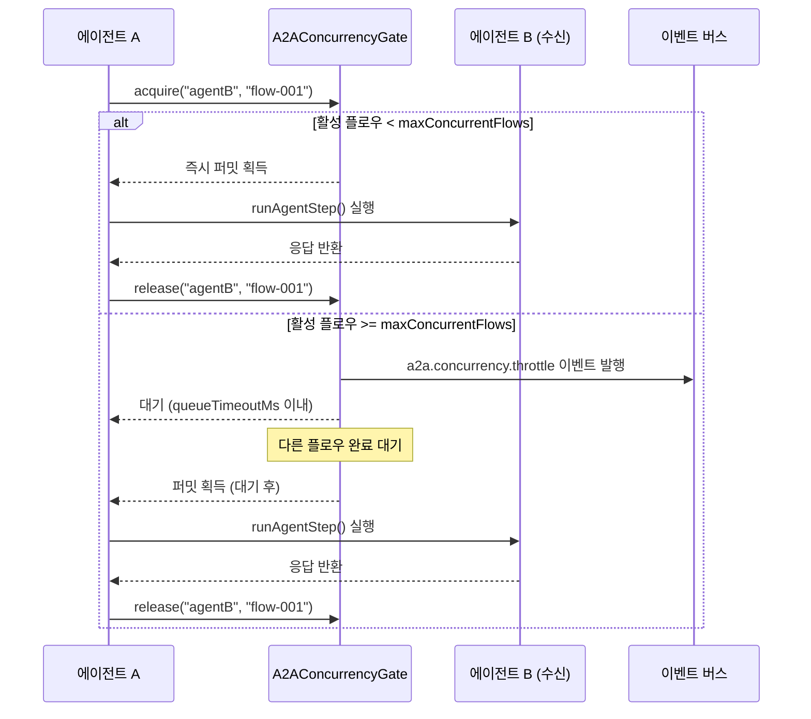
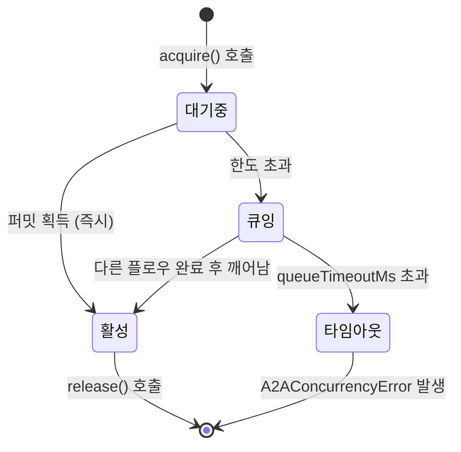

# A2A 에이전트별 동시성 제한 (Per-Agent Concurrency Control)

> 작성일: 2026-02-19
> 상태: 설계 문서
> 우선순위: 높음 (High)
> 노력 추정: L (1~2일)
> 대상: `prontolab-openclaw` — `src/agents/tools/`, `src/agents/lanes.ts`

---

## 1. 문제 정의

현재 A2A(Agent-to-Agent) ping-pong 플로우에는 **에이전트별 동시 실행 수 제한이 없다.**

`runSessionsSendA2AFlow()`는 `runAgentStep()`을 직접 호출하며, 동일 에이전트가 동시에 몇 개의 A2A 플로우에 참여하고 있는지 추적하지 않는다. 11개 에이전트가 서로 메시지를 주고받는 환경에서 A2A 버스트가 발생하면, 단일 에이전트가 수십 개의 동시 플로우를 처리하게 되어 LLM 컨텍스트 경합, 메모리 압박, 응답 지연이 발생한다.

기존 안전장치들은 이 문제를 해결하지 못한다.

- `src/discord/loop-guard.ts`: 속도 제한(10 msg/60s) + 깊이 상한(5)으로 **무한 루프**를 막지만, 동시 플로우 수는 제어하지 않는다.
- `src/cron/session-reaper.ts`: 에이전트당 세션 상한(16개)으로 **생명주기**를 관리하지만, 현재 활성 플로우 수는 추적하지 않는다.
- `src/agents/lanes.ts`: `AGENT_LANE_NESTED`로 A2A 실행을 격리하지만, 레인 내 동시 실행 수에 상한이 없다.

결과적으로 루프 가드가 통과한 합법적인 A2A 요청들이 한 에이전트에 동시에 쏟아질 수 있고, 이를 막을 수단이 없다.

---

## 2. 설계 목표

1. **에이전트별 동시 A2A 플로우 수를 제한한다.** 기본값 3, 에이전트 설정으로 조정 가능.
2. **제한 초과 시 큐잉한다.** 즉시 거부하지 않고 타임아웃 내에서 대기한다.
3. **진단 이벤트를 발행한다.** 스로틀링 발생 시 관측 가능하도록 이벤트를 남긴다.
4. **기존 동작과 역호환을 유지한다.** 제한 미설정 에이전트는 현재와 동일하게 동작한다.
5. **테스트 가능한 구조로 설계한다.** 세마포어를 의존성 주입으로 교체할 수 있어야 한다.

---

## 3. 현재 구현 분석

### 3.1 A2A 플로우 진입점

```
sessions_send 도구 호출
  └─ src/agents/tools/sessions-send-tool.ts
       └─ runSessionsSendA2AFlow()
            └─ src/agents/tools/sessions-send-tool.a2a.ts
                 └─ runAgentStep()  ← 동시성 제어 없음
```

`runSessionsSendA2AFlow()`는 ping-pong 루프를 구성하며, 각 턴마다 `runAgentStep()`을 직접 호출한다. 이 함수는 비동기이고 `await`로 완료를 기다리지만, 여러 A2A 플로우가 동시에 진입하면 동일 에이전트에 대해 `runAgentStep()`이 병렬로 실행된다.

### 3.2 레인 구조

```typescript
// src/agents/lanes.ts (현재)
export const AGENT_LANE_NESTED = "nested";

// 레인은 실행 격리를 제공하지만 동시 실행 수 상한은 없음
```

### 3.3 루프 가드 (참고)

```typescript
// src/discord/loop-guard.ts
const RATE_LIMIT = 10;       // 60초당 최대 메시지 수
const DEPTH_CAP = 5;         // 최대 재귀 깊이
```

루프 가드는 시간당 메시지 수와 깊이를 제한하지만, 동시에 실행 중인 독립 플로우 수는 제한하지 않는다.

### 3.4 세션 리퍼 (참고)

```typescript
// src/cron/session-reaper.ts
const MAX_A2A_SESSIONS_PER_AGENT = 16;
```

세션 수 상한은 있지만, 이는 저장된 세션 레코드 수이지 현재 활성 플로우 수가 아니다.

---

## 4. 상세 설계

### 4.1 핵심 인터페이스

```typescript
// src/agents/a2a-concurrency.ts

/**
 * 에이전트별 A2A 동시 플로우 세마포어.
 * 각 에이전트 ID에 대해 독립적인 카운터를 유지한다.
 */
export interface A2AConcurrencyGate {
  /**
   * 플로우 시작 전 퍼밋을 획득한다.
   * maxConcurrentFlows에 도달하면 queueTimeoutMs 동안 대기한다.
   * 타임아웃 초과 시 A2AConcurrencyError를 던진다.
   */
  acquire(agentId: string, flowId: string): Promise<void>;

  /**
   * 플로우 완료 후 퍼밋을 반환한다.
   * 대기 중인 플로우가 있으면 즉시 깨운다.
   */
  release(agentId: string, flowId: string): void;

  /**
   * 현재 에이전트의 활성 플로우 수를 반환한다.
   */
  activeCount(agentId: string): number;

  /**
   * 현재 에이전트의 대기 중인 플로우 수를 반환한다.
   */
  queuedCount(agentId: string): number;
}

/**
 * 에이전트별 A2A 동시성 설정.
 * 에이전트 config의 a2a 섹션에 위치한다.
 */
export interface A2AConcurrencyConfig {
  /** 동시 실행 가능한 최대 A2A 플로우 수. 기본값: 3 */
  maxConcurrentFlows: number;
  /** 퍼밋 대기 최대 시간(ms). 기본값: 30000 */
  queueTimeoutMs: number;
}

/**
 * 동시성 제한 초과 시 발생하는 에러.
 */
export class A2AConcurrencyError extends Error {
  constructor(
    public readonly agentId: string,
    public readonly flowId: string,
    public readonly activeCount: number,
    public readonly queueTimeoutMs: number,
  ) {
    super(
      `에이전트 ${agentId}의 A2A 동시 플로우 한도 초과: ` +
        `현재 활성 ${activeCount}개, ${queueTimeoutMs}ms 대기 후 타임아웃`,
    );
    this.name = "A2AConcurrencyError";
  }
}

/**
 * 동시성 스로틀링 진단 이벤트.
 */
export interface A2AConcurrencyThrottleEvent {
  type: "a2a.concurrency.throttle";
  agentId: string;
  flowId: string;
  activeCount: number;
  queuedCount: number;
  maxConcurrentFlows: number;
  timestamp: number;
}

/**
 * 동시성 타임아웃 진단 이벤트.
 */
export interface A2AConcurrencyTimeoutEvent {
  type: "a2a.concurrency.timeout";
  agentId: string;
  flowId: string;
  activeCount: number;
  queueTimeoutMs: number;
  timestamp: number;
}
```

### 4.2 세마포어 구현

```typescript
// src/agents/a2a-concurrency.ts (구현부)

export class A2AConcurrencyGateImpl implements A2AConcurrencyGate {
  // agentId -> 현재 활성 플로우 수
  private readonly active = new Map<string, number>();
  // agentId -> 대기 중인 resolve 함수 큐
  private readonly waitQueue = new Map<string, Array<() => void>>();

  constructor(
    private readonly config: A2AConcurrencyConfig,
    private readonly emitEvent: (
      event: A2AConcurrencyThrottleEvent | A2AConcurrencyTimeoutEvent,
    ) => void,
  ) {}

  async acquire(agentId: string, flowId: string): Promise<void> {
    const current = this.active.get(agentId) ?? 0;

    if (current < this.config.maxConcurrentFlows) {
      // 퍼밋 즉시 획득
      this.active.set(agentId, current + 1);
      return;
    }

    // 한도 초과: 큐에 등록하고 대기
    this.emitEvent({
      type: "a2a.concurrency.throttle",
      agentId,
      flowId,
      activeCount: current,
      queuedCount: this.queuedCount(agentId),
      maxConcurrentFlows: this.config.maxConcurrentFlows,
      timestamp: Date.now(),
    });

    await new Promise<void>((resolve, reject) => {
      const queue = this.waitQueue.get(agentId) ?? [];

      // 타임아웃 타이머
      const timer = setTimeout(() => {
        // 큐에서 제거
        const q = this.waitQueue.get(agentId) ?? [];
        const idx = q.indexOf(resolve);
        if (idx !== -1) q.splice(idx, 1);

        this.emitEvent({
          type: "a2a.concurrency.timeout",
          agentId,
          flowId,
          activeCount: this.active.get(agentId) ?? 0,
          queueTimeoutMs: this.config.queueTimeoutMs,
          timestamp: Date.now(),
        });

        reject(
          new A2AConcurrencyError(
            agentId,
            flowId,
            this.active.get(agentId) ?? 0,
            this.config.queueTimeoutMs,
          ),
        );
      }, this.config.queueTimeoutMs);

      queue.push(() => {
        clearTimeout(timer);
        resolve();
      });

      this.waitQueue.set(agentId, queue);
    });

    // 대기 후 퍼밋 획득
    this.active.set(agentId, (this.active.get(agentId) ?? 0) + 1);
  }

  release(agentId: string, _flowId: string): void {
    const current = this.active.get(agentId) ?? 0;
    if (current > 0) {
      this.active.set(agentId, current - 1);
    }

    // 대기 중인 플로우 깨우기
    const queue = this.waitQueue.get(agentId);
    if (queue && queue.length > 0) {
      const next = queue.shift();
      next?.();
    }
  }

  activeCount(agentId: string): number {
    return this.active.get(agentId) ?? 0;
  }

  queuedCount(agentId: string): number {
    return this.waitQueue.get(agentId)?.length ?? 0;
  }
}
```

### 4.3 A2A 플로우 통합

```typescript
// src/agents/tools/sessions-send-tool.a2a.ts (수정)

export async function runSessionsSendA2AFlow(
  params: A2AFlowParams,
  deps: A2AFlowDeps,
): Promise<A2AFlowResult> {
  const { agentId, flowId, concurrencyGate } = params;

  // 퍼밋 획득 (한도 초과 시 대기 또는 타임아웃)
  await concurrencyGate.acquire(agentId, flowId);

  try {
    // 기존 ping-pong 루프 실행
    return await runA2APingPongLoop(params, deps);
  } finally {
    // 성공/실패 모두 퍼밋 반환
    concurrencyGate.release(agentId, flowId);
  }
}
```

### 4.4 에이전트 설정 스키마 확장

```typescript
// src/agents/agent-config.ts (확장)

export interface AgentA2AConfig {
  /** 기존 A2A 설정 */
  enabled?: boolean;
  replyBack?: boolean;

  /** 신규: 동시성 제어 */
  maxConcurrentFlows?: number; // 기본값: 3
  queueTimeoutMs?: number;     // 기본값: 30000
}
```

### 4.5 플로우 다이어그램





---

## 5. 구현 계획

### Phase 1: 핵심 세마포어 구현 (0.5일)

1. `src/agents/a2a-concurrency.ts` 신규 파일 생성
   - `A2AConcurrencyGate` 인터페이스 정의
   - `A2AConcurrencyGateImpl` 클래스 구현
   - `A2AConcurrencyError` 에러 클래스 정의
   - 진단 이벤트 타입 정의
2. 단위 테스트 작성 (`src/agents/a2a-concurrency.test.ts`)
   - 즉시 퍼밋 획득 케이스
   - 큐잉 후 획득 케이스
   - 타임아웃 케이스
   - 동시 다수 에이전트 독립성 검증

### Phase 2: A2A 플로우 통합 (0.5일)

1. `src/agents/tools/sessions-send-tool.a2a.ts` 수정
   - `A2AConcurrencyGate`를 의존성으로 주입
   - `acquire` / `release` 호출 추가 (try/finally 패턴)
2. `src/agents/tools/sessions-send-tool.ts` 수정
   - 게이트 인스턴스를 deps에서 전달
3. 에이전트 설정 스키마 확장
   - `src/agents/agent-config.ts`에 `maxConcurrentFlows`, `queueTimeoutMs` 추가

### Phase 3: 진단 이벤트 연동 (0.25일)

1. 이벤트 버스에 `a2a.concurrency.throttle`, `a2a.concurrency.timeout` 이벤트 등록
2. Task-Monitor ndjson 스트림에 포함되도록 이벤트 필터 확인
3. 기존 이벤트 타입 목록 업데이트

### Phase 4: 설정 문서화 및 기본값 검증 (0.25일)

1. `docs/` 또는 `prontolab/` 설정 참조 문서 업데이트
2. 기본값(maxConcurrentFlows: 3, queueTimeoutMs: 30000) 실환경 검증
3. 통합 테스트 추가

---

## 6. 영향 받는 파일

| 파일 경로 | 변경 유형 | 설명 |
|---|---|---|
| `src/agents/a2a-concurrency.ts` | 신규 생성 | 세마포어 구현 + 인터페이스 + 에러 클래스 |
| `src/agents/a2a-concurrency.test.ts` | 신규 생성 | 단위 테스트 |
| `src/agents/tools/sessions-send-tool.a2a.ts` | 수정 | acquire/release 호출 추가 |
| `src/agents/tools/sessions-send-tool.ts` | 수정 | 게이트 인스턴스 deps 전달 |
| `src/agents/agent-config.ts` | 수정 | `maxConcurrentFlows`, `queueTimeoutMs` 필드 추가 |
| `src/agents/lanes.ts` | 수정 (선택) | 레인별 동시성 메타데이터 추가 (선택적) |
| `src/infra/event-types.ts` | 수정 | 신규 진단 이벤트 타입 등록 |

---

## 7. 테스트 전략

### 7.1 단위 테스트 (`a2a-concurrency.test.ts`)

```typescript
describe("A2AConcurrencyGateImpl", () => {
  it("maxConcurrentFlows 이내에서 즉시 퍼밋을 획득한다", async () => {
    const gate = new A2AConcurrencyGateImpl(
      { maxConcurrentFlows: 3, queueTimeoutMs: 5000 },
      vi.fn(),
    );
    await gate.acquire("agent-1", "flow-1");
    await gate.acquire("agent-1", "flow-2");
    await gate.acquire("agent-1", "flow-3");
    expect(gate.activeCount("agent-1")).toBe(3);
  });

  it("한도 초과 시 큐에 등록하고 release 후 진행한다", async () => {
    const gate = new A2AConcurrencyGateImpl(
      { maxConcurrentFlows: 1, queueTimeoutMs: 5000 },
      vi.fn(),
    );
    await gate.acquire("agent-1", "flow-1");

    const flow2 = gate.acquire("agent-1", "flow-2");
    expect(gate.queuedCount("agent-1")).toBe(1);

    gate.release("agent-1", "flow-1");
    await flow2; // 대기 후 획득 성공
    expect(gate.activeCount("agent-1")).toBe(1);
  });

  it("queueTimeoutMs 초과 시 A2AConcurrencyError를 던진다", async () => {
    const gate = new A2AConcurrencyGateImpl(
      { maxConcurrentFlows: 1, queueTimeoutMs: 50 },
      vi.fn(),
    );
    await gate.acquire("agent-1", "flow-1");

    await expect(gate.acquire("agent-1", "flow-2")).rejects.toThrow(
      A2AConcurrencyError,
    );
  });

  it("서로 다른 에이전트의 카운터는 독립적이다", async () => {
    const gate = new A2AConcurrencyGateImpl(
      { maxConcurrentFlows: 1, queueTimeoutMs: 5000 },
      vi.fn(),
    );
    await gate.acquire("agent-1", "flow-1");
    await gate.acquire("agent-2", "flow-1"); // 다른 에이전트는 영향 없음
    expect(gate.activeCount("agent-1")).toBe(1);
    expect(gate.activeCount("agent-2")).toBe(1);
  });

  it("스로틀링 발생 시 진단 이벤트를 발행한다", async () => {
    const emitEvent = vi.fn();
    const gate = new A2AConcurrencyGateImpl(
      { maxConcurrentFlows: 1, queueTimeoutMs: 5000 },
      emitEvent,
    );
    await gate.acquire("agent-1", "flow-1");

    // 비동기로 큐잉 시작
    gate.acquire("agent-1", "flow-2").catch(() => {});

    expect(emitEvent).toHaveBeenCalledWith(
      expect.objectContaining({ type: "a2a.concurrency.throttle" }),
    );
  });
});
```

### 7.2 통합 테스트

- `sessions_send` 도구를 통해 A2A 플로우를 3개 이상 동시에 트리거하고, 4번째 요청이 큐잉되는지 확인
- 타임아웃 발생 시 에러 메시지가 호출 에이전트에게 적절히 전달되는지 확인
- 진단 이벤트가 ndjson 스트림에 기록되는지 확인

### 7.3 회귀 테스트

- 기존 A2A 플로우 테스트가 `maxConcurrentFlows: 3` 기본값 하에서 모두 통과하는지 확인
- 루프 가드 테스트와 충돌하지 않는지 확인

---

## 8. 위험 평가

| 위험 | 가능성 | 영향 | 완화 방안 |
|---|---|---|---|
| 기본값 3이 너무 낮아 정상 워크플로우가 큐잉됨 | 중간 | 중간 | 초기 배포 시 모니터링 후 조정; 에이전트별 설정으로 오버라이드 가능 |
| 세마포어 메모리 누수 (release 미호출) | 낮음 | 높음 | try/finally 패턴 강제; 세션 리퍼와 연동하여 고아 카운터 정리 |
| 큐잉 중 에이전트 재시작 시 대기 플로우 처리 | 낮음 | 중간 | 프로세스 재시작 시 Map 초기화로 자동 해소 |
| 타임아웃 에러가 호출 에이전트에게 혼란스러운 메시지로 전달 | 중간 | 낮음 | 에러 메시지를 사용자 친화적으로 작성; 재시도 안내 포함 |
| 다수 에이전트 동시 큐잉 시 공정성(fairness) 문제 | 낮음 | 낮음 | FIFO 큐 구조로 선착순 처리; 우선순위 큐는 추후 확장 |

---

## 9. 의존성

### 내부 의존성

- `src/agents/tools/sessions-send-tool.a2a.ts` — 통합 대상
- `src/agents/agent-config.ts` — 설정 스키마 확장
- `src/infra/event-types.ts` — 진단 이벤트 타입 등록
- `src/discord/loop-guard.ts` — 참조 (변경 없음, 상호 보완 관계)

### 외부 의존성

- 추가 npm 패키지 없음. 순수 TypeScript 구현.

### 선행 조건

- 없음. 독립적으로 구현 가능.

---

## 10. 노력 추정

| 작업 | 추정 시간 |
|---|---|
| Phase 1: 세마포어 구현 + 단위 테스트 | 4시간 |
| Phase 2: A2A 플로우 통합 + 설정 스키마 | 3시간 |
| Phase 3: 진단 이벤트 연동 | 2시간 |
| Phase 4: 문서화 + 기본값 검증 | 2시간 |
| **합계** | **11시간 (약 1.5일)** |

---

_작성일: 2026-02-19_
