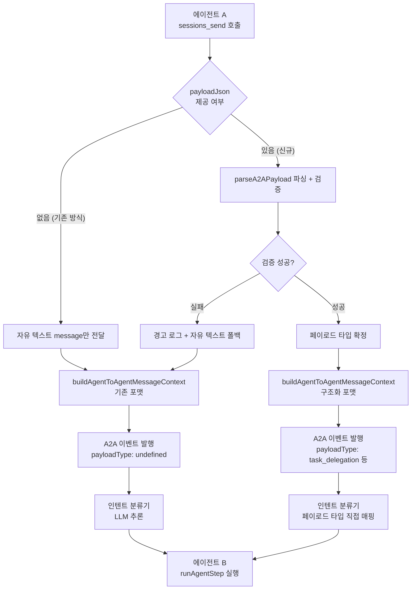
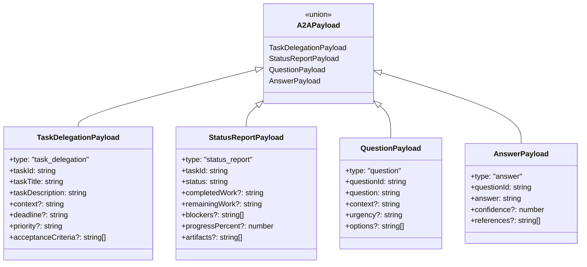

# 구조화된 A2A 핸드오프 페이로드 (Structured Handoff Payload)

> 작성일: 2026-02-19
> 상태: 설계 문서
> 우선순위: 높음 (High)
> 노력 추정: L (1~2일)
> 대상: `prontolab-openclaw` — `src/agents/tools/`, A2A 이벤트 스키마

---

## 1. 문제 정의

현재 A2A 통신은 **자유 텍스트(free-text) 기반**이다.

에이전트 A가 에이전트 B에게 메시지를 보낼 때, `sessions_send` 도구의 `message` 파라미터는 단순 문자열이다. 수신 에이전트는 자연어 산문에서 의도를 다시 파싱해야 하며, 이 과정에서 다음 문제가 발생한다.

- **파싱 오류**: 자연어 해석은 모델마다, 컨텍스트마다 결과가 다르다. "이 작업을 처리해줘"가 위임인지 질문인지 상태 보고인지 모호하다.
- **재시도/중복 제거 불가**: 동일 요청을 재전송할 때 구조화된 식별자가 없어 중복 처리 여부를 판단할 수 없다.
- **디버깅 어려움**: 이벤트 로그에 자유 텍스트만 남아 있어 어떤 종류의 상호작용이었는지 사후 분석이 어렵다.
- **인텐트 분류기 의존**: `src/agents/tools/a2a-intent-classifier.ts`가 자유 텍스트에서 인텐트를 추론하지만, 이는 근본 원인을 해결하지 않고 증상을 완화하는 방식이다.

업계 표준 멀티에이전트 아키텍처(Google A2A Protocol, LangGraph 등)는 에이전트 간 핸드오프에 JSON Schema 검증 구조체를 사용한다. 자유 텍스트는 사람이 읽는 설명으로 보조 역할을 하고, 기계가 처리하는 계약은 구조화된 페이로드가 담당한다.

---

## 2. 설계 목표

1. **선택적 구조화 페이로드를 추가한다.** 기존 `message` 자유 텍스트는 그대로 유지하며 역호환을 보장한다.
2. **공통 A2A 상호작용 유형을 타입으로 정의한다.** 작업 위임, 상태 보고, 질문, 답변 4가지를 우선 지원한다.
3. **이벤트 스키마에 `payloadType` 필드를 추가한다.** 로그/모니터링에서 상호작용 유형을 즉시 식별할 수 있도록 한다.
4. **인텐트 분류기를 보완한다.** 구조화 페이로드가 있으면 분류기를 건너뛰어 정확도를 높인다.
5. **재시도/중복 제거 기반을 마련한다.** `taskId`, `questionId` 같은 식별자로 멱등성을 지원한다.

---

## 3. 현재 구현 분석

### 3.1 sessions_send 도구 현재 시그니처

```typescript
// src/agents/tools/sessions-send-tool.ts (현재)
interface SessionsSendParams {
  sessionId: string;
  message: string;          // 자유 텍스트만 존재
  replyBack?: boolean;
  announceStep?: boolean;
}
```

`message`는 단순 문자열이며, 수신 에이전트는 이 문자열 전체를 LLM 컨텍스트로 받아 처리한다.

### 3.2 메시지 컨텍스트 빌더

```typescript
// src/agents/tools/sessions-send-helpers.ts (현재)
export function buildAgentToAgentMessageContext(
  fromAgent: string,
  message: string,
  // ... 기타 파라미터
): string {
  // 자유 텍스트 message를 그대로 컨텍스트에 삽입
  return `[${fromAgent}]: ${message}`;
}
```

구조화 정보를 삽입할 지점이 없다.

### 3.3 인텐트 분류기

```typescript
// src/agents/tools/a2a-intent-classifier.ts (현재)
export async function classifyA2AIntent(
  message: string,
): Promise<A2AIntent> {
  // 자유 텍스트에서 인텐트를 LLM으로 추론
  // "작업 위임인가? 질문인가? 상태 보고인가?"
}
```

구조화 페이로드가 있으면 이 단계를 건너뛸 수 있다.

### 3.4 A2A 이벤트 스키마 (현재)

```typescript
// 현재 A2A 이벤트에는 payloadType 필드가 없음
interface A2AEvent {
  type: "a2a.send" | "a2a.response" | "a2a.complete";
  fromAgent: string;
  toAgent: string;
  message: string;   // 자유 텍스트
  // payloadType 없음
  // payloadJson 없음
}
```

---

## 4. 상세 설계

### 4.1 페이로드 타입 정의

```typescript
// src/agents/tools/a2a-payload-types.ts (신규)

/**
 * A2A 핸드오프 페이로드 유형.
 * 각 유형은 독립적인 인터페이스를 가진다.
 */
export type A2APayloadType =
  | "task_delegation"
  | "status_report"
  | "question"
  | "answer";

/**
 * 작업 위임 페이로드.
 * 에이전트 A가 에이전트 B에게 작업을 맡길 때 사용한다.
 */
export interface TaskDelegationPayload {
  type: "task_delegation";
  /** 작업 고유 식별자. 재시도/중복 제거에 사용. */
  taskId: string;
  /** 작업 제목 (한 줄 요약) */
  taskTitle: string;
  /** 작업 상세 설명 */
  taskDescription: string;
  /** 작업 수행에 필요한 컨텍스트 (선택) */
  context?: string;
  /** 완료 기한 (ISO 8601, 선택) */
  deadline?: string;
  /** 우선순위: critical | high | medium | low */
  priority?: "critical" | "high" | "medium" | "low";
  /** 완료 기준 (선택) */
  acceptanceCriteria?: string[];
}

/**
 * 상태 보고 페이로드.
 * 에이전트 B가 에이전트 A에게 진행 상황을 보고할 때 사용한다.
 */
export interface StatusReportPayload {
  type: "status_report";
  /** 보고 대상 작업 ID */
  taskId: string;
  /** 현재 상태: in_progress | completed | blocked | failed */
  status: "in_progress" | "completed" | "blocked" | "failed";
  /** 완료된 작업 내용 요약 */
  completedWork?: string;
  /** 남은 작업 내용 (선택) */
  remainingWork?: string;
  /** 블로커 목록 (선택) */
  blockers?: string[];
  /** 완료율 0~100 (선택) */
  progressPercent?: number;
  /** 결과물 참조 (파일 경로, URL 등, 선택) */
  artifacts?: string[];
}

/**
 * 질문 페이로드.
 * 에이전트가 다른 에이전트에게 명확화를 요청할 때 사용한다.
 */
export interface QuestionPayload {
  type: "question";
  /** 질문 고유 식별자. 답변과 매칭에 사용. */
  questionId: string;
  /** 질문 내용 */
  question: string;
  /** 질문 배경 컨텍스트 (선택) */
  context?: string;
  /** 긴급도: urgent | normal | low */
  urgency?: "urgent" | "normal" | "low";
  /** 답변 옵션 목록 (선택, 객관식 형태) */
  options?: string[];
}

/**
 * 답변 페이로드.
 * 에이전트가 질문에 응답할 때 사용한다.
 */
export interface AnswerPayload {
  type: "answer";
  /** 답변 대상 질문 ID */
  questionId: string;
  /** 답변 내용 */
  answer: string;
  /** 답변 신뢰도 0.0~1.0 (선택) */
  confidence?: number;
  /** 추가 참고 자료 (선택) */
  references?: string[];
}

/**
 * 모든 페이로드 유형의 유니온.
 */
export type A2APayload =
  | TaskDelegationPayload
  | StatusReportPayload
  | QuestionPayload
  | AnswerPayload;

/**
 * 페이로드 검증 결과.
 */
export interface PayloadValidationResult {
  valid: boolean;
  errors?: string[];
}
```

### 4.2 sessions_send 도구 확장

```typescript
// src/agents/tools/sessions-send-tool.ts (수정)

interface SessionsSendParams {
  sessionId: string;
  /** 자유 텍스트 메시지. 역호환을 위해 유지. */
  message: string;
  /**
   * 선택적 구조화 페이로드 (JSON 문자열).
   * 제공 시 인텐트 분류기를 건너뛰고 payloadType을 이벤트에 기록한다.
   */
  payloadJson?: string;
  replyBack?: boolean;
  announceStep?: boolean;
}

// 도구 스키마 (TypeBox)
export const SessionsSendSchema = Type.Object({
  sessionId: Type.String(),
  message: Type.String({ description: "수신 에이전트에게 전달할 자유 텍스트 메시지" }),
  payloadJson: Type.Optional(
    Type.String({
      description:
        "선택적 구조화 페이로드 (JSON). " +
        "task_delegation | status_report | question | answer 중 하나. " +
        "제공 시 인텐트 분류가 더 정확해지고 이벤트 로그에 타입이 기록됩니다.",
    }),
  ),
  replyBack: Type.Optional(Type.Boolean()),
  announceStep: Type.Optional(Type.Boolean()),
});
```

### 4.3 페이로드 파서 및 검증기

```typescript
// src/agents/tools/a2a-payload-parser.ts (신규)

import type { A2APayload, PayloadValidationResult } from "./a2a-payload-types.ts";

/**
 * JSON 문자열을 파싱하고 페이로드 유형을 검증한다.
 * 파싱 실패 시 null을 반환하며 에러를 던지지 않는다 (역호환 보장).
 */
export function parseA2APayload(payloadJson: string): A2APayload | null {
  try {
    const parsed = JSON.parse(payloadJson) as unknown;
    if (typeof parsed !== "object" || parsed === null) return null;

    const obj = parsed as Record<string, unknown>;
    if (typeof obj["type"] !== "string") return null;

    const result = validateA2APayload(obj as A2APayload);
    if (!result.valid) {
      // 검증 실패 시 경고 로그만 남기고 null 반환
      console.warn("[A2A] 페이로드 검증 실패:", result.errors);
      return null;
    }

    return obj as A2APayload;
  } catch {
    return null;
  }
}

/**
 * 페이로드 구조를 검증한다.
 */
export function validateA2APayload(payload: A2APayload): PayloadValidationResult {
  const errors: string[] = [];

  switch (payload.type) {
    case "task_delegation":
      if (!payload.taskId) errors.push("taskId 필드가 필요합니다");
      if (!payload.taskTitle) errors.push("taskTitle 필드가 필요합니다");
      if (!payload.taskDescription) errors.push("taskDescription 필드가 필요합니다");
      break;

    case "status_report":
      if (!payload.taskId) errors.push("taskId 필드가 필요합니다");
      if (!payload.status) errors.push("status 필드가 필요합니다");
      if (
        payload.status &&
        !["in_progress", "completed", "blocked", "failed"].includes(payload.status)
      ) {
        errors.push("status는 in_progress | completed | blocked | failed 중 하나여야 합니다");
      }
      break;

    case "question":
      if (!payload.questionId) errors.push("questionId 필드가 필요합니다");
      if (!payload.question) errors.push("question 필드가 필요합니다");
      break;

    case "answer":
      if (!payload.questionId) errors.push("questionId 필드가 필요합니다");
      if (!payload.answer) errors.push("answer 필드가 필요합니다");
      if (
        payload.confidence !== undefined &&
        (payload.confidence < 0 || payload.confidence > 1)
      ) {
        errors.push("confidence는 0.0~1.0 범위여야 합니다");
      }
      break;

    default:
      errors.push(`알 수 없는 페이로드 타입: ${(payload as { type: string }).type}`);
  }

  return { valid: errors.length === 0, errors: errors.length > 0 ? errors : undefined };
}
```

### 4.4 메시지 컨텍스트 빌더 확장

```typescript
// src/agents/tools/sessions-send-helpers.ts (수정)

export function buildAgentToAgentMessageContext(
  fromAgent: string,
  message: string,
  payload: A2APayload | null,
  // ... 기타 파라미터
): string {
  if (payload === null) {
    // 기존 동작 유지
    return `[${fromAgent}]: ${message}`;
  }

  // 구조화 페이로드가 있으면 컨텍스트에 포함
  const payloadSummary = buildPayloadSummary(payload);
  return (
    `[${fromAgent}] (${payload.type}): ${message}\n\n` +
    `--- 구조화 페이로드 ---\n${payloadSummary}`
  );
}

function buildPayloadSummary(payload: A2APayload): string {
  switch (payload.type) {
    case "task_delegation":
      return (
        `작업 ID: ${payload.taskId}\n` +
        `제목: ${payload.taskTitle}\n` +
        `설명: ${payload.taskDescription}` +
        (payload.priority ? `\n우선순위: ${payload.priority}` : "") +
        (payload.deadline ? `\n기한: ${payload.deadline}` : "")
      );

    case "status_report":
      return (
        `작업 ID: ${payload.taskId}\n` +
        `상태: ${payload.status}` +
        (payload.completedWork ? `\n완료 내용: ${payload.completedWork}` : "") +
        (payload.blockers?.length ? `\n블로커: ${payload.blockers.join(", ")}` : "")
      );

    case "question":
      return (
        `질문 ID: ${payload.questionId}\n` +
        `질문: ${payload.question}` +
        (payload.urgency ? `\n긴급도: ${payload.urgency}` : "")
      );

    case "answer":
      return (
        `질문 ID: ${payload.questionId}\n` +
        `답변: ${payload.answer}` +
        (payload.confidence !== undefined
          ? `\n신뢰도: ${Math.round(payload.confidence * 100)}%`
          : "")
      );
  }
}
```

### 4.5 A2A 이벤트 스키마 확장

```typescript
// src/infra/event-types.ts (수정)

export interface A2ASendEvent {
  type: "a2a.send";
  fromAgent: string;
  toAgent: string;
  sessionId: string;
  message: string;
  /** 구조화 페이로드 유형. 페이로드가 없으면 undefined. */
  payloadType?: A2APayloadType;
  /** 구조화 페이로드 원본 JSON. 재생/디버깅용. */
  payloadJson?: string;
  timestamp: number;
  workSessionId?: string;
}

export interface A2AResponseEvent {
  type: "a2a.response";
  fromAgent: string;
  toAgent: string;
  sessionId: string;
  message: string;
  /** 응답이 특정 질문/작업에 대한 것이면 원본 payloadType 기록 */
  inResponseToPayloadType?: A2APayloadType;
  payloadType?: A2APayloadType;
  payloadJson?: string;
  timestamp: number;
  workSessionId?: string;
}
```

### 4.6 인텐트 분류기 통합

```typescript
// src/agents/tools/a2a-intent-classifier.ts (수정)

export async function classifyA2AIntent(
  message: string,
  payload: A2APayload | null,
): Promise<A2AIntent> {
  // 구조화 페이로드가 있으면 LLM 분류 건너뜀
  if (payload !== null) {
    return mapPayloadTypeToIntent(payload.type);
  }

  // 기존 자유 텍스트 분류 로직 유지
  return classifyFromFreeText(message);
}

function mapPayloadTypeToIntent(payloadType: A2APayloadType): A2AIntent {
  switch (payloadType) {
    case "task_delegation": return "delegate";
    case "status_report":   return "report";
    case "question":        return "ask";
    case "answer":          return "respond";
  }
}
```

### 4.7 전체 데이터 플로우





---

## 5. 구현 계획

### Phase 1: 페이로드 타입 정의 및 파서 (0.5일)

1. `src/agents/tools/a2a-payload-types.ts` 신규 생성
   - 4가지 페이로드 인터페이스 정의
   - `A2APayload` 유니온 타입 정의
   - `PayloadValidationResult` 인터페이스 정의
2. `src/agents/tools/a2a-payload-parser.ts` 신규 생성
   - `parseA2APayload()` 구현 (파싱 실패 시 null 반환)
   - `validateA2APayload()` 구현 (타입별 필수 필드 검증)
3. 단위 테스트 작성 (`a2a-payload-parser.test.ts`)

### Phase 2: sessions_send 도구 확장 (0.5일)

1. `src/agents/tools/sessions-send-tool.ts` 수정
   - `payloadJson` 파라미터 추가 (선택적)
   - TypeBox 스키마 업데이트
2. `src/agents/tools/sessions-send-helpers.ts` 수정
   - `buildAgentToAgentMessageContext()`에 페이로드 파라미터 추가
   - 구조화 포맷 빌더 구현
3. `src/agents/tools/a2a-intent-classifier.ts` 수정
   - 페이로드 있을 때 LLM 분류 건너뛰는 로직 추가

### Phase 3: 이벤트 스키마 확장 (0.25일)

1. `src/infra/event-types.ts` 수정
   - `A2ASendEvent`, `A2AResponseEvent`에 `payloadType`, `payloadJson` 필드 추가
2. 이벤트 발행 코드에서 페이로드 정보 포함하도록 수정
3. Task-Monitor 이벤트 필터 확인 (신규 필드 자동 포함 여부)

### Phase 4: 통합 테스트 및 문서화 (0.25일)

1. 통합 테스트: 구조화 페이로드로 A2A 플로우 실행 후 이벤트 로그 검증
2. 역호환 테스트: `payloadJson` 없는 기존 호출이 정상 동작하는지 확인
3. 에이전트 프롬프트 업데이트: `payloadJson` 사용 예시 추가 (선택)

---

## 6. 영향 받는 파일

| 파일 경로 | 변경 유형 | 설명 |
|---|---|---|
| `src/agents/tools/a2a-payload-types.ts` | 신규 생성 | 4가지 페이로드 인터페이스 + 유니온 타입 |
| `src/agents/tools/a2a-payload-parser.ts` | 신규 생성 | 파싱 + 검증 함수 |
| `src/agents/tools/a2a-payload-parser.test.ts` | 신규 생성 | 단위 테스트 |
| `src/agents/tools/sessions-send-tool.ts` | 수정 | `payloadJson` 파라미터 추가 |
| `src/agents/tools/sessions-send-helpers.ts` | 수정 | 구조화 컨텍스트 빌더 추가 |
| `src/agents/tools/a2a-intent-classifier.ts` | 수정 | 페이로드 있을 때 분류 건너뜀 |
| `src/infra/event-types.ts` | 수정 | `payloadType`, `payloadJson` 필드 추가 |
| `src/agents/tools/sessions-send-tool.a2a.ts` | 수정 (경미) | 페이로드를 이벤트 발행 시 전달 |

---

## 7. 테스트 전략

### 7.1 단위 테스트 (`a2a-payload-parser.test.ts`)

```typescript
describe("parseA2APayload", () => {
  it("유효한 task_delegation 페이로드를 파싱한다", () => {
    const json = JSON.stringify({
      type: "task_delegation",
      taskId: "task-001",
      taskTitle: "API 문서 작성",
      taskDescription: "sessions_send 도구의 payloadJson 파라미터 문서화",
      priority: "high",
    });
    const result = parseA2APayload(json);
    expect(result).not.toBeNull();
    expect(result?.type).toBe("task_delegation");
  });

  it("유효한 question 페이로드를 파싱한다", () => {
    const json = JSON.stringify({
      type: "question",
      questionId: "q-001",
      question: "배포 전 테스트 커버리지 기준이 몇 퍼센트인가요?",
      urgency: "normal",
    });
    const result = parseA2APayload(json);
    expect(result?.type).toBe("question");
  });

  it("잘못된 JSON은 null을 반환한다", () => {
    expect(parseA2APayload("not-json")).toBeNull();
  });

  it("필수 필드 누락 시 null을 반환한다", () => {
    const json = JSON.stringify({
      type: "task_delegation",
      // taskId 누락
      taskTitle: "제목만 있음",
    });
    expect(parseA2APayload(json)).toBeNull();
  });

  it("알 수 없는 type은 null을 반환한다", () => {
    const json = JSON.stringify({ type: "unknown_type", data: "..." });
    expect(parseA2APayload(json)).toBeNull();
  });

  it("confidence가 범위를 벗어나면 null을 반환한다", () => {
    const json = JSON.stringify({
      type: "answer",
      questionId: "q-001",
      answer: "네",
      confidence: 1.5, // 범위 초과
    });
    expect(parseA2APayload(json)).toBeNull();
  });
});

describe("buildAgentToAgentMessageContext", () => {
  it("페이로드 없을 때 기존 포맷을 유지한다", () => {
    const ctx = buildAgentToAgentMessageContext("agent-a", "안녕하세요", null);
    expect(ctx).toBe("[agent-a]: 안녕하세요");
  });

  it("task_delegation 페이로드가 있을 때 구조화 포맷을 반환한다", () => {
    const payload: TaskDelegationPayload = {
      type: "task_delegation",
      taskId: "task-001",
      taskTitle: "코드 리뷰",
      taskDescription: "PR #42 리뷰 요청",
    };
    const ctx = buildAgentToAgentMessageContext("agent-a", "리뷰 부탁드려요", payload);
    expect(ctx).toContain("task_delegation");
    expect(ctx).toContain("task-001");
    expect(ctx).toContain("코드 리뷰");
  });
});
```

### 7.2 통합 테스트

- `sessions_send` 도구를 `payloadJson`과 함께 호출하고, 수신 에이전트의 컨텍스트에 구조화 정보가 포함되는지 확인
- 이벤트 로그에 `payloadType` 필드가 기록되는지 확인
- `payloadJson` 없는 기존 호출이 동일하게 동작하는지 회귀 테스트

### 7.3 역호환 테스트

- 기존 A2A 플로우 테스트 전체가 `payloadJson` 없이도 통과하는지 확인
- 잘못된 `payloadJson`이 전달될 때 자유 텍스트 폴백이 작동하는지 확인

---

## 8. 위험 평가

| 위험 | 가능성 | 영향 | 완화 방안 |
|---|---|---|---|
| 에이전트가 payloadJson 형식을 잘못 생성 | 중간 | 낮음 | 파싱 실패 시 자유 텍스트 폴백으로 역호환 보장 |
| 구조화 컨텍스트가 LLM 컨텍스트 길이를 늘림 | 낮음 | 낮음 | 페이로드 요약을 간결하게 유지; 원본 JSON은 이벤트에만 저장 |
| taskId/questionId 중복으로 잘못된 중복 제거 | 낮음 | 중간 | ID 생성 가이드라인 문서화; UUID 사용 권장 |
| 페이로드 타입 추가 시 파서 업데이트 누락 | 낮음 | 낮음 | 타입 가드 + exhaustive switch로 컴파일 타임 검출 |
| 이벤트 스키마 변경으로 Task-Monitor 파싱 오류 | 낮음 | 낮음 | 신규 필드는 선택적(optional)으로 추가; 기존 이벤트 구조 유지 |

---

## 9. 의존성

### 내부 의존성

- `src/agents/tools/sessions-send-tool.ts` — 확장 대상
- `src/agents/tools/sessions-send-helpers.ts` — 컨텍스트 빌더 수정
- `src/agents/tools/a2a-intent-classifier.ts` — 페이로드 우선 분류 추가
- `src/infra/event-types.ts` — 이벤트 스키마 확장

### 외부 의존성

- 추가 npm 패키지 없음. 순수 TypeScript 구현.

### 선행 조건

- 없음. 독립적으로 구현 가능.
- 문서 #7 (A2A 동시성 제한)과 병렬 구현 가능.

---

## 10. 노력 추정

| 작업 | 추정 시간 |
|---|---|
| Phase 1: 페이로드 타입 정의 + 파서 + 단위 테스트 | 4시간 |
| Phase 2: sessions_send 도구 확장 + 컨텍스트 빌더 + 분류기 수정 | 4시간 |
| Phase 3: 이벤트 스키마 확장 + 발행 코드 수정 | 2시간 |
| Phase 4: 통합 테스트 + 역호환 검증 + 문서화 | 2시간 |
| **합계** | **12시간 (약 1.5일)** |

---

_작성일: 2026-02-19_
