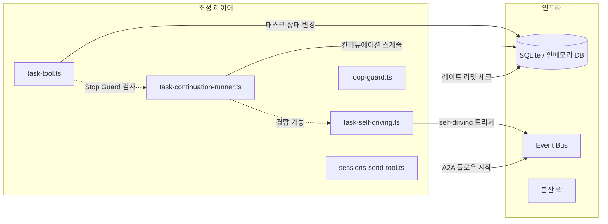
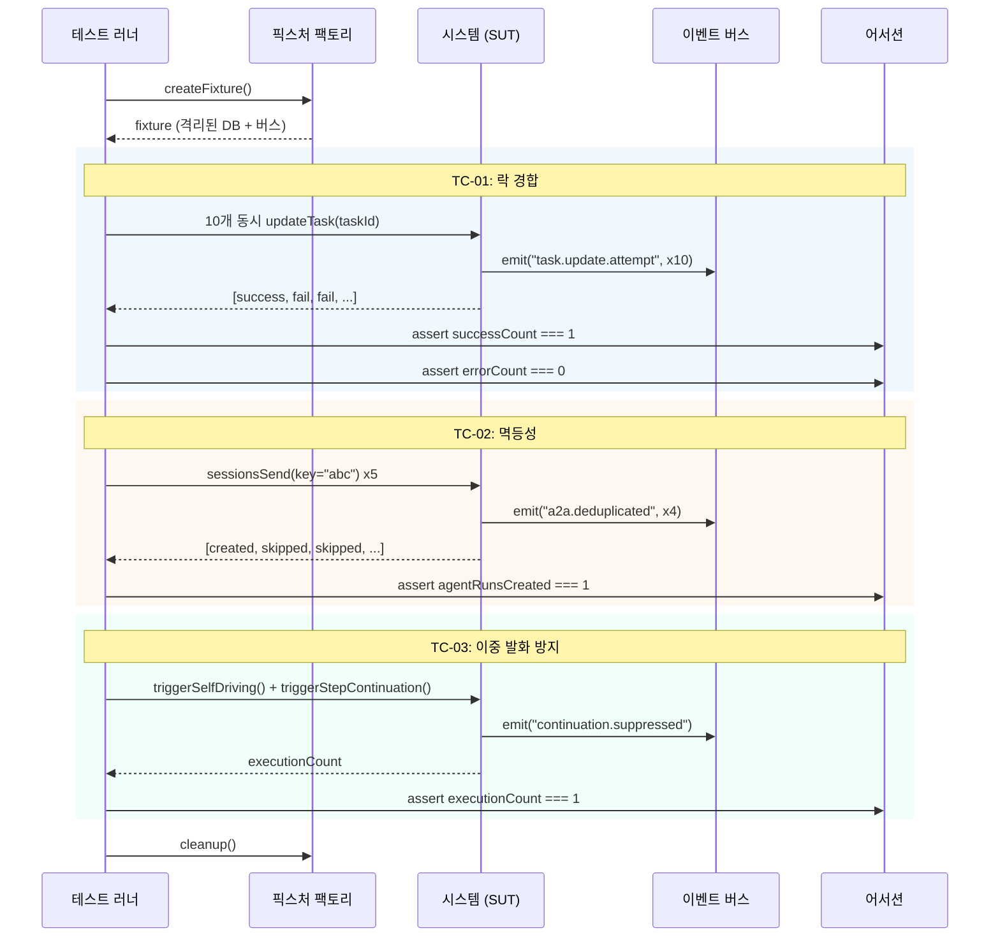
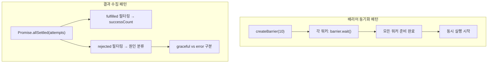

# 조정 불변량 테스트 스위트

> 작성일: 2026-02-19
> 상태: 설계 문서
> 우선순위: 높음
> 노력 추정: L (1~2일)

---

## 1. 문제 정의

현재 시스템은 개별 컴포넌트에 대한 단위 테스트와 e2e 테스트를 갖추고 있다. 하지만 **조정 불변량(coordination invariants)** — 여러 컴포넌트가 함께 동작할 때 반드시 성립해야 하는 교차 속성들 — 을 전담하는 테스트 스위트가 없다.

문제의 핵심은 **창발적 동작(emergent behavior)**이다. 컴포넌트 테스트는 각 부품이 올바르게 동작하는지 확인하지만, 여러 컴포넌트가 동시에 상호작용할 때 나타나는 경쟁 조건, 중복 실행, 복구 실패 같은 문제는 포착하지 못한다.

### 구체적인 갭

| 불변량 | 현재 테스트 커버리지 | 문제 |
|--------|---------------------|------|
| 락 경합 (동시 태스크 업데이트) | 없음 | 10개 동시 업데이트 시 정확히 1개만 성공해야 함 |
| 멱등성 키 중복 처리 | 없음 | 동일 `idempotencyKey` 5회 전송 시 에이전트 실행 1회만 생성 |
| 컨티뉴에이션 이중 발화 방지 | 암묵적 | self-driving + step-continuation 동시 발화 시 1개만 실행 |
| A2A 재시작 복구 | 없음 | 게이트웨이 재시작 후 진행 중인 A2A 플로우 복구 또는 정상 감지 |
| 루프 가드 효과 | 부분적 | 2개 에이전트 간 빠른 A2A 교환 시 임계값에서 레이트 리밋 작동 |
| Stop Guard 강제 | 단위 테스트만 | 미완료 단계에서 `task_complete` 호출 시 거부 |
| 동시 A2A 플로우 | 없음 | N개 동시 `sessions_send` 요청이 모두 완료되거나 큐에 적절히 들어가야 함 |

이 불변량들은 현재 암묵적으로만 테스트되거나 아예 테스트되지 않는다. 시스템이 복잡해질수록 이 갭은 실제 버그로 이어질 가능성이 높다.

---

## 2. 설계 목표

1. **명시적 불변량 문서화**: 각 조정 속성을 코드로 표현하여 회귀를 즉시 감지한다.
2. **창발적 동작 포착**: 컴포넌트 테스트가 놓치는 상호작용 패턴을 검증한다.
3. **기존 테스트 인프라 활용**: Vitest + 기존 6개 설정 파일 체계에 자연스럽게 통합한다.
4. **결정론적 실행**: 타이밍 의존성을 최소화하여 플레이키 테스트를 방지한다.
5. **빠른 피드백**: 전체 스위트가 CI에서 60초 이내에 완료되어야 한다.
6. **독립성**: 각 테스트 케이스가 서로 격리되어 순서에 무관하게 실행 가능해야 한다.

---

## 3. 현재 구현 분석

### 3.1 기존 테스트 파일 구조

```
src/
  agents/tools/
    task-tool.test.ts              — Stop Guard, 태스크 라이프사이클
    sessions-send-tool.a2a.test.ts — A2A 플로우, skipPingPong
  infra/
    task-continuation-runner.test.ts — 좀비 감지, 백오프, 언블록
    task-self-driving.test.ts        — 컨티뉴에이션, 에스컬레이션
  discord/
    loop-guard.test.ts               — 레이트 리밋, 깊이 제한
  gateway/
    server.sessions-send.e2e.test.ts — sessions_send 루프백
```

### 3.2 Vitest 설정 현황

```
vitest.config.ts          — 단위 테스트 (기본)
vitest.e2e.config.ts      — e2e 테스트
vitest.gateway.config.ts  — 게이트웨이 테스트
vitest.live.config.ts     — 라이브 테스트 (실제 키 필요)
vitest.extensions.config.ts — 익스텐션 테스트
vitest.combined.config.ts — 통합 실행
```

### 3.3 커버리지 임계값

V8 커버리지: 라인/브랜치/함수/구문 모두 70% 이상.

### 3.4 핵심 컴포넌트 의존 관계



### 3.5 현재 테스트의 한계

`task-continuation-runner.test.ts`는 단일 컨티뉴에이션 실행을 검증하지만, self-driving과 동시에 발화하는 시나리오는 다루지 않는다. `sessions-send-tool.a2a.test.ts`는 단일 A2A 플로우를 검증하지만, N개 동시 플로우의 큐잉 동작은 검증하지 않는다.

---

## 4. 상세 설계

### 4.1 TypeScript 인터페이스

```typescript
// src/infra/coordination-invariants.e2e.test.ts

/** 불변량 테스트 픽스처 — 각 테스트 케이스에 주입되는 의존성 */
interface CoordinationTestFixture {
  /** 격리된 인메모리 DB 인스턴스 */
  db: TestDatabase;
  /** 이벤트 캡처용 버스 */
  eventBus: TestEventBus;
  /** 모의 에이전트 런너 */
  agentRunner: MockAgentRunner;
  /** 테스트용 세션 팩토리 */
  sessionFactory: TestSessionFactory;
  /** 정리 함수 */
  cleanup: () => Promise<void>;
}

/** 락 경합 테스트 결과 */
interface LockContentionResult {
  /** 성공한 업데이트 수 (정확히 1이어야 함) */
  successCount: number;
  /** 우아하게 실패한 업데이트 수 */
  gracefulFailCount: number;
  /** 예외로 실패한 업데이트 수 (0이어야 함) */
  errorCount: number;
  /** 각 시도의 결과 */
  attempts: Array<{
    index: number;
    result: "success" | "graceful_fail" | "error";
    error?: Error;
  }>;
}

/** 멱등성 테스트 결과 */
interface IdempotencyResult {
  /** 생성된 에이전트 실행 수 (정확히 1이어야 함) */
  agentRunsCreated: number;
  /** 중복으로 거부된 요청 수 */
  duplicatesRejected: number;
  /** 최종 태스크 상태 */
  finalTaskState: TaskState;
}

/** 컨티뉴에이션 이중 발화 테스트 결과 */
interface ContinuationDoubleFire {
  /** 실제로 실행된 컨티뉴에이션 수 (정확히 1이어야 함) */
  executionCount: number;
  /** 어떤 경로가 실행되었는지 */
  executedPath: "self-driving" | "step-continuation" | "unknown";
  /** 억제된 경로 */
  suppressedPath: "self-driving" | "step-continuation" | "none";
}

/** A2A 재시작 복구 테스트 결과 */
interface A2ARestartRecovery {
  /** 재시작 전 플로우 상태 */
  preRestartState: A2AFlowState;
  /** 재시작 후 플로우 상태 */
  postRestartState: A2AFlowState;
  /** 복구 성공 여부 */
  recovered: boolean;
  /** 복구 방식 */
  recoveryMethod: "full-recovery" | "clean-detection" | "failed";
}

/** 루프 가드 효과 테스트 결과 */
interface LoopGuardResult {
  /** 레이트 리밋 발동 전 교환 횟수 */
  exchangesBeforeLimit: number;
  /** 레이트 리밋 발동 여부 */
  rateLimitTriggered: boolean;
  /** 레이트 리밋 발동 시점의 교환 횟수 */
  limitTriggeredAt: number;
}

/** 동시 A2A 플로우 테스트 결과 */
interface ConcurrentA2AResult {
  /** 총 요청 수 */
  totalRequests: number;
  /** 완료된 플로우 수 */
  completedFlows: number;
  /** 큐에 들어간 플로우 수 */
  queuedFlows: number;
  /** 실패한 플로우 수 (0이어야 함) */
  failedFlows: number;
}

type TaskState = "pending" | "running" | "completed" | "failed" | "cancelled";
type A2AFlowState = "active" | "suspended" | "completed" | "failed" | "unknown";
```

### 4.2 테스트 케이스 설계

#### TC-01: 락 경합 (동시 태스크 업데이트)

```typescript
describe("TC-01: 락 경합", () => {
  it("10개 동시 태스크 업데이트 중 정확히 1개만 성공해야 한다", async () => {
    // 동일 taskId에 대해 10개 동시 업데이트 시도
    // 결과: successCount === 1, gracefulFailCount === 9, errorCount === 0
  });
});
```

#### TC-02: 멱등성 키 중복 처리

```typescript
describe("TC-02: 멱등성", () => {
  it("동일 idempotencyKey로 5회 전송 시 에이전트 실행이 1회만 생성되어야 한다", async () => {
    // 동일 idempotencyKey로 5회 sessions_send 호출
    // 결과: agentRunsCreated === 1, duplicatesRejected === 4
  });
});
```

#### TC-03: 컨티뉴에이션 이중 발화 방지

```typescript
describe("TC-03: 컨티뉴에이션 이중 발화", () => {
  it("self-driving과 step-continuation이 동시에 발화해도 1개만 실행되어야 한다", async () => {
    // 두 경로를 동시에 트리거
    // 결과: executionCount === 1
  });
});
```

#### TC-04: A2A 재시작 복구

```typescript
describe("TC-04: A2A 재시작 복구", () => {
  it("게이트웨이 재시작 후 진행 중인 A2A 플로우를 복구하거나 정상 감지해야 한다", async () => {
    // A2A 플로우 시작 → 중간에 재시작 시뮬레이션 → 복구 확인
    // 결과: recovered === true 또는 recoveryMethod === "clean-detection"
  });
});
```

### 4.3 테스트 헬퍼 설계

```typescript
/** 결정론적 동시성 테스트를 위한 배리어 동기화 */
interface TestBarrier {
  /** 모든 참여자가 준비될 때까지 대기 */
  wait(): Promise<void>;
  /** 참여자 수 */
  readonly count: number;
}

/** 게이트웨이 재시작 시뮬레이터 */
interface GatewayRestartSimulator {
  /** 현재 상태를 스냅샷으로 저장 */
  snapshot(): Promise<GatewaySnapshot>;
  /** 스냅샷에서 복원 */
  restore(snapshot: GatewaySnapshot): Promise<void>;
  /** 진행 중인 연결 강제 종료 */
  forceDisconnect(): Promise<void>;
}

/** 이벤트 캡처 버스 */
interface TestEventBus {
  /** 발생한 이벤트 목록 */
  readonly events: CoordinationEvent[];
  /** 특정 이벤트 타입 대기 */
  waitFor(eventType: string, timeout?: number): Promise<CoordinationEvent>;
  /** 이벤트 초기화 */
  clear(): void;
}
```

### 4.4 전체 테스트 플로우 다이어그램



### 4.5 동시성 제어 패턴



---

## 5. 구현 계획

### Phase 1: 인프라 설정 (0.5일)

**목표**: 테스트 픽스처와 헬퍼 유틸리티 구축

1. `src/infra/test-helpers/coordination-fixture.ts` 생성
   - `createCoordinationFixture()` 팩토리 함수
   - 격리된 인메모리 DB 설정
   - `TestEventBus` 구현
   - `TestBarrier` 구현

2. `src/infra/test-helpers/gateway-restart-simulator.ts` 생성
   - `GatewayRestartSimulator` 구현
   - 상태 스냅샷/복원 로직

3. `vitest.coordination.config.ts` 생성
   - e2e 설정 기반으로 조정 불변량 전용 설정
   - 타임아웃: 30초 (개별 테스트), 120초 (전체 스위트)
   - 단일 스레드 실행 (`singleThread: true`) — 동시성 테스트의 결정론성 보장

### Phase 2: 핵심 불변량 테스트 구현 (1일)

**목표**: TC-01 ~ TC-04 구현

**TC-01 구현 세부사항**:
```typescript
// 배리어로 10개 고루틴을 동시에 출발시킨다
const barrier = createBarrier(10);
const attempts = await Promise.allSettled(
  Array.from({ length: 10 }, async (_, i) => {
    await barrier.wait();
    return updateTask(taskId, { status: "running", updatedBy: i });
  })
);
```

**TC-02 구현 세부사항**:
```typescript
// 동일 키로 5회 동시 전송
const key = `test-idempotency-${Date.now()}`;
const results = await Promise.allSettled(
  Array.from({ length: 5 }, () =>
    sessionsSend({ idempotencyKey: key, targetSession: "agent-b" })
  )
);
```

**TC-03 구현 세부사항**:
```typescript
// 두 경로를 동시에 트리거하고 이벤트 버스로 실행 횟수 추적
const [selfDriving, stepCont] = await Promise.all([
  triggerSelfDriving(taskId),
  triggerStepContinuation(taskId),
]);
const executions = eventBus.events.filter(e => e.type === "continuation.executed");
```

### Phase 3: 고급 불변량 테스트 구현 (0.5일)

**목표**: TC-04 ~ TC-07 구현

**TC-04 (A2A 재시작)**: 게이트웨이 재시작 시뮬레이터 활용, 개선 #2 유무에 따른 분기 처리

**TC-05 (루프 가드)**: 두 에이전트 간 빠른 메시지 교환 루프, 레이트 리밋 발동 시점 검증

**TC-06 (Stop Guard)**: 미완료 단계가 있는 태스크에 `task_complete` 호출, 거부 응답 검증

**TC-07 (동시 A2A)**: N=5, 10, 20으로 파라미터화된 동시 `sessions_send` 테스트

---

## 6. 영향 받는 파일

| 파일 경로 | 변경 유형 | 설명 |
|-----------|-----------|------|
| `src/infra/coordination-invariants.e2e.test.ts` | 신규 생성 | 메인 테스트 스위트 |
| `src/infra/test-helpers/coordination-fixture.ts` | 신규 생성 | 픽스처 팩토리 및 헬퍼 |
| `src/infra/test-helpers/gateway-restart-simulator.ts` | 신규 생성 | 재시작 시뮬레이터 |
| `src/infra/test-helpers/test-barrier.ts` | 신규 생성 | 배리어 동기화 유틸리티 |
| `src/infra/test-helpers/test-event-bus.ts` | 신규 생성 | 이벤트 캡처 버스 |
| `vitest.coordination.config.ts` | 신규 생성 | 조정 불변량 전용 Vitest 설정 |
| `package.json` | 수정 | `test:coordination` 스크립트 추가 |
| `src/agents/tools/task-tool.ts` | 수정 가능 | 테스트 훅 노출 (필요 시) |
| `src/infra/task-continuation-runner.ts` | 수정 가능 | 테스트 훅 노출 (필요 시) |
| `src/agents/tools/sessions-send-tool.ts` | 수정 가능 | 멱등성 키 추적 인터페이스 노출 |

---

## 7. 테스트 전략

### 7.1 결정론성 확보

동시성 테스트에서 가장 큰 위험은 타이밍 의존성이다. 이를 해결하기 위해:

- **배리어 동기화**: 모든 고루틴이 준비된 후 동시에 출발
- **단일 스레드 실행**: `singleThread: true`로 Node.js 이벤트 루프 내 동시성만 테스트
- **인메모리 DB**: 파일 I/O 지연 제거
- **타임아웃 명시**: 각 테스트에 `timeout: 10_000` 설정

### 7.2 격리 전략

```typescript
beforeEach(async () => {
  fixture = await createCoordinationFixture();
});

afterEach(async () => {
  await fixture.cleanup();
});
```

각 테스트는 독립적인 DB 인스턴스와 이벤트 버스를 사용한다. 전역 상태 공유 없음.

### 7.3 파라미터화 테스트

동시 A2A 플로우 테스트는 `test.each`로 파라미터화:

```typescript
test.each([
  { n: 5, expectedCompleted: 5 },
  { n: 10, expectedCompleted: 10 },
  { n: 20, expectedCompleted: 20 },
])("N=$n 동시 A2A 플로우 — 모두 완료 또는 큐잉", async ({ n, expectedCompleted }) => {
  // ...
});
```

### 7.4 CI 통합

```yaml
# .github/workflows/ci.yml 추가 스텝
- name: 조정 불변량 테스트
  run: pnpm test:coordination
  timeout-minutes: 5
```

---

## 8. 위험 평가

| 위험 | 가능성 | 영향 | 완화 방안 |
|------|--------|------|-----------|
| 플레이키 테스트 (타이밍 의존) | 중간 | 높음 | 배리어 동기화, 단일 스레드 실행 |
| 테스트 격리 실패 (전역 상태 오염) | 낮음 | 높음 | beforeEach/afterEach에서 완전 정리 |
| TC-04 (재시작 복구)가 개선 #2 없이 불안정 | 높음 | 중간 | 개선 #2 유무에 따른 조건부 어서션 |
| 인메모리 DB가 실제 SQLite 동작과 다름 | 중간 | 중간 | 핵심 케이스는 실제 DB로도 검증 |
| 동시성 테스트가 CI 환경에서 느림 | 낮음 | 낮음 | 타임아웃 여유 있게 설정 (30초) |

---

## 9. 의존성

### 내부 의존성

- **개선 #2 (A2A 재시작 복구)**: TC-04는 개선 #2가 구현된 경우 전체 복구를 검증하고, 없는 경우 정상 감지만 검증한다. 개선 #2 없이도 TC-04를 작성할 수 있지만, 어서션이 달라진다.
- `src/infra/task-continuation-runner.ts` — TC-03의 컨티뉴에이션 경로 접근
- `src/agents/tools/sessions-send-tool.ts` — TC-02, TC-07의 멱등성 키 처리
- `src/discord/loop-guard.ts` — TC-05의 레이트 리밋 로직

### 외부 의존성

- Vitest 1.x (기존 버전 유지)
- `@vitest/coverage-v8` (기존)
- 추가 npm 패키지 없음

---

## 10. 노력 추정

| 작업 | 추정 시간 |
|------|-----------|
| Phase 1: 인프라 설정 (픽스처, 헬퍼, Vitest 설정) | 4시간 |
| Phase 2: TC-01 ~ TC-04 구현 | 6시간 |
| Phase 3: TC-05 ~ TC-07 구현 | 3시간 |
| 플레이키 테스트 디버깅 및 안정화 | 2시간 |
| CI 통합 및 문서화 | 1시간 |
| **합계** | **16시간 (약 2일)** |

### 복잡도 분류: L

TC-04 (재시작 복구)가 가장 복잡하다. 게이트웨이 상태를 직렬화/역직렬화하는 시뮬레이터를 만들어야 하고, 개선 #2 유무에 따른 분기 처리도 필요하다. 나머지 케이스들은 비교적 직관적이다.

---

## 부록: 예상 테스트 출력

```
src/infra/coordination-invariants.e2e.test.ts

  조정 불변량 테스트 스위트
    TC-01: 락 경합
      ✓ 10개 동시 태스크 업데이트 중 정확히 1개만 성공해야 한다 (234ms)
    TC-02: 멱등성
      ✓ 동일 idempotencyKey로 5회 전송 시 에이전트 실행이 1회만 생성되어야 한다 (89ms)
    TC-03: 컨티뉴에이션 이중 발화 방지
      ✓ self-driving과 step-continuation이 동시에 발화해도 1개만 실행되어야 한다 (156ms)
    TC-04: A2A 재시작 복구
      ✓ 게이트웨이 재시작 후 진행 중인 A2A 플로우를 복구하거나 정상 감지해야 한다 (1.2s)
    TC-05: 루프 가드 효과
      ✓ 2개 에이전트 간 빠른 A2A 교환 시 임계값에서 레이트 리밋이 작동해야 한다 (445ms)
    TC-06: Stop Guard 강제
      ✓ 미완료 단계에서 task_complete 호출 시 거부되어야 한다 (45ms)
    TC-07: 동시 A2A 플로우
      ✓ N=5 동시 A2A 플로우 — 모두 완료 또는 큐잉 (678ms)
      ✓ N=10 동시 A2A 플로우 — 모두 완료 또는 큐잉 (1.1s)
      ✓ N=20 동시 A2A 플로우 — 모두 완료 또는 큐잉 (2.3s)

  9 tests passed (6.3s)
```
