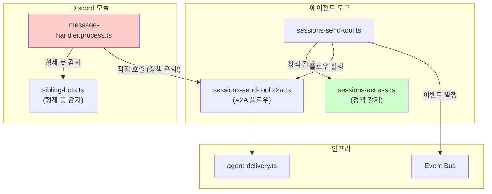
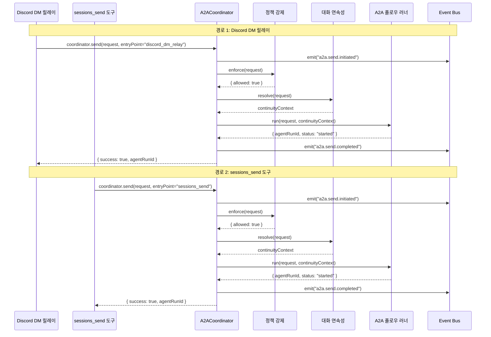

# Discord A2A 크로스플레인 통합

> 작성일: 2026-02-19
> 상태: 설계 문서
> 우선순위: 높음
> 노력 추정: M-L (1~2일)

---

## 1. 문제 정의

A2A(Agent-to-Agent) 통신이 두 개의 분리된 코드 경로를 통해 흐르고 있다. 두 경로 모두 "에이전트 조정" 로직을 구현하지만, 서로 독립적으로 발전해왔다.

### 경로 1: sessions_send 경로

```
에이전트 → sessions_send 도구 → 게이트웨이 라우팅 → 에이전트 스폰 → A2A 플로우
```

- 위치: `src/agents/tools/sessions-send-tool.ts`
- 특징: 완전한 정책 강제, 이벤트 발행, 대화 연속성 처리

### 경로 2: Discord DM 릴레이 경로

```
Discord DM → 형제 봇 감지 → 에이전트 스폰 → A2A 플로우 (직접 호출)
```

- 위치: `src/discord/monitor/message-handler.process.ts` (약 434번째 줄)
- 특징: 자체 라우팅 로직, 일부 sessions_send 정책/이벤트 로직 우회

### 핵심 문제

두 경로가 겹치는 로직을 각자 구현하고 있다. A2A 정책, 이벤트 발행, 대화 연속성에 변경이 생기면 **두 곳을 모두 수정**해야 한다. 이는 관례에 의한 정확성(correctness-by-convention)이지, 구조에 의한 정확성(correctness-by-construction)이 아니다.

실제로 발생할 수 있는 버그 시나리오:
- sessions_send에 새 정책 검사를 추가했지만 Discord 경로에는 빠뜨림
- 이벤트 발행 로직을 수정했지만 Discord 경로의 직접 호출은 그대로
- 대화 연속성 버그를 sessions_send에서 수정했지만 Discord 경로는 여전히 구버전 동작

---

## 2. 설계 목표

1. **단일 진실 공급원**: A2A 조정 로직이 한 곳에만 존재한다.
2. **구조에 의한 정확성**: 새 A2A 진입점을 추가하면 자동으로 모든 정책이 적용된다.
3. **Discord 관심사 분리**: 형제 봇 감지, DM 포맷팅 같은 Discord 고유 로직은 Discord 모듈에 남는다.
4. **하위 호환성**: 기존 sessions_send 동작이 변경되지 않는다.
5. **테스트 가능성**: `A2ACoordinator`를 독립적으로 단위 테스트할 수 있다.
6. **점진적 마이그레이션**: 한 번에 전체를 바꾸지 않고 단계적으로 이전할 수 있다.

---

## 3. 현재 구현 분석

### 3.1 sessions_send 경로 상세

```typescript
// src/agents/tools/sessions-send-tool.ts (개략)
export async function sessionsSendTool(params: SessionsSendParams) {
  // 1. 정책 검사 (sessions-access.ts)
  await enforceA2APolicy(params);

  // 2. 대화 연속성 처리
  const continuityContext = await resolveConversationContinuity(params);

  // 3. 이벤트 발행
  eventBus.emit("a2a.send.initiated", { ...params });

  // 4. A2A 플로우 실행
  await runSessionsSendA2AFlow(params, continuityContext);

  // 5. 완료 이벤트
  eventBus.emit("a2a.send.completed", { ...params });
}
```

### 3.2 Discord DM 릴레이 경로 상세

```typescript
// src/discord/monitor/message-handler.process.ts (약 434번째 줄, 개략)
if (isSiblingBotMessage(message)) {
  // Discord 고유 로직: 형제 봇 감지, DM 파싱
  const a2aParams = extractA2AParams(message);

  // 문제: runSessionsSendA2AFlow를 직접 호출
  // sessions-access.ts 정책 검사 없음
  // 이벤트 발행 없음
  // 대화 연속성 처리 없음
  void runSessionsSendA2AFlow(a2aParams);
}
```

### 3.3 공유 모듈 현황

```
src/agents/tools/sessions-send-tool.a2a.ts  — A2A 플로우 오케스트레이션 (두 경로가 공유)
src/agents/tools/sessions-access.ts         — A2A 정책 강제 (sessions_send만 사용)
src/discord/monitor/sibling-bots.ts         — 형제 봇 레지스트리 (Discord만 사용)
src/infra/outbound/agent-delivery.ts        — 배달 계획 해결
```

### 3.4 현재 아키텍처 다이어그램



빨간색으로 표시된 `message-handler.process.ts`의 직접 호출이 문제의 핵심이다.

---

## 4. 상세 설계

### 4.1 제안하는 아키텍처

`A2ACoordinator` 클래스/모듈을 도입하여 정책, 연속성, 이벤트를 캡슐화한다. 두 진입점 모두 이 코디네이터를 통해 A2A 플로우를 시작한다.

```mermaid
graph TB
    subgraph 에이전트 도구
        SST["sessions-send-tool.ts"]
    end

    subgraph Discord 모듈
        MHP["message-handler.process.ts"]
        SB["sibling-bots.ts<br/>(형제 봇 감지)"]
    end

    subgraph A2A 코디네이터 (신규)
        COORD["A2ACoordinator<br/>src/agents/a2a/coordinator.ts"]
        SA["sessions-access.ts<br/>(정책 강제)"]
        A2AF["sessions-send-tool.a2a.ts<br/>(A2A 플로우)"]
        CC["conversation-continuity.ts<br/>(대화 연속성)"]
    end

    subgraph 인프라
        BUS["Event Bus"]
        AD["agent-delivery.ts"]
    end

    SST -->|"coordinator.send()"| COORD
    MHP -->|"coordinator.send()"| COORD
    MHP -->|"형제 봇 감지"| SB

    COORD --> SA
    COORD --> CC
    COORD --> A2AF
    COORD -->|"이벤트 발행"| BUS
    A2AF --> AD

    style COORD fill:#cce5ff
    style SST fill:#ccffcc
    style MHP fill:#ccffcc
```

### 4.2 TypeScript 인터페이스

```typescript
// src/agents/a2a/coordinator.ts

/** A2A 전송 요청 — 두 진입점이 공통으로 사용 */
export interface A2ASendRequest {
  /** 대상 세션 ID */
  targetSessionId: string;
  /** 전송할 메시지 */
  message: string;
  /** 멱등성 키 (선택) */
  idempotencyKey?: string;
  /** 핑퐁 건너뛰기 여부 */
  skipPingPong?: boolean;
  /** 발신 컨텍스트 — 정책 검사에 사용 */
  senderContext: A2ASenderContext;
  /** 진입점 식별자 — 로깅/메트릭용 */
  entryPoint: "sessions_send" | "discord_dm_relay" | string;
}

/** 발신자 컨텍스트 */
export interface A2ASenderContext {
  /** 발신 세션 ID */
  sessionId: string;
  /** 발신 에이전트 ID */
  agentId?: string;
  /** 발신 채널 */
  channel?: string;
  /** 추가 메타데이터 */
  metadata?: Record<string, unknown>;
}

/** A2A 전송 결과 */
export interface A2ASendResult {
  /** 성공 여부 */
  success: boolean;
  /** 생성된 에이전트 실행 ID */
  agentRunId?: string;
  /** 중복 감지 여부 */
  deduplicated?: boolean;
  /** 정책 거부 여부 */
  policyRejected?: boolean;
  /** 거부 이유 */
  rejectionReason?: string;
  /** 오류 (실패 시) */
  error?: Error;
}

/** A2A 코디네이터 인터페이스 */
export interface IA2ACoordinator {
  /**
   * A2A 메시지를 전송한다.
   * 정책 검사, 대화 연속성, 이벤트 발행을 모두 처리한다.
   */
  send(request: A2ASendRequest): Promise<A2ASendResult>;

  /**
   * 정책 검사만 수행한다 (실제 전송 없음).
   * 사전 검증이 필요한 경우 사용.
   */
  checkPolicy(request: A2ASendRequest): Promise<A2APolicyCheckResult>;
}

/** 정책 검사 결과 */
export interface A2APolicyCheckResult {
  allowed: boolean;
  reason?: string;
  /** 허용되지만 경고가 있는 경우 */
  warnings?: string[];
}

/** A2A 코디네이터 의존성 */
export interface A2ACoordinatorDeps {
  policyEnforcer: IA2APolicyEnforcer;
  continuityResolver: IA2AContinuityResolver;
  flowRunner: IA2AFlowRunner;
  eventBus: IEventBus;
  logger: ILogger;
}

/** 정책 강제 인터페이스 */
export interface IA2APolicyEnforcer {
  enforce(request: A2ASendRequest): Promise<A2APolicyCheckResult>;
}

/** 대화 연속성 해결 인터페이스 */
export interface IA2AContinuityResolver {
  resolve(request: A2ASendRequest): Promise<A2AContinuityContext>;
}

/** A2A 플로우 실행 인터페이스 */
export interface IA2AFlowRunner {
  run(
    request: A2ASendRequest,
    continuity: A2AContinuityContext
  ): Promise<A2AFlowResult>;
}

/** 대화 연속성 컨텍스트 */
export interface A2AContinuityContext {
  /** 이전 대화 히스토리 포함 여부 */
  includeHistory: boolean;
  /** 포함할 히스토리 항목 수 */
  historyDepth?: number;
  /** 연속성 토큰 */
  continuityToken?: string;
}

/** A2A 플로우 실행 결과 */
export interface A2AFlowResult {
  agentRunId: string;
  status: "started" | "queued" | "deduplicated";
}
```

### 4.3 A2ACoordinator 구현 설계

```typescript
// src/agents/a2a/coordinator.ts

export class A2ACoordinator implements IA2ACoordinator {
  constructor(private readonly deps: A2ACoordinatorDeps) {}

  async send(request: A2ASendRequest): Promise<A2ASendResult> {
    const { policyEnforcer, continuityResolver, flowRunner, eventBus, logger } =
      this.deps;

    // 1. 이벤트: 전송 시작
    eventBus.emit("a2a.send.initiated", {
      entryPoint: request.entryPoint,
      targetSessionId: request.targetSessionId,
      idempotencyKey: request.idempotencyKey,
    });

    // 2. 정책 검사
    const policyResult = await policyEnforcer.enforce(request);
    if (!policyResult.allowed) {
      logger.warn("A2A 전송 정책 거부", {
        reason: policyResult.reason,
        entryPoint: request.entryPoint,
      });
      eventBus.emit("a2a.send.policy_rejected", {
        reason: policyResult.reason,
      });
      return {
        success: false,
        policyRejected: true,
        rejectionReason: policyResult.reason,
      };
    }

    // 3. 대화 연속성 해결
    const continuity = await continuityResolver.resolve(request);

    // 4. A2A 플로우 실행
    let flowResult: A2AFlowResult;
    try {
      flowResult = await flowRunner.run(request, continuity);
    } catch (error) {
      logger.error("A2A 플로우 실행 실패", { error });
      eventBus.emit("a2a.send.failed", { error });
      return { success: false, error: error as Error };
    }

    // 5. 이벤트: 전송 완료
    eventBus.emit("a2a.send.completed", {
      agentRunId: flowResult.agentRunId,
      status: flowResult.status,
      entryPoint: request.entryPoint,
    });

    return {
      success: true,
      agentRunId: flowResult.agentRunId,
      deduplicated: flowResult.status === "deduplicated",
    };
  }

  async checkPolicy(request: A2ASendRequest): Promise<A2APolicyCheckResult> {
    return this.deps.policyEnforcer.enforce(request);
  }
}
```

### 4.4 Discord 진입점 수정 설계

```typescript
// src/discord/monitor/message-handler.process.ts (수정 후)

// 변경 전:
if (isSiblingBotMessage(message)) {
  const a2aParams = extractA2AParams(message);
  void runSessionsSendA2AFlow(a2aParams); // 직접 호출
}

// 변경 후:
if (isSiblingBotMessage(message)) {
  // Discord 고유 로직: 형제 봇 감지, DM 파싱 (그대로 유지)
  const a2aParams = extractA2AParams(message);

  // A2ACoordinator를 통해 전송 (정책, 연속성, 이벤트 자동 적용)
  const result = await a2aCoordinator.send({
    targetSessionId: a2aParams.targetSessionId,
    message: a2aParams.message,
    idempotencyKey: a2aParams.idempotencyKey,
    senderContext: {
      sessionId: currentSessionId,
      channel: "discord",
      metadata: { guildId: message.guildId, channelId: message.channelId },
    },
    entryPoint: "discord_dm_relay",
  });

  if (!result.success && result.policyRejected) {
    logger.warn("Discord A2A 릴레이 정책 거부", { reason: result.rejectionReason });
  }
}
```

### 4.5 전체 플로우 다이어그램



### 4.6 의존성 주입 설계

```typescript
// src/agents/a2a/create-coordinator.ts

export function createA2ACoordinator(
  deps: Partial<A2ACoordinatorDeps> = {}
): A2ACoordinator {
  return new A2ACoordinator({
    policyEnforcer: deps.policyEnforcer ?? new DefaultA2APolicyEnforcer(),
    continuityResolver:
      deps.continuityResolver ?? new DefaultA2AContinuityResolver(),
    flowRunner: deps.flowRunner ?? new DefaultA2AFlowRunner(),
    eventBus: deps.eventBus ?? getGlobalEventBus(),
    logger: deps.logger ?? getLogger("a2a-coordinator"),
  });
}

// 싱글턴 인스턴스 (게이트웨이 초기화 시 생성)
let _coordinator: A2ACoordinator | null = null;

export function getA2ACoordinator(): A2ACoordinator {
  if (!_coordinator) {
    _coordinator = createA2ACoordinator();
  }
  return _coordinator;
}

/** 테스트에서 모의 코디네이터 주입 */
export function setA2ACoordinator(coordinator: A2ACoordinator): void {
  _coordinator = coordinator;
}
```

---

## 5. 구현 계획

### Phase 1: A2ACoordinator 추출 (0.5일)

**목표**: 기존 sessions_send 로직을 코디네이터로 추출하되, 동작 변경 없음

1. `src/agents/a2a/` 디렉토리 생성
2. `src/agents/a2a/coordinator.ts` 구현
   - `A2ACoordinator` 클래스
   - 인터페이스 정의
3. `src/agents/a2a/create-coordinator.ts` 구현
   - 팩토리 함수
   - 싱글턴 관리
4. `src/agents/a2a/policy-enforcer.ts` 구현
   - `sessions-access.ts` 로직을 `IA2APolicyEnforcer`로 래핑
5. `src/agents/a2a/continuity-resolver.ts` 구현
   - 기존 대화 연속성 로직 래핑
6. `src/agents/a2a/flow-runner.ts` 구현
   - `runSessionsSendA2AFlow` 래핑

**검증**: `sessions-send-tool.ts`를 코디네이터를 사용하도록 수정 후 기존 테스트 통과 확인

### Phase 2: Discord 경로 마이그레이션 (0.5일)

**목표**: Discord DM 릴레이가 코디네이터를 통해 A2A 플로우를 시작하도록 변경

1. `message-handler.process.ts`의 직접 `runSessionsSendA2AFlow` 호출을 `coordinator.send()`로 교체
2. Discord 고유 로직 (형제 봇 감지, DM 파싱)은 그대로 유지
3. `entryPoint: "discord_dm_relay"` 메타데이터 추가

**검증**: `sessions-send-tool.a2a.test.ts` 통과, Discord A2A 수동 테스트

### Phase 3: 테스트 및 정리 (0.5일)

**목표**: 새 코디네이터에 대한 단위 테스트 추가, 불필요한 코드 제거

1. `src/agents/a2a/coordinator.test.ts` 작성
   - 정책 거부 시나리오
   - 이벤트 발행 검증
   - 멱등성 키 처리
2. `src/agents/a2a/policy-enforcer.test.ts` 작성
3. 기존 `sessions-send-tool.ts`에서 중복 로직 제거
4. `runSessionsSendA2AFlow` 직접 export 제거 (코디네이터를 통해서만 접근)

---

## 6. 영향 받는 파일

| 파일 경로 | 변경 유형 | 설명 |
|-----------|-----------|------|
| `src/agents/a2a/coordinator.ts` | 신규 생성 | A2ACoordinator 클래스 및 인터페이스 |
| `src/agents/a2a/create-coordinator.ts` | 신규 생성 | 팩토리 함수 및 싱글턴 관리 |
| `src/agents/a2a/policy-enforcer.ts` | 신규 생성 | sessions-access.ts 래퍼 |
| `src/agents/a2a/continuity-resolver.ts` | 신규 생성 | 대화 연속성 래퍼 |
| `src/agents/a2a/flow-runner.ts` | 신규 생성 | A2A 플로우 러너 래퍼 |
| `src/agents/a2a/coordinator.test.ts` | 신규 생성 | 코디네이터 단위 테스트 |
| `src/agents/tools/sessions-send-tool.ts` | 수정 | 코디네이터 사용으로 리팩터링 |
| `src/agents/tools/sessions-send-tool.a2a.ts` | 수정 | 직접 export 제한, 코디네이터 내부용으로 변경 |
| `src/agents/tools/sessions-access.ts` | 수정 가능 | IA2APolicyEnforcer 인터페이스 구현 추가 |
| `src/discord/monitor/message-handler.process.ts` | 수정 | 직접 호출 → coordinator.send() |
| `src/discord/monitor/sibling-bots.ts` | 변경 없음 | Discord 고유 로직, 그대로 유지 |
| `src/infra/outbound/agent-delivery.ts` | 변경 없음 | 코디네이터 내부에서 간접 사용 |

---

## 7. 테스트 전략

### 7.1 코디네이터 단위 테스트

```typescript
// src/agents/a2a/coordinator.test.ts

describe("A2ACoordinator", () => {
  describe("send()", () => {
    it("정책이 허용하면 A2A 플로우를 실행해야 한다", async () => {
      const mockPolicy = { enforce: vi.fn().mockResolvedValue({ allowed: true }) };
      const mockFlow = { run: vi.fn().mockResolvedValue({ agentRunId: "run-1", status: "started" }) };
      const coordinator = createA2ACoordinator({ policyEnforcer: mockPolicy, flowRunner: mockFlow });

      const result = await coordinator.send(makeRequest());

      expect(result.success).toBe(true);
      expect(mockFlow.run).toHaveBeenCalledOnce();
    });

    it("정책이 거부하면 플로우를 실행하지 않아야 한다", async () => {
      const mockPolicy = {
        enforce: vi.fn().mockResolvedValue({ allowed: false, reason: "rate_limit" }),
      };
      const mockFlow = { run: vi.fn() };
      const coordinator = createA2ACoordinator({ policyEnforcer: mockPolicy, flowRunner: mockFlow });

      const result = await coordinator.send(makeRequest());

      expect(result.success).toBe(false);
      expect(result.policyRejected).toBe(true);
      expect(mockFlow.run).not.toHaveBeenCalled();
    });

    it("이벤트를 올바른 순서로 발행해야 한다", async () => {
      const events: string[] = [];
      const mockBus = { emit: vi.fn((type) => events.push(type)) };
      const coordinator = createA2ACoordinator({ eventBus: mockBus });

      await coordinator.send(makeRequest());

      expect(events[0]).toBe("a2a.send.initiated");
      expect(events[events.length - 1]).toBe("a2a.send.completed");
    });

    it("entryPoint 메타데이터가 이벤트에 포함되어야 한다", async () => {
      const mockBus = { emit: vi.fn() };
      const coordinator = createA2ACoordinator({ eventBus: mockBus });

      await coordinator.send(makeRequest({ entryPoint: "discord_dm_relay" }));

      expect(mockBus.emit).toHaveBeenCalledWith(
        "a2a.send.initiated",
        expect.objectContaining({ entryPoint: "discord_dm_relay" })
      );
    });
  });
});
```

### 7.2 통합 테스트

기존 `sessions-send-tool.a2a.test.ts`가 코디네이터 도입 후에도 통과해야 한다. 추가로:

- Discord DM 릴레이 경로가 코디네이터를 통해 정책 검사를 받는지 검증
- 두 경로에서 발행된 이벤트 구조가 동일한지 검증

### 7.3 회귀 방지

```typescript
// 코디네이터를 우회하는 직접 호출이 없는지 확인하는 린트 규칙 (선택)
// eslint 커스텀 규칙 또는 grep 기반 CI 체크
// "runSessionsSendA2AFlow" 직접 import가 coordinator.ts 외부에 없어야 함
```

---

## 8. 위험 평가

| 위험 | 가능성 | 영향 | 완화 방안 |
|------|--------|------|-----------|
| sessions_send 동작 변경 (회귀) | 낮음 | 높음 | Phase 1에서 기존 테스트 전체 통과 확인 후 진행 |
| Discord A2A 릴레이 동작 변경 | 중간 | 높음 | Discord 경로 수동 테스트 + 통합 테스트 추가 |
| 코디네이터 싱글턴 초기화 순서 문제 | 낮음 | 중간 | 게이트웨이 초기화 시퀀스에서 명시적 초기화 |
| 정책 강제 로직 래핑 시 미묘한 동작 차이 | 중간 | 중간 | sessions-access.ts 래퍼를 얇게 유지, 로직 복사 금지 |
| 테스트에서 싱글턴 상태 오염 | 낮음 | 중간 | `setA2ACoordinator()` + afterEach 정리 |

---

## 9. 의존성

### 내부 의존성

- `src/agents/tools/sessions-send-tool.a2a.ts` — 코디네이터의 `IA2AFlowRunner` 구현이 이 모듈을 래핑
- `src/agents/tools/sessions-access.ts` — 코디네이터의 `IA2APolicyEnforcer` 구현이 이 모듈을 래핑
- `src/discord/monitor/message-handler.process.ts` — Phase 2에서 수정 대상

### 선택적 의존성

- **개선 #9 (조정 불변량 테스트)**: 코디네이터 도입 후 TC-02 (멱등성), TC-07 (동시 A2A)를 코디네이터 레벨에서 테스트할 수 있다. 두 개선이 함께 진행되면 시너지가 있다.

### 외부 의존성

- 추가 npm 패키지 없음
- TypeScript 인터페이스만 추가

---

## 10. 노력 추정

| 작업 | 추정 시간 |
|------|-----------|
| Phase 1: A2ACoordinator 추출 및 sessions_send 마이그레이션 | 5시간 |
| Phase 2: Discord 경로 마이그레이션 | 3시간 |
| Phase 3: 테스트 작성 및 정리 | 4시간 |
| 회귀 테스트 및 수동 검증 | 2시간 |
| **합계** | **14시간 (약 1.5~2일)** |

### 복잡도 분류: M-L

기술적으로 어렵지 않다. 기존 로직을 새 인터페이스로 래핑하는 작업이 대부분이다. 복잡도의 주요 원인은 두 가지다.

첫째, Discord 경로의 동작을 정확히 이해하고 코디네이터로 이전할 때 미묘한 차이가 없는지 확인해야 한다. 둘째, 싱글턴 코디네이터의 초기화 순서가 게이트웨이 부트스트랩 시퀀스와 맞아야 한다.

---

## 부록: 마이그레이션 전후 비교

### 변경 전

```
A2A 정책 로직:  sessions-send-tool.ts + (Discord 경로에 없음)
이벤트 발행:    sessions-send-tool.ts + (Discord 경로에 없음)
대화 연속성:    sessions-send-tool.ts + (Discord 경로에 없음)
A2A 플로우:     sessions-send-tool.a2a.ts (두 경로가 직접 호출)
```

### 변경 후

```
A2A 정책 로직:  A2ACoordinator (단일 위치)
이벤트 발행:    A2ACoordinator (단일 위치)
대화 연속성:    A2ACoordinator (단일 위치)
A2A 플로우:     A2ACoordinator → flow-runner.ts (단일 위치)

진입점:
  sessions_send 도구 → coordinator.send()
  Discord DM 릴레이  → coordinator.send()
```

새 A2A 진입점을 추가할 때 `coordinator.send()`를 호출하기만 하면 모든 정책, 이벤트, 연속성 처리가 자동으로 적용된다.
