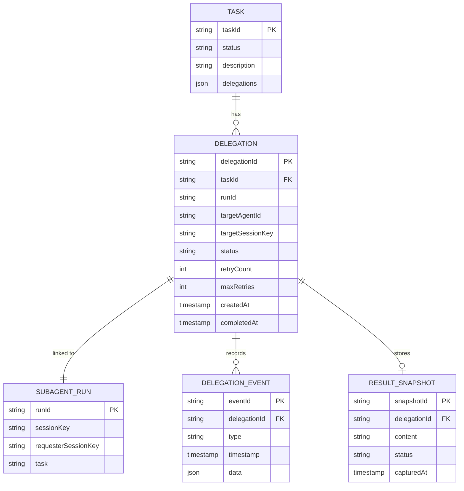
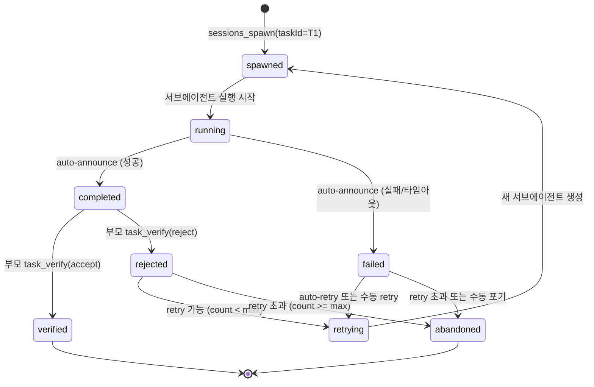
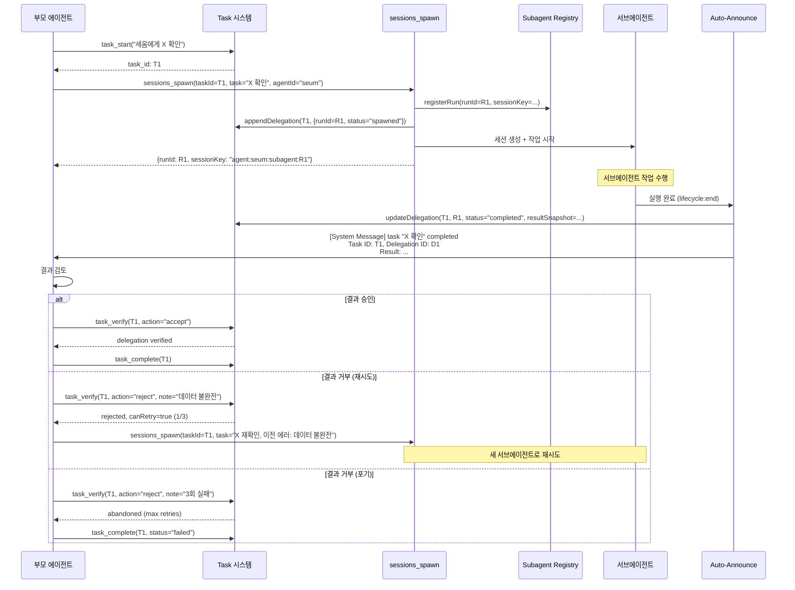
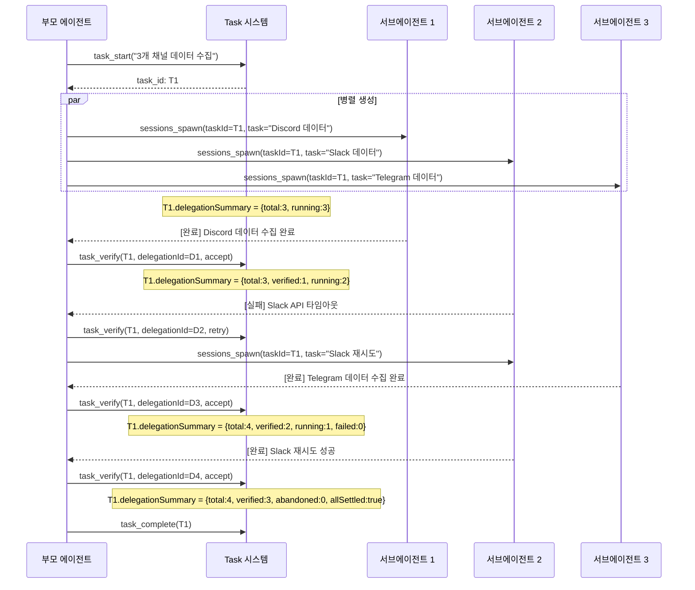

# 서브에이전트-Task 통합 라이프사이클 (Subagent-Task Lifecycle Integration)

> 작성일: 2026-02-19
> 상태: 설계 문서 (구현 전)
> 우선순위: 🔴 높음 (High)
> 노력 추정: XL (3일 이상)
> 대상: `prontolab-openclaw` — `src/agents/tools/`, `src/agents/subagent-*`, `src/plugins/core-hooks/`

---

## 1. 문제 정의

### 1.1 현재 상태: 분리된 두 시스템

현재 코드베이스에는 **서로 연결되지 않은 두 개의 작업 추적 시스템**이 존재한다:

| 시스템 | 위치 | 역할 | 추적 단위 |
|--------|------|------|-----------|
| **Task 시스템** | `src/agents/tools/task-tool.ts` | 메인 에이전트의 작업 CRUD, 상태 추적, enforcer | `task_id` (파일 기반) |
| **Subagent 시스템** | `src/agents/subagent-spawn.ts`, `subagent-announce.ts`, `subagent-registry.ts` | 서브에이전트 생성, 실행, 결과 announce | `runId` (메모리 기반) |

**핵심 문제**: 부모 에이전트가 `sessions_spawn`으로 서브에이전트를 생성할 때 `taskId` 파라미터를 전달할 수 있지만, 이것은 **이벤트 로그 메타데이터일 뿐** 실제 Task 시스템과 연결되지 않는다.

### 1.2 구체적 결함

#### 결함 1: Task 없이 서브에이전트 생성 가능

```typescript
// 현재: task_start() 없이 서브에이전트를 바로 생성할 수 있음
// task-enforcer는 sessions_spawn을 차단하지 않음

// src/plugins/core-hooks/task-enforcer.ts에서
// 차단 대상: write, edit, bash, exec
// 비차단 대상: sessions_spawn, sessions_send, read, grep, ...
```

부모 에이전트가 `sessions_spawn`을 호출하면 task-enforcer가 이를 차단하지 않는다. 결과적으로 "누가 언제 어떤 서브에이전트를 왜 생성했는지" 가 Task 이력에 남지 않는다.

#### 결함 2: Auto-Announce 결과와 Task 상태 불일치

```
시간순:
1. 부모: task_start("보고서 작성")               → task_id: T1
2. 부모: sessions_spawn(task="데이터 수집")       → runId: R1 (T1과 무관)
3. 서브에이전트 R1: 작업 수행 → 완료
4. auto-announce → 부모 세션에 [System Message] 주입
5. 부모: 결과를 읽지만, T1과 R1의 연결을 모름
6. 부모: task_complete(T1)                        → T1 완료 (R1 결과 검증 여부 불명)
```

Task T1의 이력에는 "서브에이전트 R1이 데이터를 수집했고 그 결과가 이것이었다"는 기록이 없다. Task 완료 시점에 서브에이전트 결과가 실제로 검증되었는지도 확인할 수 없다.

#### 결함 3: 실패 시 재시도 메커니즘 부재

```
시간순 (실패 시나리오):
1. 부모: sessions_spawn(task="X 확인")            → runId: R1
2. 서브에이전트 R1: rate_limit 에러 → 실패
3. auto-announce → "[System Message] task failed: rate limit"
4. 부모: 에러 메시지를 받지만...
   - R1과 연결된 Task가 없으므로 retry 카운트 추적 불가
   - 같은 작업을 재시도해도 이전 실패 맥락 없음
   - 최대 재시도 횟수 제한 불가
```

#### 결함 4: 서브에이전트 세션 삭제 시 이력 소실

```typescript
// src/agents/subagent-announce.ts:979-986
if (shouldDeleteChildSession) {
  await callGateway({
    method: "sessions.delete",
    params: { key: params.childSessionKey, deleteTranscript: true },
  });
}
```

`cleanup: "delete"` (기본값)일 때 서브에이전트 세션과 트랜스크립트가 삭제된다. Task 시스템에 결과가 기록되지 않았으므로, 서브에이전트가 무엇을 했는지의 영구 기록이 사라진다.

#### 결함 5: 다중 서브에이전트 조율 어려움

부모가 여러 서브에이전트를 병렬로 생성했을 때:
- 각 서브에이전트의 완료 상태를 Task 레벨에서 추적할 수 없음
- "3개 중 2개 완료, 1개 실패" 같은 상태를 구조적으로 표현할 수 없음
- `subagents list`로 런타임 상태를 볼 수 있지만, 이건 메모리 기반이고 재시작 시 소실

### 1.3 이상적인 흐름 (목표)

```
부모 에이전트                                    서브에이전트
    │                                               │
    ├── task_start("세움에게 X 확인 요청")            │
    │   → task_id: T1 생성                           │
    │                                               │
    ├── sessions_spawn(taskId=T1, task="X 확인")  ──→│  세션 생성
    │   → T1에 "subagent R1 spawned" 이벤트 기록     │  task 컨텍스트 인지
    │   → T1.status = "delegated"                    │
    │                                               │  ... 작업 수행 ...
    │                                               │
    │  ←── auto-announce (taskId=T1) ───────────────┤  완료
    │   → T1에 "subagent R1 completed" 이벤트 기록   │
    │   → T1에 결과 스냅샷 저장                       │
    │                                               │
    ├── 결과 검증 (accept/reject)                     │
    │   → T1에 "verified: pass" 이벤트 기록           │
    │                                               │
    ├── task_complete(T1, verified=true)              │
    │   → 영구 이력에 전체 라이프사이클 기록            │
```

---

## 2. 설계 목표

1. **Task-Subagent 연결**: `sessions_spawn` 시 `taskId`가 있으면 Task와 서브에이전트 run을 양방향 연결한다
2. **라이프사이클 이벤트 기록**: spawn, progress, complete, fail, verify 이벤트를 Task 파일에 기록한다
3. **결과 스냅샷 보존**: auto-announce 시 결과를 Task 파일에 영구 저장한다 (세션 삭제와 무관)
4. **검증 단계 지원**: 부모 에이전트가 결과를 accept/reject/retry 할 수 있는 구조를 제공한다
5. **재시도 추적**: 실패 시 retry 카운트, 이전 에러, 백오프 정보를 Task에서 관리한다
6. **다중 서브에이전트 상태 집계**: 하나의 Task에 연결된 여러 서브에이전트의 상태를 집계한다
7. **역호환성**: `taskId` 없이 `sessions_spawn`을 호출하면 현재와 동일하게 동작한다
8. **서브에이전트 도구 정책 유지**: 서브에이전트는 여전히 task 도구를 직접 사용하지 않는다 (부모가 관리)

---

## 3. 현재 구현 분석

### 3.1 sessions_spawn 도구 (현재)

```typescript
// src/agents/tools/sessions-spawn-tool.ts
const SessionsSpawnToolSchema = Type.Object({
  task: Type.String(),                                    // 작업 설명 (필수)
  label: Type.Optional(Type.String()),                    // 표시 라벨
  agentId: Type.Optional(Type.String()),                  // 대상 에이전트
  model: Type.Optional(Type.String()),                    // 모델 오버라이드
  thinking: Type.Optional(Type.String()),                 // thinking 모드
  runTimeoutSeconds: Type.Optional(Type.Number()),        // 타임아웃
  cleanup: optionalStringEnum(["delete", "keep"]),        // 세션 정리
  taskId: Type.Optional(Type.String()),                   // ← 있지만 메타데이터용
  workSessionId: Type.Optional(Type.String()),            // 작업 세션 ID
  parentConversationId: Type.Optional(Type.String()),     // A2A 대화 ID
  depth: Type.Optional(Type.Number()),                    // A2A depth
  hop: Type.Optional(Type.Number()),                      // A2A hop
});
```

`taskId`가 Optional로 존재하지만:
- Task 시스템에 이벤트를 기록하지 않음
- 서브에이전트 완료 시 Task 상태를 변경하지 않음
- 이벤트 로그(`A2A_SEND`, `A2A_RESPONSE`, `A2A_COMPLETE`)에만 전달됨

### 3.2 subagent-announce.ts의 결과 전달 (현재)

```typescript
// src/agents/subagent-announce.ts:628-653 (간략화)
export async function runSubagentAnnounceFlow(params: {
  childSessionKey: string;
  childRunId: string;
  requesterSessionKey: string;
  task: string;
  taskId?: string;           // ← 전달만 할 뿐, Task 시스템 호출 없음
  workSessionId?: string;
  // ...
}): Promise<boolean> {
  // 1. 서브에이전트의 마지막 출력 읽기
  const reply = await readLatestSubagentOutput(params.childSessionKey);

  // 2. 이벤트 로그에 A2A_RESPONSE 기록 (taskId 포함)
  emit({
    type: EVENT_TYPES.A2A_RESPONSE,
    data: {
      fromAgent, toAgent,
      taskId: params.taskId,        // 이벤트 로그에만 기록
      // ...
    },
  });

  // 3. 부모 세션에 [System Message]로 결과 주입
  const triggerMessage = `[System Message] A subagent task "${taskLabel}" just ${statusLabel}.\n\nResult:\n${findings}`;

  // 4. 부모 세션에 전달 (direct/queued/steered)
  await deliverSubagentCompletionAnnouncement({ ... });

  // 5. A2A_COMPLETE 이벤트 기록
  emit({ type: EVENT_TYPES.A2A_COMPLETE, ... });

  // ❌ Task 시스템 호출 없음:
  //    - task.addEvent("subagent_completed", result) 없음
  //    - task.updateStatus("awaiting_verification") 없음
  //    - task.saveResultSnapshot(reply) 없음
}
```

### 3.3 task-enforcer 훅 (현재)

```typescript
// src/plugins/core-hooks/task-enforcer.ts (간략화)

// 차단하는 도구 목록
const BLOCKED_TOOLS = new Set([
  "write", "edit", "bash", "exec", "apply_patch",
  // ...
]);

// 비차단 도구 목록 (sessions_spawn 포함)
const EXEMPT_TOOLS = new Set([
  "read", "glob", "grep", "lsp_diagnostics",
  "sessions_spawn", "sessions_send",    // ← 차단 안 됨
  "subagents",
  "task_start", "task_update", "task_complete",
  // ...
]);
```

`sessions_spawn`이 exempt 목록에 있어서 Task 없이도 서브에이전트를 생성할 수 있다.

### 3.4 subagent-registry.ts (현재)

```typescript
// src/agents/subagent-registry.ts (인메모리 레지스트리)
// - 서브에이전트 run 목록 관리
// - 메모리 기반: 게이트웨이 재시작 시 소실
// - taskId 저장하지 않음

interface SubagentRunRecord {
  runId: string;
  sessionKey: string;
  requesterSessionKey: string;
  task: string;
  label?: string;
  outcome?: { status: string; error?: string };
  startedAt?: number;
  endedAt?: number;
  // taskId 없음 ❌
}
```

### 3.5 시스템 프롬프트의 task 관련 지시 (현재)

```typescript
// src/agents/system-prompt.ts:446 (간략화)
// 메인 에이전트(promptMode="full")에만 적용

"⚠️ HARD RULE: If task_start and task_complete tools are available,
 all substantive work must be tracked with tasks."

// 그러나 "서브에이전트 생성 시 반드시 taskId를 연결하라"는 지시 없음
```

---

## 4. 상세 설계

### 4.1 Task-Subagent 연결 모델



### 4.2 타입 정의

```typescript
// src/agents/tools/task-delegation-types.ts (신규)

/**
 * 서브에이전트 위임 상태.
 * Task의 delegations 배열에 저장된다.
 */
export type DelegationStatus =
  | "spawned"           // 서브에이전트 생성됨
  | "running"           // 실행 중
  | "completed"         // 완료 (미검증)
  | "verified"          // 부모가 결과 승인
  | "rejected"          // 부모가 결과 거부
  | "failed"            // 서브에이전트 실패
  | "retrying"          // 재시도 중
  | "abandoned";        // 최대 재시도 초과 또는 수동 포기

/**
 * 단일 위임 기록.
 * 하나의 Task에 여러 Delegation이 연결될 수 있다.
 */
export interface TaskDelegation {
  /** 위임 고유 ID (delegation_${uuid}) */
  delegationId: string;
  /** 연결된 서브에이전트 runId */
  runId: string;
  /** 대상 에이전트 ID */
  targetAgentId: string;
  /** 대상 세션 키 */
  targetSessionKey: string;
  /** 위임된 작업 설명 */
  task: string;
  /** 라벨 */
  label?: string;
  /** 현재 상태 */
  status: DelegationStatus;
  /** 재시도 횟수 */
  retryCount: number;
  /** 최대 재시도 횟수 (기본: 3) */
  maxRetries: number;
  /** 이전 시도의 에러 메시지 목록 */
  previousErrors: string[];
  /** 결과 스냅샷 (완료 시 캡처) */
  resultSnapshot?: {
    content: string;
    capturedAt: number;
    outcomeStatus: string;
  };
  /** 검증 메모 (verified/rejected 시) */
  verificationNote?: string;
  /** 타임스탬프 */
  createdAt: number;
  updatedAt: number;
  completedAt?: number;
}

/**
 * 위임 이벤트.
 * Task 파일의 delegationEvents 배열에 추가된다.
 */
export interface DelegationEvent {
  type:
    | "delegation_spawned"
    | "delegation_running"
    | "delegation_completed"
    | "delegation_failed"
    | "delegation_verified"
    | "delegation_rejected"
    | "delegation_retry"
    | "delegation_abandoned";
  delegationId: string;
  runId: string;
  timestamp: number;
  data?: Record<string, unknown>;
}

/**
 * Task 파일 확장.
 * 기존 TaskFile 인터페이스에 delegations 필드를 추가한다.
 */
export interface TaskDelegationExtension {
  /** 이 Task에 연결된 모든 위임 */
  delegations?: TaskDelegation[];
  /** 위임 이벤트 이력 */
  delegationEvents?: DelegationEvent[];
  /** 위임 집계 상태 */
  delegationSummary?: {
    total: number;
    completed: number;
    verified: number;
    failed: number;
    running: number;
    /** 모든 위임이 완료(verified/rejected/abandoned)되었는가 */
    allSettled: boolean;
  };
}
```

### 4.3 위임 라이프사이클 상태 머신



### 4.4 핵심 모듈: TaskDelegationManager

```typescript
// src/agents/tools/task-delegation-manager.ts (신규)

import type { TaskDelegation, DelegationEvent, DelegationStatus } from "./task-delegation-types.js";

export interface DelegationCreateParams {
  taskId: string;
  runId: string;
  targetAgentId: string;
  targetSessionKey: string;
  task: string;
  label?: string;
  maxRetries?: number;
}

export interface DelegationUpdateParams {
  taskId: string;
  delegationId: string;
  status: DelegationStatus;
  resultSnapshot?: {
    content: string;
    outcomeStatus: string;
  };
  verificationNote?: string;
  error?: string;
}

/**
 * Task-Delegation 라이프사이클 관리자.
 *
 * 순수 함수 기반: Task 파일을 읽고/쓰는 것은 호출자의 책임.
 * 이 클래스는 상태 전이 검증과 이벤트 생성만 담당한다.
 */
export class TaskDelegationManager {

  /**
   * 새 위임을 생성한다.
   * sessions_spawn 호출 시 taskId가 있으면 호출된다.
   */
  createDelegation(params: DelegationCreateParams): {
    delegation: TaskDelegation;
    event: DelegationEvent;
  } {
    const now = Date.now();
    const delegationId = `delegation_${crypto.randomUUID()}`;

    const delegation: TaskDelegation = {
      delegationId,
      runId: params.runId,
      targetAgentId: params.targetAgentId,
      targetSessionKey: params.targetSessionKey,
      task: params.task,
      label: params.label,
      status: "spawned",
      retryCount: 0,
      maxRetries: params.maxRetries ?? 3,
      previousErrors: [],
      createdAt: now,
      updatedAt: now,
    };

    const event: DelegationEvent = {
      type: "delegation_spawned",
      delegationId,
      runId: params.runId,
      timestamp: now,
      data: {
        targetAgentId: params.targetAgentId,
        task: params.task,
      },
    };

    return { delegation, event };
  }

  /**
   * 위임 상태를 변경한다.
   * 유효하지 않은 상태 전이는 에러를 반환한다.
   */
  updateDelegation(
    current: TaskDelegation,
    update: DelegationUpdateParams,
  ): {
    delegation: TaskDelegation;
    event: DelegationEvent;
  } | { error: string } {
    const transition = this.validateTransition(current.status, update.status);
    if (!transition.valid) {
      return { error: transition.reason };
    }

    const now = Date.now();
    const updated: TaskDelegation = {
      ...current,
      status: update.status,
      updatedAt: now,
    };

    // 상태별 처리
    if (update.status === "completed" || update.status === "failed") {
      updated.completedAt = now;
    }
    if (update.resultSnapshot) {
      updated.resultSnapshot = {
        ...update.resultSnapshot,
        capturedAt: now,
      };
    }
    if (update.verificationNote) {
      updated.verificationNote = update.verificationNote;
    }
    if (update.error) {
      updated.previousErrors = [...current.previousErrors, update.error];
    }
    if (update.status === "retrying") {
      updated.retryCount = current.retryCount + 1;
      updated.completedAt = undefined;
    }

    const event: DelegationEvent = {
      type: `delegation_${update.status}` as DelegationEvent["type"],
      delegationId: current.delegationId,
      runId: current.runId,
      timestamp: now,
      data: {
        previousStatus: current.status,
        ...(update.resultSnapshot ? { hasResult: true } : {}),
        ...(update.error ? { error: update.error } : {}),
        ...(update.verificationNote ? { note: update.verificationNote } : {}),
      },
    };

    return { delegation: updated, event };
  }

  /**
   * 위임 목록의 집계 상태를 계산한다.
   */
  computeSummary(delegations: TaskDelegation[]): TaskDelegationExtension["delegationSummary"] {
    const total = delegations.length;
    const completed = delegations.filter((d) => d.status === "completed").length;
    const verified = delegations.filter((d) => d.status === "verified").length;
    const failed = delegations.filter((d) =>
      d.status === "failed" || d.status === "abandoned"
    ).length;
    const running = delegations.filter((d) =>
      d.status === "spawned" || d.status === "running" || d.status === "retrying"
    ).length;
    const settled = delegations.every((d) =>
      ["verified", "rejected", "abandoned"].includes(d.status)
    );

    return { total, completed, verified, failed, running, allSettled: settled };
  }

  /**
   * 실패한 위임이 재시도 가능한지 확인한다.
   */
  canRetry(delegation: TaskDelegation): boolean {
    if (delegation.status !== "failed" && delegation.status !== "rejected") {
      return false;
    }
    return delegation.retryCount < delegation.maxRetries;
  }

  /**
   * 상태 전이 유효성 검증.
   */
  private validateTransition(
    from: DelegationStatus,
    to: DelegationStatus,
  ): { valid: true } | { valid: false; reason: string } {
    const VALID_TRANSITIONS: Record<DelegationStatus, DelegationStatus[]> = {
      spawned: ["running", "failed", "abandoned"],
      running: ["completed", "failed"],
      completed: ["verified", "rejected"],
      verified: [],    // 최종 상태
      rejected: ["retrying", "abandoned"],
      failed: ["retrying", "abandoned"],
      retrying: ["spawned"],
      abandoned: [],   // 최종 상태
    };

    const allowed = VALID_TRANSITIONS[from] ?? [];
    if (allowed.includes(to)) {
      return { valid: true };
    }
    return {
      valid: false,
      reason: `Invalid delegation transition: ${from} → ${to}. Allowed: ${allowed.join(", ") || "none (terminal state)"}`,
    };
  }
}
```

### 4.5 통합 지점 1: sessions_spawn에서 Task 연결

```typescript
// src/agents/tools/sessions-spawn-tool.ts (수정)

execute: async (_toolCallId, args) => {
  // ... 기존 파라미터 파싱 ...

  const result = await spawnSubagentDirect({ ... });

  // ★ 신규: taskId가 있으면 Task에 delegation 기록
  if (taskIdParam && result.runId) {
    const manager = new TaskDelegationManager();
    const { delegation, event } = manager.createDelegation({
      taskId: taskIdParam,
      runId: result.runId,
      targetAgentId: requestedAgentId || "default",
      targetSessionKey: result.sessionKey,
      task,
      label: label || undefined,
    });

    await appendDelegationToTask(taskIdParam, delegation, event);
  }

  return jsonResult(result);
}
```

### 4.6 통합 지점 2: auto-announce에서 결과 캡처

```typescript
// src/agents/subagent-announce.ts (수정)

export async function runSubagentAnnounceFlow(params: { ... }) {
  // ... 기존 로직 ...

  // ★ 신규: taskId가 있으면 결과를 Task에 기록
  if (params.taskId) {
    const manager = new TaskDelegationManager();
    const delegation = await findDelegationByRunId(params.taskId, params.childRunId);

    if (delegation) {
      const newStatus: DelegationStatus =
        outcome.status === "ok" ? "completed" :
        outcome.status === "timeout" ? "failed" :
        outcome.status === "error" ? "failed" : "completed";

      const updateResult = manager.updateDelegation(delegation, {
        taskId: params.taskId,
        delegationId: delegation.delegationId,
        status: newStatus,
        resultSnapshot: reply ? {
          content: reply.slice(0, 10_000),  // 최대 10KB 스냅샷
          outcomeStatus: outcome.status,
        } : undefined,
        error: outcome.status === "error" ? outcome.error : undefined,
      });

      if (!("error" in updateResult)) {
        await updateDelegationInTask(
          params.taskId,
          updateResult.delegation,
          updateResult.event,
        );
      }
    }
  }

  // ... 기존 announce 로직 계속 ...
}
```

### 4.7 통합 지점 3: task_verify 도구 (신규)

```typescript
// src/agents/tools/task-verify-tool.ts (신규)

const TaskVerifyToolSchema = Type.Object({
  taskId: Type.String(),
  delegationId: Type.Optional(Type.String()),
  action: optionalStringEnum(["accept", "reject", "retry"]),
  note: Type.Optional(Type.String()),
});

/**
 * 서브에이전트 위임 결과를 검증하는 도구.
 *
 * - accept: 결과를 승인하고 delegation을 "verified"로 변경
 * - reject: 결과를 거부. retry 가능하면 자동 재시도
 * - retry: 명시적 재시도. 새 서브에이전트 생성
 */
export function createTaskVerifyTool(opts?: {
  agentSessionKey?: string;
}): AnyAgentTool {
  return {
    label: "Task Verify",
    name: "task_verify",
    description:
      "Verify a subagent delegation result. Accept to approve, reject to deny (auto-retry if possible), or retry to re-run.",
    parameters: TaskVerifyToolSchema,
    execute: async (_toolCallId, args) => {
      const params = args as Record<string, unknown>;
      const taskId = readStringParam(params, "taskId", { required: true });
      const delegationId = readStringParam(params, "delegationId");
      const action = (params.action as string) || "accept";
      const note = readStringParam(params, "note");

      const task = await loadTaskFile(taskId);
      if (!task) {
        return jsonResult({ error: `Task not found: ${taskId}` });
      }

      // delegationId 미지정 시 마지막 completed delegation 선택
      const targetDelegation = delegationId
        ? task.delegations?.find((d) => d.delegationId === delegationId)
        : task.delegations?.findLast((d) => d.status === "completed");

      if (!targetDelegation) {
        return jsonResult({
          error: "No completed delegation found to verify",
          delegations: task.delegations?.map((d) => ({
            id: d.delegationId,
            status: d.status,
            task: d.task,
          })),
        });
      }

      const manager = new TaskDelegationManager();

      if (action === "accept") {
        const result = manager.updateDelegation(targetDelegation, {
          taskId,
          delegationId: targetDelegation.delegationId,
          status: "verified",
          verificationNote: note,
        });
        if ("error" in result) {
          return jsonResult({ error: result.error });
        }
        await updateDelegationInTask(taskId, result.delegation, result.event);
        return jsonResult({
          status: "verified",
          delegationId: targetDelegation.delegationId,
          message: "Delegation result accepted",
        });
      }

      if (action === "reject") {
        if (manager.canRetry(targetDelegation)) {
          // 거부 → 자동 재시도
          const rejectResult = manager.updateDelegation(targetDelegation, {
            taskId,
            delegationId: targetDelegation.delegationId,
            status: "rejected",
            verificationNote: note,
          });
          if ("error" in rejectResult) {
            return jsonResult({ error: rejectResult.error });
          }
          await updateDelegationInTask(taskId, rejectResult.delegation, rejectResult.event);

          return jsonResult({
            status: "rejected",
            canRetry: true,
            retryCount: targetDelegation.retryCount,
            maxRetries: targetDelegation.maxRetries,
            message: "Delegation rejected. Use task_verify with action='retry' to re-run, or spawn a new subagent manually.",
          });
        }

        // 재시도 불가 → abandoned
        const abandonResult = manager.updateDelegation(targetDelegation, {
          taskId,
          delegationId: targetDelegation.delegationId,
          status: "abandoned",
          verificationNote: note || "Rejected with no retries remaining",
        });
        if ("error" in abandonResult) {
          return jsonResult({ error: abandonResult.error });
        }
        await updateDelegationInTask(taskId, abandonResult.delegation, abandonResult.event);
        return jsonResult({
          status: "abandoned",
          message: "Delegation abandoned (max retries exceeded)",
        });
      }

      if (action === "retry") {
        if (!manager.canRetry(targetDelegation)) {
          return jsonResult({
            error: `Cannot retry: ${targetDelegation.retryCount}/${targetDelegation.maxRetries} retries exhausted`,
          });
        }
        // retrying 상태로 변경 — 부모 에이전트가 sessions_spawn을 다시 호출해야 함
        const retryResult = manager.updateDelegation(targetDelegation, {
          taskId,
          delegationId: targetDelegation.delegationId,
          status: "retrying",
          verificationNote: note,
        });
        if ("error" in retryResult) {
          return jsonResult({ error: retryResult.error });
        }
        await updateDelegationInTask(taskId, retryResult.delegation, retryResult.event);
        return jsonResult({
          status: "retrying",
          retryCount: targetDelegation.retryCount + 1,
          maxRetries: targetDelegation.maxRetries,
          previousErrors: targetDelegation.previousErrors,
          message: "Ready for retry. Call sessions_spawn with the same taskId to create a new subagent.",
        });
      }

      return jsonResult({ error: `Unknown action: ${action}` });
    },
  };
}
```

### 4.8 auto-announce 시스템 메시지 개선

```typescript
// src/agents/subagent-announce.ts (수정)

// 현재 announce 메시지:
// "[System Message] A subagent task 'X' just completed successfully.\n\nResult:\n..."

// 개선된 announce 메시지 (taskId가 있을 때):
function buildEnhancedAnnounceMessage(params: {
  taskLabel: string;
  statusLabel: string;
  findings: string;
  statsLine: string;
  taskId?: string;
  delegationId?: string;
  retryCount?: number;
  replyInstruction: string;
}): string {
  const lines = [
    `[System Message] A subagent task "${params.taskLabel}" just ${params.statusLabel}.`,
  ];

  if (params.taskId) {
    lines.push("");
    lines.push(`Task ID: ${params.taskId}`);
    if (params.delegationId) {
      lines.push(`Delegation ID: ${params.delegationId}`);
    }
    if (params.retryCount && params.retryCount > 0) {
      lines.push(`Attempt: ${params.retryCount + 1}`);
    }
  }

  lines.push("", "Result:", params.findings, "", params.statsLine);

  if (params.taskId) {
    lines.push(
      "",
      "---",
      "The result has been saved to the task's delegation record.",
      "Use `task_verify` to accept or reject this result.",
    );
  }

  lines.push("", params.replyInstruction);

  return lines.join("\n");
}
```

### 4.9 시스템 프롬프트 개선

```typescript
// src/agents/system-prompt.ts에 추가할 내용

const DELEGATION_RULES = `
## 서브에이전트 위임 규칙

서브에이전트에게 작업을 위임할 때 반드시 다음 흐름을 따르세요:

1. **task_start** — 위임할 작업의 Task를 먼저 생성하세요
2. **sessions_spawn(taskId=...)** — Task ID를 반드시 전달하세요
3. **결과 대기** — 서브에이전트 완료 시 자동으로 결과가 전달됩니다
4. **task_verify** — 결과를 검토하고 accept/reject/retry 하세요
5. **task_complete** — 모든 위임이 완료되면 Task를 종료하세요

서브에이전트 실패 시:
- task_verify(action="retry")로 재시도할 수 있습니다 (최대 3회)
- 재시도 시 이전 에러 메시지가 자동으로 포함됩니다
- 최대 재시도 초과 시 delegation이 abandoned 됩니다

여러 서브에이전트를 병렬로 생성할 때:
- 하나의 Task에 여러 delegation이 연결됩니다
- task_verify로 각각 개별 검증하세요
- delegationSummary로 전체 진행 상태를 확인할 수 있습니다
`;
```

### 4.10 전체 통합 시퀀스



### 4.11 다중 서브에이전트 병렬 위임



---

## 5. 구현 계획

### Phase 1: 기반 타입 및 매니저 (1일)

| 단계 | 작업 | 파일 |
|------|------|------|
| 1.1 | `TaskDelegation`, `DelegationEvent` 타입 정의 | `task-delegation-types.ts` (신규) |
| 1.2 | `TaskDelegationManager` 순수 함수 클래스 | `task-delegation-manager.ts` (신규) |
| 1.3 | Task 파일 스키마 확장 (delegations 필드) | `task-tool.ts` (수정) |
| 1.4 | 유닛 테스트: 상태 전이, 집계, retry 로직 | `task-delegation-manager.test.ts` (신규) |

### Phase 2: sessions_spawn 통합 (0.5일)

| 단계 | 작업 | 파일 |
|------|------|------|
| 2.1 | sessions_spawn에서 taskId 있을 때 delegation 생성 | `sessions-spawn-tool.ts` (수정) |
| 2.2 | subagent-registry에 taskId 필드 추가 | `subagent-registry.ts` (수정) |
| 2.3 | Task 파일에 delegation append 헬퍼 | `task-delegation-persistence.ts` (신규) |
| 2.4 | 통합 테스트: spawn → delegation 기록 확인 | `sessions-spawn-tool.test.ts` (수정) |

### Phase 3: auto-announce 통합 (0.5일)

| 단계 | 작업 | 파일 |
|------|------|------|
| 3.1 | runSubagentAnnounceFlow에서 delegation 업데이트 | `subagent-announce.ts` (수정) |
| 3.2 | 결과 스냅샷 캡처 로직 | `subagent-announce.ts` (수정) |
| 3.3 | 강화된 announce 메시지 포맷 | `subagent-announce.ts` (수정) |
| 3.4 | 통합 테스트: announce → delegation 상태 변경 확인 | `subagent-announce.test.ts` (수정) |

### Phase 4: task_verify 도구 (0.5일)

| 단계 | 작업 | 파일 |
|------|------|------|
| 4.1 | task_verify 도구 구현 | `task-verify-tool.ts` (신규) |
| 4.2 | 도구 등록 (openclaw-tools.ts에 추가) | `openclaw-tools.ts` (수정) |
| 4.3 | 도구 정책에 task_verify 추가 (메인 에이전트 전용) | `pi-tools.policy.ts` (수정) |
| 4.4 | 유닛/통합 테스트 | `task-verify-tool.test.ts` (신규) |

### Phase 5: 시스템 프롬프트 및 강화 (0.5일)

| 단계 | 작업 | 파일 |
|------|------|------|
| 5.1 | 시스템 프롬프트에 위임 규칙 추가 | `system-prompt.ts` (수정) |
| 5.2 | task_start의 announce 메시지에 delegation 상태 포함 | `task-tool.ts` (수정) |
| 5.3 | task-enforcer에 sessions_spawn + taskId 권장 경고 | `task-enforcer.ts` (수정, 선택적) |
| 5.4 | E2E 테스트: 전체 라이프사이클 | `task-delegation.e2e.test.ts` (신규) |

---

## 6. 영향 받는 파일

| 파일 | 변경 유형 | 변경 범위 |
|------|----------|----------|
| `src/agents/tools/task-delegation-types.ts` | **신규** | 타입 정의 (~80 LOC) |
| `src/agents/tools/task-delegation-manager.ts` | **신규** | 순수 함수 매니저 (~200 LOC) |
| `src/agents/tools/task-delegation-persistence.ts` | **신규** | Task 파일 읽기/쓰기 헬퍼 (~100 LOC) |
| `src/agents/tools/task-verify-tool.ts` | **신규** | 검증 도구 (~150 LOC) |
| `src/agents/tools/sessions-spawn-tool.ts` | 수정 | +20 LOC (delegation 생성 호출) |
| `src/agents/subagent-announce.ts` | 수정 | +30 LOC (delegation 업데이트 + 메시지 개선) |
| `src/agents/subagent-registry.ts` | 수정 | +5 LOC (taskId 필드 추가) |
| `src/agents/openclaw-tools.ts` | 수정 | +3 LOC (task_verify 도구 등록) |
| `src/agents/pi-tools.policy.ts` | 수정 | +1 LOC (task_verify 정책) |
| `src/agents/system-prompt.ts` | 수정 | +20 LOC (위임 규칙 추가) |
| `src/agents/tools/task-tool.ts` | 수정 | +15 LOC (delegation 필드 스키마) |
| `src/plugins/core-hooks/task-enforcer.ts` | 수정 (선택) | +10 LOC (경고 메시지) |

**총 신규 코드**: ~530 LOC
**총 수정 코드**: ~100 LOC

---

## 7. 테스트 전략

### 7.1 유닛 테스트

```typescript
// task-delegation-manager.test.ts

describe("TaskDelegationManager", () => {
  describe("createDelegation", () => {
    it("should create delegation with spawned status");
    it("should generate unique delegationId");
    it("should set default maxRetries to 3");
    it("should record creation event");
  });

  describe("updateDelegation", () => {
    it("should allow spawned → running transition");
    it("should allow running → completed transition");
    it("should allow completed → verified transition");
    it("should allow completed → rejected transition");
    it("should allow failed → retrying transition");
    it("should reject invalid transitions (verified → running)");
    it("should reject transitions from terminal states");
    it("should capture result snapshot on completion");
    it("should increment retryCount on retrying");
    it("should accumulate previousErrors");
  });

  describe("computeSummary", () => {
    it("should count delegations by status");
    it("should set allSettled when all are terminal");
    it("should handle empty delegations array");
    it("should count retrying as running");
  });

  describe("canRetry", () => {
    it("should return true when retryCount < maxRetries");
    it("should return false when retryCount >= maxRetries");
    it("should return false for non-failed/rejected status");
  });
});
```

### 7.2 통합 테스트

```typescript
// task-delegation.e2e.test.ts

describe("Task-Subagent Lifecycle Integration", () => {
  it("sessions_spawn with taskId creates delegation record in task file");
  it("auto-announce updates delegation to completed with result snapshot");
  it("task_verify accept transitions delegation to verified");
  it("task_verify reject + retry creates new delegation");
  it("task_verify reject at max retries transitions to abandoned");
  it("multiple parallel delegations tracked independently");
  it("delegationSummary reflects current state accurately");
  it("sessions_spawn without taskId works unchanged (backward compatible)");
  it("delegation events are recorded chronologically");
  it("result snapshot is preserved even after subagent session deletion");
});
```

### 7.3 속성 기반 테스트

```typescript
describe("Delegation State Machine Properties", () => {
  it("every delegation eventually reaches a terminal state (verified/abandoned)");
  it("retryCount never exceeds maxRetries");
  it("previousErrors length equals retryCount for failed delegations");
  it("state transitions are deterministic given same inputs");
  it("computeSummary is consistent with individual delegation states");
});
```

---

## 8. 위험 평가

| 위험 | 영향 | 확률 | 대응 |
|------|------|------|------|
| Task 파일 크기 증가 (delegation 데이터) | 중간 | 높음 | resultSnapshot에 10KB 제한 적용, 이벤트 pruning 주기 설정 |
| 기존 sessions_spawn 호출 깨짐 | 높음 | 낮음 | taskId 없으면 기존과 동일 동작 (역호환 보장) |
| Task 파일 동시 쓰기 충돌 | 중간 | 중간 | 기존 task 파일 락 메커니즘 재사용 (atomic write) |
| 모델이 task_verify 사용법을 모름 | 중간 | 중간 | 시스템 프롬프트에 명확한 사용 가이드 + announce 메시지에 안내 포함 |
| announce 실패 시 delegation 상태 불일치 | 높음 | 낮음 | announce 실패 시 delegation을 "completed"로 두되, 별도 reconciliation 로직 추가 |
| 재시도 무한 루프 | 높음 | 낮음 | maxRetries 하드 리밋 (기본 3, 최대 10), 지수 백오프 권장 |

---

## 9. 의존성

### 9.1 선행 의존성

| 의존 대상 | 필요 이유 | 없으면? |
|-----------|----------|---------|
| 없음 (독립적) | 기존 Task 시스템과 Subagent 시스템 모두 이미 존재 | - |

### 9.2 후행 활용

| 활용 대상 | 활용 방식 |
|-----------|----------|
| #04 계속실행 상태머신 | `decideNextAction`에서 delegation 상태를 고려한 결정 가능 |
| #08 구조화된 핸드오프 | delegation 메타데이터를 A2A 페이로드에 포함 가능 |
| #09 조정 불변량 테스트 | delegation 상태 머신의 불변량을 테스트 스위트에 추가 |
| #02 A2A 내구성 | delegation 상태가 파일 기반이므로 게이트웨이 재시작 시에도 보존 |

### 9.3 기존 문서와의 관계

| 문서 | 관계 |
|------|------|
| #04 continuation-state-machine | 보완: 내부 continuation 로직. 본 문서는 외부 위임 라이프사이클 |
| #08 structured-handoff | 보완: 메시지 포맷. 본 문서는 Task-위임 상태 추적 |
| #03 task-tool-modularization | 선행 시 유리: task-tool이 모듈화되면 delegation 로직 삽입이 깔끔 |

---

## 10. 노력 추정

| Phase | 내용 | 추정 |
|-------|------|------|
| Phase 1 | 기반 타입 + 매니저 + 유닛 테스트 | 1일 |
| Phase 2 | sessions_spawn 통합 | 0.5일 |
| Phase 3 | auto-announce 통합 | 0.5일 |
| Phase 4 | task_verify 도구 | 0.5일 |
| Phase 5 | 시스템 프롬프트 + E2E 테스트 | 0.5일 |
| **합계** | | **3일** |

**병렬화 가능 여부**: Phase 1 완료 후, Phase 2-4는 병렬 작업 가능 (서로 독립적).

---

## 11. 성공 기준

구현이 성공적이라면 다음이 가능해야 한다:

1. **추적 가능성**: 모든 서브에이전트 작업이 Task 파일에 영구 기록됨
2. **검증 가능성**: 부모 에이전트가 결과를 명시적으로 accept/reject 할 수 있음
3. **재시도 가능성**: 실패한 위임을 이전 에러 맥락과 함께 재시도할 수 있음
4. **역호환성**: taskId 없는 기존 sessions_spawn 호출이 변경 없이 동작함
5. **관찰 가능성**: `delegationSummary`로 다중 위임의 진행 상태를 한눈에 파악할 수 있음
6. **내구성**: 게이트웨이 재시작 후에도 delegation 상태가 보존됨 (파일 기반)
