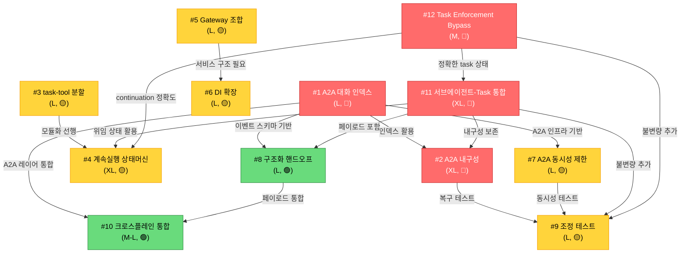
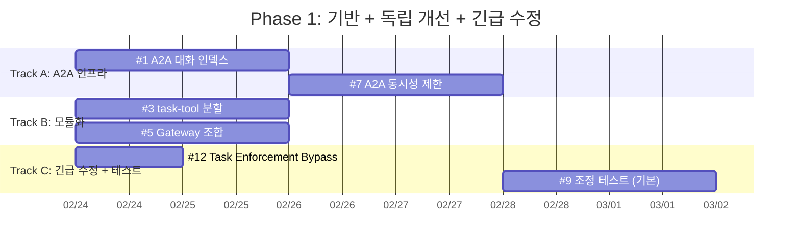
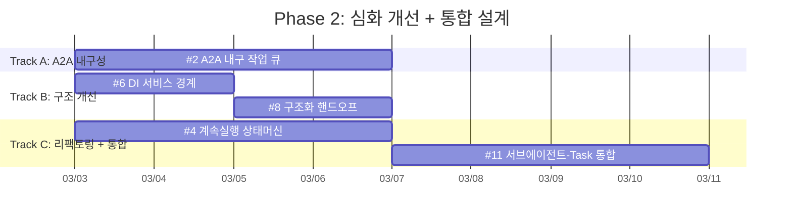
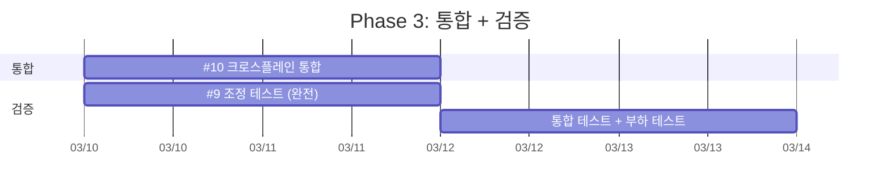

# 아키텍처 개선 마스터 플랜

> 작성일: 2026-02-19
> 상태: 설계 문서
> 대상: `prontolab-openclaw` 아키텍처 리뷰 기반 개선안
> 종합 등급: **B-** (65/100 아키텍처 부채 점수)

---

## 0. 개요

이 문서는 prontolab-openclaw 코드베이스의 종합 아키텍처 리뷰에서 도출된 **12개 핵심 개선안**의 마스터 플랜입니다.
각 개선안은 별도 상세 설계 문서(`improvements/01-*.md` ~ `improvements/12-*.md`)로 관리됩니다.

### 리뷰 배경

- **코드베이스 규모**: 364,550 LOC (non-test .ts), 68개 디렉토리, 37개 확장 패키지
- **주요 모듈**: `src/agents/` (380 entries), `src/infra/` (214), `src/gateway/` (161)
- **핵심 설계 의도**: 11개 persistent 에이전트 간 비동기 A2A 통신
- **Oracle 컨설팅**: 아키텍처 강점/약점 식별, 2x 스케일 준비도 평가 완료

---

## 1. 개선안 목록

| #   | 개선안                              | 우선순위     | 노력        | 영향도       | 상세 문서                                                                    |
| --- | ----------------------------------- | ------------ | ----------- | ------------ | ---------------------------------------------------------------------------- |
| 1   | A2A 대화 연속성 인덱스 교체         | 🔴 높음      | L (1-2일)   | 🔴 높음      | [01-a2a-conversation-index.md](./01-a2a-conversation-index.md)               |
| 2   | A2A 플로우 내구성 확보              | 🔴 높음      | XL (3일+)   | 🔴 높음      | [02-a2a-durable-jobs.md](./02-a2a-durable-jobs.md)                           |
| 3   | task-tool.ts 모듈 분할              | 🟡 중간      | L (1-2일)   | 🟡 중간      | [03-task-tool-modularization.md](./03-task-tool-modularization.md)           |
| 4   | 계속실행 상태머신 리팩토링          | 🟡 중간      | XL (3일+)   | 🟡 중간      | [04-continuation-state-machine.md](./04-continuation-state-machine.md)       |
| 5   | Gateway 순수 조합 전환              | 🟡 중간      | L (1-2일)   | 🟡 중간      | [05-gateway-composition.md](./05-gateway-composition.md)                     |
| 6   | DI 서비스 경계 확장                 | 🟡 중간      | L (1-2일)   | 🟡 중간      | [06-dependency-injection.md](./06-dependency-injection.md)                   |
| 7   | A2A 에이전트별 동시성 제한          | 🟡 중간      | L (1-2일)   | 🟡 중간      | [07-a2a-concurrency-control.md](./07-a2a-concurrency-control.md)             |
| 8   | 구조화된 핸드오프 페이로드          | 🟢 중간-낮음 | L (1-2일)   | 🟢 중간-낮음 | [08-structured-handoff.md](./08-structured-handoff.md)                       |
| 9   | 조정 불변량 테스트 스위트           | 🟡 중간      | L (1-2일)   | 🟡 중간      | [09-coordination-invariants-tests.md](./09-coordination-invariants-tests.md) |
| 10  | Discord A2A 크로스플레인 통합       | 🟢 낮음      | M-L (1-2일) | 🟢 낮음      | [10-cross-plane-unification.md](./10-cross-plane-unification.md)             |
| 11  | 서브에이전트-Task 통합 라이프사이클 | 🔴 높음      | XL (3일+)   | 🔴 높음      | [11-subagent-task-lifecycle.md](./11-subagent-task-lifecycle.md)             |
| 12  | Task Enforcement Bypass 수정        | 🔴 높음      | M (0.5-1일) | 🔴 높음      | [12-task-enforcement-bypass.md](./12-task-enforcement-bypass.md)             |

**총 노력 추정**: XL (전체 클린하게 수행 시 약 5-6주, #11·#12 포함)

---

## 2. 의존성 그래프



### 의존성 요약

| 개선안                      | 선행 의존성          | 후행 활용                                                     |
| --------------------------- | -------------------- | ------------------------------------------------------------- |
| #1 A2A 인덱스               | 없음 (독립)          | #2, #7, #8, #10                                               |
| #2 A2A 내구성               | #1 (인덱스 활용)     | #9 (복구 테스트)                                              |
| #3 task-tool 분할           | 없음 (독립)          | #4 (모듈화 선행)                                              |
| #4 계속실행 상태머신        | #3 (모듈화 선행)     | 없음                                                          |
| #5 Gateway 조합             | 없음 (독립)          | #6 (서비스 구조)                                              |
| #6 DI 확장                  | #5 (Gateway 구조)    | 없음                                                          |
| #7 A2A 동시성               | #1 (A2A 인프라)      | #9 (테스트)                                                   |
| #8 구조화 핸드오프          | #1 (이벤트 스키마)   | #10 (통합)                                                    |
| #9 조정 테스트              | #2, #7 (테스트 대상) | 없음                                                          |
| #10 크로스플레인            | #1, #8 (기반)        | 없음                                                          |
| #11 서브에이전트-Task 통합  | 없음 (독립)          | #2 (내구성), #4 (상태머신), #8 (페이로드), #9 (테스트)        |
| #12 Task Enforcement Bypass | 없음 (독립)          | #4 (continuation 정확도), #9 (불변량), #11 (task 상태 정확도) |

---

## 3. 실행 Phase

### Phase 1: 기반 + 독립 개선 (Week 1-2)

**병렬 실행 가능한 3개 트랙:**



**Phase 1 산출물:**

- Task Enforcement Bypass 수정 완료 (stale file + A2A 프롬프트 공백 해결)
- A2A 대화 인덱스 O(1) 조회 동작
- task-tool.ts가 5개 모듈로 분리, 기존 테스트 통과
- server.impl.ts가 순수 조합 루트로 전환
- 기본 조정 불변량 테스트 실행 가능

### Phase 2: 심화 개선 (Week 2-3)



### Phase 3: 통합 + 검증 (Week 3-4)



---

## 4. ROI 우선순위 매트릭스

```
영향도 (높음)
  │
  │  ★ #12 Task Bypass   ★ #1 A2A 인덱스     ★ #2 A2A 내구성
  │     (M, 긴급 수정)      (L, 빠른 ROI)       (XL, 핵심 안정성)
  │
  │  ★ #11 서브에이전트   ★ #5 Gateway 조합    ★ #3 task-tool 분할
  │     (XL, 핵심 통합)     (L, 유지보수)        (L, 가독성)
  │
  │  ★ #7 동시성 제한     ★ #4 상태머신
  │     (L, 안정성)          (XL, 구조 개선)
  │
  │  ★ #9 조정 테스트     ★ #6 DI 확장
  │     (L, 품질 보증)       (L, 테스트성)
  │
  │  ★ #8 핸드오프        ★ #10 통합
  │     (L, 정확성)          (M-L, 일관성)
  │
  └─────────────────────────────────────── 노력 (높음)
```

### 가장 높은 ROI 순서

1. **#12 Task Enforcement Bypass** — 적은 노력(M)으로 전 에이전트 task 추적 정확도 복원 (긴급)
2. **#1 A2A 대화 인덱스** — 적은 노력으로 즉각적인 성능 개선
3. **#3 task-tool 분할** — 적은 노력으로 유지보수성 대폭 향상
4. **#5 Gateway 조합** — 적은 노력으로 머지 충돌 감소
5. **#2 A2A 내구성** — 노력은 크지만 시스템 안정성의 근본적 개선
6. **#7 A2A 동시성** — 에이전트 수 증가 시 필수
7. **#11 서브에이전트-Task 통합** — 노력은 크지만(XL) 위임 체계의 근본적 완성

---

## 5. 성공 기준

### Phase 완료 기준

| Phase   | 성공 기준                                                                                                                                                                            |
| ------- | ------------------------------------------------------------------------------------------------------------------------------------------------------------------------------------ |
| Phase 1 | `pnpm test` 통과, `pnpm build` 통과, A2A 대화 연속성 O(1) 확인, task-tool 모듈 분리 확인, #12 Task Enforcement Bypass 수정 검증 (stale task 우회 불가 + A2A 세션에서 task 의무 적용) |
| Phase 2 | Gateway 재시작 후 A2A 플로우 복구 확인, DI 서비스 경계 동작 확인, #11 서브에이전트-Task 통합 lifecycle 정상 동작                                                                     |
| Phase 3 | 조정 불변량 전체 테스트 통과, 2x 에이전트 부하 테스트 통과                                                                                                                           |

### 전체 완료 기준

- [ ] 모든 개선안 구현 + 테스트 통과
- [ ] `pnpm test` 전체 통과 (기존 테스트 회귀 없음)
- [ ] `pnpm build` 성공
- [ ] 아키텍처 부채 점수 65/100 → 45/100 이하로 감소
- [ ] 2x 스케일 시뮬레이션 테스트 통과

---

## 6. 위험 요소

| 위험                   | 확률 | 영향 | 완화 전략                               |
| ---------------------- | ---- | ---- | --------------------------------------- |
| Upstream sync 충돌     | 중간 | 높음 | 각 Phase 시작 전 upstream sync 수행     |
| 기존 테스트 회귀       | 낮음 | 높음 | 각 모듈 변경 후 즉시 `pnpm test` 실행   |
| A2A 내구성 구현 복잡도 | 높음 | 중간 | Phase 2에서 최소 MVP 먼저 구현          |
| 게이트웨이 다운타임    | 낮음 | 높음 | 각 변경은 무중단 배포 가능하게 설계     |
| 파일 잠금 경합 증가    | 중간 | 중간 | #9 테스트에서 동시성 경합 시나리오 검증 |

---

## 7. 관련 문서

| 문서                                                | 역할                                       |
| --------------------------------------------------- | ------------------------------------------ |
| [PRONTOLAB.md](../../PRONTOLAB.md)                  | 구현 완료 기능 목록 + 운영 기준            |
| [SYSTEM-ARCHITECTURE.md](../SYSTEM-ARCHITECTURE.md) | 현재 시스템 아키텍처 다이어그램            |
| [TASK-STEPS-DESIGN.md](../TASK-STEPS-DESIGN.md)     | Task Steps + Event-Based Continuation 설계 |
| [SISYPHUS-DESIGN.md](../SISYPHUS-DESIGN.md)         | Sisyphus 패턴 설계                         |
| [OPERATIONS-RUNBOOK.md](../OPERATIONS-RUNBOOK.md)   | 운영 런북                                  |

---

## 8. 변경 이력

| 날짜       | 변경 내용                                                                                                      |
| ---------- | -------------------------------------------------------------------------------------------------------------- |
| 2026-02-19 | 초기 문서 작성 (아키텍처 리뷰 기반, #1-#10)                                                                    |
| 2026-02-19 | #11 서브에이전트-Task 통합 라이프사이클 추가                                                                   |
| 2026-02-19 | #12 Task Enforcement Bypass 수정 추가                                                                          |
| 2026-02-20 | 인덱스 정합성 수정: 중복 #12 행 제거, "10개→12개" 반영, ROI 매트릭스/랭킹에 #11·#12 추가, Gantt에 #11·#12 배치 |

---

_이 문서는 아키텍처 리뷰 결과를 기반으로 작성되었으며, 각 개선안의 상세 설계는 `improvements/` 디렉토리의 개별 문서를 참조하세요._
